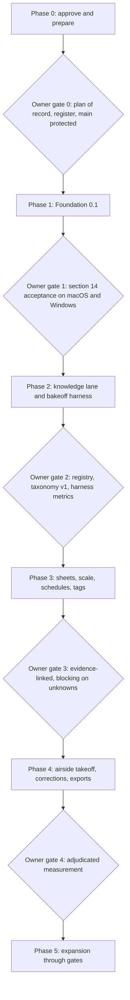
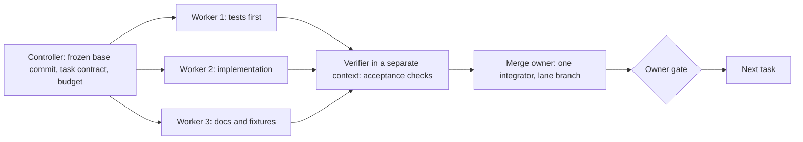
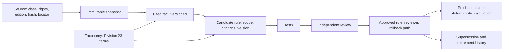
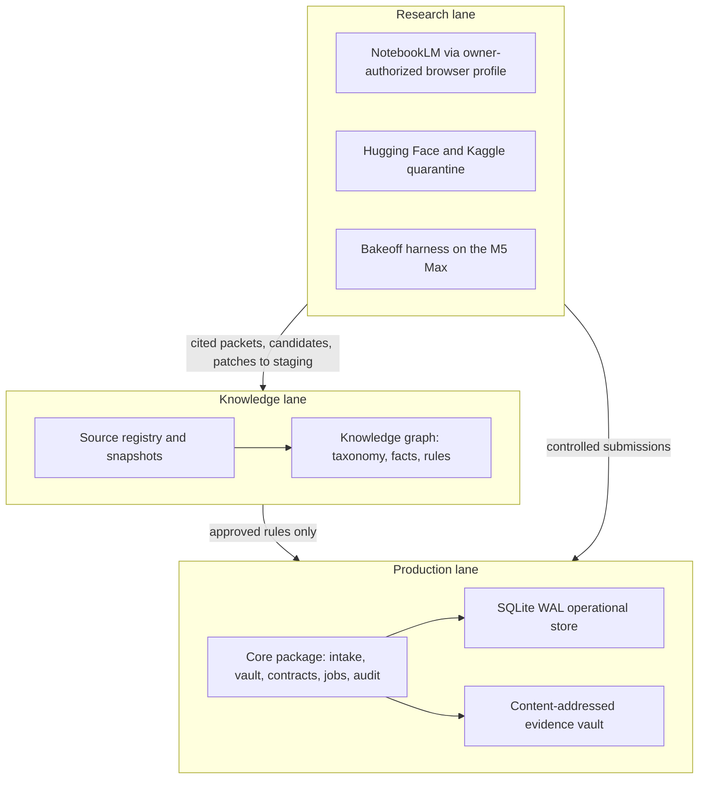

# Heleos-spark build roadmap

**Status:** Proposed for owner review
**Date:** 2026-09-01
**Owner:** Bekim Bukolla
**Authority:** [`docs/superpowers/specs/2026-08-26-heleos-spark-foundation-design.md`](docs/superpowers/specs/2026-08-26-heleos-spark-foundation-design.md) (the spec). This roadmap details the spec's sections 14 and 15; it does not reorder them and it does not approve anything by itself (spec section 16).

## Purpose

Get from "design approved" to "code accepted" with the smallest set of owner
decisions, a plan of record that can start the same day, and the tooling
(skills, agents, plugins, graphs, loops) admitted the way section 11 requires.
Every phase ends at an owner gate. Every unattended loop has a budget, a
verifier separate from the worker, and a kill switch.

Companion pages:

- [`docs/roadmap/phase-0-evidence.md`](docs/roadmap/phase-0-evidence.md): verified state of every branch, the provenance chain of PR #1, and its test results.
- [`docs/roadmap/skills-and-plugins.md`](docs/roadmap/skills-and-plugins.md): admission register for every skill, agent pack, plugin, and MCP server.
- [`docs/workspace/claude-code-lane.md`](docs/workspace/claude-code-lane.md): how Claude Code works here (single lane branch, guard, session start).
- [`docs/superpowers/plans/2026-08-27-recovery-reconciliation.md`](docs/superpowers/plans/2026-08-27-recovery-reconciliation.md): candidate plan of record for Foundation 0.1 (Option A below).

## How to read this

1. **Gates.** Nothing moves to the next phase without the exit criteria met and
   the owner's recorded decision under `docs/decisions/`.
2. **Lane.** All Claude Code work happens on `claude/heleos-spark-branch-60gd5e`,
   flows through draft pull requests into `main`, and is merged by the owner.
   Codex is the integrator the spec names; until its deterministic controller
   exists (Phase 1), the lane guard is the enforcement.
3. **Tooling.** A tool named here is a proposal until its row in the admission
   register says **Admitted**. Superpowers workflows are the exception the spec
   already authorizes.
4. **Graphs.** "Task graph" means the shape of the work (who runs in parallel,
   who verifies, who merges). "Knowledge graph" means the knowledge lane's
   data (sources, taxonomy, cited facts, candidate rules). Both are drawn in the
   Graphs section.

## Phase 0: Approve and prepare (this week)

**Goal.** Resolve the fork in the repository's history, admit the tooling for
Phase 1, and protect `main`.

**What already exists** (details and reproduction commands in the evidence page):

| Where | What |
|---|---|
| `main` | Spec, README, ECC-generated bundle |
| PR #3 (this lane) | Lane guard, `CLAUDE.md`, workspace docs, this roadmap |
| PR #1 `feat/enriched-build-fabric` | Working `helios-takeoff-core` package: P0, P1A, P1B, Division 23 v2 registry and kernel, build fabric, ATHENA R1A. 294 files. 277 of 279 tests pass on Linux/Python 3.12 from a clean checkout; two code-level defects remain (an authority-boundary scan failure and a worker-profile schema mismatch). Its design document asserts owner approval and a different build order than the spec. |
| `recovery/misplaced-chat-p0-p1a-2026-08-27` | Custody record and bundle of the recovered repository (hash verified) |
| `docs/recovery-reconciliation-2026-08-27` | Foundation 0.1 plan, Tasks 1 to 9, clean `src/heleos_spark/` layout, never merged |

**Decision 1: plan of record.** Two plans exist and cannot both be true.

| | Option A: reconciliation plan | Option B: adopt PR #1 |
|---|---|---|
| Base | Clean `src/heleos_spark/`, spec section 14 order (intake, vault, migrations, jobs first) | Recovered `src/helios_takeoff_core/` extended by PR #1; enriched build-cycle order (databases, source governance, kernels first; drawing intake later) |
| Consistency with records | Matches the 2026-08-27 custody record ("preservation is not acceptance"; no transplant of migrations 001 to 013) | Matches the 2026-09-01 design in the branch, which states it supersedes the spec's sequencing by a later owner decision |
| Time to first accepted milestone | Longer: rebuild from Task 1 | Shorter: fix two defects, run the suite on macOS and Windows, audit provenance |
| Risk | Re-deriving concepts already proven in PR #1 | Accepting 75k lines whose approval is asserted only inside the branch; spec section 14 acceptance not yet demonstrated |

**Recommended procedure** (a decision procedure, not a guess):

1. Record in `docs/decisions/2026-09-XX-plan-of-record.md` whether the 2026-09-01
   enriched build-fabric design is owner-approved and supersedes the spec's
   section 14 ordering. If it is not approved in writing, Option A applies.
2. If approved, Option B applies **behind an objective gate**: (a) the two
   code-level test defects are fixed on that branch; (b) the full suite passes
   from a clean checkout on the owner's Apple Silicon Mac and on Windows;
   (c) the provenance audit in the evidence page is accepted (import commit =
   recovered bundle + listed changes); (d) the spec's section 14 acceptance list
   is mapped onto the enriched milestones with a written delta for the deferred
   PDF intake, and "Foundation 0.1 accepted" is not declared until that list
   passes. Then PR #1 merges to `main`, the lane merges `main`, and Phase 1
   continues from the enriched build-cycle plan's Milestone 0.
3. If not approved, Option A applies: execute the reconciliation plan Tasks 1
   to 9 on the lane. PR #1 stays open as a reference branch; concepts may be
   re-derived, commits are not cherry-picked (the plan's own rule).

**Other Phase 0 decisions** (recommended answers in the decision log below):
approve this roadmap and the register statuses; inventory the four auto-installed
GitHub Apps; protect `main`; confirm Python 3.12 as the floor; decide the
package name (follows Decision 1); defer the PDF backend to the Task 1 proof.

**Skills and agents.** `superpowers:brainstorming` only for the open design
points below; `/council --quick` on Decision 1 with the transcript attached to
the decision record; no coding agents yet.

**Exit.** Decision records written; PR #3 merged (the lane guard and this
roadmap on `main`); `main` protected; admission register rows for Phase 1 marked
Admitted or Rejected.

## Phase 1: Foundation 0.1 (spec section 14)

**Goal.** Operational database, immutable evidence vault, deterministic PDF
intake, typed contracts, audit and finite jobs, and the test harness, accepted
by the section 14 list from a clean checkout on macOS and Windows.

**Scope in.** Section 14 items 1 to 7 exactly. **Scope out.** Rules engine,
pricing, UI, bots, model training, cloud (section 14 last paragraph).

**Plan of record.** Option A: reconciliation plan Tasks 1 to 9 (each task names
its files, the failing test first, the commands, and the commit). Option B:
enriched build-cycle Milestone 0 and Enabling Checkpoint 1, plus a new task set
that satisfies the section 14 acceptance list (deterministic PDF intake, vault
verification, interrupted-ingest restart) before the milestone is declared.

**Task graph.** Every task runs as a diamond (see Graphs): one planner writes the
task contract from the plan; two or three workers implement in isolated
worktrees created by the controller (never by the worker); one verifier in a
separate context runs the task's acceptance; one merge owner (Codex, or the
lane until the controller exists) integrates; the owner gates the milestone.
The deterministic controller itself (section 10: permissions, budgets, leases,
timeouts, idempotency, stop conditions) is built in this phase as build
tooling, not runtime code; the enriched build fabric in PR #1 is one candidate
implementation, subject to Decision 1.

**Skills, agents, plugins.**

| When | Tool | Path |
|---|---|---|
| Task start | `superpowers:executing-plans` or `subagent-driven-development` | `/home/user/superpowers/skills/executing-plans/SKILL.md` |
| Every change | `superpowers:test-driven-development`; ECC `tdd-guide` | `/home/user/ECC/agents/tdd-guide.md` |
| Before commit | `superpowers:verification-before-completion` | `/home/user/superpowers/skills/verification-before-completion/SKILL.md` |
| Before PR | ECC `python-reviewer`, `database-reviewer` (migrations, WAL, transactions), `security-reviewer`, `silent-failure-hunter`; `/code-review` | `/home/user/ECC/agents/`, `/home/user/ECC/commands/code-review.md` |
| Design points | `/council --quick` for the PDF backend proof and the storage-interface boundary (SQLite now, PostgreSQL later) | `/home/user/council-of-high-intelligence/SKILL.md` |
| Library facts | Context7 for pypdfium2, pydantic, sqlite3 behaviour before adoption | harness connector |
| Code intelligence | Codebase Memory MCP once `src/` exists (admission pending) | `/home/user/codebase-memory-mcp/README.md` |

**Python dependencies to admit** (pending, section 11): `pytest`, `ruff`, `mypy`
(dev); a PDF backend chosen by the Task 1 proof, with license as a hard filter:
`pypdfium2` (BSD-3/Apache-2.0) and `pypdf` (BSD-3) are candidates; PyMuPDF is
AGPL-3.0 and excluded unless the owner accepts that license; `pydantic` only if
the typed contracts need it (dataclasses are the default); `hypothesis` for
property tests on identity and hashing. Pin exact versions in the lock file;
record each in `dependencies/manifest.toml` per the reconciliation plan.

**Loops.** None unattended on code. CI on every push to the lane: lint, type
check, unit tests, the section 14 acceptance test, on `macos-14` (Apple Silicon)
and `windows-latest`, plus the lane guard tests on Linux. GitHub Actions is the
CI; it is not one of the four auto-installed apps.

**Knowledge graph.** Empty except the schema of `source_records` and the
document/revision/sheet identity graph the vault produces; the Phase 2 knowledge
lane will attach to those identities, never to parallel ones (section 6).

**Risks.** PDF backend behaves differently across platforms (mitigation: Task 1
platform proof and pinned digest). Encrypted or malformed PDFs crash the parser
(mitigation: quarantine with typed reasons, fuzz the intake with corrupt
fixtures). Two writers to SQLite (mitigation: single-writer path with tests).
Scope creep from PR #1's breadth (mitigation: the section 14 "no broad rules
engine" rule is a merge blocker).

**Exit.** Every bullet of the section 14 acceptance list, recorded in
`docs/verification/foundation-0.1-acceptance.md` with commit, platform, fixture
hashes, and command output; owner decision recorded.

## Phase 2: Knowledge lane and bakeoff harness (spec section 15, items 1 and 2)

**Goal.** Governed source registry and Division 23 taxonomy; frozen dataset and
model/worker bakeoff harness. No model is promoted; no rule is production.

**Knowledge graph, built with the graph-engineering pipeline** (prompts in
`/home/user/graph-engineering/WORKFLOWS.md`): `/kg-scope` writes competency
questions from the estimator's real work ("which duct gauge does SMACNA require
at this pressure class?"); `/kg-schema` fixes the node and edge types to the
spec's vocabulary (Source, Snapshot, Taxonomy term, Cited fact, Candidate rule,
Approved rule, Test, Reviewer, Supersession); `/kg-extract` and `/kg-relations`
run only over sources already in the registry with rights recorded; `/kg-fuse`
deduplicates by document hash and locator; `/kg-eval` measures citation
resolution rate before anything is shown to a user; `/kg-rag` is the research
lane's retrieval, never the production authority (section 4.2).

**Bakeoff harness.** Section 8 candidates (RF-DETR, D-FINE, LW-DETR, RT-DETR;
PP-OCR and PaddleOCR-VL; EdgeTAM and SAM 2.1; a Qwen vision-language checker)
enter through quarantine: checksum, archive and malware inspection,
safe-serialization check, license and provenance record, then a frozen
evaluation on adjudicated public or synthetic sheets on the M5 Max. Hugging Face
MCP and Exa are research-lane tools here and receive `PUBLIC` data only. ECC
`eval-harness` and `benchmark` skills and the cookbook `misc/building_evals.ipynb`
are the reference patterns.

**Research lane.** NotebookLM through the official UI in a dedicated browser
profile with owner login (section 9); ATHENA from PR #1 is the candidate
implementation under Option B. Outputs land in staging with notebook identity,
source set, query, time, citation map, and hash.

**Skills, agents, plugins.** graph-engineering skill; `/council --triad` for the
model admission criteria and the taxonomy's top level; ECC `rag-pipeline-reviewer`
and `security-reviewer` on the quarantine path; loop-engineering templates
(`loop-constraints.md`, `loop-budget.md`, `gate.yaml`) copied into the repo.

**Loops.** First unattended loop, report-only: daily research triage (pattern
`daily-triage`, L1) that lists new candidate sources and model releases and
writes a report; budget 100k tokens per day; kill switch label `loop-pause-all`;
no writes to the registry.

**Exit.** Registry populated with provenance for every source; taxonomy v1
approved by the owner; harness runs end to end on the frozen set with recorded
metrics per candidate; zero promotions.

## Phase 3: Sheet inventory, verified scale, schedules and tags (items 3 and 4)

**Goal.** Sheet identity, title, discipline, dimensions; declared, detected,
calibrated, verified scale with blocking on missing scale; equipment schedule
extraction and bidirectional plan-tag reconciliation with evidence crops.

**Task graph.** Extraction workers (OCR, layout, detection candidates from the
Phase 2 harness) run in parallel per sheet; a deterministic reconciler merges;
the Qwen-family checker verifies in a separate context and can only flag, never
correct; the human reviewer gates. Vision candidates remain non-authoritative
(section 8).

**Skills, agents, plugins.** Cookbook vision references
(`multimodal/best_practices_for_vision.ipynb`, `multimodal/crop_tool.ipynb`,
`tool_use/vision_with_tools.ipynb`) for adapters only; ECC `performance-optimizer`
when the per-sheet pipeline is measured; `/council --quick` on the scale
verification rule set.

**Loops.** PR babysitter (L2, assisted): re-runs the affected tests on each push
to the lane, proposes minimal fixes in an isolated worktree, never merges;
verifier is the full suite; budget per the `loop-budget.md` table.

**Exit.** Per spec: unverified scale blocks scale-dependent quantities on that
sheet; every schedule row and tag link resolves to evidence; conflicts are
evidence-linked and blocked, not guessed.

## Phase 4: One airside takeoff class, corrections, exports (items 5 to 7)

**Goal.** One narrow airside class measured with evidence crops and overlays;
human correction with deterministic recalculation; estimator-usable live-formula
Excel and an evidence PDF.

**Quantity states.** Only the section 7 vocabulary (`measured_m`, `rule_derived`,
`context_required_candidate`, `allowance`, `clarification`, `exclusion_proposal`,
`human_accepted_estimate_line`); context documents create obligations, never
silent rewrites.

**Promotion path.** Corrections become candidate rules, then tests, then staging,
then owner-approved production (section 3, principle 8); the knowledge graph
records each step with reviewer and version.

**Skills, agents, plugins.** Claude Code built-in `xlsx` and `pdf` skills for the
export adapters (reference implementations, verified against the evidence
manifest); ECC `code-reviewer` and `pr-test-analyzer`; `/council --full` once,
before the first adjudicated measurement is reported to the owner as a result.

**Exit.** Measured performance on adjudicated drawing sets recorded; every
exported line traces to evidence; correction round trip reproducible from frozen
inputs (section 3, principle 5).

## Phase 5: Expansion through measured gates (item 8)

Systems beyond the first airside class, automation (n8n as edge automation only,
section 10), native clients after the cross-platform proof (section 12), and
optional cloud (Azure first, section 10), each behind its own gate. Nothing here
is scheduled until Phase 4 exits.

## Graphs

### Phases and gates

### Task graph for one Foundation 0.1 task

Rules that shape it: split only work that never reads another piece's result
(the stop rule); the verifier never shares a context with a worker; one owner
of the merge; the human gate closes every milestone. Source:
`/home/user/graph-engineering/graph-engineering/references/task-graphs.md`.

### Knowledge lane pipeline

### Lanes, packages, and stores

## Skills, agents, and plugins by phase

| Tool | Phase 0 | Phase 1 | Phase 2 | Phase 3 | Phase 4 | Register status |
|---|---|---|---|---|---|---|
| Superpowers process skills | brainstorming | executing-plans, TDD, verification, code review | same | same | same | Authorized by spec |
| ECC rules and review agents | rules only | tdd-guide, python-reviewer, database-reviewer, security-reviewer | rag-pipeline-reviewer | performance-optimizer | code-reviewer, pr-test-analyzer | Proposed: design phase |
| Council | quick on Decision 1 | quick on PDF backend and storage boundary | triad on model admission and taxonomy | quick on scale rules | full before first reported measurement | Proposed: design phase |
| graph-engineering | task-graph shape | task-graph shape | knowledge graph pipeline | reconciliation graph | promotion path | Proposed: design phase |
| loop-engineering | templates | CI only | daily research triage L1 | PR babysitter L2 | same | Proposed: Foundation 0.1 |
| Codebase Memory MCP | no | after first code | yes | yes | yes | Proposed: Foundation 0.1 |
| Claude Cookbooks | no | no | evals | vision | exports | Reference only |
| Context7, GitHub MCP | yes | yes | yes | yes | yes | Authorized / harness |
| Exa, Hugging Face MCP | no | no | research lane, PUBLIC data | same | same | Later |
| Codex Security | no | before first merge to main with dependencies | yes | yes | yes | Later, owner evaluates |

## Loops

| Loop | Pattern source | Starts | Cadence | Budget | Verifier | Kill switch | Human gate |
|---|---|---|---|---|---|---|---|
| CI on the lane | GitHub Actions | Phase 1 | every push | runner minutes only | the suite itself | disable workflow | owner merges |
| Daily research triage | `/home/user/loop-engineering/patterns/daily-triage.md` | Phase 2 | weekdays | 100k tokens/day, 0 sub-agents | report reviewed weekly | `loop-pause-all` label | owner acts on report |
| PR babysitter | `/home/user/loop-engineering/patterns/pr-babysitter.md` | Phase 3 | 15 min while active | 200k tokens/day, 2 sub-agents/run | full suite in an isolated worktree | `loop-pause-all` | never auto-merges |
| Dependency sweeper | `/home/user/loop-engineering/patterns/dependency-sweeper.md` | Phase 4 | daily | 100k tokens/day | full suite | `loop-pause-all` | majors need owner |

Constraints for every loop are recorded in a repo-level `loop-constraints.md`
copied from `/home/user/loop-engineering/loop-constraints.md` and adapted: never
push before reporting, never merge to `main`, never edit guard files, one fix
per run, three attempts then escalate, report-only at 80 percent of budget.

## Decision log and open questions

| # | Decision | Recommended answer | Why |
|---|---|---|---|
| 1 | Plan of record | Follow the procedure above; default to Option A unless the 2026-09-01 design's approval is recorded on `main` | The custody record and the spec are the only approvals visible on `main` |
| 2 | Approve this roadmap and register statuses | Approve with edits recorded in `docs/decisions/` | Unblocks Phase 1 admissions |
| 3 | Four auto-installed GitHub Apps | Inventory permissions; retain ECC Tools read-only or remove; suspend Amazon Q, Azure Pipelines, AWS Connector until a task needs them | Spec section 11; ECC Tools already writes files, Amazon Q already reviews |
| 4 | Protect `main` | Require pull requests, block direct pushes and force pushes, require the lane guard tests once CI exists | Closes the last path around the lane |
| 5 | Python floor | 3.12 | Both existing plans assume it; matches the owner's machines |
| 6 | Package name | `heleos_spark` under Option A; keep `helios_takeoff_core` under Option B and document the product name mapping | Renaming 294 files in PR #1 would destroy its provenance trail |
| 7 | PDF backend | Decide by the Task 1 proof; license is a hard filter (AGPL excluded by default) | Section 11 provenance and license rule |
| 8 | Deterministic controller | Build it in Phase 1 as build tooling; evaluate PR #1's build fabric as the candidate under Option B | Section 10 requires a non-LLM owner of permissions and budgets |
| 9 | Windows CI runner | GitHub-hosted `windows-latest` first; owner's machine as the acceptance oracle | Section 12: Windows CI begins with the shared core |
| 10 | Multi-provider council routing | Off (`no_auto_route: true`) until the data-class policy for prompts is written | Section 5 egress rules |

## Session checklist for anyone coding here

1. Start on the lane (`session_start.sh` prints the status). Read `CLAUDE.md`.
2. Open the plan of record; pick the next unchecked task.
3. `superpowers:executing-plans`: write the failing test, implement, run the
   task's commands, commit with a Conventional Commit.
4. Before the pull request: `superpowers:verification-before-completion`, then
   the ECC review agents named for the phase.
5. Push the lane; update the draft pull request; the owner merges.
