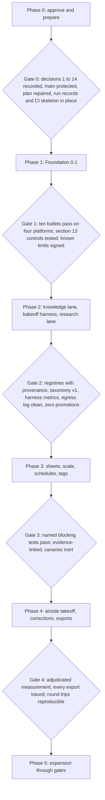
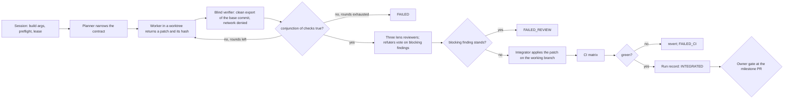
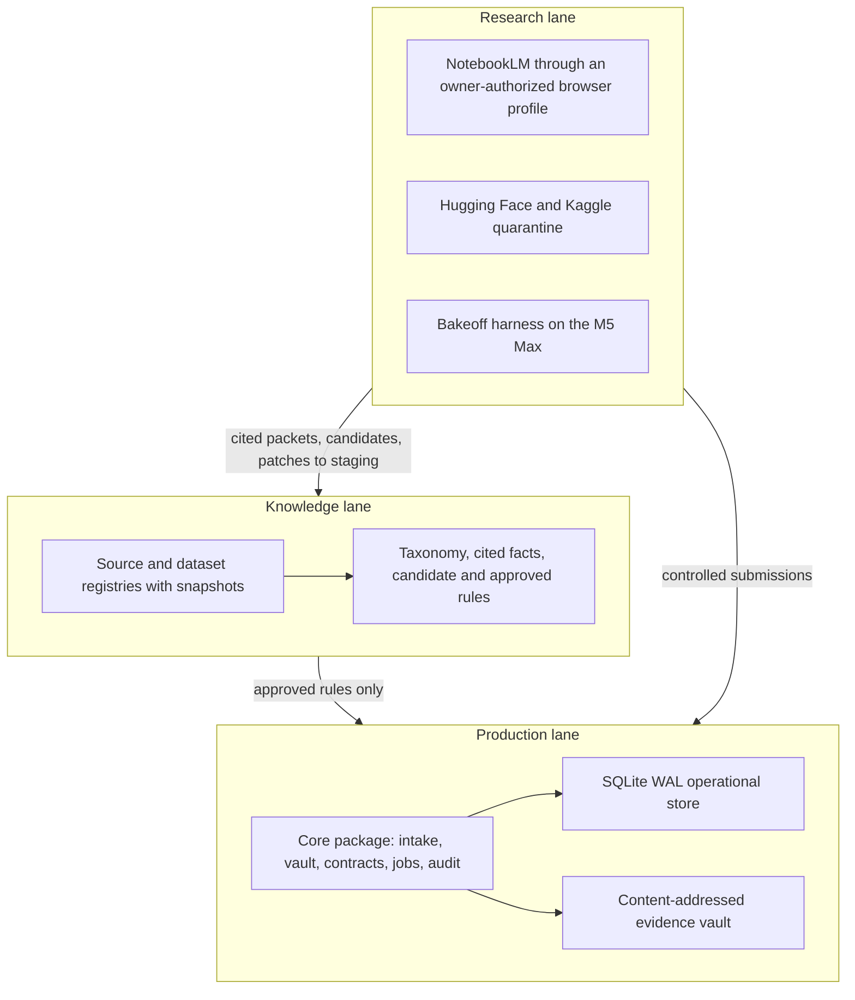

# Heleos-spark build roadmap

**Status:** Proposed for owner review (revision 2)
**Date:** 2026-09-02
**Owner:** Bekim Bukolla
**Authority:** [`docs/superpowers/specs/2026-08-26-heleos-spark-foundation-design.md`](docs/superpowers/specs/2026-08-26-heleos-spark-foundation-design.md) (the spec). This roadmap details spec sections 14 and 15 and schedules the controls of sections 5 to 13 that those milestones depend on. It preserves the order of sections 14 and 15; Phase 1 adds section 13 controls and the section 12 core platform proof as scope, not as a reordering; Option B, if chosen, would supersede the section 14 order and is offered only behind Decision 2. It approves nothing by itself (spec section 16).
**Supersedes:** revision 1 of 2026-09-01 on pull request #3 (`claude/heleos-spark-branch-60gd5e`, commit `861fcfe`). Section 2 lists what changed and why.

Companion pages:

- [`docs/roadmap/phase-0-evidence.md`](docs/roadmap/phase-0-evidence.md): verified state of every branch, the provenance chain and test results of PR #1, the harness inventory, and the lane-guard simulation, all as of 2026-09-02.
- [`docs/roadmap/plan-of-record-audit.md`](docs/roadmap/plan-of-record-audit.md): Option A's repair list and Option B's gap list against spec section 14.
- [`docs/roadmap/spec-coverage-matrix.md`](docs/roadmap/spec-coverage-matrix.md): every checkable requirement of spec sections 2 to 16 mapped to the phase and exit criterion that covers it.
- [`docs/roadmap/dynamic-workflow-operating-model.md`](docs/roadmap/dynamic-workflow-operating-model.md): how work runs as dynamic multi-agent workflows in Claude Code within spec section 10's boundaries.
- [`docs/roadmap/skills-and-plugins.md`](docs/roadmap/skills-and-plugins.md): admission register for every skill, plugin, MCP server, workflow script, and generated configuration.
- [`docs/roadmap/decision-drafts.md`](docs/roadmap/decision-drafts.md): ready-to-copy records for every open decision below.
- [`docs/runs/`](docs/runs/): records of the dynamic-workflow runs that produced this revision.

## 1. Purpose

Get from "design approved" to "Foundation 0.1 accepted" and onward through spec section 15 with the smallest set of owner decisions, a plan of record that can start the week it is approved, tooling admitted the way section 11 requires, and every unattended run bounded by a budget, a verifier separate from the worker, and a kill switch. Every phase ends at an owner gate with exit criteria that can be checked from a clean checkout.

## 2. What changed since revision 1

Revision 1 was audited by ten independent agents; independent skeptics re-checked 197 of the 230 findings (every blocker, major, and minor finding; the 33 informational findings were not sent by design), and none was refuted. The changes that matter:

1. **The evidence is corrected and extended.** Four numbers on the 2026-09-01 evidence page were wrong (PR #3's commit count, the modified-file count of PR #1's import, the file totals, the document dates), and the two PR #1 test defects now have root causes from code: one is a scanner false positive, the other a loader bug. Details in the evidence page, section 2.
2. **Neither candidate plan can start as written.** The reconciliation plan (Option A) has three tasks that cannot pass their own steps and a migration-numbering order that breaks its own discovery code; it needs a repair commit first (plan-of-record audit, section 2). PR #1 (Option B) implements neither the evidence vault nor PDF intake and can demonstrate none of the ten acceptance bullets (section 3 there). Decision 2 is reframed accordingly.
3. **The roadmap now runs on what exists.** Revision 1 depended on seven reference repositories at machine-local paths and on skills, agents, and commands that do not exist in a fresh Claude Code session. Revision 2 uses the harness's built-in `Workflow` tool, subagents, worktree isolation, and GitHub Actions, and vendors nothing it cannot cite by URL and commit. The admission register is rewritten against the environment inventory.
4. **A dynamic-workflow operating model replaces the sketch of a task graph.** It states which of section 10's controller duties the workflow script, the harness, the guard and branch protection, and repository code each satisfy, which stay unmet, and what every worker receives and returns. The three-worker split of revision 1 is withdrawn: one worker per task by default, parallel workers only for disjoint path partitions or contested designs, parallelism spent on verification instead.
5. **The single fixed lane conflicts with how sessions are started.** The owner starts Claude Code web sessions on per-session branches (this revision was written on one). Merged as-is, PR #3's guard moves a clean web session onto the lane (its documented reconciliation) and denies every edit and push of a session that is not switched; it also denies the worktrees section 10 requires for isolated workers. Decision 3 offers a branch pattern instead of a single name.
6. **Every phase has exit criteria that name a record, a test, or a decision**, and the spec-coverage matrix shows where each requirement of sections 2 to 16 lands. Revision 1 left sections 5, 8, 9, 11, 12, and 13 largely unscheduled: the external-submission record, the dataset registry and quarantine order, the NotebookLM operating rules, the six repository-owned skills, the cross-platform proof, encrypted backups, audit-event chaining, keychain secrets, log classes, and the failure-scope taxonomy now have phases and gates.
7. **The spec itself is not yet approved.** It is still "Proposed for owner review" on `main`, and both sections 14 and 16 make its approval the precondition for Phase 1. Decision 1 is that approval.

## 3. How to read this

1. **Gates.** Nothing moves to the next phase without its exit criteria met and the owner's recorded decision under `docs/decisions/`.
2. **Branches.** Until Decision 3 is recorded, Claude Code works on the branch its session was started on, opens draft pull requests into `main`, and never pushes elsewhere; the owner merges. After Decision 3, the guard enforces whichever policy was chosen.
3. **Tooling.** A tool named here is a proposal until its row in the admission register says Admitted. The harness's own tools (the `Workflow` tool, subagents, worktrees, the GitHub connector) are recorded as harness-provided with an accepted pinning exception.
4. **Dynamic workflows.** "Workflow" means a script run by the Claude Code `Workflow` tool: deterministic control flow over subagents with a hard token ceiling and a replayable journal. Repository-owned workflows live under `.claude/workflows/`. The operating model says how they are contracted, verified, recorded, and stopped. A workflow never merges, approves, or pushes to `main`.
5. **Options A and B.** Option A is the repaired 2026-08-27 reconciliation plan; Option B is adopting PR #1 behind a gate. Phase 1 text says what differs between them.

## 4. Where the repository stands on 2026-09-02

| Where | What | State |
|---|---|---|
| `main` | Spec (still "Proposed for owner review"), README, 12 ECC-generated files | No code, no CI, no decision records, no `CLAUDE.md` |
| PR #3 (`claude/heleos-spark-branch-60gd5e`, 4 commits) | Lane guard, `CLAUDE.md`, roadmap revision 1 and its pages | Open draft; the guard's single-lane rule needs Decision 3 |
| PR #1 (`feat/enriched-build-fabric`, audited at `1a804ed`: 4 commits, 294 files; two further commits landed on 2026-09-02 and were not audited) | `helios-takeoff-core` 0.1.0: P0, P1A, P1B, Division 23 v2 registry and kernel, build fabric, ATHENA intake | Open draft; at `1a804ed` 277 of 279 tests pass on Linux, two defects with known root causes; no PDF intake, no evidence vault; approval asserted only inside the branch; import carries recovered migrations unchanged |
| `recovery/misplaced-chat-p0-p1a-2026-08-27` | Custody record and bundle of the recovered repository (hash verified) | Quarantined from `main` by its own record |
| `docs/recovery-reconciliation-2026-08-27` | The reconciliation plan (Option A) | Never merged; needs the repairs in the plan-of-record audit |
| This branch (`claude/dynamic-workflow-roadmap-156gdn`) | Revision 2 of the roadmap and its companion pages, the first repository-owned workflow scripts, the run records | Draft pull request |
| Harness | Claude Code Remote: `Workflow` tool, subagents, worktrees, GitHub MCP, Context7, Exa, Hugging Face MCP; Python 3.11 default with 3.12 through `uv`; no plugins, no `gh` | Evidence page, section 7 |

## 5. Phase 0: Approve and prepare

**Goal.** Approve the design, choose the plan of record, settle the branch policy, protect `main`, stand up the minimum run-record tooling and CI skeleton, and admit the tooling Phase 1 needs.

**Target.** Decision records within two weeks of this revision's merge; the owner sets the date in the Decision 1 record and it becomes the Phase 0 deadline.

**Owner decisions** (recommended answers in section 12; drafts in `docs/roadmap/decision-drafts.md`): 1 approve the spec; 2 plan of record; 3 branch policy; 4 disposition of PR #3; 5 GitHub Apps inventory; 6 protect `main`; 7 Python floor; 8 package name; 9 PDF backend; 10 deterministic controller; 11 disposition of the ECC-generated files; 12 egress policy for prompts and connectors; 13 budgets and known limits; 14 CI runners.

**Tasks.**

| # | Task | Who | Output |
|---|---|---|---|
| P0.1 | Record Decisions 1 to 14 | owner | `docs/decisions/2026-09-XX-*.md`, one file each, from the drafts |
| P0.2 | Repair the plan of record: apply repairs A1 to A29 from the plan-of-record audit as one reviewed commit (Option A), or write the section 14 task set and run the Option B gate | session, reviewed by `pr-review` | `docs/superpowers/plans/2026-08-27-recovery-reconciliation.md` revision 2, or the Option B task set |
| P0.3 | Run `harness-probe` and record what the guard does inside a harness worktree, the worktree branch pattern, and which hook payload fields identify a subagent | session | `docs/runs/<run_id>/` |
| P0.4 | Guard revision per Decision 3: branch pattern instead of a single name, linked-worktree rules, protected `.claude/workflows/` and `.claude/agents/`, tests for every allow/deny cell | session started by the owner with `HELEOS_GUARD_ALLOW_SELF_EDIT=1` | PR #3 amended or a successor PR; `tests/hooks/` green |
| P0.5 | Minimum run-record tooling: `tools/wf/record.py`, `tools/wf/lint.py`, `docs/runs/README.md`, `docs/runs/index.jsonl`, `docs/runs/schema/`, `.claude/workflows/REGISTRY.json` with policies for the workflows already run in this revision | session | `tests/wf/` green; every run in `docs/runs/2026-09-02-roadmap-revision-2/` registered |
| P0.6 | GitHub Apps inventory, then branch protection on `main` (pull request required, no force push, no deletion, required checks once CI exists) | owner | Decision 5 and 6 records with the `gh api` output pasted |
| P0.7 | CI skeleton: `.github/workflows/ci.yml` running the hook tests, `tools/wf/lint.py`, `tools/wf/clean_room_check.py`, and the ledger check on `ubuntu-latest`; actions pinned by commit SHA; no secrets | done in this revision for the checks that exist today (`docs/policies/github-automation.md`); the `tools/wf/` checks join it under P0.5; branch protection and the auto-merge toggle stay with the owner (P0.6) | Green `checks` run on this branch |
| P0.8 | Apply the ECC-file dispositions of Decision 11 | session | One commit; the repository skill states Python conventions |
| P0.9 | Write `docs/policies/egress.md` from Decision 12: data classes, which sessions may see what, which workflows may call which providers, the seven-field submission record | owner drafts, session formats | Policy file referenced by every workflow policy |
| P0.10 | Register rows for Phase 1 marked Admitted or Rejected with evidence: Python dependencies, GitHub Actions, Context7 for design use, the repository-owned workflows, Codex Security evaluated | owner | Register revision 3 |

**Exit.** Decision records 1 to 14 exist, and the Decision 5 record lists each of the four apps' permissions and the owner's choice, with no workflow or secret added for those apps (the four workflows the owner authorized on 2026-09-02 are not theirs, `docs/policies/github-automation.md`); the implementation plan for the chosen option is approved and recorded (spec section 16): the Decision 2 record is completed, or amended, after P0.2 and cites the commit hash of the plan's revision 2 or of the Option B task set; this roadmap and its pages are merged; PR #3 is merged, amended, or closed per Decision 4; `main` is protected and a direct push is rejected; the admission register and `dependencies/manifest.toml` are declared the section 2 source registry of record until `source_records` exists, every file or dependency introduced from outside the repository in Phase 0 has a row there with origin, commit or hash, license, and retrieval date, and the ECC-generated bundle on `main` has its own row; `docs/runs/` holds the `harness-probe` record and this revision's run records; `tools/wf/` tests and `tests/hooks/` pass from a clean checkout; the CI skeleton is green; the ECC dispositions are applied; the plan of record is repaired and reviewed with zero standing blocking findings; the spec-coverage matrix shows every Phase 0 and Phase 1 requirement as covered; the register has no Phase 1 row left in Proposed.

## 6. Phase 1: Foundation 0.1 (spec section 14)

**Goal.** Operational database, immutable evidence vault, deterministic PDF intake, typed contracts, audit events and finite jobs, and the test harness, accepted by the ten section 14 bullets from a clean checkout on `macos-14`, `windows-latest`, the owner's Apple Silicon Mac, and the owner's Windows machine.

**Scope in.** Section 14 items 1 to 7, plus the section 13 controls that those items cannot be built without: hash mismatch as a hard failure; typed quarantine for unsupported, corrupt, password-protected, and suspicious files; the failure-scope taxonomy (item-level versus job-level or release-level blocking) in the typed error contracts; job states, leases, heartbeats, deadlines, action and cost budgets, cancellation, and resumable checkpoints in the runtime job model; transactional idempotent writes; the operational store opened in WAL mode with `PRAGMA foreign_keys = ON` on every connection, explicit forward migrations, one controlled writer, and safe transaction boundaries, each checked by a named test; mutable review and lifecycle state kept in separate records from immutable content, evidence, and audit rows, with a test that `UPDATE` and `DELETE` on immutable rows are rejected; a storage statement in `docs/architecture/storage.md` that the vault is immutable by application contract on an ordinary local filesystem and is not regulatory WORM storage, and that SQLite alone is not claimed to prevent privileged alteration; secrets in the OS keychain or an approved secret manager and redacted from logs; log records that separate public metadata from sensitive content and default to the least revealing useful record (a test asserts that the default log level emits no source text, no path outside the repository, and no content bytes); a vault that is append-only to application code with retention and deletion as a separately authorized operation; hash-chained audit events with an exported chain head; encrypted backups verified on backup, restore, read, and export; the six-field record (actor, inputs, prior state, new state, reason, time) on every production-changing decision. Also in scope: the `source_records` schema (the thirteenth section 6 record) and the `evidence_objects` table with the section 6 minimum-field columns, populated first by the Task 1 render derivative, the storage-interface boundary test that keeps a later PostgreSQL and object-storage implementation possible without changing domain contracts, and the cross-platform proof of section 12 for the core (PDF rendering, SQLite, packaging, and a loopback IPC probe on both platforms). Under Option A these land as repairs A13, A14, A20 and additions to Tasks 1, 4, 6, and 7.

**Scope out.** Rules engine, pricing, models, research adapters, worker execution features, native interfaces, cloud, bot roster (section 14, last paragraph). The build-time controller of section 10 is Phase 0 and Phase 1 build tooling under `tools/wf/`, never runtime code, and never a gate for the milestone.

**Plan of record.** Option A: the repaired reconciliation plan (repairs A1 to A29 in the plan-of-record audit), Tasks 1 to 9, critical path T1, T2, T3, T5, T7, T8, T9 with T4 parallel to T3 and T6 parallel to T5. Option B: PR #1 merged behind the gate in the plan-of-record audit section 4, then a task plan in the section 16 form (files, failing test first, commands, acceptance checks, commit boundaries) for section 14 items 3 and 4 and every acceptance bullet PR #1 defers, written and approved before Phase 1 begins. Under Option B, Foundation 0.1 is measured on the section 14 subset only; the Division 23 kernel, build fabric, and ATHENA trees cannot gate the milestone.

**Execution.** Every task runs as one `foundation-task` diamond (operating model, section 4): a planner narrows the contract; one worker implements test-first in a harness worktree and returns a patch, never a commit; a blind verifier applies the patch to a clean export of the frozen base commit and runs the task's acceptance commands with network denied; three lens reviewers and majority refuters judge the diff; one integrator applies the patch on the working branch; CI runs the matrix; the session records the run. The milestone driver runs tasks in dependency order from the integrated head. Until the controller tooling of Phase 0 exists and the guard revision of Decision 3 is merged, tasks run one at a time on the session's branch with planner, worker, and verifier as separate contexts; harness worktrees for workers start only after the `harness-probe` record and the guard revision. Contested design choices (the PDF backend, the storage boundary, the backup cipher and key handling) run as three candidates judged blind instead of a council. The task contract carries the section 10 prohibitions for every worker, Codex included: no push to `main`, no self-approval, no merge, no credential change, no change to production truth; the controller enforces them and branch protection (Decision 6) backs them. The controller itself is a parallel build-tooling track, not part of the Phase 1 exit, and may not delay Foundation 0.1 acceptance (section 14 closing rule).

**The ten acceptance bullets as tests and verifier checks.**

| # | Section 14 bullet | Test | Verifier evidence |
|---|---|---|---|
| 1 | Original bytes unchanged, expected stable SHA-256 | `test_acc_01_bytes_unchanged` | fixture hash before and after two ingests equals `tests/fixtures/manifest.json`; verifier re-hashes |
| 2 | One content object and one canonical document revision | `test_acc_02_single_object_revision` | row counts of `content_objects` and `document_revisions` equal 1; vault lists one object |
| 3 | Two auditable intake attempts linked to deterministic outcomes | `test_acc_03_two_ingest_events` | `ingest_events` outcomes `[ACCEPTED, DUPLICATE]`, each linked to an audit event |
| 4 | Stable page ordering, dimensions, rotation, units, per-page identities, derivative lineage | `test_acc_04_page_identity_stable` | canonical JSON of page records identical across both ingests and across platforms; the render derivative names its parent hash |
| 5 | Clean migration from an empty database and a tested migration rollback or recovery procedure | `test_acc_05_migrate_empty_and_recover` | migrate from empty; corrupt the migration ledger; the documented recovery (backup, restore, verify) restores; checksums match |
| 6 | Restart after an interrupted ingest without partial authoritative state | `test_acc_06_interrupted_restart` | failpoint after the vault write and before the metadata commit; restart; reconciliation reports one unreferenced valid object and zero authoritative revisions |
| 7 | Typed outcomes for identical content under a new filename, a near-duplicate PDF, corrupt bytes, an encrypted PDF | `test_acc_07_typed_outcomes` | `DUPLICATE`, `NEW_REVISION_OF_EXISTING_DOCUMENT`, `QUARANTINED_CORRUPT`, `QUARANTINED_ENCRYPTED` |
| 8 | Retrieval and hash verification of the original and its evidence manifest | `test_acc_08_retrieve_and_verify` | `heleos verify` exits 0; `heleos inspect --manifest` emits the per-document manifest; verifier recomputes the hashes |
| 9 | Zero external network calls in the default local test path | `test_acc_09_no_network` and the verifier's network record | `tests/netguard.py` counts zero connection attempts over the suite, subprocess CLI tests included; CI runs under a dead proxy |
| 10 | All declared automated checks passing from a clean checkout | the declared check list itself | `ruff`, `mypy`, `pytest -q`, `python -m build`, wheel install in a fresh environment, `heleos --help`, every exit code 0 on the four platforms |

**Dependencies to admit** (register, Decision 9 and P0.10): `pytest`, `ruff`, `mypy`, `hypothesis`, `build` as development extras; one PDF backend chosen by the Task 1 proof with license as a hard filter (`pypdfium2` and `pypdf` are the candidates; PyMuPDF is AGPL-3.0 and excluded unless the owner accepts that license); `pydantic` only if typed contracts need it. Exact versions and hashes in `uv.lock`; provenance in `dependencies/manifest.toml`.

**CI.** Every push to the working branch and every pull request to `main`: hook tests on Python 3.11 and 3.12 (hooks stay standard-library and run on the host interpreter), workflow lint, clean-room lint (`tools/wf/clean_room_check.py`), ledger check on `ubuntu-latest`; `ruff`, `mypy`, and the suite with network denied on `macos-14` and `windows-latest`; `timeout-minutes` on every job; superseded runs cancelled; a secret scan on every push covering fixtures and dataset directories. The owner authorized the `checks`, `claude-review`, `claude`, and `auto-merge` workflows on 2026-09-02, before Decision 5 (`docs/policies/github-automation.md`); the Decision 5 record inventories the apps afterwards. The acceptance test runs on dispatch or label. A monthly Actions-minutes ceiling is recorded in `docs/runs/KNOWN-LIMITS.md` (Decision 13). The owner's Mac and Windows machines are the acceptance oracle, through local `acceptance-verify` runs. Until Codex Security is admitted, the security gate before any merge that adds dependencies is the built-in `security-review` skill plus GitHub secret scanning and dependency review.

**Loops.** None unattended on code. `pr-review` runs on request before the owner marks a pull request ready; it comments, never approves.

**Risks.** The PDF backend behaves differently across platforms (mitigation: the Task 1 proof runs both candidates and pins a digest). Encrypted or malformed PDFs crash the parser (mitigation: typed quarantine; corrupt fixtures generated by a recorded tool). Two writers to SQLite (mitigation: single-writer path with tests). Scope creep from PR #1's breadth (mitigation: the section 14 closing rule is a merge blocker). Verification cost (mitigation: one worker per task; ceilings tuned from the first ten run records).

**Exit.** Every plan task has an `INTEGRATED` run record whose verifier conjunction holds; `docs/verification/foundation-0.1-acceptance.md` has one row per section 14 item and per acceptance bullet, each with test, platform, and evidence, and cites four `acceptance-verify` run ids (two GitHub runners, two owner machines) with all ten checks at exit 0 and zero network violations, naming the network-denial mechanism for both in-process tests and subprocess CLI tests; migration from an empty database creates all thirteen section 6 records by name (`projects`, `content_objects`, `documents`, `document_revisions`, `project_documents`, `ingest_events`, `sheets` , `scales` with the five scale facts as a typed enumeration, `job_runs`, `source_records` with the nine-field contract, `evidence_objects`, `corrections` with before, after, reason, author, scope, and rule-candidate link, `audit_events`), asserted in `test_acc_05_migrate_empty_and_recover`; `tests/test_evidence_contracts.py` refuses an evidence object missing any section 6 minimum field group; each derivative records its parent content-object hash and a test traverses derivative to original bytes; audit events are chained or exportable for tamper detection and a test detects an out-of-band row edit; every production-changing event carries actor, inputs, prior state, new state, reason, and time, and a test rejects a correction missing any of them; backups are encrypted with the key held outside the backup and restore-verify proves decryption plus per-object hash verification; the runtime job model is tested for lease expiry with a single reclaim, heartbeat loss, deadline, action and cost budget exhaustion, cancellation, and resume from checkpoint; typed error contracts carry a blocking scope (item or job) and integrity, migration, and hash failures are tested to block the job; configuration rejects inline credentials and the log writer has a redaction test; log records default to metadata (identities, hashes, typed outcomes, timings) and a test proves source bytes, page text, and rendered content never reach the default log; vault objects and immutable tables reject `UPDATE` and `DELETE` from the application path (trigger and filesystem tests) and Foundation 0.1 ships no deletion path; the storage-boundary decision is recorded and a test shows domain contracts have no SQLite or filesystem dependency; the platform proof is recorded in `docs/verification/platform-proof.md` and filed as the section 12 core-technology selection, confirming Decision 7 or recording the reopened decision before Task 2 started; one task run replayed with `resumeFromRunId` yields an identical record apart from attempt and time; `docs/runs/KNOWN-LIMITS.md` is signed by the owner; owner decision recorded. Separate tooling exit, required before Phase 2 starts but never part of the section 14 acceptance: the `tools/wf/` controller enforces the section 10 properties with tests (budget exhaustion stops a task, lease expiry releases the isolation unit, a duplicate task id is idempotent, an illegal state transition is rejected, a contract missing any of the six section 10 fields is rejected).

## 7. Phase 2: Knowledge lane, bakeoff harness, research lane (spec section 15, items 1 and 2)

**Goal.** A governed source registry and Division 23 taxonomy; a governed dataset registry; a frozen dataset and a model and worker bakeoff harness; the research lane operating under section 9's rules. No model is promoted; no rule is production.

**Knowledge lane.** The source registry stores the nine section 4.2 fields (source class, rights basis, jurisdiction, edition or effective date, retrieval date, document hash, precise locator, applicability, supersession state) and is populated retroactively for every external dependency, fixture, and copied asset introduced in Phases 0 and 1 (section 2's "from the beginning" rule). Taxonomy v1 uses the section 7 vocabulary (`measured_m`, `rule_derived`, `context_required_candidate`, `allowance`, `clarification`, `exclusion_proposal`, `human_accepted_estimate_line`) and the Division 23 system terms. Cited facts, candidate rules, tests, independent review, and owner promotion follow section 4.2's path; supersession and retirement history is recorded. Pricing provenance and freshness metadata (source, rights basis, effective date, retrieval date, freshness window) and dataset manifests get schemas here; pricing stays unpopulated until Phase 5. Every rule carries the six-item production-entry record (citations, scope, tests, version, reviewer, rollback path) before it may be promoted.

**Datasets and models (section 8).** Every Hugging Face or Kaggle candidate is scored on the eight review criteria the spec fixes (license, provenance, security, hardware, accuracy, latency, memory, reproducibility), recorded per candidate by the harness with a hardware section (device used, Metal or MPS compatibility, fallback events, throughput); any deliberation sets thresholds and weights only. Quarantine is a five-step gate for every download, models and datasets alike, run before any code loads the asset: checksum, archive and malware inspection, safe-serialization check, license and provenance record, data-leakage review against the frozen evaluation set; the loader refuses any path that has not cleared it. Every evaluation dataset is an entry in the same governed registry (not a second one) with origin, owner, version, license, files, hashes, transformations, and allowed uses, and a frozen hash; the harness refuses a set without a record. The bakeoff registry keeps the spec's primary and challenger structure: RF-DETR Large is the initial primary, and D-FINE, LW-DETR, and RT-DETR-family challengers enter only with a verified release and an acceptable license recorded before evaluation; PP-OCR and PaddleOCR-VL-family candidates enter with an exact release tag and weights digest, with a challenger slot for other reproducible document-VLM candidates; EdgeTAM, SAM 2.1, and an RF-DETR segmentation candidate where license and performance qualify; a locally runnable Qwen-family checker. A bakeoff winner is pinned with the six-field record (repository, release, license, weights digest, preprocessing, runtime) before Phase 3 may consume it. Metal or MPS incompatibility and inefficient training are reported, never hidden. Authoritative large training jobs may use a time-bounded NVIDIA cloud job only after the local pipeline and dataset are reproducible. Kaggle is used for public or explicitly licensed datasets, notebooks, and benchmark discovery only; private bid packages are never uploaded anywhere. The worker bakeoff runs the same frozen tasks through the coding workers section 10 names (Claude Code, Kimi Code, Grok Build, Cursor Agent, GitHub Copilot CLI), under the `foundation-task` contract with model pins, and produces the measured comparison the CrewAI admission rule requires; the same frozen task set also runs through `foundation-milestone` under `tools/wf/` and through Codex CLI as orchestrator, and that record is the measured comparison Decision 10 requires before Codex takes the section 10 orchestration role.

**Research lane (section 9).** Phase 2 delivers browser-driven NotebookLM automation through the official UI in a dedicated browser profile with the owner's login, with the manual round trip (PR #1's ATHENA runbook is the candidate to re-derive) as the human-assisted fallback. The rules become tests and checklists: the browser profile lives outside the repository and is gitignored; the login authorizes only the approved workflow; cookies and session material are `SECRET` class and never reach code, logs, other workers, or the repository; automation may create or update notebooks, add approved sources, request cited synthesis, and export permitted results, and nothing else; it stops and marks the research node `BLOCKED` on an expired session, MFA, consent, CAPTCHA, or an unrecognised UI state, and the owner acts directly; reading, exporting, or bypassing credentials or access controls is a forbidden change with a boundary test; a notebook's source set is a list of registry snapshot hashes held as local copies, so any notebook can be deleted and rebuilt; any future API sits behind a capability-tested adapter with a human-assisted fallback, and no undocumented API becomes a mandatory dependency; notebook outputs are imported as research artifacts (notebook identity, source set, query, time, citation map, content hash); the registry source hash and precise locator, never the notebook answer, is the authoritative citation, and a claim whose locator does not resolve stays in staging as a candidate; independent review records both the citation check and an applicability scope before any candidate rule advances. Research-lane tooling runs from a configuration with no operational-database path and no vault write path, and acceptance of any research output requires an actor other than the producing worker, both asserted by tests. Any credential the research lane or the bakeoff harness holds is stored in the OS keychain or a named secret manager, recorded in a decision entry. An external-submission ledger lands before the first research-lane call: every submission to any provider (NotebookLM, Exa, Hugging Face, Kaggle, Context7, Grok Bots) records the seven section 5 fields (provider, purpose, data class, source hashes, policy decision, time, result reference); `PUBLIC` sends log source and license; a test rejects a research-lane call lacking a policy decision; nothing above `PUBLIC` leaves the machine without the project- and provider-specific approval of Decision 12; the Phase 0 and Phase 1 use of Context7 and the GitHub connector for queries carrying no project content is recorded as an exemption in their admission records. Kaggle is admitted only for public or explicitly licensed datasets, notebooks, and benchmark discovery, through the same quarantine. Grok Bots, if admitted, are a public-data research and adversarial-review channel: no private data, no production write path, never treated as a security boundary. Failure isolation becomes a test: a fault-injection run in which the NotebookLM browser session, a model runtime, an Exa or Hugging Face call, and a cloud job each fail mid-run leaves production tables byte-identical and leaves no rule, source, dataset, or quantity in an approved state.

**Workflows.** `source-admit`, `dataset-quarantine`, `bakeoff-run`, and the first unattended loop, `research-triage`: report-only, daily, `PUBLIC` sources only, 100k tokens per run, launched by a Routine, stopped by the `KILL` file or the `loop-pause-all` label, never writing to the registry, with a tool allowlist that contains no messaging, billing, or cloud-provisioning tool.

**Exit.** Every registry row carries all nine section 4.2 source-record fields and a check fails a source missing any; every item introduced since Phase 0 has a registry row; taxonomy v1 approved; the frozen evaluation set has a dataset record with the eight fields and a hash, quarantine records exist for every candidate, and a test shows the harness refuses an unquarantined path or an unregistered set; harness runs end to end on the frozen set with all eight criteria and the hardware section recorded per candidate (a run that fell back from MPS is flagged, never reported as an MPS result) and a pin record under `docs/decisions/` with the six fields (repository, release, license, weights digest, preprocessing, runtime) for any winner; the egress ledger for the phase lists only `PUBLIC` submissions with zero violations and matches the transcripts; a NotebookLM demonstration record shows one notebook built from registry sources on the dedicated profile, one cited synthesis imported as a research artifact, one notebook deleted and rebuilt from local copies with the same source set, and one simulated expired session that stops with `BLOCKED`; the research-lane isolation, fault-injection failure-isolation, and different-actor tests pass; the credential store is recorded; an injection fixture (a registry source with embedded instructions) produces no tool call, policy change, secret disclosure, or rule promotion in extraction or in the triage loop; superseding a source keeps the prior row, links the successor, and writes a retirement audit event (test); the pricing provenance and dataset manifest schemas exist with schema tests; at least five `research-triage` records; zero promotions. Recorded in `docs/verification/phase-2-acceptance.md` with the frozen dataset identifiers and hashes; the gate 2 decision (`docs/decisions/<date>-gate-2.md`) fixes the numeric thresholds for citation resolution, scale verification, and measurement error that Phases 3 and 4 must meet.

## 8. Phase 3: Sheet inventory, verified scale, schedules and tags (items 3 and 4)

**Goal.** Sheet identity, title, discipline, and dimensions; declared, detected, calibrated, verified, and rejected scale with blocking on a missing or unverified scale; equipment-schedule extraction and bidirectional plan-tag reconciliation, every row and link resolving to evidence.

**Entry.** No model loads in Phase 3 without a pin record under `docs/decisions/` from the frozen Phase 2 bakeoff, and Phase 3 evidence objects cite that pin.

**Rules that become tests here.** Only pinned candidates from the Phase 2 pin record run. Extraction workers run per sheet in parallel; a deterministic reconciler merges; the checker (non-authoritative) can flag, never correct; the human reviewer gates. No research-lane, worker, or checker code path can write accepted quantities, approved rules, evidence objects, or release state; the only entry is the controlled-submission path that records the six-field decision, and a test proves each forbidden write is rejected. Localized extraction failures block only their dependent items, while integrity, hash, migration, or scale failures block the job (the section 13 taxonomy); a fixture with one unscaled sheet and one verified sheet yields blocked scale-dependent quantities only on the first and complete results on the second. Conflicts are evidence-linked and blocked, never guessed. Candidates and conflicts produced here use only the section 7 vocabulary. Every table added in this phase (detections, schedule rows, reconciliation edges) references `document_revisions`, `evidence_objects`, rule versions, and `job_runs` by foreign key and carries no parallel provenance columns, checked by a migration test that enumerates new tables. Untrusted content is data: canary injection fixtures (a sheet and a schedule that instruct the reader to change policy) run through the vision and OCR path, and the verifier checks that nothing acted on them. Review of a sheet works offline: its acceptance tests pass with outbound sockets blocked by the same guard as the section 14 zero-network test.

**Workflows.** `build-task` (the diamond, renamed after Phase 1) for every task; `extraction-eval` over adjudicated public or synthetic sets, with metrics computed by code; `schedule-reconcile` (deterministic plan-tag and equipment-schedule reconciler plus checker, recorded per sheet) for every schedule and tag reconciliation; `pr-review` on every push, assisted, never merging.

**Exit.** Named passing tests for "unverified scale blocks scale-dependent quantities on that sheet", "an item-level failure on one sheet leaves quantities on other sheets and non-dependent items on the same sheet unblocked", "every schedule row and tag link resolves to evidence", "conflicts are blocked, not guessed", "research and worker submissions cannot write production records directly", "every Phase 3 table references the section 6 identities", and "canary content never acts"; the offline review test passes; the failure-isolation test passes for the extraction model path (a model runtime failure mid-run leaves production tables byte-identical); `extraction-eval` records with per-sheet metrics meeting the gate 2 thresholds; no run touching `PROJECT_CONFIDENTIAL` content has `session_kind: web`. Recorded in `docs/verification/phase-3-acceptance.md` with the adjudicated set identifiers and hashes; owner decision `docs/decisions/<date>-gate-3.md`.

## 9. Phase 4: One airside takeoff class, corrections, exports (items 5 to 7)

**Goal.** One narrow airside class measured with evidence crops and overlays; human correction with deterministic recalculation; estimator-usable live-formula Excel and an evidence PDF.

**Rules that become tests here.** The seven section 7 states are the only quantity states, checked by `test_quantity_states_are_exactly_the_seven`. Context documents may create only obligations, conflicts, candidates, allowances, or questions (each mapped to a section 7 state, checked by a fixture test) and may not silently rewrite a measured quantity: a fixture with a context document contradicting a measured quantity leaves `measured_m` unchanged, records an evidence-linked conflict, and blocks the line. Precedence between context documents and drawings comes from the project's contract instructions as a per-project input, never a hard-coded default; a fixture with swapped precedence changes which document wins. Release state (bid or export release) is a production-lane record set only by the owner through the six-field decision record, and a test shows no worker, research, or export path can set it; an export is blocked when any contained quantity is blocked. Every accepted material line resolves to an evidence object carrying the section 6 minimum fields (object hash, media type, length, key; project, revision, sheet, coordinate space and transform, bounding box or polygon; source text or crop and overlay hash; extraction method and parameters; model name, pinned version or digest, runtime; rule identifiers and versions; confidence components; originating run, timestamps, decision state; reviewer, correction history, disposition), and later tables reference the same revision, evidence, rule, and run identities. Corrections create new records, become candidate rules, then tests, then staging, then owner-approved production, with the six-item rule record (citations, scope, tests, version, reviewer, rollback path) and the six-field decision record on every correction and approval; promotion with any item empty is rejected, and superseding a rule keeps the prior row, links the successor, and writes a retirement audit event. A correction round trip is byte-reproducible from frozen inputs. For every exported line the evidence PDF and Excel manifest resolve document revision, sheet, coordinates, extraction method, rule version, model or software version, confidence components, and review history. Calculation, correction, evidence retrieval, and export work offline: their acceptance tests pass with outbound sockets blocked.

**Workflows.** `build-task`; `export-verify`; `correction-roundtrip`; a `judge-panel` deliberation (three independent assessments, scored) before the first adjudicated measurement is reported to the owner as a result.

**Exit.** Measured performance on adjudicated drawing sets recorded against the gate 2 thresholds; every export in the adjudicated set has an `export-verify` record with zero untraced lines and the eight traceability elements resolved; every correction has a byte-identical `correction-roundtrip` record referencing the six-field decision contract; the named tests for the seven states, the context-document outputs, the no-silent-rewrite fixture, the precedence fixture, the rule-record refusal, the release-gate, and the export-blocking rule pass; the offline tests pass for review, correction, calculation, evidence retrieval, and export; the failure-isolation test passes for the export path; every table added in this phase references the section 6 identities (migration test). Recorded in `docs/verification/phase-4-acceptance.md`; owner decision `docs/decisions/<date>-gate-4.md`.

## 10. Phase 5: Expansion through measured gates (item 8)

Nothing here is scheduled until Phase 4 exits. Each item has its own gate and its own decision record.

- Further systems and the Division 23 capability matrix, one class at a time.
- Automation: n8n only as self-hosted edge automation through idempotent job APIs for intake notifications, research dispatch, approval routing, and run alerts; it never calculates quantities, stores raw private drawing sets, invokes unrestricted shells, or becomes a source of truth. CrewAI only if the Phase 2 worker bakeoff shows a material advantage over direct workers.
- Native clients: the section 12 cross-platform proof for the interface layer (rendering, local IPC, packaging and signing, Apple Silicon and Windows behaviour) before the UI technology is selected; the shared core exposed through a versioned local API; platform shells for filesystem, keychain, installer and signing, rendering, and hardware acceleration; Windows and macOS desktop parity across intake, drawing review, takeoff, evidence, correction, estimating, research control, export, and final approval as a product gate; the iPhone companion for controlled review and approval only.
- Cloud: Azure first as the optional production cloud, a bounded Google research lane, an inactive AWS adapter; multi-cloud-ready is not multi-cloud-deployed; cloud adapters stay optional and the offline test stays in the default suite; agents never provision, purchase, or change billing.
- Training off-workstation (section 8): a time-bounded NVIDIA cloud job only after a frozen dataset hash and a reproducible local run are recorded, with an owner-approved time and cost bound, and results re-verified locally.
- Pricing and labor: entering only through the knowledge lane's pricing provenance and freshness records and later migrations that reference rule and run identities, gated by every exported price resolving to a source record with retrieval date and freshness state. Topology, RFIs, and further exports likewise: each is its own gate, and each new table references the existing document revision, evidence, rule, and run identities, checked by a schema test that forbids parallel provenance columns.
- Bid-release state as a production-lane record with audit events; research and workers have no write path to it (test).
- Platform proof entry gate for native clients: local IPC, packaging, installer and signing, and Apple Silicon and Windows behaviour for the chosen shell technology, recorded in `docs/verification/`, citing the Task 1 (PDF rendering, runtime, loopback IPC probe) and Task 8 (wheel) results as the halves already done; native shells consume only the versioned local API, whose version scheme is a Phase 5 entry decision.
- Standing rule: any retention or deletion operation on vault objects, evidence, backups, or run records requires its own decision record with a fully enumerated object list (spec section 13).
- Release verification re-runs every acceptance bullet of a release tag from a clean export on three platforms.

## 11. Dynamic workflows

The operating model is the reference; this section is the summary the owner needs to read the rest of the roadmap.

**What the harness gives us.** The `Workflow` tool runs a plain-JavaScript script that orchestrates subagents deterministically: `agent()` with a JSON schema for validated returns, `parallel()` and `pipeline()` for fan-out, `workflow()` for one level of nesting, a hard output-token ceiling with `agent()` throwing at the limit, and a journal of every agent's return that makes a run replayable. Subagents can run in isolated git worktrees and can be restricted to a tool list by a reviewed agent definition under `.claude/agents/`. Scripts cannot read files, keep time, or take random values, so every durable fact is produced by an agent and validated by repository code afterwards.

**What that satisfies of section 10.** The script is the non-LLM owner of control flow, budget, and stop conditions; the harness owns tool permissions and isolation; the guard, git hooks, branch protection, and CI own git and GitHub authority; small standard-library tools under `tools/wf/` own run identity, leases, scope checks, integration, records, and acceptance. Unmet in this harness and recorded as known limits: per-agent wall clock, heartbeats, money and input-token budgets, and Bash-level egress for workers that read untrusted content in web sessions.

**The worker contract.** Every worker receives, as the first text of its prompt, a frozen contract: base commit, exact objective, allowed and forbidden paths, allowed tools, acceptance commands with expected exit codes, forbidden changes, limits, and the list of untrusted inputs that are data and never instructions. It returns a patch file and its hash plus a schema-validated report. It never commits, pushes, merges, approves, or touches credentials.

**Repository-owned workflows by phase.**

| Workflow | Phase | Purpose | Ceiling / agents | Human gate | Status |
|---|---|---|---|---|---|
| `spec-coverage-audit` | 0, then every gate | Map every requirement of chosen spec sections to a test, task, or "uncovered" | 150k / 30 | owner | Run in this revision |
| `verify-findings` | 0, then every gate | Independent skeptics refute or confirm each finding of an audit | 200k / 40 | owner | Run in this revision |
| `judge-panel` | any decision | Independent designs or assessments from distinct angles, scored by independent judges, synthesized | 300k / 12 | owner | Run in this revision |
| `harness-probe` | 0 | Record real harness and guard behaviour before any worktree workflow is admitted | 60k / 10 | owner | Proposed |
| `roadmap-review` | 0 | Lens-diverse review of this roadmap and its pages against the spec | 150k / 25 | owner | Proposed |
| `provenance-audit` | 0 under Option B; before any merge adding dependencies or fixtures | Hashes, licenses, and the explained delta | 100k / 20 | owner | Proposed |
| `foundation-task` (later `build-task`) | 1 onward | The task diamond | 400k / 40 | owner accepts at the milestone PR | Proposed |
| `foundation-milestone` | 1 | Dependency-ordered driver over diamonds | 4M / 400 | owner merges | Proposed |
| `pr-review` | 1 onward | Review before the owner marks a PR ready; comments only | 200k / 40 | owner | Proposed |
| `acceptance-verify` | 1 exit | The ten bullets as verifier checks on a named platform | 150k / 12 | gate 1 | Proposed |
| `research-triage` | 2 | Daily report-only sweep of `PUBLIC` sources | 100k / 10 | owner reads weekly | Proposed |
| `source-admit`, `dataset-quarantine`, `bakeoff-run` | 2 | One source, one asset, one frozen evaluation | 80k to 300k | owner | Proposed |
| `extraction-eval` | 3 | Deterministic pipeline and checker over adjudicated sets | 300k / 50 | owner | Proposed |
| `schedule-reconcile` | 3 | Deterministic plan-tag and equipment-schedule reconciler plus checker, recorded per sheet | 200k / 30 | owner | Proposed |
| `export-verify`, `correction-roundtrip`, `release-verification` | 4 | Traceability, reproducibility, release re-run | 80k to 100k | owner | Proposed |

**The six repository-owned skills of spec section 11.** Each is implemented as a repository-owned workflow (or a lint) with an owner and a phase; the register carries their rows.

| Spec section 11 skill | Implementation | Phase |
|---|---|---|
| Clean-room boundary enforcement | The guard's denial of fetches from any remote but `origin`, `provenance-audit`, and a `tools/wf/clean_room_check.py` lint in CI that fails on any reference to the quarantined predecessor outside policy statements | 0 and 1 |
| Source curation and citation validation | `source-admit` | 2 |
| Model and worker bakeoffs | `bakeoff-run` and the worker bakeoff | 2 |
| Plan-tag and equipment-schedule reconciliation | `schedule-reconcile` (deterministic reconciler plus checker, recorded per sheet) | 3 |
| Evidence-first takeoff review | `extraction-eval` and `export-verify` | 3 and 4 |
| Release verification | `acceptance-verify` (Phase 1) and `release-verification` (Phase 4 onward) | 1 and 4 |

**Budgets and stop rules.** No `foundation-task` or later run starts without a token ceiling (`require_ceiling: true` in its policy; `ABORTED_NO_CEILING` otherwise); the three read-only audit workflows already run in this revision carry `require_ceiling: false`, log the absence, and ran without a ceiling, as their run record states. Rework is capped at two rounds; three consecutive non-integrated runs on one task freeze it until the owner lifts the freeze. Kill switches: the harness interrupt, the guard-protected `.claude/workflows/KILL` file, and the `loop-pause-all` label for Routine-launched runs.

**Records.** Every run leaves `docs/runs/<run_id>/` with the launched arguments, the script hash, each stage's validated return, verifier logs and their hashes, the integration commit, CI results, the egress log, and a summary whose first line is the status. A hash-chained index is recomputed in CI. `ACCEPTED` is written only by a tool run by the owner.

**What stays human.** Merging and approving pull requests; every decision record; admitting any tool, dependency, model, or dataset; promoting a rule, source, or model; accepting a quantity; releasing anything; editing the guard, the workflows, the agents, CI, and branch protection; setting budgets; starting any run over `PROJECT_CONFIDENTIAL` content (local sessions only); entering credentials; anything account-wide.

## 12. Decision log and open questions

| # | Decision | Recommended answer | Why |
|---|---|---|---|
| 1 | Approve the foundation design (spec) and freeze it as the baseline | Approve as written; record any amendment as its own decision | Sections 14 and 16 make this the precondition for Phase 1; the spec is still "Proposed for owner review" |
| 2 | Plan of record | Option A, executed after the repair commit (plan-of-record audit, section 2); PR #1 stays open as a reference branch whose concepts are re-derived and whose defects are recorded. Option B only with a recorded approval of the 2026-09-01 design that supersedes the section 14 ordering and its closing rule (audit finding B13), a record that itself lists which section 14 items and bullets move to which milestone, and the gate in section 4 of that page, including a section 16-form task plan for the deferred items approved before Phase 1 starts | PR #1 implements neither the vault nor PDF intake, cannot demonstrate any acceptance bullet, transplants recovered migrations against the custody rule, and asserts its approval only inside the branch |
| 3 | Branch policy | A pattern, `claude/*`, for Claude Code work branches, each session on its own branch; pushes only to the session's own branch; `main` and other branches read-only; merges only by the owner through pull requests; branch protection on `main` as the outer boundary; the guard revised to the pattern, to allow linked worktrees for workers, to protect `.claude/workflows/` and `.claude/agents/`, and to start a missing lane from `origin/main` rather than from an arbitrary HEAD | The harness creates a `claude/<slug>-<id>` branch for every web session (the lane name itself follows that pattern) and this revision was made on one; a single fixed lane moves clean sessions onto it and blocks the rest (evidence page, section 8) and denies the worktrees section 10 requires |
| 4 | Disposition of PR #3 | Merge its guard after the Decision 3 revision; replace its roadmap pages with this revision | The guard is tested and useful; the roadmap pages are superseded |
| 5 | Four auto-installed GitHub Apps | Inventory permissions before any workflow or secret is added; ECC Tools already holds write access and has written to the repository; retain read-only or remove; suspend Amazon Q, Azure Pipelines, and AWS Connector until a task needs them; no app-triggered result is authoritative | Spec section 11 |
| 6 | Protect `main` | Pull request required; no force push; no deletion; required checks once CI exists; administrators not exempt | Closes the last path around any branch policy |
| 7 | Python floor | 3.12, provisional: confirmed as the section 12 core-technology selection by the Task 1 platform proof record, which is filed under `docs/decisions/`; the proof must show the Python 3.12 core rendering PDFs, running SQLite in WAL mode, packaging, and answering a loopback IPC probe on `macos-14`, `windows-latest`, and the owner's Apple Silicon Mac, and a proof failure reopens the decision before Task 2 starts. CI and `uv` pin it; the harness default of 3.11 is not used for project code; hook scripts stay standard-library and run on the host interpreter | Both plans require it; the environment provides it through `uv`; section 12 selects technology only after a proof |
| 8 | Package name | `heleos_spark` under Option A; under Option B keep `helios_takeoff_core` with a documented mapping or rename before merge; keeping it needs a recorded owner exception to the custody record, and the version leaves 0.1.0 either way | Renaming PR #1's 78 files would destroy its provenance trail |
| 9 | PDF backend | Decided by the Task 1 proof between `pypdfium2` and `pypdf`; license is a hard filter; AGPL excluded by default | Sections 11 and 12 |
| 10 | Deterministic controller | `tools/wf/` build tooling in Phases 0 and 1 as the operating model describes; PR #1's tooling evaluated only under Option B and as two candidates: `tools/helios_build` for the section 10 worker controller (missing leases, heartbeats, and real cost accounting) and the P1A agentic spine for the section 13 runtime job model (missing lease expiry, heartbeat, deadline, and cost-budget columns); Codex integration deferred until a measured comparison exists | Section 10 requires a non-LLM owner of permissions and budgets; nothing may gate Foundation 0.1 on it |
| 11 | ECC-generated files | Apply the dispositions in the register, section 3 | The skill is live and wrong; the Codex config would egress by default |
| 12 | Egress policy | Write `docs/policies/egress.md`: `PUBLIC` may go to admitted providers with source and license logging; `INTERNAL` local by default; `PROJECT_CONFIDENTIAL` never in web sessions and never to a provider without a project- and provider-specific record; `SECRET` never anywhere; every submission carries the seven fields; council-style multi-provider routing off | Section 5; Phase 2 introduces the first providers |
| 13 | Budgets and known limits | Per-phase ceilings as the operating model proposes, tuned after ten runs; a monthly Actions-minutes ceiling; the unmet controls accepted in `KNOWN-LIMITS.md` at Phase 1 exit or a repository daemon scheduled in a named phase | Section 10 |
| 14 | CI runners | `ubuntu-latest` for hooks and lint; `macos-14` and `windows-latest` for the core; the owner's machines as the acceptance oracle | Section 12 |

Open questions the owner must answer that no page here can: which root the guard resolves inside a harness worktree (settled by `harness-probe`); whether the owner will sign acceptance commits; the permission mode for local sessions that run hundreds of tool calls per diamond; how a Routine-launched run carries its token ceiling.

## 13. Graphs

### Phases and gates

### The task diamond

Rules that shape it: one worker unless paths are disjoint or the design is contested; the verifier never shares a context with the worker; reviewers never see the worker's claims; one integrator; the human gate closes every milestone.

### Lanes, packages, and stores

## 14. Skills, agents, and plugins by phase

| Tool | Phase 0 | Phase 1 | Phase 2 | Phase 3 | Phase 4 | Register status |
|---|---|---|---|---|---|---|
| `Workflow` tool, subagents, worktrees | audits, judge panel, probe | diamonds, review, acceptance | triage, admit, quarantine, bakeoff | eval | verify, round trip | Harness-provided |
| Repository-owned workflows | three run, three proposed | four proposed | four proposed | two | three | Repository-owned or Proposed |
| GitHub MCP, GitHub Actions | PRs; CI skeleton | full matrix | same | same | same | Authorized by spec; Proposed: Phase 0 |
| Context7 | library facts for the PDF backend and SQLite | same | same | same | same | Proposed: Phase 0 |
| Exa, Hugging Face MCP | no | no | research lane, `PUBLIC` only | same | same | Proposed: Phase 2 |
| Superpowers, ECC review agents | no (absent) | after install and review, if wanted | same | same | same | Absent; Proposed: Phase 1 |
| Council | replaced by `judge-panel` | same | same | same | same | Absent |
| Codebase Memory MCP | no | after first code, local sessions | same | same | same | Absent; Proposed: Phase 1 |
| Codex CLI and Codex Security | no | after pins and the owner's evaluation; until then `security-review` plus GitHub secret scanning and dependency review | same | same | same | Not authorized as generated; Proposed: Phase 1 |
| Anthropic `pdf` and `xlsx` skills | no | no | no | no | export adapters | Reference only until Phase 4 |
| Kaggle, Grok Bots | no | no | research lane, `PUBLIC` only, through quarantine | same | same | Proposed: Phase 2 |
| Google Drive, Figma, Gmail connectors | no | no | no | no | no | Deferred by spec section 11 until a milestone names the task |

## 15. Loops

| Loop | Starts | Cadence | Budget | Verifier | Kill switch | Human gate |
|---|---|---|---|---|---|---|
| CI | Phase 0 skeleton; Phase 1 full matrix | every push and pull request | Actions minutes ceiling (Decision 13) | the suite | disable the workflow | owner merges |
| `pr-review` | Phase 1 | on request; Phase 3 on every push | 200k per run | refuters must reproduce a confirmed finding | `KILL` file | never approves or merges |
| `research-triage` | Phase 2 | daily, Routine-launched | 100k per run, report only | none (report); every row carries provider, URL, hash, license | `KILL` file; `loop-pause-all` label | owner acts weekly |
| Dependency sweeper | Phase 4, if wanted | daily | 100k per run | the suite | `KILL` file | major upgrades need the owner |

Constraints for every loop: never push before recording; never merge to `main`; never edit guard, workflow, or agent files; never modify credentials; never approve; one fix per run; three attempts then escalate; report-only at 80 percent of budget; never provision cloud services, change billing, purchase anything, send external messages, or alter account-wide security settings (spec section 13); never read the browser profile.

## 16. Session checklist for anyone working here

1. Start on the session's branch; read `CLAUDE.md` and this roadmap; check `docs/runs/INDEX.md` for the current state and `docs/runs/ESCALATIONS.md` for frozen tasks.
2. Open the plan of record; pick the next unchecked task; build the contract with `tools/wf/args.py` once it exists, or write it by hand from the task's file list until then.
3. Run the task as a `foundation-task` diamond with a token ceiling; never commit from a worker; never push anywhere but the session's branch.
4. Record the run under `docs/runs/`; update the draft pull request; the owner merges.
5. Before marking a pull request ready: `pr-review` run, then `spec-coverage-audit` if the change touches a gate.
