# Foundation 0.1 task graph and operating rules

```mermaid
flowchart LR
    T1["T1 Governance baseline"] --> T2["T2 Rust workspace + domain"]
    T2 --> T3["T3 SQLite + migrations"]
    T3 --> T4["T4 Evidence vault"]
    T4 --> T5["T5 WASI PDF probe"]
    T5 --> T6["T6 Jobs + intake + evidence"]
    T6 --> T7["T7 CLI + encrypted backup/restore"]
    T7 --> V8["T8 Independent storage verifier"]
    V8 --> V9["T9 Independent acceptance verifier"]
    V9 --> H["Owner gate: GitHub App disposition"]
    H --> V10["T10 Supply-chain + macOS/Windows release gate"]

    R["Separate engineering-research plan"] -. "public research only; non-blocking" .-> T2
    R -. "cited candidates; no authority" .-> T5
```

Tasks 1–7 are serialized because their manifests and integration surfaces are shared. The separate engineering-research plan may produce cited public candidates but is not a Foundation prerequisite or source of production authority. Tasks 8–10 are independent verifier nodes: they return production failures to the owning task instead of repairing production code.

## Operating rules

Codex is the merge owner. No more than four workers may be active. Exactly one writer owns each path at a time, and every task has a separate reviewer. A review loop is capped at five rounds; unresolved work is returned to the task owner or escalated to the owner.

Human approval is required before login, GitHub App-permission changes, push, merge, publish, deploy, or destructive actions. An implementer must not create a workflow, configure a secret, change a GitHub App, push, merge, publish, deploy, or perform a destructive action without that recorded human gate.
