# Heleos-spark Foundation 0.1 Implementation Plan

> **For agentic workers:** REQUIRED SUB-SKILL: Use superpowers:subagent-driven-development (recommended) or superpowers:executing-plans to implement this plan task-by-task. Steps use checkbox (`- [ ]`) syntax for tracking.

**Goal:** Build and verify the local-first Foundation 0.1 trust engine: typed domain contracts, a durable SQLite store, an immutable evidence vault, deterministic capability-sandboxed PDF intake, crash-safe jobs, canonical evidence manifests, encrypted backup/restore, and a stable CLI.

**Architecture:** A Rust workspace provides one platform-independent core and thin process adapters. SQLite owns mutable metadata through a cross-process controlled writer path, while SHA-256-addressed files hold immutable bytes; ingest coordinates the two with explicit checkpoints, idempotency, typed quarantine outcomes, canonical evidence manifests, and an append-only hash-chained audit trail. Untrusted PDF parsing runs as a memory/fuel/time-bounded WASI guest with no network capability and one private read-only input directory.

**Tech Stack:** Rust 1.96.1 (edition 2024); `rusqlite` with bundled SQLite and backup support; `lopdf`; `wasmtime`/`wasmtime-wasi`; `bytes`; `cap-std`/`cap-fs-ext` plus the exact Windows-only `cap-primitives` safe by-handle metadata compatibility edge; `fs2`; exact macOS `rustix` and Windows `windows-sys` edges isolated in a local platform-filesystem helper; Windows-only `windows-acl`/`windows-permissions`; `serde`/`serde_json`/`serde_jcs`; `uuid`; `sha2`; `ed25519-dalek`; `thiserror`; `clap`; `tracing`; `tempfile`; `age`; and `proptest`, all pinned by exact manifest requirements and `Cargo.lock`.

**Spec:** `docs/superpowers/specs/2026-08-26-heleos-spark-foundation-design.md`

## Global Constraints

- The owner approved the design and explicitly selected a Rust core on 2026-08-28. Task 1 records that external decision; a worker editing a status field is not itself approval.
- The clean-room boundary is binding: do not inspect, import, compare with, name, or reuse any predecessor repository, artifact, schema, history, prompt, test, or convention.
- Rust is pinned to `1.96.1`, edition `2024`; `unsafe` is forbidden in Heleos-authored Rust except for the single Task 7 `cfg(windows)` call site in `heleos-platform-fs` shared by its regular-file and directory no-replace operations. That block constructs the bounded `FILE_RENAME_INFO` buffer and calls `SetFileInformationByHandle(FileRenameInfo)` after the safe callers have frozen the source kind and retained handles. It has a narrowly scoped `#[allow(unsafe_code)]`, a documented invariant for every pointer/length/ABI assumption, and its own append-only governance and native-test owner; `heleos-core` and every other Heleos crate retain `#![forbid(unsafe_code)]`. Unsafe code inside admitted upstream crates remains governed as supply chain.
- The default runtime and test path is local-only and opens no network socket. Browser and CLI research adapters are separate, explicit egress paths.
- Foundation 0.1 is a single-user local engine whose storage boundary is one configured database pathname in a stable owner-controlled private parent namespace. Its application writer lock coordinates cooperating Heleos processes; hardlink/path aliases, a hostile process already running as the same OS principal, direct out-of-band database writes, and deliberate same-principal namespace replacement are outside this milestone's security boundary. Path, identity, and lock rechecks still fail closed on detected replacement, but are not represented as an ambient-path or SQLite-handle capability. Widening this boundary requires a separately admitted capability-bound SQLite VFS or safe upstream handle-binding API and native WAL/locking proof after 0.1.
- Windows Heleos processes do not impersonate another thread token in Foundation 0.1. The process-token `TokenUser` SID is the authoritative current principal for private DACL creation/readback; account-name lookup is never used to infer that SID, and the current-principal/SYSTEM allowlist is deduplicated when the process already runs as SYSTEM.
- SQLite runs in WAL mode with `foreign_keys=ON`, `synchronous=FULL`, `trusted_schema=OFF`, defensive mode, a 5-second busy timeout, explicit forward migrations, bound query parameters, and one cross-process application writer lock per database among cooperating Heleos processes.
- Migration recovery is transactional rollback plus restore-and-forward from a verified encrypted backup; Foundation 0.1 does not implement down-migrations.
- Vault keys are validated lowercase SHA-256 values and map only to `objects/sha256/<first-2>/<next-2>/<digest>` below a configured vault root.
- Vault objects are immutable by application contract, atomically published on the same filesystem, and re-hashed on every read, backup, restore, verify, and export.
- Backups use `age` X25519 encryption with ciphertext integrity plus an Ed25519 signature from a separately trusted backup signer. Encryption alone does not authenticate the producer: restore treats the container as hostile until bounded parsing and trusted-signer verification succeed. Private encryption/signing identities stay outside the repository and backup; restore requires a destination path that does not exist.
- The first accepted byte sequence creates one canonical document and revision whose IDs derive from its SHA-256. Identical bytes under another filename reuse them; a near-duplicate creates a new document and revision until a later explicit revision-linking workflow exists.
- A page ID is `SHA256("heleos-page-v1\0" || content_digest_bytes || zero_based_page_index_be_u32)`. Dimensions use integer micro-points, rotation is one of `0`, `90`, `180`, `270`, and the normalized coordinate origin is top-left.
- A retained PDF digest's first committed Foundation admission is immutable: accepted or quarantined. A later key may reuse that admission but cannot promote or re-probe it. An input-cap, original-retention-quota, or project-association-quota outcome creates no new content/project association and records only safely known digest/length evidence. An evidence-manifest-quota outcome instead retains the already-published original as sticky quarantine but never retains the rejected manifest. No quarantine outcome creates a document revision, sheet, scale, or accepted evidence record.
- Job states are `queued`, `running`, `interrupted`, `succeeded`, `failed`, or `cancelled`. Only `queued→running`, `queued→cancelled`, `running→interrupted|succeeded|failed|cancelled`, and `interrupted→running|cancelled` are legal.
- The default lease is 30 seconds. Clocks, IDs, process launching, and fault points are injected so tests never depend on wall-clock timing or real external processes.
- Audit events form the one append-only SHA-256 chain from a 32-byte zero genesis hash over RFC 8785 JSON Canonicalization Scheme bytes. Every immutable ingest attempt has a corresponding audit event in the same transaction; ingest rows are not a second hash chain. Update and delete are rejected by SQLite triggers. Golden byte/hash vectors bind macOS and Windows behavior.
- PDF intake validates magic bytes, never executes or follows actions or links, and rejects active content, embedded files, external URI actions, absurd geometry, and configured byte/page/object limits.
- Foundation hard PDF limits are 256 MiB input bytes, 10,000 pages, 250,000 indirect objects, 64 nested references, 16 MiB per decoded metadata/string/name value, 14,400 points per page axis, 768 MiB guest memory, one memory, one instance, four tables, 10,000 elements per table, 5,000,000,000 Wasmtime fuel units, 256 guest-to-host call transitions (which also bounds the P1 descriptor table to the four initial descriptors plus at most 256 descriptor-acquiring calls), 120 seconds, a 16 KiB request, and 4 MiB protocol output. Each `WasiPdfProbe` admits at most two concurrent sandbox jobs. Protocol output means stdout only: stderr is a recording closed zero-capacity stream, and any attempted stderr write discards stdout even if the guest handles the returned errno.
- Accepted plus quarantined vault content is capped at 50 GiB per project and 500 GiB per local store; evidence derivatives are additionally capped at 5 GiB per project and 50 GiB per store; quarantined subsets are capped at 2 GiB per project and 8 GiB per store. Every write preserves free space equal to the greater of 20 GiB or 10% of volume capacity. A quota rejection records hash/length when safely known but does not retain bytes beyond the cap.
- Backup hard limits are 522 GiB ciphertext, 520 GiB total decoded/plaintext container bytes, 16 GiB database snapshot, 2,000,000 blob entries, 256 MiB per blob, an 80 MiB fixed-record entry table, and a 16 MiB JCS manifest. One database record plus 2,000,000 41-byte blob records fits within the table cap. The 520 GiB bound covers the valid 500 GiB store maximum plus the database, manifest, table, and container overhead; the ciphertext bound additionally covers age framing overhead. Foundation 0.1 uses a conservative admission estimate—not a universal proof of exact on-disk allocation—for every destination or default-temporary volume on which `fs2` supplies checked `total_space`, `available_space`, and nonzero `allocation_granularity` while each retained anchor's strong identity/name binding and the helper's opaque `Same`/`Distinct`/`Unknown` relation both remain unchanged across every bracket. `fs2` supplies statistics only and never volume identity. With granularity `G`, define checked `round_up_G(n)`, checked `file_G(n) = max(G, round_up_G(n)) + G` for estimated file body/allocation plus its namespace entry, and checked `directory_G = G + G` for estimated directory body/inode plus its namespace entry, including the staged root's parent binding and every dense-shard child. At the initial pre-decrypt bracket, an unavailable/invalid query, mismatched anchor identity/name binding, comparator error, or relation drift is `PolicyDenied` before any staging path is created; at every later bracket the same failures are prepublication `PolicyDenied` with full RAII staging/scratch cleanup and no report, acknowledgement, or destination; runtime never identifies or discriminates by filesystem type and has no logical-size or alternate-volume fallback. The per-node estimate and the normal `max(20 GiB, ceil(total_space / 10))` reserve are separate checked terms; the reserve is not claimed to cover omitted metadata. Before decrypting, let `C = ciphertext_length`, `N_max = 2_000_001` decoded payload files, and `D_max = 5 + 256 + 65_536` restored directories. Require the initial restore-staging worst case `file_G(C) + round_up_G(C) + 2 * N_max * G + file_G(0) for foundation.sqlite3.writer.lock + file_G(0) for vault/.vault.lock + D_max * directory_G + reserve`, covering exactly 2,000,004 possible files and 65,797 possible directories. Then create only the capped plaintext file, decrypt to authenticated ciphertext EOF, verify signer/signature/JCS/table, stream/hash every payload extent in that retained plaintext file, and derive exact database/blob lengths and shard counts; do not extract any decoded payload or create the Store/Vault tree yet. At that post-authentication boundary, requery current free space and do not recount the already allocated plaintext file. The not-yet-created restore-tree term is `file_G(database_byte_length) + file_G(0) for foundation.sqlite3.writer.lock + file_G(0) for vault/.vault.lock + sum(file_G(each authenticated blob length)) + (5 + actual distinct first-level shard count + actual distinct second-level shard count) * directory_G`, exactly `blob_count + 3` remaining files plus the complete generated directory count. Define the remaining decoded-tree term as `T(G)` and the Store scratch term as `S(G) = file_G(database_byte_length) + directory_G + 1 GiB recovery allowance`, each recomputed with the queried anchor's own `G`; let `A_s`/`A_t` and `R_s`/`R_t` be staging/temporary available space and reserve. Keep the known branches unchanged: only stable `Same` selects the combined staging check `T(G_s) + S(G_s) + R_s`, and only stable `Distinct` selects independent `A_s >= T(G_s) + R_s` and `A_t >= S(G_t) + R_t` checks. Stable `Unknown` uses the asymmetric least-restrictive safe union witness: both `A_s >= T(G_s) + S(G_s) + R_s` and `A_t >= S(G_t) + R_t` are mandatory, with no pooling and never the `Distinct` branch or a symmetric full-tree requirement on temporary. This remains safe whether the anchors are actually same or distinct. For the explicit counterexample `T = 70`, `S = 70`, `R = 20`, and `A_s = A_t = 100`, treating `Unknown` as `Distinct` would admit both `90` checks even though an actually shared volume needs `160` against only `100`; the union witness correctly denies on staging. Equal paths, names, or capacity statistics never infer relation. Exact equality on every required inequality admits; a one-byte shortfall on either required anchor or checked arithmetic overflow returns `PolicyDenied`. Only after admission may code extract, generate both lock files/`.staging`, and invoke Store/Vault verification. After the complete decoded tree and generated writer-lock/Vault layout are materialized and Store/Vault verification has reached the actual Store-scratch peak, repeat the complete relation-and-identity bracket and requery `available_space`: stable `Same` requires one combined reserve check, while stable `Distinct` or `Unknown` independently requires `A_s >= R_s` and `A_t >= R_t`. Repeat the complete relation-and-identity bracket and the same applicable reserve check or checks immediately before `verify_container` acknowledgement; for `restore`, repeat the complete bracket and destination/staging reserve check after complete-store verification and immediately before directory publication. Any shortage or later relation-gate failure is prepublication `PolicyDenied`, removes all plaintext/decoded/Store/Vault staging and scratch through RAII, and produces no report, acknowledgement, or destination. Plaintext/decode/restore/reader staging is removed on every ordinary success/error path; every post-publication failure remains `CommitOutcomeUnknown` and preserves the complete final. A future no-copy verifier would require a separately reviewed amendment; Foundation 0.1 does not assume one.
- Task 7's only restore/verification staging-mutation classifier is private to `crates/heleos-core/src/backup/mod.rs`. For direct `tempfile`/file open, write, sync, and `create_dir` operations and every capability-retained staging mutation, only an unerased `std::io::Error` whose `ErrorKind` is `StorageFull` or `QuotaExceeded` maps to `PolicyDenied`; Rust 1.96 maps Unix `ENOSPC`/`EDQUOT` and Windows `ERROR_DISK_FULL`/`ERROR_HANDLE_DISK_FULL`/`ERROR_DISK_QUOTA_EXCEEDED` to those kinds. Every staging helper preserves or classifies that provenance before type erasure. At exact Store/Vault orchestration call sites, only a preserved `HeleosError::Io` source of either kind or already typed staging `ResourceLimit` provenance maps to `PolicyDenied`. Ordinary `EIO`, `Other`, `PermissionDenied`, invalid data, and every Store `Database` outcome retain their existing `Io`/`Database` mapping; this explicitly includes an underlying SQLite `DiskFull` already erased by the existing Store boundary. Code never infers a storage-full error from observed free space and never maps every create/write/directory error. The direct online SQLite-backup `DiskFull` branch observed inside `BackupService::create` before Store error erasure remains `ResourceLimit`; there is no public Store/Vault API or path change, and the only Store exception is Task 7's exact crate-private retained snapshot-parent, parent-bound opener, and checked-close surface in existing `crates/heleos-core/src/store/mod.rs`.
- Task 7 captures the default-temporary selector exactly once through one crate-private `ReadOnlySnapshotParent`, binds every temporary-volume relation/statistics bracket and the Store scratch allocation to that same retained parent, and keeps it alive through actual scratch peak, checked Store close, and the final reserve bracket. Public `Store::open_read_only` keeps both Store-owned capacity checks; only `Store::open_read_only_with_snapshot_parent` uses caller-admitted-capacity mode and executes zero Store-owned `fs2` queries. No process-global tempfile override, environment mutation, ambient `tempdir`/`tempdir_in` creation, public capacity seam, or capability-aware SQLite-VFS claim is authorized.
- A defensive read-only source snapshot accepts at most a 16 GiB database plus a 16 GiB WAL (32 GiB combined) and checks the staging volume before copying. Its bounded SQLite-recovery allowance is the declared WAL length plus 1 GiB, never more than 17 GiB; the WAL-length component covers worst-case database growth as committed frames are applied, while the fixed component covers the bounded WAL-index/SHM representation and filesystem allocation rounding. Required free space before copying is declared DB+WAL copy bytes plus that recovery allowance plus the greater of 20 GiB or 10% of the staging volume. After SQLite opens/recovers the staging copy, only the expected database/WAL/SHM files may exist, their combined logical length may not exceed copy bytes plus the recovery allowance, and available space must still meet the reserve. Size growth, exact-capacity shortfall, unexpected staging output, copy/sync/permission failure, or cleanup uncertainty fails closed with private staging retained only until RAII cleanup.
- User-controlled paths, filenames, identifiers, and prompts are never interpolated into a shell command. JSON output escapes terminal control characters.
- `SECRET` data is never eligible for external egress. `INTERNAL` and `PROJECT_CONFIDENTIAL` remain denied in Foundation 0.1. Only registered `PUBLIC` packets may reach an enabled research adapter.
- Foundation 0.1 contains no external-provider launcher or network client. NotebookLM and coding-agent evaluation run under the separate engineering-research plan and cannot block this milestone.
- Every dependency, fixture, skill, plugin, model, dataset, and public source introduced by a task must have version or digest, origin, license/rights basis, owner, permissions/egress review, evaluation state, and rollback target in the governed registries.
- No GitHub workflow or repository secret is added until the owner records a disposition for the four already installed GitHub Apps described by the design. Foundation 0.1 acceptance remains incomplete until that gate and Windows shared-core CI pass; only a local release candidate may exist before then.
- Foundation 0.1 excludes a broad Division 23 rules engine, pricing, model training, complete desktop/mobile UI, bot roster, and cloud deployment.
- Every production-code task follows red-green-refactor TDD, commits its changes, and is independently reviewed from a generated diff package before the next dependent implementation task starts.
- Before each commit, verify that every changed/staged path is declared by that task, stage exact paths with `git add --`, run `git diff --cached --check`, and inspect `git diff --cached --name-only`; never stage a whole shared tree.

## Frozen Foundation Decisions

| Decision | Foundation 0.1 rule |
|---|---|
| Canonical identity | Content SHA-256 is the revision identity; the first revision also anchors the logical document identity. Explicit revision grouping is a later governed operation. |
| Durable timestamps | Unix epoch milliseconds supplied by an injected `Clock`; database defaults do not decide authoritative time. |
| SQLite recovery | Each migration is one transaction. Unknown newer schemas fail closed. Recovery restores a verified backup into a new location, then migrates forward. |
| Local writer boundary | Private owner-controlled storage plus a retained lock coordinates cooperating Heleos processes. SQLite's pathname open is not claimed to be bound to the separately checked Rust file handle; hostile same-principal replacement is a post-0.1 capability-VFS hardening problem. |
| Rejected bytes | A retained PDF quarantine is stored in the vault and `content_objects` as sticky `quarantined`, referenced by a terminal `ingest_event`, and never promoted. An input-cap, original-retention-quota, or project-association-quota outcome creates no new content/project association and records a terminal event with a null content foreign key. An evidence-manifest-quota outcome retains the already-published original as sticky quarantine with a non-null event content foreign key, but never retains the rejected manifest. |
| Orphans | Reconciliation reports typed metadata/blob inconsistencies and never adopts, repairs, quarantines, or deletes automatically. Intake recovery may reuse only the exact current request/checkpoint digest, never an arbitrary orphan. |
| Audit integrity | `SHA256("heleos-audit-event-v1\0" || JCS(exact_event_document))` plus the prior hash forms the audit chain; the document includes nullable project scope. SQLite triggers reject audit mutation. Signing and external checkpoints are post-0.1 hardening. |
| Backup custody | `age` X25519 recipient and separate Ed25519 signer at backup time; decryption identity and trusted signer supplied only at verification or restore; no private key in arguments, logs, database, repository, or backup. |
| Backup format | A path-free `HELEOSB1` length-prefixed container holds a bounded JCS manifest, signer public-key ID, detached signature, a digest-bound compact entry table, one DB snapshot, and digest-addressed blobs. Tar/ZIP extraction is not used. |
| PDF isolation | The production CLI embeds guest bytes only after its build script matches them to the tracked approved SHA-256/protocol/source/dependency/import/export manifest. Runtime accepts no arbitrary guest or manifest override. The guest receives one identity-bracketed private read-only preopen containing only `input.pdf`, finite stdin, bounded stdout, closed stderr, an exact non-network WASIp1 import set, store limits/fuel/call budget installed before async instantiation, a fixed-rate shared epoch ticker with relative per-store deadlines, and an outer async wall timeout. The sole guest-visible nondeterminism-API exception is WASIp1 `random_get`, required by Rust `HashMap`; it is capped at 32 bytes and backed by Wasmtime-WASI's platform-independent deterministic byte-cycle generator seeded from the input digest. Wasmtime-WASI's safe builder internally initializes inaccessible RNG defaults from host entropy, but Heleos overwrites secure/insecure RNGs and the insecure seed before `build_p1`; no default entropy is guest-visible or affects output. |
| Technology proof | Rust is an owner decision. Task 2 proves host and Windows-target core compilation; Task 5 proves capability-isolated PDF guest/host IPC. UI/rendering/packaging technology remains unselected until the roadmap's native-client proof. |

## Dependency Graph

```mermaid
flowchart LR
    T1["T1 Governance baseline"] --> T2["T2 Rust workspace + domain"]
    T2 --> T3["T3 SQLite + migrations"]
    T3 --> T4["T4 Evidence vault"]
    T4 --> T5["T5 WASI PDF probe"]
    T5 --> T6["T6 Jobs + intake + evidence"]
    T6 --> T7["T7 CLI + encrypted backup/restore"]
    T7 --> V8["T8 Independent storage verifier"]
    V8 --> V9["T9 Independent acceptance verifier"]
    V9 --> H["Owner gate: GitHub App disposition"]
    H --> V10["T10 Supply-chain + macOS/Windows release gate"]

    R["Separate engineering-research plan"] -. "public research only; non-blocking" .-> T2
    R -. "cited candidates; no authority" .-> T5
```



Tasks 1–7 are serialized because they share manifests and integration surfaces; the arrows make those write dependencies explicit. Read-only public-source research may fan out under the separate engineering-research plan but is not a Foundation prerequisite. Tasks 8–10 are verifier nodes: their writers may add tests, fixtures, verification scripts, and reports, but must return production failures to the owning task instead of repairing production code themselves.

## File Responsibility Map

- `crates/heleos-core/src/domain/**`: strongly typed IDs, states, records, limits, and deterministic identity functions.
- `crates/heleos-core/src/store/**` and `crates/heleos-core/migrations/**`: SQLite connection policy, migration engine, repositories, constraints, integrity checks, and Task 7's crate-private retained default-temporary parent plus capability-owned defensive read-snapshot scratch.
- `crates/heleos-core/src/vault/**`: content hashing, path derivation, atomic publication, verified reads, and reconciliation reports.
- `crates/heleos-core/src/pdf/**`, `crates/heleos-pdf-protocol/**`, and `crates/heleos-pdf-guest/**`: inert PDF metadata probing, a parser-free shared wire contract, and the bounded WASI guest/host protocol.
- `crates/heleos-core/src/ingest/**` and `crates/heleos-core/src/store/ingest_repository.rs`: finite jobs, idempotency, audit chaining, evidence manifests, checkpoints, and intake persistence.
- `crates/heleos-core/src/backup/**`: consistent SQLite snapshots, path-free encrypted containers, and safe staged restore.
- `crates/heleos-platform-fs/**`: the isolated safe retained-handle `publish_file_noreplace` and `publish_directory_noreplace` boundaries plus the read-only opaque `retained_volume_relation` comparator; publication reuses one narrowly governed Windows `FILE_RENAME_INFO` unsafe call site, while comparison adds no unsafe site or FFI.
- `crates/heleos-cli/**`: argument parsing, stable JSON responses, exit-code mapping, and composition only.
- `tests/fixtures/**`: synthetic/public inputs whose provenance and SHA-256 values are recorded in `governance/fixtures.toml`.
- `tests/verification/**`: black-box verifier tests only; no production implementation.
- `docs/superpowers/plans/2026-08-28-heleos-engineering-research.md`: the independent NotebookLM and coding-agent research graph; never production truth and never a Foundation release dependency.

---

### Task 1: Approve the Baseline and Establish Governance

**Files:**
- Modify: `README.md`
- Modify: `docs/superpowers/specs/2026-08-26-heleos-spark-foundation-design.md`
- Create: `SECURITY.md`
- Create: `docs/architecture/decisions/0001-foundation-runtime.md`
- Create: `docs/architecture/task-graph.md`
- Create: `docs/roadmap.md`
- Create: `governance/tools.toml`
- Create: `governance/sources.toml`
- Create: `governance/fixtures.toml`
- Create: `governance/github-apps.toml`

**Interfaces:**
- Consumes: The approved design and this plan.
- Produces: Machine-readable admission registries and the binding current/future roadmap used by every later task.

- [ ] **Step 1: Capture the pre-change approval failure**

Run: `rg -n "Proposed for owner review|Production implementation begins only" README.md docs/superpowers/specs/2026-08-26-heleos-spark-foundation-design.md`

Expected: both stale pre-approval statements are found.

- [ ] **Step 2: Record the approval and runtime ADR**

Change the design status to exactly `**Status:** Approved by owner on 2026-08-28` and make the README current phase exactly `Foundation 0.1 implementation on the foundation-0.1 branch`. The ADR must state that it records the owner's external approval rather than creating approval, and must record the Rust 1.96.1/edition 2024 decision, Task 2 host/Windows compilation proof, Task 5 WASI isolation/IPC proof, explicit deferral of UI/rendering/packaging selection, SQLite plus filesystem vault, canonical identity rules, forward-only migrations, `age` X25519 backup encryption, and the exclusions from Global Constraints.

- [ ] **Step 3: Write the security and provenance contracts**

`SECURITY.md` must define local vulnerability reporting, secret handling, untrusted-document handling, data classes, external-egress denial defaults, dependency admission, and the clean-room boundary. The TOML registries use stable arrays named `[[tool]]`, `[[source]]`, `[[fixture]]`, and `[[github_app]]`; every entry contains `name`, `origin`, `version_or_digest`, `license_or_rights`, `data_class`, `owner`, `permissions`, `egress`, `evaluation`, and `rollback`.

Seed `governance/tools.toml` with Rust 1.96.1, Cargo 1.96.1, SQLite, Superpowers 6.3.0, and graph-engineering commit `cfacb56a05a31ba69bf84d0b8b00f5ce463127ef`. Seed the four app names from design section 11 with `disposition = "owner_decision_required"`; do not add workflow or secret configuration.

- [ ] **Step 4: Publish the task graph and future roadmap**

`docs/architecture/task-graph.md` must reproduce the dependency graph above, identify Codex as merge owner, cap active workers at four, require one writer per path, use a separate reviewer for every task, cap each review loop at five rounds, and place human gates before login, app-permission changes, push, merge, publish, deploy, or destructive actions.

`docs/roadmap.md` must define these gated outcomes: 0.1 trust foundation; 0.2 source registry and Division 23 taxonomy; 0.3 sheet inventory and verified scale; 0.4 schedule extraction and bidirectional plan-tag reconciliation; 0.5 one narrow airside takeoff class with evidence; 0.6 correction, deterministic recalculation, formula-driven Excel, and evidence PDF; 0.7 native Windows/macOS desktop alpha; 0.8 iPhone review plus bounded automation; 1.0 adjudicated production pilot. Each milestone starts only after the prior acceptance evidence is recorded.

- [ ] **Step 5: Verify and commit**

Run: `rg -n "Approved by owner on 2026-08-28|Rust 1.96.1|owner_decision_required|Foundation 0.1|Production pilot" README.md SECURITY.md docs governance`

Expected: all approval, runtime, app-gate, and roadmap terms are present; `rg -n "Proposed for owner review|Production implementation begins only" README.md docs/superpowers/specs` returns no matches.

Stage only the ten paths declared in this task, then run `git diff --cached --check` and inspect `git diff --cached --name-only`.

Commit: `git commit -m "docs: approve foundation and record governance"`

---

### Task 2: Create the Rust Workspace and Typed Domain Contracts

**Files:**
- Create: `rust-toolchain.toml`
- Create: `Cargo.toml`
- Create: `Cargo.lock`
- Create: `rustfmt.toml`
- Modify: `.gitignore`
- Create: `crates/heleos-core/Cargo.toml`
- Create: `crates/heleos-core/src/lib.rs`
- Create: `crates/heleos-core/src/error.rs`
- Create: `crates/heleos-core/src/domain/mod.rs`
- Create: `crates/heleos-core/src/domain/digest.rs`
- Create: `crates/heleos-core/src/domain/identity.rs`
- Create: `crates/heleos-core/src/domain/state.rs`
- Create: `crates/heleos-core/src/domain/time.rs`
- Create: `crates/heleos-core/tests/domain_contracts.rs`
- Modify: `governance/tools.toml`

**Interfaces:**
- Consumes: Task 1 governance registries.
- Produces: `Result<T>`, `HeleosError`, `Sha256Digest`, `ProjectId`, `ActorId`, `JobId`, `IngestEventId`, `EvidenceId`, `DocumentId`, `RevisionId`, `SheetId`, `JobState`, `IngestOutcome`, `DataClass`, `Clock`, `IdGenerator`, `PdfLimits`, `page_id`, `canonical_document_ids`, and RFC 8785 canonical serialization.

- [ ] **Step 1: Create the pinned build scaffold**

Use this root shape, with exact requirements and a generated lockfile:

```toml
[workspace]
resolver = "3"
members = ["crates/heleos-core"]

[workspace.package]
edition = "2024"
rust-version = "1.96.1"
license = "LicenseRef-Proprietary"

[workspace.dependencies]
serde = { version = "=1.0.229", features = ["derive"] }
serde_json = "=1.0.151"
serde_jcs = "=0.2.0"
sha2 = "=0.11.0"
thiserror = "=2.0.20"
uuid = { version = "=1.26.0", features = ["serde", "v4"] }
```

`rust-toolchain.toml` pins channel `1.96.1`, targets `aarch64-apple-darwin`, `x86_64-pc-windows-msvc`, and `wasm32-wasip1`, and components `rustfmt` and `clippy`. Every crate root created here begins with `#![forbid(unsafe_code)]`; Task 7's separately governed Windows platform-helper block is the sole later exception described in Global Constraints. Add `/target/`, `/.heleos/`, and `/research-cache/` to `.gitignore`. Run `cargo generate-lockfile`, `cargo check -p heleos-core`, and `cargo check -p heleos-core --target x86_64-pc-windows-msvc`; both checks must pass before domain behavior is added.

- [ ] **Step 2: Write failing domain-contract and canonicalization tests**

Create tests that require: a digest parser accepts exactly 64 lowercase hex characters; uppercase, traversal text, and incorrect lengths fail; page IDs are stable and page-index-sensitive; identical content produces identical document/revision IDs; legal job transitions succeed and all other pairs fail; every exact `IngestOutcome` below round-trips; `SECRET`, `INTERNAL`, and `PROJECT_CONFIDENTIAL` are distinct from `PUBLIC`; fake clocks and ID generators return injected values; and RFC 8785/JCS golden inputs produce committed canonical UTF-8 bytes and SHA-256.

Run: `cargo test -p heleos-core --test domain_contracts`

Expected: FAIL with unresolved typed-domain imports.

- [ ] **Step 3: Implement the minimal domain contracts**

`Sha256Digest` owns `[u8; 32]`, implements `FromStr`, `Display`, serde as lowercase hex, and exposes `from_bytes`, `as_bytes`, and `hash_reader`. Generated IDs wrap UUIDs and never accept empty text. `ActorId` accepts 1..128 UTF-8 bytes, rejects control characters, and preserves the supplied Unicode scalar sequence. `DocumentId` and `RevisionId` wrap `Sha256Digest`. `SheetId` wraps the page digest. `IngestOutcome` persists exactly `accepted_new`, `accepted_duplicate`, `idempotent_replay`, `quarantined_corrupt`, `quarantined_encrypted`, `quarantined_unsupported`, `quarantined_suspicious`, `quarantined_limit`, `interrupted`, or `denied_conflict`. Implement:

```rust
pub fn canonical_document_ids(content: Sha256Digest) -> (DocumentId, RevisionId);
pub fn page_id(content: Sha256Digest, zero_based_page_index: u32) -> SheetId;
pub trait Clock { fn now_unix_ms(&self) -> i64; }
pub trait IdGenerator { fn next_uuid(&self) -> uuid::Uuid; }
pub fn can_transition(from: JobState, to: JobState) -> bool;
pub fn canonical_json<T: serde::Serialize>(value: &T) -> Result<Vec<u8>>;
```

`PdfLimits::default()` returns the exact limits in Global Constraints. `HeleosError` has typed variants for I/O, invalid digest/ID, database, migration, integrity, corrupt PDF, encrypted PDF, unsupported PDF, suspicious PDF, resource limit, quota, timeout, invalid state transition, idempotency conflict, quarantine, not found, backup decryption/integrity, invalid backup container, policy denial, sandbox trap, and serialization errors. Error displays must not include file bytes or secrets.

- [ ] **Step 4: Reach green and run quality checks**

Run: `cargo fmt --all --check`

Run: `cargo clippy --workspace --all-targets --all-features -- -D warnings`

Run: `cargo test --locked --workspace --all-targets`

Expected: all commands pass without warnings.

- [ ] **Step 5: Record dependency provenance and commit**

Add an entry for every direct dependency with its exact version, crates.io origin, registry checksum from `Cargo.lock`, SPDX license from crate metadata, no runtime egress, owner `Heleos engineering`, evaluation `admitted for Foundation 0.1`, and rollback `revert Task 2 commit and regenerate Cargo.lock`.

Stage only `.gitignore`, `Cargo.toml`, `Cargo.lock`, `rust-toolchain.toml`, `rustfmt.toml`, the nine declared `crates/heleos-core` paths, and `governance/tools.toml`; inspect the staged diff and path list.

Commit: `git commit -m "feat: establish typed Rust foundation"`

---

### Task 3: Implement SQLite Schema, Migrations, and Integrity Checks

**Files:**
- Modify: `Cargo.toml`
- Modify: `Cargo.lock`
- Modify: `crates/heleos-core/Cargo.toml`
- Modify: `crates/heleos-core/src/lib.rs`
- Modify: `crates/heleos-core/src/error.rs`
- Create: `crates/heleos-core/migrations/0001_foundation.sql`
- Create: `crates/heleos-core/src/store/mod.rs`
- Create: `crates/heleos-core/src/store/migration.rs`
- Create: `crates/heleos-core/src/store/schema.rs`
- Create: `crates/heleos-core/src/store/permissions.rs`
- Create: `crates/heleos-core/tests/migrations.rs`
- Create: `docs/operations/migration-recovery.md`
- Modify: `governance/tools.toml`

**Interfaces:**
- Consumes: Task 2 IDs, states, clock, and typed errors.
- Produces: `Store::open_writer`, `Store::open_read_only`, `Store::open_in_memory`, `Store::migrate`, `Store::schema_version`, `Store::verify_integrity`, the initially public `Store::with_immediate_transaction` (explicitly narrowed to `pub(crate)` by Task 6 when the audited repository replaces external raw mutation), `apply_private_permissions`, `verify_private_permissions`, `WriterLock`, `MigrationReport`, the distinct `HeleosError::WriterBusy` variant, and schema version `1`.

- [ ] **Step 1: Add exact storage dependencies without implementation**

Add `rusqlite = { version = "=0.40.2", features = ["bundled", "backup", "functions"] }`, `fs2 = "=0.4.3"`, and runtime `tempfile = "=3.27.0"` at workspace level and to `heleos-core`, target-specific `libc = "=0.2.189"` for Unix no-follow open flags, and target-specific `windows-acl = "=0.3.0"`, `windows-permissions = "=0.2.4"`, plus `stellar-agent-windows-identity = "=0.1.0-alpha.6"` for Windows. `tempfile` is pulled forward from Task 4 solely for source-preserving read-only snapshots.
Production use of `stellar-agent-windows-identity` is limited to its safe `current_user_sid_string` process-token API; its unrelated DPAPI APIs are forbidden. The dependency is explicitly pre-release and not designed as a general standalone library, so admit it only after recording that limitation, its aligned `u64`-backed `TOKEN_USER` implementation, exact checksum/source, no-build-script status, Windows API authority, full upstream unsafe/transitive surface, and rollback.
Production use of `windows-permissions` is limited to `ConvertStringSidToSid` plus `ConvertSidToStringSid` for one exact process-SID canonicalization round trip, `ConvertStringSecurityDescriptorToSecurityDescriptor` for Heleos-generated exact non-null DACL SDDL, `GetSecurityDescriptorDacl` only on that known non-null descriptor, handle-bound `SetSecurityInfo` with DACL/protection flags, handle-bound `GetSecurityInfo` with `SE_FILE_OBJECT`/DACL only, and DACL-only `ConvertSecurityDescriptorToStringSecurityDescriptor`. The parsed `LocalBox<Sid>` remains live through canonical conversion, and code compares the returned `OsString` directly with the original `OsStr`; it never invokes `Sid`/`LocalBox<Sid>` formatting or debugging because their `Display` path contains an `expect`. Production code must not call the crate's alignment-unsound `utilities::current_process_sid`, account-name lookup, blanket `WindowsSecure`, any named/path setter, or `SecurityDescriptor::as_sddl()`. Production uses `windows-acl` only for handle-bound structural enumeration after replacement; it must not call that crate's account-name helpers, leaking `string_to_sid` helper, or ACE mutation methods.
Windows-only tests may use the same admitted descriptor and handle-bound setter wrappers solely to synthesize hostile DACL fixtures. Those calls remain `cfg(test)` fixture code, DACL-only, and must never send a present-but-null DACL through `GetSecurityDescriptorDacl`, whose safe wrapper panics on that valid state; synthesize a null DACL directly with `SetSecurityInfo(..., SecurityInformation::Dacl, ..., None, None)` and use extraction only for a known non-null SDDL descriptor. Test fixtures set `ProtectedDacl` or `UnprotectedDacl` explicitly and do not rely on `catch_unwind` to make a documented panic path safe under `panic=abort`.
Record every source, checksum, SQLite bundling/locking/ACL behavior, complete upstream unsafe/transitive surface (including `libc`, `widestring`, field-offset/memoffset, WinAPI, `windows-sys`, and the unused-but-compiled DPAPI surface where applicable), license, API restriction, and rollback in `governance/tools.toml`. The `fs2` record must cover shared and exclusive application locks plus local staging-volume total/available-capacity inspection. Run `cargo check -p heleos-core` to prove dependency resolution only.

- [ ] **Step 2: Write failing migration and invariant tests**

Integration tests must prove: an empty database reaches version 1; reopening is idempotent; `foreign_keys` is `1`, journal mode is `wal` for a file database, `synchronous` is `2`, trusted schema is off, and defensive mode is on; every table below exists; SQL-injection payloads in names, actors, idempotency keys, paths, and JSON remain inert data; invalid foreign keys and enums fail; immutable tables reject update/delete; audit and ingest-event rows reject update/delete; a stored version newer than the binary fails closed; two independent processes cannot both obtain a writer lock and the denied caller receives exactly `HeleosError::WriterBusy`; synchronized simultaneous first-use writers never leak `AlreadyExists` and yield one winner plus exact `WriterBusy`; a reader confronting a writer paused after exclusive-lock acquisition but before database/sidecar construction receives exact `WriterBusy`; a writer denied by a live reader does not change authoritative metadata; every retained lock/DB/WAL/SHM open rejects a final symlink/reparse through an OS no-follow flag as well as identity rechecks; read-only verification leaves source parent/database/WAL/SHM bytes and write metadata unchanged both when sidecars exist and after clean close removes them; crash-left WAL is recovered only in disposable staging; an active writer makes snapshot acquisition return exactly `WriterBusy`; writer close/checkpoint completes before a snapshot can acquire the shared lock; oversize/insufficient-space/exact-capacity/recovery-overhead/copy/sync failures remove private staging; unexpected post-recovery staging files or growth beyond the frozen allowance fail closed; dropping a reader closes staging SQLite, then releases the shared lock, then deletes its temp directory; direct collision coverage includes `content_objects.sha256`; hostile raw transactions cannot attach quarantined content to a sheet/scale or an `accepted` evidence row; and both SQLite integrity checks report clean. A private `cfg(test)` unit test inside the migration module injects a deliberately failing second migration and proves version 1 and its schema remain unchanged; no public or feature-enabled migration injector exists. Private integrity-boundary unit tests prove 128 violations publish 128 with no truncation, a 129th sentinel publishes only 128 with truncation, and every truncated report is non-clean. Private snapshot-helper unit tests inject mid-copy, sync, exact-capacity, and post-recovery-growth failures and prove fail-closed RAII cleanup without exposing a production fault hook. A private `cfg(test)` subprocess barrier pauses the real snapshot helper after its first copied chunk while the child holds the shared lock: a parent-process writer receives exactly `WriterBusy` both at that mid-copy barrier and after snapshot open, then succeeds only after the child drops the reader and signals that the lock has been released. Commit the full `cfg(windows)` no-delete/reparse/DACL-negative test source in Task 3; Task 10 executes it without ignores on a native Windows runner.

Run: `cargo test -p heleos-core --test migrations`

Run: `cargo test -p heleos-core --lib`

Expected: FAIL with unresolved `Store` contracts and no migration implementation.

- [ ] **Step 3: Create migration 1 in one transaction**

The migration creates `schema_migrations`, `projects`, `content_objects`, `documents`, `document_revisions`, `project_documents`, `ingest_events`, `sheets`, `scales`, `job_runs`, `source_records`, `evidence_objects`, `corrections`, and `audit_events`. Use `TEXT` IDs, `INTEGER` epoch milliseconds and byte counts, canonical JSON text with `json_valid` checks, exact enum `CHECK` clauses from Task 2, and foreign keys with explicit delete behavior. Required uniqueness is:

```text
content_objects.sha256
document_revisions.content_sha256
project_documents(project_id, document_id)
sheets(revision_id, zero_based_page_index)
job_runs(project_id, kind, idempotency_key)
evidence_objects(project_id, document_revision_id, content_sha256)
audit_events.sequence and audit_events.event_hash
```

`sheets` stores integer `width_micropoints`, `height_micropoints`, allowed rotation, unit `pt`, parent content hash, and JCS transform JSON. A sheet insert requires its parent hash to equal its revision's accepted content hash; because scales require an existing sheet, this also prevents any scale lineage from quarantined input. An `accepted` evidence insert requires both derivative and parent content objects to be accepted and requires the parent hash to equal the referenced revision's accepted content hash; non-accepted review states may still preserve quarantined evidence for inspection. `job_runs` stores attempt, lease owner/expiry, deadline, budget/input/checkpoint JSON, and terminal reason. Each `ingest_events` row is inserted once with a terminal exact Task 2 outcome; interrupted attempts are materialized during recovery rather than updated in place. `content_objects.admission_state` is `accepted` or `quarantined`. Create triggers that reject update/delete on content objects, document revisions, sheets, evidence objects, ingest events, and audit events; rejected input does not create rows in document revisions or sheets.

- [ ] **Step 4: Implement connection and migration policy**

After verifying the stable private parent, `Store::open_writer` creates or opens `<database>.writer.lock` with an OS no-follow flag, obtains the exclusive `fs2` lock, and only then inspects, hardens, or opens the authoritative database/WAL/SHM. An `AlreadyExists` result racing first lock creation restarts the complete checked existing-file open and contends on that file; it is never returned as raw I/O. Lock-file private-permission apply/readback occurs while the lock is held so an active lock owner wins exact contention before another caller evaluates mutable policy. The writer rejects symlinks/reparse points and non-regular files, checks database path identity before and after SQLite's independent pathname open, and keeps checked database and lock handles for the `Store` lifetime. Unix retained opens use `O_NOFOLLOW`; Windows retained opens use `FILE_FLAG_OPEN_REPARSE_POINT`, and the opened-handle metadata is independently rejected if it is a reparse point. The writer rechecks both identities before every migration or immediate transaction and fails closed if replacement is detected. Its SQLite connection closes and completes its normal checkpoint before the exclusive lock handle is dropped. These checks detect ordinary or accidental replacement; they do not claim to bind SQLite's internal file handle or defeat a hostile same-principal swap inside a check-to-open interval. A second cooperating Heleos process using the same configured pathname receives exactly `HeleosError::WriterBusy`; it must not be collapsed into `Database`, `PolicyDenied`, or a string-matched I/O error. On Windows, retained database and lock handles omit delete sharing, and native tests must prove rename, delete, replacement, and reparse substitution fail while the handles live and succeed after the store drops; hardlink aliases are explicitly unsupported.

`Store::open_read_only` never opens SQLite on the authoritative pathname and never creates a source lock file: after the stable-parent check it opens the existing lock no-follow without write/create access, acquires the shared lock before any DB/WAL/SHM inspection (returning exact `WriterBusy` if a writer is active), then verifies the lock's permissions and handle/path identity and retains it for the returned `Store`'s complete lifetime. Only under that lock does it open no-follow checked handles for the database and any WAL/SHM. While that lock and all source handles remain held, it enforces the 16 GiB DB, 16 GiB WAL, and 32 GiB combined caps; creates a `tempfile` RAII directory; applies and verifies private permissions; computes a recovery allowance of declared WAL bytes plus 1 GiB, capped at 17 GiB; checks that the staging volume has copy bytes plus recovery allowance plus the 20 GiB/10% reserve; streams and syncs the stable database plus WAL into private staging; and rechecks every source and lock handle/path. It then opens a query-only SQLite connection on that disposable copy. SQLite may recover or create sidecars only in staging; the authoritative source files and parent receive no write operation. Immediately after open/recovery, the store rejects any staging entry other than its database/WAL/SHM, rejects combined logical length above copy bytes plus recovery allowance, and rechecks that available space still meets the reserve. Field/drop ownership guarantees this order for a reader: staging SQLite closes first, checked source handles close next, the shared lock releases only after SQLite is closed and remains held throughout the whole usable `Store` lifetime, and `TempDir` cleanup runs last; every construction error drops private staging and releases the lock. Private `cfg(test)` subprocess barriers prove first-use contention, writer construction/reader exact-busy ordering, and the actual snapshot helper's mid-copy/reader-lifetime lock behavior without exposing a production hook.

Both connection kinds apply safe settings; every value-bearing SQL statement uses rusqlite bound parameters, while only compile-time SQL supplies identifiers. `apply_private_permissions` sets Unix file/directory modes to `0600`/`0700`. On Windows, permission mutation and readback operate on the same retained no-follow handle. That hardening handle, and every `cfg(test)` handle used with `SetSecurityInfo`, uses stable `OpenOptionsExt::access_mode` with its required existing data/locking access plus `READ_CONTROL | WRITE_DAC`, `FILE_FLAG_OPEN_REPARSE_POINT` (and `FILE_FLAG_BACKUP_SEMANTICS` for directories), and `FILE_SHARE_READ | FILE_SHARE_WRITE` without delete sharing.

Windows admits only the process-token `TokenUser` SID returned by `stellar_agent_windows_identity::current_user_sid_string()` and numeric `SYSTEM` SID `S-1-5-18`, deduplicated when equal. Before any SDDL construction, Heleos parses the returned SID with `ConvertStringSidToSid`, converts that live parsed SID back with `ConvertSidToStringSid`, and rejects unless the result is exact byte-for-byte canonical equality with the original string; this admits valid non-NT authorities such as cloud-account `S-1-12-1-...` while rejecting aliases, suffixes, and SDDL injection. Heleos then constructs a fresh exact protected DACL SDDL containing one zero-flag `FA` allow ACE per deduplicated SID, parses it with `ConvertStringSecurityDescriptorToSecurityDescriptor`, calls `GetSecurityDescriptorDacl` only on that known non-null descriptor, keeps the descriptor and borrowed DACL live, and atomically installs it on the retained handle with `SetSecurityInfo(..., SecurityInformation::Dacl | SecurityInformation::ProtectedDacl, ..., Some(dacl), None)`. It never enumerates or incrementally mutates the hostile prior DACL. Protection-state readback calls `GetSecurityInfo(&retained_file, SeObjectType::SE_FILE_OBJECT, SecurityInformation::Dacl)` and then `ConvertSecurityDescriptorToStringSecurityDescriptor(&descriptor, SecurityInformation::Dacl)`; the returned SDDL DACL control section must contain `P`. Independent `windows-acl` handle-bound enumeration must then yield exactly the deduplicated process-token/SYSTEM principals as unique explicit `AccessAllow` ACEs with zero flags and exact `FILE_ALL_ACCESS` masks; any unknown or unparsed ACE is an extra entry and fails closed. Native negative tests cover domain/service/SYSTEM/cloud-account token identities, malformed and non-canonical token-SID strings, unprotected-but-matching DACLs, inherited/wrong-mask/duplicate/extra/deny/object/callback ACEs, null/empty DACLs without panic, reparse points, and non-regular paths. A DACL-present=false case is exercised against the private pure-policy descriptor/SDDL checker because `SetSecurityInfo` can install a null or empty DACL but cannot install that absent state on a live handle.

Permission-hardening failure aborts creation/open, and existing SQLite sidecars are validated before use. `migrate` checks embedded SQL SHA-256, applies one migration per immediate transaction, and rejects an unknown newer version. `verify_integrity` requests up to 129 SQLite violations per check, publishes at most the first 128, and sets that check's truncation flag whenever the 129th sentinel row is present; a truncated report is never clean. Faulty migration injection exists only in a private `cfg(test)` unit and is absent from the public debug/release API.

- [ ] **Step 5: Document and test recovery**

`docs/operations/migration-recovery.md` prescribes: stop writers; preserve the failed DB and WAL/SHM; verify the last encrypted backup; restore into a newly created staging path; run integrity and foreign-key checks in defensive read-only mode; run forward migrations; compare manifest hashes; and perform an explicit owner-approved cutover. It must state that files are never overwritten in place and down-migrations are unsupported.

Run: `cargo fmt --all --check && cargo clippy --workspace --all-targets --all-features -- -D warnings && cargo test -p heleos-core --test migrations && cargo test -p heleos-core --lib`

Run the exact locked full-core Windows target check during Task 3: `cargo +1.96.1 check --locked -p heleos-core --all-targets --target x86_64-pc-windows-msvc`. If a non-Windows authoring host stops first in bundled `libsqlite3-sys` C compilation because its Windows SDK/sysroot is absent, preserve that result as an environment limitation and additionally run a Rust-only type-check through a throwaway manifest outside the repository.

The probe package is exactly version `0.1.0`, package name `heleos-core`, library name `heleos_core`, and test target name `migrations`; its library and test paths are the canonical absolute paths to the actual Task 3 `src/lib.rs` and `tests/migrations.rs`. Its manifest mirrors every exact direct dependency and Windows feature from the production package and changes only rusqlite from `bundled` to `modern_sqlite` while retaining `backup` and `functions`. Seed the probe with a byte-for-byte copy of production `Cargo.lock`, run one offline unlocked normalization check, and compare the resulting lock and resolved metadata with production before accepting it: every package shared by the graphs must have the identical name/version/source/checksum; no probe-only package is allowed; and every production-only package or dependency edge must be proven reachable solely from bundled `libsqlite3-sys`/its `cc` build path. Any other delta fails the probe. Freeze that normalized probe lock, then rerun `cargo +1.96.1 check --locked --offline --all-targets --target x86_64-pc-windows-msvc`. Before deleting the throwaway project, record in the ignored Task 3 evidence report the complete manifest text and SHA-256, both production and normalized probe lockfile SHA-256 values, their exact semantic diff, source HEAD, canonical source paths, both exact commands, complete exit results, and the resolved package/version/source/checksum comparison. This probe must catch all Heleos `cfg(windows)` library and test type errors now, but it is explicitly supplemental compile evidence: Task 10 still owns native Windows linking and runtime execution of the committed tests.

Expected: all pass without warnings.

- [ ] **Step 6: Commit**

Stage only the thirteen files declared by this task, run the staged checks, then commit.

Commit: `git commit -m "feat: add durable foundation schema"`

---

### Task 4: Implement the Immutable Evidence Vault

**Files:**
- Modify: `Cargo.toml`
- Modify: `Cargo.lock`
- Modify: `crates/heleos-core/Cargo.toml`
- Modify: `crates/heleos-core/src/lib.rs`
- Modify: `crates/heleos-core/src/store/mod.rs`
- Modify: `crates/heleos-core/src/store/permissions.rs`
- Create: `crates/heleos-core/src/vault/mod.rs`
- Create: `crates/heleos-core/src/vault/path.rs`
- Create: `crates/heleos-core/src/vault/reconcile.rs`
- Create: `crates/heleos-core/tests/vault.rs`
- Modify: `governance/tools.toml`

**Interfaces:**
- Consumes: `Sha256Digest`, `HeleosError`, and a configured root path.
- Produces: `Vault::open`, `Vault::put_reader`, `Vault::open_verified`, `Vault::verify`, `Vault::object_key`, `Vault::reconcile`, `VaultConfig`, `VaultOpenMode`, `VaultWriteBudget`, `PutOutcome`, `StoredObject`, `VerifiedObject`, `VaultVerification`, `VaultInventoryEntry`, `VaultInventory`, `EncodedVaultPath`, `ReconciliationFinding`, and `ReconciliationReport`.

- [ ] **Step 1: Add exact vault dependencies without implementation**

Confirm Task 3's runtime `tempfile = "=3.27.0"` pin and governance record have not drifted. Add runtime `cap-std = { version = "=4.0.3", default-features = false }`, runtime `cap-fs-ext = { version = "=4.0.3", default-features = false, features = ["std"] }`, and dev-only `proptest = { version = "=1.11.0", default-features = false, features = ["std"] }` in their correct workspace/package sections. Do not enable `proptest`'s default `fork`, `timeout`, `bit-set`, `rusty-fork`, or optional `tempfile` graph. Record exact crate and transitive checksums, licenses, build scripts, upstream unsafe/platform surface, capability and ambient-path authority, the approved APIs below, local-only/no-egress behavior, owner, evaluation state, and rollback. Run `cargo +1.96.1 check --locked -p heleos-core --all-targets` after lock normalization to prove resolution and MSRV compatibility.

No additional publication or link-count dependency is admitted in this task. `cap-fs-ext::OpenOptionsFollowExt`, `OpenOptionsMaybeDirExt`, and `DirExt::open_dir_nofollow` are the approved no-follow surface; `cap_std::fs::Dir::hard_link` is the approved atomic no-replace operation. `cap_std::fs::Dir::rename` is forbidden for publication because it replaces an existing destination. On Windows, `cap_fs_ext::MetadataExt::nlink` may be called only on metadata obtained from an opened `cap_std::fs::File`; never call it on `DirEntry`, path-only, or partial metadata because the upstream Windows implementation expects by-handle fields.

- [ ] **Step 2: Write failing vault tests**

Public integration tests must cover known SHA-256 bytes; exact lowercase key layout; secure create/open modes; one stored object from repeated writes; deterministic concurrent threads, separate same-process `Vault` instances, and independent processes writing equal bytes; distinct objects for near-duplicates; source bytes unchanged; a duplicate succeeding with zero retainable bytes; quota-rejection digest/length evidence; streaming verified retrieval; bit-flip and truncation findings; a wrong existing object at a digest key; final/intermediate symlink or Windows reparse substitution; unexpected hardlink counts; an externally prepared `.partial`; file-only orphan; row-only missing reference and inventory key/length mismatch supplied through `VaultInventory`; lossless hostile-name encoding; canonical report JSON; and no deletion or row invention during reconciliation. A property test generates arbitrary byte vectors up to 64 KiB and proves round-trip hash, length, key, and bytes.

Private `cfg(test)` unit tests inside `vault` must inject the otherwise nondeterministic windows without exposing a production feature, environment switch, or public fault hook. Cover capacity shortage before staging, allocation/write/flush/file-sync failure, interruption before link, interruption after link while both names have `nlink == 2`, staging-unlink failure, final-directory-sync failure, destination substitution during the close/unlink/reopen interval, winner substitution, cleanup ordering, and every RAII error path. Under the held vault lock, any surviving partial is abandoned rather than active, and reconciliation must report it without repair. Commit the complete `cfg(windows)` tests described below; Task 10 runs them natively without ignores.

Run: `cargo test -p heleos-core --test vault`

Run: `cargo test -p heleos-core --lib`

Expected: FAIL with unresolved `Vault` contracts.

- [ ] **Step 3: Freeze the public DTO, budget, and trust-anchor contract**

Use this public shape:

```rust
pub struct VaultConfig { pub root: PathBuf, pub open_mode: VaultOpenMode }
pub enum VaultOpenMode { ExistingOnly, CreateOrOpen, CreateNew }
pub struct VaultWriteBudget { /* private validated fields */ }
pub enum PutOutcome {
    Stored(StoredObject),
    QuotaRejected { digest: Sha256Digest, byte_length: u64 },
}
pub struct StoredObject {
    pub digest: Sha256Digest,
    pub byte_length: u64,
    pub vault_key: String,
    pub newly_published: bool,
}
pub fn open(config: VaultConfig) -> Result<Vault>;
pub fn put_reader<R: std::io::Read>(
    &self,
    reader: R,
    budget: VaultWriteBudget,
) -> Result<PutOutcome>;
pub fn open_verified(&self, digest: Sha256Digest) -> Result<VerifiedObject>;
pub fn verify(&self, digest: Sha256Digest) -> Result<VaultVerification>;
pub fn reconcile(&self, inventory: &VaultInventory) -> Result<ReconciliationReport>;
```

`VaultWriteBudget::new(max_input_bytes, max_retain_bytes) -> Result<Self>` is the only constructor and the fields have read-only accessors. `max_input_bytes` may only tighten the Foundation 256 MiB per-object cap, while `max_retain_bytes` may only tighten the 500 GiB local-store cap and is the caller's already serialized minimum remaining project/category quota. Task 6 computes and reserves that value while it owns the database writer lock, then takes the vault lock; the global lock order is database writer lock before vault lock. A valid duplicate adds zero retained bytes and may succeed when `max_retain_bytes == 0`. A novel object larger than the supplied retain budget or the remaining logical store cap returns `QuotaRejected` and removes only the caller's staging name. Every quota rejection continues bounded SHA-256/counting to EOF without retaining further bytes and carries the known digest plus length; a read failure remains `Io`, and input exceeding `max_input_bytes` returns `HeleosError::ResourceLimit`. No quota path publishes or retains over-quota bytes.

`VerifiedObject` owns one read-only, no-follow, verified file handle; it has no `Clone`, path accessor, reopen API, `Write`, or raw-handle implementation. It implements `Read` and `Seek`, starts at byte zero, and exposes digest, byte length, and canonical key accessors. `VaultVerification` is a tagged serializable value with this exact information: `Verified { digest, byte_length, vault_key }`, `Missing { digest, vault_key }`, `Corrupt { expected_digest, actual_digest: Option<Sha256Digest>, actual_byte_length: Option<u64>, vault_key }`, `NonRegular { digest, vault_key }`, `UnexpectedLinkCount { digest, byte_length, vault_key, link_count }`, and `PermissionViolation { digest, byte_length: Option<u64>, vault_key }`. These expected inventory states are not collapsed into string-matched I/O. `open_verified` maps them to the existing typed `NotFound`, `Integrity`, or `PolicyDenied` errors and returns a handle only for `Verified`.

`VaultInventoryEntry { pub digest, pub expected_byte_length, pub vault_key }` records the database expectation. `VaultInventory::try_from_entries(iter) -> Result<Self>` owns a private `BTreeMap<Sha256Digest, VaultInventoryEntry>`: exact duplicate rows deduplicate; conflicting duplicates fail closed; a wrong stored key/length remains representable so reconciliation can report it. `EncodedVaultPath { pub encoding, pub value }` is lossless and tagged: canonical UTF-8 relative keys use `utf8`; hostile Unix names use `unix_bytes_hex` with lowercase raw-byte hex; hostile Windows names use `windows_utf16_units_hex` with four lowercase hex digits per UTF-16 unit.

`ReconciliationFinding` is a tagged enum declared in this stable sort order: `StagingPartial { path }`, `UnreferencedObject { verification }`, `CorruptObject { verification }`, `NonRegularEntry { path }`, `PermissionViolation { path }`, `UnexpectedLinkCount { path, link_count }`, `InvalidLayout { path }`, `MissingReference { inventory }`, `InventoryKeyMismatch { inventory, expected_vault_key }`, and `InventoryLengthMismatch { inventory, actual_byte_length }`. `ReconciliationReport { pub findings }` contains one vector sorted by the explicit tuple `(variant declaration ordinal, digest hex or empty, encoded-path encoding, encoded-path value, byte length or zero)` before serialization; `canonical_json(&report)` must succeed deterministically.

- [ ] **Step 4: Implement capability-rooted paths and atomic publication**

`VaultConfig.root` is an absolute path whose validated final component resides in an already existing stable owner-controlled private parent; `.`/`..`, an absent parent, a filesystem root, or a non-normal final component is rejected. The stable parent is the ambient trust anchor under the same Foundation 0.1 same-principal namespace limitation as the database. Open and verify that parent no-follow on one retained handle, then create/open only the root's single final component through the parent capability according to `VaultOpenMode`. The mode governs root creation: `ExistingOnly` requires the root entry to exist, `CreateNew` rejects any existing root entry, and `CreateOrOpen` handles simultaneous first use by restarting the complete checked existing-root open after `AlreadyExists`. After the root is retained, every mode initializes or checks the fixed internal writer layout; shard directories remain lazy. Open and create `objects`, `sha256`, `.staging`, the two digest shard directories, the exact final digest basename, and the retained `.vault.lock` one component at a time. Every component is opened no-follow and independently rejected if it is a symlink, reparse point, or wrong type; multi-component convenience opens are forbidden.

Preserve Task 3's existing public path-based `apply_private_permissions` and `verify_private_permissions` exports unchanged. Additionally expose only its handle-based apply/verify helpers as `pub(crate)` through `store/mod.rs`; keep Windows SID/DACL internals private. Newly created root/fixed/shard directories, lock files, and staging files are hardened and read back on the same retained handle; existing directories are apply-and-verify because `Vault` is a writer, while an existing immutable final is verify-only and is never repaired or replaced. On Unix, opens use `O_NOFOLLOW` and exact `0700`/`0600`. On Windows, root and directory handles use `GENERIC_READ | READ_CONTROL | WRITE_DAC`, `FILE_FLAG_BACKUP_SEMANTICS | FILE_FLAG_OPEN_REPARSE_POINT`, and `FILE_SHARE_READ | FILE_SHARE_WRITE` without delete sharing; file handles request their needed data access plus `READ_CONTROL`/`WRITE_DAC`, explicitly open the reparse point, and reject the reparse attribute on the opened handle. Wrap only a validated retained root/directory handle with `cap_std::fs::Dir::from_std_file`.

Each root resolves a process-wide `Arc<Mutex<()>>` from a `OnceLock` registry keyed by the validated absolute root plus retained lock marker; the registry stores weak entries and prunes dead ones. This serializes separate same-root `Vault` instances as well as operations on one instance, while hardlink/path aliases remain outside the global boundary. The vault also retains a regular, private, single-link `.vault.lock` handle plus its opened-handle marker. On Windows that lock handle uses exactly its required `GENERIC_READ | GENERIC_WRITE | READ_CONTROL | WRITE_DAC`, `FILE_FLAG_OPEN_REPARSE_POINT`, and `FILE_SHARE_READ | FILE_SHARE_WRITE` without delete sharing; opened-handle metadata rejects every reparse point. Concurrent first creation of the lock uses the same restart-on-`AlreadyExists` checked-open rule as the root and never leaks raw `AlreadyExists`. A write or reconciliation holds the shared process mutex and blocking exclusive `fs2` lock for its complete staging/publication or inventory snapshot; verified open/hash/recheck holds the same mutex and cross-process shared lock. This honors `fs2`'s rule that one `File` is never locked concurrently and makes no claim of parallel reads through same-root instances. Immediately after acquiring either OS lock and again before release, recheck the capability-relative lock name against the retained handle/marker; Unix uses exact device/inode, while Windows no-delete sharing prevents rebinding and handle/path policy is revalidated. A detected replacement returns `PolicyDenied`. RAII always unlocks. The lock is acquired before staging creation, quota enumeration, or object inspection, so cooperating readers never observe the legitimate publication interval with two hardlinks.

`Vault::object_key` accepts only `Sha256Digest` and returns exactly `objects/sha256/<first-2>/<next-2>/<64-lowercase-hex>`. No object or directory path is derived from a caller filename, arbitrary string, directory entry, or unparsed digest. Staging uses a cryptographically random UUID basename ending in `.partial` under the retained `.staging` directory and `create_new`; it is on the same filesystem as the final shard.

Before retaining novel bytes, serialize all cooperating writes with the vault lock, scan canonical final objects through no-follow handles with overflow-safe arithmetic, validate their regular/reparse/private-permission/`nlink == 1` policy, reject any invalid layout or policy state, and enforce the fixed 500 GiB sum of logical retained blob lengths. This quota scan need not re-hash unrelated valid objects; the target winner and every verified read are always re-hashed. Determine the volume reserve as `max(20 GiB, ceil(total_space / 10))`. The only post-open ambient pathname use permitted is `fs2` volume-statistics lookup against the initially configured root; bracket every such call with root path/retained-handle identity and no-follow/reparse checks, never use it to open, list, create, read, write, link, or delete content, and treat capacity values as advisory against unrelated system allocation races. Require enough available space for the declared maximum staging bytes plus the reserve and checked allocation-granularity overhead before creating/allocating staging, use `fs2::FileExt::allocate` rather than unreserved fallback writes, and verify the reserve again before publication. If capacity is insufficient, continue bounded hashing without staging so an exact duplicate can still succeed and a novel object returns a known-evidence `QuotaRejected`. An allocation/ENOSPC failure closes and removes its partial, continues bounded hashing from the already accumulated state, and returns the same known-evidence outcome unless the input is over-limit or unreadable.

While holding the exclusive locks, create and harden one staging handle, stream at most `max_input_bytes + 1` bytes through SHA-256, truncate preallocation to the exact length, flush and `sync_all`, rewind and independently re-hash/recount that same handle, and require a regular non-reparse private file with `nlink == 1`. Windows staging handles initially omit delete sharing so the random source name cannot be rebound during hashing or linking. For a novel permitted digest, hard-link the staging basename into the retained final shard; this is the only atomic no-replace publication primitive. Verify `nlink == 2` on metadata from the retained opened staging file and sync the final shard directory. Drop every Windows handle that denies deletion for that inode before removing only the caller's staging basename, then sync the staging directory. Reopen the final bare basename no-follow with no delete sharing, reverify its exact permissions/type/reparse state/hash/length and `nlink == 1`, and only then report success. On `AlreadyExists`, do not mutate the destination: under the vault lock open it no-follow/no-delete and fully verify it, close and remove only the caller's staging file, sync staging, and return `StoredObject { newly_published: false, .. }` only for an exact valid winner. A wrong, non-regular, permission-invalid, or multi-link winner fails closed after caller-staging cleanup. Any pre-link cleanup closes the staging handle before removing its generated name. A crash or unlink failure after link is not success and leaves both names for reconciliation; it is never automatically repaired or deleted.

On Unix, sync cloned staging and final-shard directory handles after their namespace mutations and propagate every failure; a post-publication failure leaves a reportable orphan and never claims success. On Windows, `File::sync_all` remains mandatory for staging content, while directory-handle `sync_all` is best effort because `FlushFileBuffers` is not a portable directory durability guarantee. Only the explicitly classified directory-sync results `ERROR_INVALID_FUNCTION` (1), `ERROR_ACCESS_DENIED` (5), and `ERROR_INVALID_HANDLE` (6) may be recorded as unsupported; every other error fails closed. Foundation 0.1 claims atomic no-replace and process-crash reconciliation on Windows, not power-loss durability of namespace metadata. Windows support is limited to an owner-private local hard-link-capable filesystem; there is no copy/replace/cross-volume/network-filesystem fallback.

For every link-count decision on Windows, call `cap_fs_ext::MetadataExt::nlink` only on `cap_std::fs::File::metadata()` from the retained open handle. Initial staging, after-link, and final-reopen states are exactly `1 -> 2 -> 1`. Final verified handles and every directory handle omit delete sharing. A staging handle may be closed before its path unlink as required by Windows sharing, but the final is always reopened no-follow/no-delete and fully verified before success; the irreducible close/unlink/reopen same-principal namespace race remains within the global Foundation 0.1 threat-boundary exclusion and is covered by a deterministic fail-closed substitution test.

`open_verified` opens one regular single-link file handle, hashes that same handle, seeks it to byte zero, and returns it with the verified digest and length. It never reads the complete object into memory and never reopens by path after verification.

- [ ] **Step 5: Implement fail-closed reconciliation**

Reconciliation holds the exclusive vault lock for a stable cooperating-process snapshot. Therefore every observed staging entry is an abandoned partial; no wall-clock cutoff or ambient `Clock` is used. It traverses only retained capability directories one component at a time, opens every candidate no-follow, verifies type/reparse state/private permissions/link count/length/hash through the same handle, compares canonical digest-derived keys and expected inventory lengths, and emits the typed findings above. It lists but never deletes a staging entry, invalid-layout entry, unreferenced valid blob, corrupt blob, non-regular/permission-invalid/multi-link object, or file-only orphan; it reports but never creates a database row for a row-only missing reference or key/length mismatch. Reconciliation itself performs no repair, rename, permission mutation, deletion, or database write.

- [ ] **Step 6: Reach green, prove Windows source compatibility, and commit**

Run: `cargo fmt --all --check && cargo clippy --workspace --all-targets --all-features -- -D warnings && cargo test -p heleos-core --lib --test vault && cargo test --workspace --all-targets --all-features`

Expected: all tests pass without warnings and the concurrency test leaves exactly one blob.

Run the exact locked full-core Windows target check during Task 4: `cargo +1.96.1 check --locked -p heleos-core --all-targets --target x86_64-pc-windows-msvc`. If the non-Windows host stops first in bundled `libsqlite3-sys` C compilation because no Windows SDK/sysroot exists, preserve that honest environment result and run the same locked/offline Rust-only probe protocol frozen in Task 3, updated to the final Task 4 manifest and lock. The probe package/library remain `heleos-core`/`heleos_core`, and its explicit integration-test targets are the canonical actual `domain_contracts.rs`, `migrations.rs`, and `vault.rs`; change only rusqlite `bundled` to `modern_sqlite`, retain `backup` and `functions`, and include every exact direct/target/dev dependency. Seed production `Cargo.lock`, normalize once offline unlocked, admit only the already approved bundled-SQLite/`cc` graph delta with identical shared package identities/checksums, freeze the probe lock, then run `cargo +1.96.1 check --locked --offline --all-targets --target x86_64-pc-windows-msvc`. Record the complete manifest, manifest/lock hashes, semantic graph comparison, source HEAD/paths/blob hashes, commands, outputs, and cleanup disposition in the ignored Task 4 report. This is Windows Rust compilation evidence only. Task 10 must link and execute every committed Windows test on a native local NTFS runner, including root/intermediate/final symlink and junction/reparse rejection; retained parent/final/`.vault.lock` no-delete behavior; lock rename/delete/replacement denial and marker/path mismatch; hard-linking an open no-delete staging source; `1 -> 2 -> 1` link counts; no-overwrite and hostile winners; deterministic concurrent publishers; crash/kill before link, after link, and after unlink; close/unlink/reopen substitution; exact protected DACLs; cleanup ordering; ENOSPC/write/sync faults; capacity-query nofollow/reparse/identity bracketing around both `total_space` and `available_space` under attempted root substitution; and the actual directory-sync result. Capacity tests must prove no alternate storage is queried after a mismatch. Process-kill tests are not represented as power-loss durability proof.

Stage only the eleven declared files, run the staged checks and both Windows compile attempts against staged source, inspect `git diff --cached --check` and `git diff --cached --name-only`, then commit.

Commit: `git commit -m "feat: add immutable evidence vault"`

---

### Task 5: Implement Deterministic PDF Probing in a WASI Capability Sandbox

**Files:**
- Create: `.gitattributes`
- Modify: `Cargo.toml`
- Modify: `Cargo.lock`
- Modify: `crates/heleos-core/Cargo.toml`
- Modify: `crates/heleos-core/src/lib.rs`
- Create: `crates/heleos-core/src/pdf/mod.rs`
- Create: `crates/heleos-core/src/pdf/geometry.rs`
- Create: `crates/heleos-core/src/pdf/wasi_host.rs`
- Create: `crates/heleos-pdf-protocol/Cargo.toml`
- Create: `crates/heleos-pdf-protocol/src/lib.rs`
- Create: `crates/heleos-pdf-guest/Cargo.toml`
- Create: `crates/heleos-pdf-guest/src/lib.rs`
- Create: `crates/heleos-pdf-guest/src/main.rs`
- Create: `crates/heleos-test-fixtures/Cargo.toml`
- Create: `crates/heleos-test-fixtures/src/lib.rs`
- Create: `crates/heleos-core/tests/pdf_probe.rs`
- Create: `tests/fixtures/pdf/README.md`
- Create: `artifacts/pdf-guest/manifest.toml`
- Modify: `governance/fixtures.toml`
- Modify: `governance/tools.toml`

**Interfaces:**
- Consumes: `VerifiedObject`, `RevisionId`, validated tightening-only `PdfLimits`, tracked guest bytes, a stable owner-private PDF staging parent, and typed errors.
- Produces: `ApprovedPdfGuest`, `PdfSandboxConfig`, `PdfProbe`, `WasiPdfProbe`, `PdfProbeOutcome`, `PdfInspection`, `PdfQuarantine`, `PdfProbeProvenance`, `PdfQuarantineReason`, `PdfActiveFeature`, `PdfLimitKind`, `PageUnit`, `PageMetadata`, `PageTransform`, deterministic fixture factories, a tracked artifact/source/import trust manifest, and protocol `heleos.pdf-probe/v1`.

The exact public contract is:

```rust
pub trait PdfProbe: Send + Sync {
    fn probe(
        &self,
        input: VerifiedObject,
        revision: RevisionId,
        limits: PdfLimits,
    ) -> Result<PdfProbeOutcome>;
}

pub struct PdfSandboxConfig {
    pub staging_parent: PathBuf,
}

impl ApprovedPdfGuest {
    pub fn load_tracked(wasm: &[u8]) -> Result<Self>;
}

impl WasiPdfProbe {
    pub fn new(guest: ApprovedPdfGuest, config: PdfSandboxConfig) -> Result<Self>;
}
```

`PdfProbeOutcome` is `Accepted(PdfInspection)` or `Quarantined(PdfQuarantine)` and uses Serde's adjacent representation `#[serde(tag = "outcome", content = "value", rename_all = "snake_case")]`. `PdfInspection` has exactly `revision_id: RevisionId`, `content_sha256: Sha256Digest`, `byte_length: u64`, `provenance: PdfProbeProvenance`, and `pages: Vec<PageMetadata>`. `PdfQuarantine` has exactly `content_sha256`, `byte_length`, `provenance`, and `reason`; it never contains or creates a revision. `PdfProbeProvenance` has exactly `parser_name: String` (literal `lopdf`), `parser_version: String` (literal `0.44.0`), `guest_wasm_sha256: Sha256Digest`, `guest_source_tree_sha256: Sha256Digest`, `guest_dependency_graph_sha256: Sha256Digest`, and `protocol_version: String` (literal `heleos.pdf-probe/v1`). The host constructs provenance only from its verified tracked manifest; the guest cannot supply it. `PdfQuarantine::ingest_outcome()` is the only mapping into the existing persistence enum, so a serialized outcome cannot disagree with its reason.

`PdfQuarantineReason` uses `#[serde(tag = "kind", content = "detail", rename_all = "snake_case")]` and has exactly `BadMagic`, `Corrupt`, `Encrypted`, `InvalidGeometry`, `UnsupportedUserUnit`, `ActiveFeature(PdfActiveFeature)`, `LimitExceeded(PdfLimitKind)`, `SandboxTrap`, and `ProtocolBreach`. `PdfActiveFeature`, in frozen ordinal order, is `OpenAction`, `AdditionalActions`, `JavaScriptAbbreviation`, `JavaScript`, `Launch`, `Uri`, `GoToRemote`, `SubmitForm`, `ImportData`, `RichMedia`, `EmbeddedFiles`, `AssociatedFiles`, `Xfa`, and `AcroForm`. `PdfLimitKind` is `InputBytes`, `Pages`, `IndirectObjects`, `NestedReferences`, `MetadataBytes`, `PageAxisPoints`, `GuestMemoryBytes`, `Memories`, `Instances`, `Tables`, `TableElements`, `Fuel`, `HostCalls`, `Timeout`, and `ProtocolOutputBytes`.

The reason-to-ingest mapping is exact: bad magic, corrupt, and invalid geometry map to `QuarantinedCorrupt`; encrypted maps to `QuarantinedEncrypted`; unsupported `UserUnit` maps to `QuarantinedUnsupported`; every active feature, sandbox trap, and protocol breach maps to `QuarantinedSuspicious`; every limit kind maps to `QuarantinedLimit`. Guest/module bytes, tracked-manifest, source-tree, imports, exports, compilation, or linker mismatch; `RevisionId`/object-digest mismatch; source or copy length/digest mismatch; staging capacity, local I/O, permission, sync, or explicit cleanup failure are hard `Err`, never document quarantine.

`PageUnit` has the sole variant `Point` and serialized value `pt`, matching the committed `sheets.unit` constraint; the integer dimension/translation field names remain explicitly micro-points. `PageMetadata` has exactly `index: u32`, `page_id: SheetId`, `width_micropoints: u64`, `height_micropoints: u64`, `unit: PageUnit`, `rotation_degrees: u16`, and `transform: PageTransform`. `PageTransform` has exactly `m11: i8`, `m12: i8`, `m21: i8`, `m22: i8`, `tx_micropoints: i64`, and `ty_micropoints: i64`. Public DTO JCS bytes are golden-tested.

Every public `PdfLimits` field must be nonzero and componentwise no greater than `PdfLimits::default()`; values can tighten but never raise Foundation ceilings. Invalid caller configuration is `Err(HeleosError::PolicyDenied)`. A limit of `N` accepts exactly `N` and quarantines `N + 1`. The non-public hard ceilings are one guest memory, 10,000 elements in each table, 256 `CallingHost` transitions, two concurrent sandbox jobs per `WasiPdfProbe`, a 16 KiB request, and a 32 MiB guest-WASM artifact. The call hook runs before each host call; because every P1 descriptor acquisition crosses that hook, the descriptor table is bounded by its four initial entries plus at most 256 acquisitions.

**Protocol v1:** `heleos-pdf-protocol` is a PDF-parser-free shared crate. Its default surface contains the wire DTOs, strict JSON/JCS framing, artifact-record DTOs, pure source/record hash helpers, and constants. A non-default `artifact-host` feature adds only the pinned `wasmparser`-based module-record extractor, the pinned TOML parser for bounded manifest/Cargo.lock v4 input, the pure canonical guest-resolution-workspace/source-closure/lock-projection validators, the pure parser that joins already-produced guest/full Cargo metadata with those exact lockfile bytes into normalized dependency records, and the pure complete guest-build-policy/physical-prefix verifier frozen in Step 5; it never performs filesystem I/O or launches a process. The guest uses default features only, while core and the later CLI build script enable `artifact-host`; `cargo tree -p heleos-pdf-guest` must contain neither `wasmparser`, `toml`, nor any Cargo-process helper. The trusted core must never depend on the guest, and `cargo tree -p heleos-core --edges normal` must contain no `lopdf`. Its `#[serde(deny_unknown_fields)]` wire DTOs freeze these documents:

```text
PdfRequestV1 {
  protocol, input_sha256, byte_length,
  limits { max_input_bytes, max_pages, max_indirect_objects,
           max_nested_references, max_metadata_bytes, max_page_axis_points }
}
PdfResponseV1 { protocol, input_sha256, byte_length, outcome }
PdfGuestOutcomeV1 = Accepted { pages: Vec<PdfPageV1> }
                  | Rejected { reason: PdfGuestReasonV1 }
PdfGuestReasonV1 = BadMagic | Corrupt | Encrypted | InvalidGeometry
                 | UnsupportedUserUnit
                 | ActiveFeature(PdfActiveFeatureV1)
                 | LimitExceeded(PdfDocumentLimitV1)
PdfDocumentLimitV1 = InputBytes | Pages | IndirectObjects
                   | NestedReferences | MetadataBytes | PageAxisPoints
PdfPageV1 {
  index, page_id, width_micropoints, height_micropoints,
  unit, rotation_degrees,
  transform { m11, m12, m21, m22, tx_micropoints, ty_micropoints }
}
```

`PdfGuestOutcomeV1` and `PdfGuestReasonV1` use the same adjacent `outcome/value` and `kind/detail` representations as their public counterparts; all leaf enums use `snake_case`. Scalar types are the corresponding public integer types, `unit` is the literal `pt`, and protocol page IDs are exactly 64 lowercase hex characters. Every serialized signed/unsigned integer must lie in JCS's exact IEEE-754 integer interval `[-9_007_199_254_740_991, 9_007_199_254_740_991]`; smaller field-specific caps still apply. `protocol` is the literal `heleos.pdf-probe/v1`; input digests are also exactly 64 lowercase hexadecimal characters. Each direction is one UTF-8 RFC 8785/JCS JSON document followed by exactly one LF byte and then EOF. Before parsing, reject request bytes over 16 KiB or response bytes over the validated output cap. Parsing must reject malformed UTF-8/JSON, duplicate/missing/unknown fields, noncanonical member/number/string encoding, CRLF, multiple documents, and any trailing byte: deserialize the typed DTO, require `Deserializer::end`, reserialize to JCS, and byte-compare the payload before the LF. No recursive output digest field exists. The guest consumes stdin through EOF before opening the PDF. The host validates echoed protocol, digest, and length, revalidates every scalar and enum, requires contiguous unique zero-based page indices in page-tree order, and recomputes every page ID from the verified content digest and index.

**Geometry v1:** Traverse the catalog's page tree in `Kids` order with a custom validator, never `lopdf::get_pages()`. The root `/Pages` node is tree depth zero; each child edge increments depth. A repeated/cyclic page-tree node, wrong `/Type`, missing child, non-dictionary page node, inconsistent `/Count`, or non-contiguous result is corrupt. General indirect-reference depth starts at zero for each loaded object; each indirect hop increments it, an active cycle terminates that branch, and an object reached through a deeper path is re-expanded so a global visited set cannot hide an over-depth chain. Page-tree `/Parent` backlinks are excluded from that general-depth walk. The indirect-object count is the number of unique expected non-free xref objects after the fail-closed xref/object bijection audit below, never merely the number lopdf happened to load.

Resolve the nearest inherited `/MediaBox`, `/CropBox`, `/Rotate`, and `/UserUnit` along the validated page ancestry. The effective box is `CropBox` when present, otherwise `MediaBox`; both must be exactly four finite PDF numbers, with `llx < urx`, `lly < ury`, and CropBox contained in MediaBox. Missing or malformed boxes are `InvalidGeometry`. A missing `UserUnit` is one; any malformed value or any finite value other than exactly numeric one is `UnsupportedUserUnit` in v1. Rotation must be an integer multiple of 90, may be negative, and is normalized with Euclidean modulo to `0`, `90`, `180`, or `270`; other values are invalid geometry.

Convert PDF integers by checked i128 multiplication by exactly `1_000_000` followed by checked i64 conversion. Convert lopdf `Object::Real` f32 values to f64, multiply by exactly `1_000_000`, apply `round_ties_even`, and checked-convert to i64. Conversion overflow, a non-finite value, or any converted endpoint/translation outside JCS's exact integer interval `[-9_007_199_254_740_991, 9_007_199_254_740_991]` is invalid geometry. Test ordering and CropBox containment in this converted integer micro-point domain; width/height are checked endpoint differences, must be positive, and must be no greater than `max_page_axis_points * 1_000_000`. Post-rotation output swaps width/height for 90/270. For absolute micro-point input `(x, y)`, the serialized transform means `x' = m11*x + m12*y + tx` and `y' = m21*x + m22*y + ty`. For effective `(llx,lly,urx,ury)` already in micro-points, the exact matrices are:

| Rotation | `(m11,m12,m21,m22,tx,ty)` |
|---|---|
| 0 | `(1,0,0,-1,-llx,ury)` |
| 90 clockwise | `(0,1,1,0,-lly,-llx)` |
| 180 | `(-1,0,0,1,urx,-lly)` |
| 270 clockwise | `(0,-1,-1,0,ury,urx)` |

- [ ] **Step 1: Resolve and govern the exact dependency graph before behavior**

Add workspace crates `heleos-pdf-protocol`, `heleos-pdf-guest`, and `heleos-test-fixtures`. In all three package manifests set `build = false`, `autolib = false`, `autobins = false`, `autoexamples = false`, `autotests = false`, and `autobenches = false`; declare exactly one explicit library target at `src/lib.rs` in each and exactly one additional guest binary target named `heleos_pdf_guest` at `src/main.rs`, with no other target. Pin `lopdf = "=0.44.0"` with `default-features = false` only in the guest and non-production fixture crate. Pin the trusted host to `wasmtime = "=48.0.1"` with `default-features = false, features = ["async", "call-hook", "cranelift", "runtime", "std"]`; `wasmtime-wasi = "=48.0.1"` with `default-features = false, features = ["p1"]`; and direct `tokio = "=1.51.1"` with only `rt-multi-thread`, `sync`, and `time`. Pin direct `bytes = "=1.12.1"` in the workspace and core solely so Heleos can name `bytes::Bytes` in the reexported Wasmtime-WASI `OutputStream::write` signature for its recording closed stderr; the package is already transitive, but the new direct edge and its restricted safe API remain governed. Pin the warning-free Cargo requirement `toml = "=1.1.4"` with `default-features = false, features = ["parse", "serde", "std"]` in the workspace, directly in core for the embedded artifact manifest, and as an optional dependency enabled only by `heleos-pdf-protocol/artifact-host` for the shared bounded Cargo.lock v4 join. Cargo SemVer requirement matching ignores build metadata, so the production `Cargo.lock` v4 bytes, governance record, and exact lock-join checks must still bind the selected published package identity and checksum as `toml 1.1.4+spec-1.1.0`; the `+spec-1.1.0` suffix is forbidden in manifest requirement text because pinned Cargo 1.96.1 warns that it is ignored. Pin optional `wasmparser = "=0.254.0"` without defaults behind that same protocol feature; core enables the feature and the guest does not. Pin dev-only `wat = { version = "=1.254.0", default-features = false }` without enabling Wasmtime's production WAT feature. Use `Module::from_binary` only: file loading, WAT parsing, native artifact deserialization, and cache APIs are forbidden. Do not add a direct RNG crate: `wasmtime_wasi::random::Deterministic` is the sole guest-visible generator, because seeded `StdRng` output is explicitly non-portable across platforms and versions.

Record exact origins, checksums, licenses, MSRV, feature resolution, build scripts, native/compiler surface, upstream unsafe, capability/egress analysis, evaluation, and rollback for every new direct and transitive package. Record that the protocol's optional TOML authority is restricted to size-bounded, schema-restricted production/resolution manifest and Cargo.lock v4 parsing plus pure cache-plan derivation inside `artifact-host`, and that this adds only a direct feature edge to an already pinned package, never TOML to the guest graph. Record that its existing `serde_json` authority also parses only the 32-MiB/65,536-record pinned-Cargo build trace under the exact typed evidence validator; it performs no process or filesystem I/O. Record the distinction between 67 checksum-bound pruned resolver packages admitted to isolated Cargo homes and the exact 56 registry packages permitted to compile, with the tracked resolution-lock digest and reached-only dependency digest as separate trust statements. Record that Wasmtime-WASI's P1 feature compiles P2/Tokio network-capable transitive code while runtime authority remains absent through the exact import/preopen contract, and record the builder's unavoidable but overwritten host-RNG initialization separately from guest-visible deterministic `random_get`. `cargo tree -p heleos-core --edges normal` must contain neither `lopdf` nor `heleos-pdf-guest`; `cargo tree -p heleos-pdf-guest` must contain neither `toml` nor `wasmparser`; `cargo tree -p heleos-pdf-guest -i lopdf` and the fixture inverse tree must resolve exactly 0.44.0. Create compilable empty roots and run locked/offline metadata, inverse-tree, and workspace checks before behavior.

- [ ] **Step 2: Create deterministic fixture factories and provenance**

`heleos-test-fixtures` returns deterministic in-memory bytes, never copied project content, for: two pages with distinct dimensions and one 90-degree rotation; all four rotations with inherited/nonzero/fractional boxes; the same valid PDF with one inert metadata-byte change; malformed/reversed/missing/non-finite boxes; `UserUnit` absent/one/non-one/malformed; corrupt/truncated bytes; bad magic; fixed-byte encrypted and empty-password encrypted PDFs; each active-feature ordinal; encoded names; nested dictionaries; active content in an object stream; harmless active-feature words inside page/content/image bytes; metadata/string/name, reference-depth, object-count, page-count, input-byte, and geometry boundaries; xref/object-stream decompression bombs; malformed/repeated/cyclic page trees; and prompt-injection text. Fixture generation is parameterized so tests exercise tightened `N`/`N+1` limits without allocating the Foundation maxima; a separate deterministic 10,000-page fixture proves the default page maximum.

Factories assign object numbers in declared order and set every trailer ID, metadata value, date, producer, and encryption input explicitly; they never consult time, locale, environment, filesystem order, or RNG. Encryption fixtures use fixed repository-authored bytes or explicitly fixed encryption inputs—never RNG output. `governance/fixtures.toml` records each factory/vector's expected SHA-256, generation function and parameters, rights `repository-authored synthetic fixture`, data class `PUBLIC`, allowed use `automated tests`, owner, evaluation, and rollback. Golden tests fail on byte drift. The prompt-injection fixture is accepted and no extracted text appears in any response.

- [ ] **Step 3: Freeze failing public, protocol, geometry, resource, and sandbox tests**

Before production behavior, write RED tests for the exact public signatures and JCS bytes; golden request, accepted response, rejected response, inspection, quarantine, and trusted-provenance encodings; wrong digest/length/version; malformed UTF-8/JSON; duplicate/missing/unknown fields; CRLF, noncanonical JSON, multiple documents, and trailing bytes; wrong/gapped/duplicate/out-of-order page indices and IDs; page-tree order; all rotations and matrices; inheritance, nonzero origins, ties-even fractional rounding, malformed boxes, JCS-safe translation endpoints and one-over, and `UserUnit`; each active-feature ordinal including encoded/object-stream forms; harmless stream/prompt text; original and empty-password encryption; and pre-seeked `VerifiedObject` plus revision mismatch.

For every public PDF limit, prove invalid zero/enlarged configuration, exactly `N`, and `N + 1`, plus deterministic multi-violation precedence. The completed guest's document precedence is: host input bytes; bad magic; encrypted (including any top-level `/Encrypt` key in an authoritative trailer established within the permitted xref work, even when its value is malformed, `InvalidPassword`, unsupported security-handler/decryption errors, `Document::is_encrypted()`, or `Document::was_encrypted()`); loader, raw/coded xref-stream, or object-stream-preflight decompression/metadata cap; xref examined-row/revision work-cap exhaustion as `IndirectObjects`; other preflight/parse/structure corruption; active indirect-object count; nested references; decoded metadata/string/name bytes; pages; invalid geometry; page-axis size; unsupported `UserUnit`; then active-feature ordinal. The xref work cap is an authoritative incomplete-inspection result: stop before examining an excess row or revision, so neither undiscovered later corruption nor encryption in a trailer not yet established can outrank it; do not add a second traversal to evade the cap. A loader result occupies exactly one of its encrypted/metadata/corrupt classes. At each later stage, collect bounded findings and choose the first frozen ordinal rather than object-map encounter order. If fuel, memory, table, call, time, or output limits prevent a complete valid response, the recorded runtime limit is authoritative because no document verdict exists; tests combine low runtime limits with otherwise classifiable inputs to bind this rule.

Freeze raw-xref tests for a newer free tombstone over an older normal/compressed entry; current and older hybrid `XRefStm` sections; same-revision overlap; malformed, repeated, cyclic, negative, and out-of-range `Prev`/`startxref`; invalid `/W`, `/Index`, widths, row counts, entry types, narrowing, and offsets; raw and decoded xref-stream cap `N`/`N + 1`; canonical-map/lopdf divergence; malformed `/Encrypt` precedence; the total examined-row/revision caps; and work-cap exhaustion combined with corruption or `/Encrypt` that lies before and after the unexamined boundary. Freeze object-stream header tests for ASCII-only decimal tokens, checked and strictly increasing offsets, exact IDs, non-whitespace header gaps/trailing header bytes, and explicitly do not claim object-body gap/trailing validation without a parser that returns exact consumed lengths. Exercise every recording-stderr `check_write`, `write`, and `flush` path independently.

Prove a worst-case valid 10,000-page response—using maximum-width decimal indices, digests, dimensions, and JCS-safe signed translations—serializes with LF to at most 4 MiB, and run the 10,000-page guest fixture successfully. Use private deterministic host seams for memory growth, instance/memory/table/table-element denial, fuel exhaustion, host-call exhaustion, epoch interruption, outer timeout, stdout overflow, stderr write that the guest handles before emitting otherwise-valid stdout, nonzero exit, and cleanup error; no test waits 120 seconds. Test-only malicious modules must be built from `wat` only inside `wasi_host.rs` unit tests and cannot enter the public artifact path. They prove rejection of unknown/custom/preview0/socket/clock/oversized-random/`poll_oneoff`/`proc_raise`/process imports, start sections, wrong import kinds/signatures, missing/duplicate/renamed/wrong-signature `_start` or `__main_void`, any additional function export, secret reads outside the preopen, `..` escape, input writes, output overflow, and instantiation-time resource bombs. A host lookup observer proves that production resolves and calls only `_start`, never the compiler/CRT entry shim `__main_void`. Any trap/nonzero exit or recorded stderr attempt discards all output. Classify `Trap::OutOfFuel`, `Trap::Interrupt`, and `I32Exit` by typed downcast, never message text. Separately prove the fixed module's sole `random_get` import receives at most 32 deterministic bytes. Freeze a known input digest whose Rust 1.96.1 `HashMap` initialization requests exactly 16 bytes: for secure-domain digest bytes `d[0..32]`, pinned Wasmtime-WASI's `random_iter::<u8>` samples the low byte of each big-endian `Deterministic::next_u32`, so the exact expected sequence is `d[3], d[7], d[11], d[15], d[19], d[23], d[27], d[31]` repeated once. Require those identical golden bytes across fresh stores and host targets.

Freeze the artifact-build policy before the first approved build: exact `rust_path_remap` manifest literal; ordered last-match-wins remap arguments including nested and equal-component textual-prefix roots; hostile/overlapping/non-UTF-8/control-delimited roots; Cargo proxy alias versus resolved-rustup identity and a wrong proxy basename; inherited Rust flags, compiler/linker/wrapper and `CARGO_PROFILE_RELEASE_*` mutations; a missing offline cache entry with no fetch attempt; an unmapped workspace, registry/cache, target, or rustc-sysroot path embedded in a data/custom section; and two builds from distinct physical workspace, Cargo-cache, and target roots. Mutate every manifest field and remap-policy identifier independently. The two builds must have identical bytes and the tracked SHA after physical-prefix scanning; same-host target-directory equality alone is insufficient.

Add Unix symlink/substitution tests for staging parent/root/input and committed cfg(windows) source for root/input symlink, junction, and reparse substitution; no-delete behavior; exact protected DACL/read-only attributes; cleanup after all outcomes; and path/handle marker mismatch. Native Windows/NTFS execution remains a Task 10 acceptance obligation. First run:

`cargo +1.96.1 build --locked -p heleos-pdf-guest --target wasm32-wasip1 --release --message-format=json-render-diagnostics --quiet`

`HELEOS_PDF_GUEST=target/wasm32-wasip1/release/heleos_pdf_guest.wasm cargo +1.96.1 test --locked -p heleos-core --lib --test pdf_probe`

Expected: fail only because the frozen production contracts/behavior do not exist.

- [ ] **Step 4: Implement inert, bounded, deterministic guest probing**

The guest reads stdin through EOF, validates the canonical request, then reads only `/input/input.pdf`. It finds `%PDF-` within the first `min(1,024, byte_length)` bytes and first constructs a canonical raw cross-reference map over those already input-bounded bytes. Anchor exact checked tail/`startxref` grammar without locating structural tokens by substring search. Parse each revision newest-first: its primary table or stream, then a same-revision `XRefStm` supplemental stream for missing IDs only, then `Prev`; preserve free tombstones so older live entries cannot reappear, and reject same-revision duplicate/overlapping IDs. Reject malformed, negative, repeated, cyclic, or out-of-range links; unknown entry types; narrowing overflow; invalid `/Size`, `/W`, `/Index`, row lengths/ranges, offsets, and decoded-length mismatches. Examine at most `max_indirect_objects + 1` total xref rows including free and superseded rows and at most `max_indirect_objects` revisions, all with checked arithmetic; stop before examining an excess row or revision and return `LimitExceeded(IndirectObjects)` even if later unexamined bytes are corrupt or encrypted. Cap every raw and decoded xref stream at `max_metadata_bytes`; a raw unfiltered stream over the cap is `MetadataBytes` before copying or normal loading, and that evidence precedes structural corruption. Safe bounded use of lopdf's public `Reader` with a seeded one-entry `Xref` or bounded synthetic indirect object is permitted, but Heleos decodes and validates xref rows itself and uses no unsafe or new parser dependency. Any top-level `/Encrypt` key in an authoritative trailer established within the permitted work wins `Encrypted`; except for an earlier metadata/work limit, failure to establish an authoritative trailer is `Corrupt`.

Only after that prepass, load bounded input with `lopdf::LoadOptions { strict: true, password: None, filter: Some(preflight_object_stream), max_decompressed_size: Some(validated_max_metadata_bytes) }`. Lopdf 0.44.0's loader silently drops general object-load errors and `ObjectStream::new_with_limit` errors in internal paths, so the function-pointer filter must perform the missing bounded preflight before lopdf expands each unencrypted `/ObjStm`: clone only that already input-bounded stream, call `ObjectStream::new_with_limit` with the validated metadata cap, and strictly parse the now-bounded decompressed header into its declared `/N` ordered `(object_number, offset)` pairs. Require exactly `2 * N` ASCII-decimal `u32` tokens separated and followed before `/First` only by ASCII whitespace, unique object numbers, valid `/First`, checked `First + offset`, strictly increasing in-range offsets, no non-whitespace header gaps/trailing header bytes, and exact agreement between the parsed IDs and the returned `ObjectStream::objects`; do not claim validation of gaps between object bodies or bytes after the final body because lopdf's public parser does not expose exact consumed lengths. Record the container ID and ordered object IDs. In request-scoped thread-local state, retain the lowest failing container ID independently for `MetadataBytes` and `Corrupt`, and return `None` on an error so lopdf cannot retry or hide it; on success return the original ID and an unchanged clone so normal expansion proceeds. Reset the state before each load and consume it immediately afterward; the WASIp1 guest is single-threaded and handles exactly one request. `Decompress(MemoryLimitExceeded)` records `MetadataBytes`; every other object-stream preflight error records `Corrupt`. Encryption classification remains earlier only when the authoritative trailer was established within the xref budget; budget exhaustion before that point returns `IndirectObjects` and skips loading. The encrypted loader path does not use this filter. After the load attempt, choose encrypted state/error first, then any metadata-limit record (lowest container within that class), then a propagated xref/other loader decompression-size error as `MetadataBytes`, then any corrupt preflight record (lowest container within that class), and finally other loader errors as `Corrupt`. Reject original encryption even when lopdf automatically accepts the empty password: test both `is_encrypted()` and `was_encrypted()` after load.

For every successfully loaded unencrypted document, audit a strict bijection against the canonical raw map—not `Document.reference_table`—before counting or scanning content. Every active normal entry for object number `n` must have exactly `Document.objects[(n, generation)]`; every active compressed entry must have exactly `Document.objects[(n, 0)]`, a loaded normal `/ObjStm` container, and the preflight record for that container must have `n` at exactly its non-narrowed index. Compressed `(container, index)` pairs and expected object IDs must be unique. Conversely, every loaded `Document.objects` key must correspond to exactly one active non-free canonical entry with the same generation/container/index relationship; free/unusable-free entries must have no loaded object. Reject inconsistent xref size/ranges, missing, extra, generation-mismatched, container-mismatched, or index-mismatched objects. If lopdf cannot faithfully load an otherwise valid canonical hybrid mapping, the divergence is deterministically `Corrupt`; supporting that shape would require a separately reviewed lopdf patch/replacement. If the preflight recorded a limit, that limit wins; otherwise any bijection failure is `Corrupt`. Only after a complete bijection passes, compare the count of unique expected non-free entries with `max_indirect_objects`, then scan them in `(object_number, generation)` order. Tests pin skipped malformed normal objects, active content hidden behind a skipped entry, missing/extra/generation mismatches, stale/wrong/duplicate compressed container indices, free-entry objects, exact count `N`/`N + 1`, and the swallowed object-stream limit/corrupt distinction, including reset between loads and lowest-container-ID selection.

After object-stream expansion, scan every object and trailer deterministically by object ID. Scan arrays, dictionaries, stream dictionaries, decoded PDF string bytes, decoded names, dictionary keys, and indirect-reference edges; exclude raw generic/content/image stream data. Lopdf-decoded `#XX` names are authoritative. Do not call unbounded decompression APIs, decode page/content/image streams, extract text, render, execute, launch, follow, fetch, use a clock/RNG, or write. Validate reference depth with the re-expansion rule above, then traverse the page tree and geometry under the frozen precedence. Emit exactly one canonical response plus LF to stdout and nothing to stderr.

- [ ] **Step 5: Verify the independently tracked guest artifact trust root**

`artifacts/pdf-guest/manifest.toml` is the only approved manifest and is embedded with `include_str!`; callers may supply bytes only through `ApprovedPdfGuest::load_tracked`, never a manifest/path/override. It is at most 1 MiB, UTF-8, parsed into `#[serde(deny_unknown_fields)]` structs with the pinned TOML parser, and must contain no duplicate/unknown field. Its top-level fields are exactly `schema`, `protocol`, `wasm_sha256`, `wasm_byte_length`, `source_tree_sha256`, `dependency_graph_sha256`, `guest_resolution_lock_sha256`, `dependencies`, `target`, `profile`, `rustc`, `rust_path_remap`, `imports_sha256`, `imports`, `exports_sha256`, `exports`, and `build_command`. Literals are `schema = "heleos.pdf-guest-manifest/v1"`, `protocol = "heleos.pdf-probe/v1"`, target `wasm32-wasip1`, profile `release`, rustc `1.96.1`, `rust_path_remap = "heleos-rust-path-remap/v1"`, and build command `cargo +1.96.1 build --locked -p heleos-pdf-guest --target wasm32-wasip1 --release --message-format=json-render-diagnostics --quiet`; lengths are JCS-safe unsigned integers and digests are 64 lowercase hex.

Pinned Cargo 1.96.1 `cargo metadata` has no package selector and feature-unifies all workspace members, even when `--manifest-path` names the guest; that full-workspace result is not the `cargo build -p heleos-pdf-guest` release graph and is forbidden as artifact dependency-record input. Under `artifact-host`, freeze these pure exact types and helper:

```rust
pub struct GuestResolutionFileV1 {
    pub relative_path: &'static str,
    pub source_tree_member: bool,
}

pub struct GuestResolutionWorkspaceSpecV1 {
    pub root_manifest_utf8_lf: &'static str,
    pub files: &'static [GuestResolutionFileV1],
}

pub fn guest_resolution_workspace_spec_v1(
    production_workspace_toml: &[u8],
    guest_manifest_toml: &[u8],
    protocol_manifest_toml: &[u8],
    fixtures_manifest_toml: &[u8],
) -> Result<GuestResolutionWorkspaceSpecV1>;

pub fn validate_guest_source_closure_v1(files: &[SourceFileV1]) -> Result<()>;
```

Reject any manifest input over 1 MiB before parsing. The spec helper validates the production root's `resolver = "3"`, exact inherited `workspace.package` fields, and every exact `workspace.dependencies` entry used by the three manifests; rejects any `[patch]`, `[replace]`, source override, or relevant mismatch; requires all three package manifests to set the six `build = false`/auto-discovery fields and the exact explicit targets above; validates the guest and protocol dependency/feature shapes; and requires the fixture to have no feature, build dependency, target-specific dependency, or dependency other than default-only protocol plus the identical `lopdf.workspace = true` edge used by the guest. `root_manifest_utf8_lf` is exactly these bytes:

```toml
[workspace]
resolver = "3"
members = [
  "crates/heleos-pdf-guest",
  "crates/heleos-pdf-protocol",
  "crates/heleos-test-fixtures",
]
default-members = ["crates/heleos-pdf-guest"]

[workspace.package]
edition = "2024"
rust-version = "1.96.1"
license = "LicenseRef-Proprietary"

[workspace.dependencies]
lopdf = { version = "=0.44.0", default-features = false }
serde = { version = "=1.0.229", features = ["derive"] }
serde_jcs = "=0.2.0"
serde_json = "=1.0.151"
sha2 = "=0.11.0"
thiserror = "=2.0.20"
toml = { version = "=1.1.4", default-features = false, features = ["parse", "serde", "std"] }
wasmparser = { version = "=0.254.0", default-features = false }
```

The returned `files` slice is sorted by relative-path UTF-8 bytes and has exactly seven records: the guest `Cargo.toml`, `src/lib.rs`, and `src/main.rs`; protocol `Cargo.toml` and `src/lib.rs`; and fixture `Cargo.toml` and `src/lib.rs`. Exactly the first six named in the source-tree allowlist below have `source_tree_member = true`; fixture `src/lib.rs` is the sole false record because it is resolution-only and must never be reached by the release graph. Reject an empty file, any file over 8 MiB, or total content over 32 MiB before validation. `validate_guest_source_closure_v1` requires exactly those seven unique records and, in the three production Rust sources, uses a bounded fail-closed Rust-token scan to reject every `include!`, `include_bytes!`, or `include_str!` invocation and every `path` attribute including through `cfg_attr`; exact inventory plus explicit targets therefore makes an external `mod` fail rather than resolve an unbound source. Reject lexical ambiguity. Inline modules remain permitted.

`default-members` is defense-in-depth only and does not prevent metadata feature unification. Before any Cargo invocation, each Task 5/7/9 launcher capability-enumerates the approved source's three crate subtrees and every materialized copy no-follow, requires exactly the helper-returned seven-file inventory with only the three crate roots and their `src` directories, calls the shared source-closure validator, and requires copied bytes to equal the approved source. It rejects every extra entry—including any root `build.rs`, auto target, extra module/source, Cargo config, symlink, reparse point, or special file—and any missing/type/identity/byte mismatch. Each governed resolution root then contains only byte-identical copies of those entries plus the helper-returned root manifest and the lockfile being normalized; no other member is allowed. Seed it with the exact production Cargo.lock, run once offline without `--locked` only to let pinned Cargo delete full-workspace-only lock state, validate the resulting projection as specified below, freeze it, then run `cargo +1.96.1 metadata --locked --offline --filter-platform wasm32-wasip1 --format-version 1` there. The unlocked stdout is never artifact evidence. Separately produce bounded full-workspace metadata with the same locked/offline/filter/format arguments only for the supplemental subset proof below; it never supplies dependency records. Task 5, Task 7, and Task 9 must use this identical shared spec/source-closure/projection protocol.

The three record arrays use shared PDF-parser-free `#[serde(deny_unknown_fields)]` types and are stored in their canonical sort order. `DependencyRecordV1` has exactly `id`, `features`, and `edges`; an edge has exactly `kind` (`normal` or `build`) and `id`. Pinned Cargo 1.96.1 can expose a weak optional dependency in `resolve.nodes[].deps` even though it does not compile or `cargo tree`-reach that dependency: the frozen live case is `flate2@1.1.10` feature `runtime_detection = ["zlib-rs?/std", "crc32fast?/std"]`, which emits a normal `zlib-rs@0.6.7` resolve edge/node although the activating `zlib-rs = [..., "dep:zlib-rs"]` feature is disabled. Therefore the shared normalizer—not any launcher—must classify resolved dep-kinds through the exact feature-aware declaration join below before calling an edge active.

Extend the bounded metadata schema with each package's dependency declarations using exact `#[serde(deny_unknown_fields)]` fields `{ name, source, req, kind, rename, optional, uses_default_features, features, target, registry, optional path }` and feature table `feature-name -> [feature-spec]`, plus each resolve dependency's Cargo name and exact `{ kind, target }` dep-kind record. Pre-index exact package/node IDs and each package's optional sole dependency-capable lib/proc-macro target. Per the reviewed classifier-compatibility prerequisite below, zero dependency-capable targets are admissible only for an otherwise fully validated, canonical `source = null` workspace package with at least one validated bin target that is neither the selected root nor any resolve dependency child; an empty/custom-build-only/external zero-target package, a selected zero-target root in either metadata document, every zero-target child under any dep kind including dev, and every package with two or more dependency-capable targets are rejected. For every resolve dependency and dep-kind, join exactly one parent declaration to the selected child package using child package name/source, exact normalized kind and target, and Cargo's external dependency name: ASCII `-` becomes `_`; a renamed dependency uses its normalized `rename`, while an unrenamed dependency uses the selected child's lib/proc-macro target name rather than blindly normalizing the package name (`md-5` must join external name `md5`). The manifest-local dependency key used by features is `rename.unwrap_or(name)` before external-name normalization. Uniqueness and alias ambiguity are scoped to the complete join key `(parent package identity, selected child package identity and source, normalized external dependency name, exact normalized kind, exact target)`: each resolve dep-kind must join exactly one declaration and two distinct manifest-local keys may not collide for that same complete tuple. Reusing the same dependency key/external name across declarations distinguished by kind or target is valid and each declaration is independently validated; the live `lopdf` normal-plus-dev `flate2` declarations must remain admissible. Reject zero/multiple matches within the complete key, unsupported kind, missing dependency-capable child target, or any source/kind/target/name disagreement; validate dev joins but never traverse them.

Validate every feature key/spec once. The sorted/deduplicated `resolve.nodes[].features` array is Cargo's complete authoritative enabled local-feature set, not a seed that Heleos may repair or enlarge. Use a cycle-safe queue and checked visited sets only to validate that closed set and derive strong dependency keys: every enabled feature must exist in the package feature table, every bare local-feature reference reached from it must already occur in the exact node feature set, and the final visited local-feature set must equal that exact node set. Never synthesize an omitted local feature. A bare spec names another local feature; `dep:key` strongly activates that optional dependency; `key/nonempty-child-feature` strongly activates an optional dependency (and is permitted but redundant for a nonoptional dependency); and `key?/nonempty-child-feature` is weak forwarding that never activates an optional dependency by itself. For strong `key/nonempty-child-feature`, when Cargo's implicit same-name local feature `key` exists in the feature table, it too must already occur in and be visited from the exact node feature set; do not invent that implicit feature when `dep:key` syntax disabled its generation. An implicit optional feature is otherwise handled through Cargo metadata's generated local feature whose definition contains `dep:key`. Reject malformed separators/prefixes, empty names/child features, unknown local feature/dependency keys, `dep:` naming a nonoptional dependency, weak syntax naming a nonoptional dependency, an enabled feature absent from the table, an omitted referenced or implicit local feature, or an extra node feature outside the validated closure. Declaration-level child features/defaults, the child node's presence/features, lock/cache presence, and weak forwarding alone never activate an optional edge. A uniquely joined nonoptional declaration is active unconditionally; a joined optional declaration is active only when its local key is in the computed strong set. Traverse from `heleos-pdf-guest` through only classified-active normal/build kinds: Cargo kind `null` is `normal`, `build` is `build`, dev is excluded, and an edge active in both included kinds yields both records. Include the root and all reached normal/build nodes. Apply this identical classifier to the bounded guest graph and supplemental full-workspace graph before subset comparison; build output/trace is never circular graph authority.

Normalize reached workspace IDs to `workspace:<name>@<version>` and crates.io IDs to `registry:<name>@<version>#<checksum>`; reject git, path-outside-resolution-workspace, missing-checksum, or other reached sources. Features are the exact active `resolve.nodes[].features` for classified-reached nodes. The reached protocol node must have exactly `features = ["default"]`; reject a reached `artifact-host` feature or any reached `toml`/`wasmparser`/`zlib-rs` node or edge. Sort/deduplicate features by UTF-8 bytes; sort/deduplicate edges by kind ordinal `normal = 0`, `build = 1`, then normalized-ID bytes; sort unique nodes by normalized-ID bytes and reject duplicate IDs.

Pinned Cargo 1.96.1 metadata format v1 does not emit registry checksum fields; production `Cargo.lock` v4 is the checksum authority, while the pruned guest-resolution lock binds the metadata invocation. Expose the exact pure preflight `pub fn validate_guest_resolution_lock_projection_v1(production_cargo_lock_v4: &[u8], guest_resolution_cargo_lock_v4: &[u8]) -> Result<()>`; the graph function below must call this same implementation, and launchers use it after the unlocked normalization before freezing the pruned lock. The authoritative graph-normalization boundary is exactly `pub fn normalize_dependency_graph_v1(guest_metadata_json: &[u8], full_workspace_metadata_json: &[u8], production_cargo_lock_v4: &[u8], guest_resolution_cargo_lock_v4: &[u8], root_package_name: &str) -> Result<ArtifactDependencyGraphV1>`. The public record-only wrapper is exactly `pub fn normalize_dependency_records(guest_metadata_json: &[u8], full_workspace_metadata_json: &[u8], production_cargo_lock_v4: &[u8], guest_resolution_cargo_lock_v4: &[u8], root_package_name: &str) -> Result<Vec<DependencyRecordV1>>`; it only calls the graph function and extracts `.records`. All three are pure. Reject either metadata document over 32 MiB or either lockfile over 16 MiB before parsing. Before indexing or semantic traversal, use checked aggregate counters and independently reject more than 65,536 metadata packages, resolve nodes, package dependency declarations, feature keys, feature specs, node enabled features, resolve dependencies, or dep-kinds; bound every individual metadata string and total decoded string content under the existing 32-MiB document cap. Feature and dependency cycles terminate through visited sets with linear indexed work; no recursive stack walk or repeated whole-graph scan is permitted. After each bounded TOML parse and before indexing or graph traversal, require `1..=65,536` lock packages.

The same `artifact-host` lock parser/projection authority exposes this additional exact pure cache plan; launchers may not derive a registry name, archive path, sparse-index path, or unpacked-source path themselves:

```rust
pub struct GuestResolutionSparseIndexEntryV1 {
    pub package_name: String,
    pub cargo_home_relative_path: String,
}

pub struct GuestResolutionArchiveV1 {
    pub normalized_dependency_id: String,
    pub cargo_home_relative_path: String,
    pub unpacked_source_cargo_home_relative_path: String,
    pub sha256: String,
}

pub struct GuestResolutionCachePlanV1 {
    pub sparse_config_cargo_home_relative_path: String,
    pub sparse_index_entries: Vec<GuestResolutionSparseIndexEntryV1>,
    pub resolution_archives: Vec<GuestResolutionArchiveV1>,
}

pub fn guest_resolution_cache_plan_v1(
    production_cargo_lock_v4: &[u8],
    guest_resolution_cargo_lock_v4: &[u8],
) -> Result<GuestResolutionCachePlanV1>;

pub fn guest_resolution_lock_sha256(
    guest_resolution_cargo_lock_v4: &[u8],
) -> Result<String>;

pub fn guest_resolution_cache_plan_sha256(
    plan: &GuestResolutionCachePlanV1,
) -> Result<String>;
```

`guest_resolution_cache_plan_v1` first calls the exact projection validator and reuses its bounded parsed package index. It requires exactly three source-less workspace tuples—`heleos-pdf-guest@0.1.0`, `heleos-pdf-protocol@0.1.0`, and `heleos-test-fixtures@0.1.0`—and no other source-less package. Every sourced pruned package must use exactly `registry+https://github.com/rust-lang/crates.io-index` and a 64-character lowercase hexadecimal checksum; every registry name must be canonical lowercase ASCII `[a-z0-9_-]+`; and every version used in a filename must be nonempty ASCII `[0-9A-Za-z.+_-]+` with no leading/trailing dot, `..`, separator, control, or case-fold ambiguity. Every returned relative path is already a canonical slash-separated UTF-8 `String`; reject a leading root/prefix, backslash, empty/`.`/`..` component, noncanonical separator, or platform case-fold collision before returning it, and the launcher may only join that string below its validated Cargo home. The returned config path is exactly `registry/index/index.crates.io-1949cf8c6b5b557f/config.json`. It returns one sparse entry per unique pruned registry package name at the exact lowercase crates.io `.cache` relative path, sorted by relative-path bytes then name, and one archive record for every exact pruned registry identity at `registry/cache/index.crates.io-1949cf8c6b5b557f/<name>-<version>.crate`, with unpacked root `registry/src/index.crates.io-1949cf8c6b5b557f/<name>-<version>`, sorted by normalized-ID bytes. Reject duplicate identities, unsafe relative paths, or bytewise/platform-case-fold collisions across every returned config/index/archive/source path. No physical path or I/O enters the helper. `guest_resolution_lock_sha256` first validates the same bounded v4 lock shape, then returns lowercase hexadecimal `SHA256("heleos-pdf-guest-resolution-lock-v1\0" || exact_guest_resolution_lock_bytes)`; the tracked manifest binds this sixth digest independently from the active dependency-graph digest. `guest_resolution_cache_plan_sha256` validates the plan again and returns `SHA256("heleos-pdf-guest-resolution-cache-plan-v1\0" || JCS(plan))`, where `plan` is the exact `GuestResolutionCachePlanV1` object serialized with only the struct field names above and each nested struct's declared fields in the already-sorted arrays. It is recorded in A/B build evidence and the ignored report, never raw sparse-index bytes. Golden tests freeze the complete canonical JCS bytes, field names, arrays, and digest.

Parse both lockfiles as UTF-8 with the pinned TOML crate into `#[serde(deny_unknown_fields)]` root/package structs; require integer `version = 4`, no top-level field other than `version` and `package`, and no package field other than `name`, `version`, optional `source`, optional `checksum`, optional string-array `dependencies`, and optional `replace`. Distinct `[[package]]` array elements are expected; reject every present `replace`, duplicate `(name, version, source)` package tuple, malformed field type, TOML duplicate-key/table-redefinition error, or cap excess. Every guest-resolution package must match exactly one production package's scalar name/version/source/checksum/replace state; no resolution-only identity is allowed. Resolve each dependency string against its own lock's package index using only `name`, `name version`, or `name version (source)`: with no version require exactly one version for that name; after version selection, an explicit source selects that exact tuple, while absent source selects the unique source-less workspace/path tuple when one exists and otherwise the sole remaining source tuple. Reject malformed, dangling, ambiguous, or duplicate normalized dependency targets. Normalize each dependency to exact `(name, version, source)` and require every guest-resolution package's target set to be a subset of its matching production package's target set. Textual disambiguator changes such as resolution `sha2` versus production `sha2 0.11.0` are equal after this contextual normalization; only dependency-target deletions are allowed, never an addition or repointing. The two independently normalized guest-resolution lockfiles must be byte-for-byte identical before either locked metadata rerun.

Guest-resolution metadata remains authoritative for records, feature-classified target-filtered reached edges, active features, workspace membership, and registry source roots. Every classified-reached guest package must join exactly one package in both lockfiles by exact `(name, version, source)`, interpreting absent lock source as metadata JSON `null`. A reached workspace package requires null metadata source plus absent lock source/checksum. A reached registry package requires the exact crates.io source and identical 64-character lowercase hexadecimal checksum in both lockfiles; if a future or fixture metadata document contains a non-null checksum, it must equal both. Reject a missing/ambiguous join, source/checksum disagreement, or invalid reached shape. As supplemental evidence, run the identical declaration join/feature-aware classifier over the bounded full-workspace metadata, normalize its classified-reached identities, and require every guest node, each of its features, and every `(from, kind, to)` edge to be a subset of that filtered full graph; this never replaces the canonical-manifest, fixture-neutrality, or lock-projection checks and never contributes a record. Unreached production or resolver-only packages are permitted and cannot enter the digest.

Freeze tests for the exact canonical resolution manifest/spec/file flags and every production-root/guest/protocol/fixture mutation; each missing or non-false build/auto-discovery field; extra/missing/renamed target or inventory entry; root `build.rs`; extra module/auto target; every include-family spelling, whitespace/comment split, raw identifier, `path`, and `cfg_attr(path)` indirection; source file/total byte `N`/`N + 1`; full-workspace and member-`--manifest-path` feature-unification rejection; protocol exactly default-only; fixture feature/build/target/dependency drift; realistic pinned-Cargo metadata with no checksum key; matching/missing/ambiguous joins; wrong source/version/checksum/case/length; workspace checksum/source injection; unsupported lock version/replacement/field/TOML/UTF-8 and byte/package `N`/`N + 1`; added/repointed versus deleted dependency targets; contextual dependency-string ambiguity and `sha2`/`sha2 0.11.0` equivalence; guest/full graph subset violations; and A/B pruned-lock byte inequality. Feature-aware edge tests freeze the live `flate2 runtime_detection -> zlib-rs?/std` weak-only ghost exclusion; nonoptional activation; implicit optional features; `dep:key`; strong `key/feature`; weak-only with child resolve node/features present; weak plus an independent strong activator; declaration-level child features/defaults without activation; omitted and extra transitive local-feature closure members, an enabled name absent from the feature table, and strong same-name implicit-feature closure without inventing a feature disabled by `dep:key`; renamed dependency keys and hyphen-to-underscore aliases; unrenamed package-versus-library names such as `md-5`/`md5`; accepted same-alias normal-plus-dev and disjoint-target declarations; ambiguous distinct local keys within one complete child/external-name/kind/target join tuple; normal/build/dev and target-specific joins; missing/ambiguous declarations and normalized-name collisions within the complete join key; malformed/duplicate/unknown feature specs; cycle termination; guest/full filtered-subset parity; input permutation; and package/declaration/feature/spec/node/dependency/dep-kind/string/work `N`/`N + 1`. Cache-plan tests freeze 1/2/3/4+ sparse-path layouts, exact pinned registry namespace/config path, duplicate-name/multiple-version index deduplication with distinct archives, inactive optional `toml`/`wasmparser`/`cpufeatures`/`zlib-rs` archive inclusion without active roots, exact three workspace identities, production-only exclusion, unsafe name/version/source/checksum/path/case-fold/collision rejection, input permutation stability, package/file/byte `N`/`N + 1`, cache-plan JCS/digest goldens, a missing required returned index/archive offline failure, an unreturned injected cache entry rejection, no copied source root, independent A/B unpacked-root identity, an absent unused resolver-only source root accepted, a missing active source root rejected, every unplanned source rejected, and the exact optional `registry/CACHEDIR.TAG`/`.package-cache`/`.package-cache-mutate`/`.global-cache` path-type-size rules. Build-evidence tests mutate every JSON reason/field, target kind/name/crate type/profile/feature/fresh flag, package ID, resolver-only/full-only/fixture/dev identity including injected `zlib-rs`, compiler-unit multiplicity including any active-unit omission, build-script identity/cfg/env/link/search/out-dir, guest executable/filename association, final-record order/count/success, line/record/byte `N`/`N + 1`, physical prefix, target/temp zero/extra/preexisting/rebound inventory, and A/B ordering/equality; freeze exact live equality at 58 active identities (56 registry plus guest/protocol), 68 compiler units, nine build scripts, empty stderr, and resolution-lock/cache-plan evidence digests. Prove metadata/package/lock input permutations normalize identically, unused production packages do not perturb reached records, the live locked guest closure feature-classifies every resolved edge, the pruned cache contains exactly 67 registry archives while the trace compiles exactly 56 registry identities, and `cargo tree --locked --offline -p heleos-pdf-guest --target wasm32-wasip1 -e normal,build` contains neither `toml`, `wasmparser`, `artifact-host`, `zlib-rs`, nor the fixture. No launcher, build script, or verifier may parse either lockfile, define the resolution manifest/inventory/source-closure/cache-plan/feature-activation policy, project features, validate build evidence, or perform semantic validation independently. Each may perform only its own bounded no-follow enumeration/copy, process I/O, cleanup, and publication orchestration according to the shared returned spec and validators.

`ImportRecordV1` has exactly `module`, `name`, `kind` (literal `func`), `params`, and `results`. Imports are functions only; retain duplicate imports and sort by module/name UTF-8 bytes, then lexicographic parameter/result type ordinals. `ExportRecordV1` is a `kind`-tagged record with common `name` and exactly one shape: `func { params, results }`; `memory { minimum_pages, maximum_pages, memory64, shared, page_size_log2 }`; or `table { element, minimum_elements, maximum_elements, table64 }`. Optional maxima/page-size serialize as JSON `null` for hashing and as absent optional TOML values only where the typed manifest schema permits them. Core value-type strings and ordinals are exactly `i32 = 0`, `i64 = 1`, `f32 = 2`, `f64 = 3`, `v128 = 4`, `funcref = 5`, and `externref = 6`; reject every other reference/GC type. Table `element` is only `funcref` or `externref`. Sort exports by name bytes, kind ordinal `func = 0`, `memory = 1`, `table = 2`, then the listed typed fields; reject duplicate export names. The guest has no WebAssembly start section and has exactly two function exports: `_start: () -> ()` and Rust 1.96.1/WASIp1 CRT's required `__main_void: () -> i32`; only compiler-required memory/table exports recorded by the manifest may accompany them. `__main_void` is an ABI shim, grants no import or ambient authority, and the host must never resolve or invoke it directly. A missing, duplicate, renamed, wrong-signature, or additional function export, or any untracked import/memory/table export, is policy failure.

Compute the record digests over the exact RFC 8785/JCS bytes of those fully sorted typed arrays, with no LF: `SHA256("heleos-pdf-guest-dependency-graph-v1\0" || jcs(dependencies))`, `SHA256("heleos-pdf-guest-imports-v1\0" || jcs(imports))`, and `SHA256("heleos-pdf-guest-exports-v1\0" || jcs(exports))`. The separate tracked resolution-lock digest uses the exact domain/bytes above and never changes the reached-only meaning of `dependencies` or `dependency_graph_sha256`. Absolute paths never enter any record or tracked digest. Golden tests freeze all three JCS byte arrays/hashes plus the exact resolution-lock hash and independently mutate schema/protocol/remap policy, package field, feature, edge kind/ID/checksum, array order, duplicate record, import module/name/kind/parameter/result, each required function export and its signature, export kind/type/limit, pruned-lock byte/length/case/domain, and each digest field. Task 5 tests and Task 7's build script must call the same `heleos-pdf-protocol/artifact-host` functions on exact guest/full metadata JSON, exact production/resolution Cargo.lock v4 bytes, and module bytes; neither may reimplement resolution-workspace validation, lock projection/cache planning/joining, normalization, hashing, build-evidence validation, export policy, remapping, or physical-prefix scanning.

The source-tree digest is:

`SHA256("heleos-pdf-guest-source-v1\0" || each sorted record)`

where each record is `u32be(path_utf8_len) || path_utf8 || u64be(content_len) || raw_content`. The exact allowlist is the six spec entries marked `source_tree_member = true`: `crates/heleos-pdf-protocol/Cargo.toml`, `crates/heleos-pdf-protocol/src/lib.rs`, `crates/heleos-pdf-guest/Cargo.toml`, `crates/heleos-pdf-guest/src/lib.rs`, `crates/heleos-pdf-guest/src/main.rs`, and `crates/heleos-test-fixtures/Cargo.toml`; the fixture manifest is included because its exact feature-neutral shape participates in Cargo's guest-resolution workspace, while its inventory-only implementation is proven unreachable by the non-dev release graph. The exact inventory and shared source-closure policy forbid every other production source/build input. Root manifests/lock and the artifact manifest are excluded so later governed workspace tasks do not invalidate the source trust root. `.gitattributes` contains exactly one leading-slash `text eol=lf` rule for each of those six paths and no broad wildcard. Tests require `git check-attr` to report LF policy and reject any CR byte, so raw-content hashing is identical on macOS and Windows checkouts. Core embeds those six source bytes and recomputes the digest. No `.wasm` artifact is tracked.

Under `artifact-host`, expose one shared, I/O-free `ArtifactBuildInputsV1`/`ArtifactBuildPolicyV1` helper. Inputs distinguish an absolute lexical Cargo proxy invocation path whose final name is exactly `cargo`/`cargo.exe` from its separately canonicalized resolved binary identity; they also contain already validated canonical absolute paths for the workspace, Cargo home, target, pinned rustc sysroot and Rustup home, active registry package roots paired with normalized dependency IDs, and the canonical Windows `SystemRoot` when applicable. The pinned-toolchain bin is derived as `rustc_sysroot/bin`. The launcher, before calling the helper, proves the invocation path is the expected rustup Cargo proxy, resolves to the separately recorded regular-file identity, and reports pinned Cargo/Rustup 1.96.1 under a bounded `cargo +1.96.1 -Vv` probe; it never substitutes the canonical `rustup` target as the executable because proxy dispatch depends on the invocation alias. It also proves every path root exists as the expected file/directory and that each canonical supplied spelling is its identity; on Windows it proves `System32` and `System32/cmd.exe` below `SystemRoot`. The pure helper validates only deterministic shape: it rejects a wrong proxy basename, relative/empty path, duplicate physical root with different meaning, non-UTF-8 value, control/delimiter injection, or absent/extra platform value; it does not repeat the launcher's filesystem identity proof. Map each active registry package root to `/heleos/registry/<sha256(normalized_dependency_id_utf8)>`, and the target, workspace, Cargo-home, and rustc-sysroot roots to `/heleos/target`, `/heleos/workspace`, `/heleos/cargo`, and `/heleos/rust`. Pinned rustc applies the last textual matching `--remap-path-prefix`, so sort mappings by ascending physical path-component count and then ascending physical UTF-8 byte length: a broad or same-component textual prefix is emitted before its longer nested/suffixed match, making the most specific mapping authoritative. At equal depth and byte length sort the complete physical UTF-8 bytes, then kind ordinal `rust = 0`, `cargo = 1`, `workspace = 2`, `target = 3`, `registry = 4`, and finally registry normalized-ID bytes. Reject two different physical roots that normalize to the same comparison key or two roles that would map one physical root differently. Construct the encoded remap argument vector beginning with `--remap-path-scope=object`, followed for each mapping by `--remap-path-prefix` and `physical=virtual`, joined for `CARGO_ENCODED_RUSTFLAGS` with U+001F separators.

`ArtifactBuildPolicyV1` returns the validated lexical Cargo proxy invocation path plus the separate resolved identity for evidence, canonical working directory, exact argv `+1.96.1 build --locked -p heleos-pdf-guest --target wasm32-wasip1 --release --message-format=json-render-diagnostics --quiet`, `env_clear = true`, the complete environment sorted by ASCII variable-name bytes, and every physical root in original/slash-normalized/backslash-normalized byte forms for scanning. The launcher executes the lexical proxy path exactly. `PATH` is derived, never supplied: on Unix it is the pinned-toolchain bin followed by the fixed literal entries `/usr/bin` and `/bin`; on Windows it is the pinned-toolchain bin followed by `SystemRoot/System32` and `SystemRoot`, using the platform path-list separator. The rest of the environment is exactly: controlled canonical `CARGO_HOME` and `CARGO_TARGET_DIR`; `CARGO_NET_OFFLINE=true`; the encoded remap value as `CARGO_ENCODED_RUSTFLAGS`; canonical pinned `RUSTUP_HOME` and `RUSTUP_TOOLCHAIN=1.96.1`; both `HOME` and `USERPROFILE` equal to controlled Cargo home; all of `TMPDIR`, `TMP`, and `TEMP` equal to the one canonical precreated directory `<CARGO_TARGET_DIR>/.heleos-tmp`; fixed `LANG=C`, `LC_ALL=C`, `TZ=UTC`, `SOURCE_DATE_EPOCH=0`, `CARGO_INCREMENTAL=0`, and `CARGO_TERM_COLOR=never`; and on Windows only `SystemRoot`/`WINDIR` equal to the validated root, `ComSpec` equal to its validated `System32/cmd.exe`, and fixed `PATHEXT=.COM;.EXE;.BAT;.CMD`. No caller environment extension exists. Empty/duplicate scan forms are removed. Rust prefix remapping is purely textual, so applying this complete policy still does not by itself prove cross-host equality.

The same pure `artifact-host` authority validates the complete pinned-Cargo build trace rather than trusting package presence in `CARGO_HOME`:

```rust
pub enum CargoTargetKindV1 {
    Lib,
    ProcMacro,
    CustomBuild,
    Bin,
}

pub struct CargoCompilerUnitV1 {
    pub normalized_dependency_id: String,
    pub target_name: String,
    pub target_kind: CargoTargetKindV1,
    pub crate_types: Vec<String>,
    pub features: Vec<String>,
    pub profile_test: bool,
}

pub struct CargoBuildScriptEvidenceV1 {
    pub normalized_dependency_id: String,
    pub cfgs: Vec<String>,
    pub env: Vec<(String, String)>,
    pub linked_libs: Vec<String>,
    pub linked_paths: Vec<String>,
}

pub struct GuestBuildEvidenceV1 {
    pub guest_resolution_lock_sha256: String,
    pub guest_resolution_cache_plan_sha256: String,
    pub compiler_units: Vec<CargoCompilerUnitV1>,
    pub build_scripts: Vec<CargoBuildScriptEvidenceV1>,
}

pub fn validate_guest_build_evidence_v1(
    cargo_json_stdout: &[u8],
    guest_metadata_json: &[u8],
    full_workspace_metadata_json: &[u8],
    production_cargo_lock_v4: &[u8],
    guest_resolution_cargo_lock_v4: &[u8],
    root_package_name: &str,
    policy: &ArtifactBuildPolicyV1,
) -> Result<GuestBuildEvidenceV1>;
```

Immediately before the exact build, the launcher proves the target root contains exactly one directory entry named `.heleos-tmp`, that this entry is the same canonical non-reparse directory named by all three temporary-environment variables, and that the child is empty; zero or any extra/preexisting/rebound target or temp entry fails. It requires process exit zero and empty capped stderr and gives complete stdout only to this helper. The helper first calls the same graph normalizer, cache-plan function, and resolution-lock hash function. It rejects stdout over 32 MiB, more than 65,536 LF-terminated JSON records, a non-JSON/text/unknown-reason record, any `compiler-message`, a missing/duplicate/non-final `build-finished`, or any final result other than `success = true`. Every `compiler-artifact` must have `fresh = false`, an exact package join, declared target/features, and one permitted target-kind shape; reject every dev/test/example/bench target, unexpected workspace package, non-release test profile, or unrecognized crate type. The sole guest-bin record must have `executable = Some(<canonical policy CARGO_TARGET_DIR>.join("wasm32-wasip1").join("release").join("heleos_pdf_guest.wasm"))` and `filenames` exactly the singleton containing that same platform-safe joined path; this exact candidate is subsequently opened, validated, and published. Canonical compiler-unit equality is over normalized package ID, target name, kind, sorted crate types, sorted features, and `profile.test`; retain legitimate multiplicity for guest lib/bin, proc-macro host units, and custom-build units. Per-package artifact features must be subsets of the locked active node and their union must equal that node's exact feature set. The normalized package-ID set must equal the active graph exactly, and the exact expected target-unit equation is: one declared lib-or-proc-macro unit for each of the 58 active identities (56 registry plus guest/protocol), one `custom-build` unit for each of the exact nine active identities declaring that target, plus the sole guest bin; no other bin or target is permitted, yielding exactly 68 compiler-artifact records. Resolver-only, fixture, dev-only, and full-workspace-only IDs are forbidden. `build-script-executed` records must have exact multiplicity and normalized-ID equality with those nine validated active `custom-build` artifact units; require empty linked libraries/search paths, an `out_dir` strictly under the policy target, bounded canonical sorted/deduplicated cfg/env pairs without a helper-returned physical prefix, and exact A/B evidence equality. `GuestBuildEvidenceV1` records both domain-separated pruned-lock/cache-plan digests, never raw sparse-index bytes. Pinned live goldens freeze 67 resolution archives, the exact 58 active identities and 68 target tuples, nine build-script identities with their exact cfg/env outputs, and one successful final record; `--quiet` must retain every JSON evidence record and leave stderr empty.

The Task 5 launcher performs only no-follow root/inventory/cache validation and materialization, bounded process I/O, artifact verification, cleanup, and publication around the exact returned policies; it must apply the build executable, cwd, argv, `env_clear`, and environment byte-for-byte and cannot append or reconstruct a build variable. It rejects an uncontrolled Cargo config in the approved source workspace, any guest-resolution workspace, either isolated build workspace, any ancestor, or any controlled Cargo home. It calls `guest_resolution_workspace_spec_v1` and `validate_guest_source_closure_v1` on the approved source, enforces the returned inventory there and after every copy, and cannot add, omit, or reinterpret an entry. Against the approved source and validated seed cache, first capture bounded full-workspace locked metadata; create a governed seven-file guest-resolution tree from exact spec files and `root_manifest_utf8_lf`; copy in the exact production lock; run the one offline unlocked normalization; call `validate_guest_resolution_lock_projection_v1` on the exact production and resulting pruned lock bytes and discard the unlocked stdout; freeze that lock, derive the shared cache plan plus both domain-separated digests, then rerun locked. Normalize the seed locked guest/full graph only to establish the expected reached graph and physical seed identities; it is a non-authoritative list/equality oracle and never final artifact/build evidence. The cache-plan result—not launcher lock parsing—authorizes the exact pruned registry material copied into each independent A/B Cargo home.

Build twice with two independently materialized pruned-resolution/build Cargo homes, two distinct governed seven-file workspaces carrying `root_manifest_utf8_lf` plus their frozen pruned locks, two distinct target roots each containing only its canonical empty `.heleos-tmp` child, and two distinct full-workspace copies used only for supplemental metadata. For each A/B Cargo home, copy create-new and no-follow exactly the cache-plan config, sparse-index entries, and every pruned registry archive from the validated seed cache; require copied config/index bytes to hash-equal the seed and every archive SHA-256 to equal its returned lock checksum. Never copy a seed `registry/src` root: pinned Cargo independently unpacks sources in each home. Before the first Cargo command, no-follow enumeration under a 131,072-entry/16-GiB regular-content cap must find exactly the planned config/index/archive files and permitted empty parent directories, with no `registry/src`, config override, symlink/reparse, special file, non-UTF-8 name, identity alias, or A/B shared file identity. Each governed workspace is re-enumerated against the seven-file spec and source-closure validator before every Cargo command.

Seed each A/B governed workspace with its byte-identical production lock, perform its single offline unlocked normalization through its corresponding independent pruned cache, validate the deletion-only projection, and require the two resulting pruned locks to be byte-for-byte equal to each other and the seed pruned lock before either locked rerun. Recompute and require equal cache plans, resolution-lock digests, and cache-plan digests. Rerun locked metadata in each governed workspace/cache; pinned Cargo may unpack only source roots named by that cache plan. Post-command no-follow snapshots must prove every planned config/index/archive input remains present, identity-stable, and byte-identical. `registry/src` may contain any subset of the 67 returned unpacked-source paths because pinned Cargo need not unpack an unused resolver-only package; no unreturned source root is allowed, and after graph normalization every exact one of the 56 active registry roots must be present and equal its joined planned path. Apart from planned inputs, permitted parent directories, and returned source subtrees, the only optional Cargo-generated cache entries are the regular file `registry/CACHEDIR.TAG` with exactly 177 bytes and SHA-256 `6d9d1d216e0f83abc5e5662ca62c92b4f23009466b54fa27321a69acdb778bb2`; root regular zero-byte lock files `.package-cache` and `.package-cache-mutate`; and root regular `.global-cache` bounded to 16 MiB. Every other extra, missing required input/active root, rebound, type change, or materially changed path fails. Task 7 and Task 9 must reuse this exact pre/post cache lifecycle; Task 10 inherits it through Task 9. Separately capture each copied full workspace's bounded locked metadata through the sole snapshotted seed-cache exception: before and after those supplemental queries, no-follow snapshot-hash the complete seed `registry/cache`, `registry/index`, and `registry/src` subtrees plus root Cargo config inputs, fail above 131,072 entries or 16 GiB of regular-file content, and require identical sorted relative-name/type/length/content-digest records. Only the same explicitly allowed Cargo-generated cache entries may change outside that snapshot, subject to their exact type/size rules. Full-workspace metadata may supply only subset evidence—never a dependency record, registry root, cache-plan entry, remap input, compiler input, or build policy root.

Pass each exact guest/full/production-lock/pruned-lock tuple to the shared normalizer. The A/B authoritative graphs must equal each other and the seed graph in records/digests; their dependency graph remains reached-only and excludes the fixture plus every resolver-only package. Every normalizer-returned active registry root must equal the corresponding helper-returned unpacked-source path inside that same copy's Cargo home. Pass only those graph-active roots—not every pruned source root—to the corresponding build policy/remap/prefix scanner. Build only from that copy's governed seven-file workspace and frozen pruned lock, never the full production workspace/lock. Immediately before the exact policy build, enforce the one-child target/temp inventory above; execute the policy byte-for-byte; require exit zero/empty stderr; and validate complete stdout with `validate_guest_build_evidence_v1`. Require A/B build evidence, lock/cache-plan digests, compiler units, and build-script evidence to be canonically equal. Resolver-only pruned archives/sources are admitted solely because pinned Cargo requires them to resolve the frozen lock; any resolver-only compiler artifact, build script, dependency record, policy root, remap root, or unexpected output is failure. Re-enumerate the governed workspace, cache, and target after each build and require the shared normalizer plus build-evidence validator to remain the sole semantic authority; the separate locked/offline `cargo tree` exclusion remains an independent focused test/gate, never launcher acceptance input. Tests delete the inactive `cpufeatures` archive/index to prove offline failure, inject an unplanned full-only cache entry to prove preflight rejection, reject zero/extra/preexisting/rebound target/temp entries, and mutate trace records—including the guest executable/filename association—to prove resolver-only code or a wrong candidate cannot hide behind an active package-set match.

Parse and validate both modules, reject either byte stream if it contains any helper-returned workspace/cache/target/sysroot/active-root physical prefix or any resolver-only source-root prefix in a data/custom section, and require byte-for-byte equality. Every tracked manifest field—schema, protocol, module digest/length, source digest, reached dependency records/digest, resolution-lock digest, target/profile/rustc/remap literals, import/export records/digests, and build command—must match both candidates and the populated manifest. The cache-plan digest and canonical build evidence must match A/B, the frozen helper goldens, and the ignored Task 5 report but are not manifest fields. The committed test-only launcher is exactly `pdf_probe` integration test `tracked_guest_build_is_reproducible_across_distinct_roots`; only after both outputs pass does it stage and sync the generated canonical `target/wasm32-wasip1/release/heleos_pdf_guest.wasm`. Publication is atomic no-replace when absent; when that generated path already exists, the launcher opens and fully validates the existing bytes and succeeds only if they equal the candidate, otherwise it fails without deleting or overwriting them. It reopens the published/winning file and repeats hash/module/manifest/prefix validation, then re-associates the already validated A/B evidence only through exact candidate-byte equality; it never claims evidence can be recovered from the WASM or manifest. It never writes a tracked `.wasm`, and any cache, publication, or cleanup uncertainty fails the test. Task 7's build script reuses the same resolution-workspace/source-closure/lock-projection/cache-plan/join/complete-policy/export/scanner functions and independently regenerates the pruned lock, cache plan, active graph, and tracked resolution-lock digest when accepting the already-built artifact; it does not claim build-trace evidence because it never compiles. Task 9's launcher uses the same cache plan, exact build trace, resolution-lock binding, and complete policy and differs only in I/O/cache/process/publication orchestration. Task 10 reuses Task 9's binary natively on Windows from distinct physical workspace/cache/target roots and requires both Windows outputs/evidence to equal each other and the tracked manifest SHA. If native equality fails because Windows spellings/separators expose a mapping gap, Task 10 must fail and return the finding to the Task 5 owner for a reviewed helper/manifest repair; it must not bless a platform-specific hash or silently broaden the mapping.

From this point onward, every plan command that shows `cargo ... build ... -p heleos-pdf-guest --target wasm32-wasip1 --release` means that exact Cargo argv executed by the committed shared-policy launcher with its controlled environment; a raw inherited-environment build is not release evidence. Until Task 9 supplies the release verifier binary, Tasks 5–8 run `tracked_guest_build_is_reproducible_across_distinct_roots` first and consume only its reopened canonical generated output. Task 9 and Task 10 use the same library helper through the verifier binary described below, not a Bash/PowerShell reimplementation.

Before compilation, reject bytes over 32 MiB; verify manifest schema/protocol/remap-policy/length/hash/source/dependency/import/export digests; use `wasmparser` to reject a start section and unsupported binary shape; and validate each import's module, name, kind, and full function signature against both the exact tracked manifest and the governed WASIp1 subset. Runtime trusts the embedded dependency closure; Task 5's reproducibility gate and Task 7's build script independently recompute it from the locked active graph before accepting new bytes. Universally forbid sockets, clocks, `poll_oneoff`, `proc_raise`, preview0, custom modules, and non-function imports. Permit `random_get` only when it is in the fixed manifest, cap each request at 32 bytes, and supply no guest-visible ambient entropy; permit `proc_exit` only when the fixed guest imports it. Validate the exact two-function export set `_start: () -> ()` and `__main_void: () -> i32`, then resolve and call only `_start`. Compile only with `Module::from_binary`. Artifact, manifest, binary-policy, compile, and link failures are `Integrity`/`PolicyDenied`, never quarantine.

- [ ] **Step 6: Implement the race-checked private input and async capability host**

`probe` first requires `revision.as_digest() == input.digest()`, seeks the consumed-by-value `VerifiedObject` to byte zero regardless of caller cursor, streams exactly its declared length, requires EOF, and rehashes it. A tightened input-limit rejection still hashes the bounded Foundation object but creates no staging copy. Otherwise open the configured staging parent no-follow, verify it is stable, owner-private, non-reparse, and bracket the one admitted path-based `fs2::{total_space,available_space,allocation_granularity}` query with its retained identity. Retain that parent handle through execution and cleanup; on Windows it omits delete sharing. Require declared copy bytes plus one allocation unit plus `max(20 GiB, ceil(10% total capacity))`, preallocate nonzero input, and treat any capacity/allocation/write/sync failure as a hard local error with explicit cleanup.

Create a fresh `TempDir` under that parent. Open/harden/verify the directory and `input.pdf` through retained no-follow handles using the Task 3 crate-private permission helpers; it must contain exactly that one regular file. Copy while hashing, require exact length/EOF, sync, rehash the retained copy, set Unix mode exactly `0400` or Windows read-only attribute plus the exact private protected DACL, close every writable handle, and retain no-delete/read-only directory/file handles through execution. `WasiCtxBuilder::preopened_dir` necessarily reopens its path: immediately before and after that call, and again before accepting output, recheck the retained parent/root/input handles against their path identities, types, permissions, exact root contents, input length, and digest. On Windows all three retained handles omit delete sharing; on Unix detected substitution fails closed under the global same-principal boundary. Preopen only this root as guest `/input` with `FsPerms::ReadOnly`.

Construct `WasiCtxBuilder` with one finite canonical `MemoryInputPipe`, one `MemoryOutputPipe(validated_output_cap)`, and a Heleos-owned recording zero-capacity closed stderr stream; every stderr `check_write`, `write`, or `flush` sets a shared attempted-write flag before returning `StreamError::Closed`. Thus a guest that handles the WASI errno cannot conceal the attempt; any set flag discards stdout and becomes `SandboxTrap`. Supply no args/env/inherited stdio, no other preopen, and no network authority. Derive three independent nonempty byte strings with `SHA256("heleos-pdf-secure-rng-v1\0" || input_digest_bytes)`, `SHA256("heleos-pdf-insecure-rng-v1\0" || input_digest_bytes)`, and `SHA256("heleos-pdf-insecure-seed-v1\0" || input_digest_bytes)`. Immediately replace the builder's secure and insecure RNGs with separate `wasmtime_wasi::random::Deterministic::new(digest_bytes.to_vec())` values, parse the first 16 bytes of the seed digest as a big-endian `u128`, set `max_random_size(32)`, and only then call `build_p1`. Under pinned Wasmtime-WASI 48.0.1/rand 0.10.1, the generator and `random_iter` sampling define a platform-independent stream whose exact stride-four byte behavior is golden-tested above; any dependency-version change requires manifest/reproducibility review. `StdRng` and every other guest-visible generator are forbidden. Deterministic `random_get` exists solely because Rust 1.96.1's `HashMap::RandomState`, used inside lopdf, requires it; no guest operation receives host randomness. Call `wasmtime_wasi::p1::add_to_linker_async` only after exact static import validation. That helper defines the full P1 symbol set inside the host linker, but core Wasm imports are static: the approved module can invoke only its manifest-bound imports, and the host adds no non-P1 functions or authority for absent imports.

Configure one shared Wasmtime `Engine` with fuel and epoch interruption; disable threads, multi-memory, memory64, and the component model; omit deprecated `Config::async_support`. A dedicated ticker increments that engine's epoch every 10 ms for its lifetime, uses a cancellation channel, and is joined on drop. Every store gets a relative deadline of `ceil(validated_timeout_seconds * 1,000 / 10)` ticks, so staggered concurrent stores cannot interrupt one another.

`WasiPdfProbe::new` also starts one dedicated runtime-owner thread. That thread alone constructs, owns, and ultimately drops a runtime with exactly `tokio::runtime::Builder::new_multi_thread().worker_threads(2).enable_time().build()`; the explicit timer driver is mandatory for `tokio::time::timeout`. Public callers never invoke `Runtime::block_on`, enter, or drop a runtime. A standard-library bounded dispatch channel and an RAII `Mutex`/`Condvar` admission guard allow exactly two calls to proceed before any staging allocation; the owner thread spawns each admitted job on its runtime and each synchronous caller waits on a private standard-library result channel. This remains safe (though synchronously blocking by API contract) when called from inside an unrelated current-thread or multi-thread Tokio runtime. Each job wraps `instantiate_async`, `_start.call_async`, and complete output collection in `tokio::time::timeout`. On probe drop, stop admission, close dispatch, let the two bounded in-flight jobs finish/cancel, drop the runtime on its owner thread, then join that thread; no runtime is dropped in an arbitrary async context. The fixed ticker/relative deadline bounds running Wasm; the outer future deadline also regains control from async host calls. Tests cover ordinary threads, calls nested inside both Tokio runtime flavors, timer-driver presence, a blocked third admission before staging, staggered independent expirations, shutdown with in-flight jobs, and absence of timer/runtime/thread leaks.

Before `instantiate_async`, perform typed static resource admission. Exact import policy already forbids imported memories/tables, and each job uses a fresh store for exactly one planned core-module instance. Compare `Module::resources_required()` with the validated ceilings: more than one memory is `Memories`; more than `max_tables` tables is `Tables`; checked `max_initial_memory_size * 65_536` over `max_guest_memory_bytes` is `GuestMemoryBytes`; and an initial table over 10,000 elements is `TableElements`. A host attempt counter records `Instances` before any attempt beyond validated `max_instances`; production attempts exactly one. Attach a Heleos `RecordingLimiter` implementing Wasmtime's safe `ResourceLimiter`: its `instances`, `tables`, and `memories` return the same caps for defense in depth, while `memory_growing` and `table_growing` compare requested sizes themselves, record the typed limit, and return a Heleos typed marker error on a configured-cap denial. An allowed growth that later fails because of the module maximum or host allocation records no limit and is an unclassified `SandboxTrap`. Wasmtime's opaque count-limit error strings are never parsed; after the static/fresh-store proof, an unexpected count-limit failure is a trusted-host `Integrity` error. Add validated fuel, set the relative epoch deadline, and attach the 256-entry `CallingHost` hook. Limits therefore apply before and during instantiation as well as `_start`.

Record typed signals independently and arbitrate only after execution/output collection or cancellation, so wall-clock race order cannot change the persisted reason. The exact compound-signal priority is: recorded limiter denials in `GuestMemoryBytes`, `Memories`, `Instances`, `Tables`, `TableElements` order; typed `Trap::OutOfFuel`; recorded `HostCalls`; recorded `ProtocolOutputBytes`; typed `Trap::Interrupt` or outer timeout as `Timeout`; any recorded stderr attempt; nonzero `I32Exit` or another unclassified input-dependent trap; then framing/semantic `ProtocolBreach`. The first present signal wins and all output is discarded. Normal return and typed `I32Exit(0)` can proceed to protocol validation only when no higher signal exists. Never classify from display strings. Tests cover each static count/initial-size denial, dynamic memory/table denial, module-maximum/host-allocation failure without a false limit flag, the unexpected opaque-count hard-error branch, every adjacent priority pair, and at minimum stdout overflow + handled stderr + nonzero exit, stderr + timeout, host-call exhaustion + timeout, limiter denial + fuel, and zero exit + invalid response. Only input-dependent guest runtime/protocol failures become typed quarantine; trusted artifact/host setup failures remain hard errors.

On every accepted, quarantined, error, trap, exit, and timeout path: discard output unless a complete valid response exists; drop instance, store, WASI context/preopen, pipes, and retained input/root handles while preserving the retained staging-parent anchor; call `TempDir::close()` explicitly; recheck the parent anchor/path; and only then drop the parent handle. Cleanup or parent-recheck failure overrides a candidate outcome and prevents acceptance. Private observers prove exact close order and absence of leaked staging entries.

- [ ] **Step 7: Reach green, prove reproducibility, and record cross-target evidence**

Run the committed launcher against the zero placeholder to obtain one independently equal/prefix-free candidate (that first run fails only on the placeholder), populate the tracked manifest from that verified candidate, then rerun the launcher and all gates from staged source. Run:

`cargo +1.96.1 test --locked -p heleos-core --test pdf_probe tracked_guest_build_is_reproducible_across_distinct_roots -- --exact --nocapture`

`cargo +1.96.1 fmt --all --check`

`cargo +1.96.1 clippy --locked --workspace --all-targets --all-features -- -D warnings`

`HELEOS_PDF_GUEST=target/wasm32-wasip1/release/heleos_pdf_guest.wasm cargo +1.96.1 test --locked -p heleos-core --lib --test pdf_probe`

`cargo +1.96.1 test --locked --workspace --all-targets --all-features`

`cargo +1.96.1 check --locked --workspace --all-targets --all-features`

`cargo +1.96.1 metadata --locked --offline --format-version 1`

Expected: all golden, boundary, geometry, parser, artifact, timeout, concurrency, resource-bomb, filesystem, cleanup, and no-network tests pass without warnings; both distinct-root guest builds are byte-identical, physical-prefix-free, and match the tracked manifest; normal core dependency edges contain no parser.

Run `cargo +1.96.1 check --locked -p heleos-core --all-targets --target x86_64-pc-windows-msvc`. On a non-Windows host, record the exact first native stop before Heleos Rust; the admitted environment stops are the locked `wasmtime-internal-fiber 48.0.1` translation unit failing on absent Windows SDK `windows.h` and the bundled `libsqlite3-sys 0.38.2` translation unit failing on absent Windows SDK/CRT headers. Any other first stop fails the Task 5 evidence gate. Then run the Task 4 locked/offline `modern_sqlite` compile probe updated to the final Task 5 manifests, lock, all direct/target/dev dependencies, protocol crate, fixture crate, and canonical actual integration tests `domain_contracts.rs`, `migrations.rs`, `vault.rs`, and `pdf_probe.rs`. Seed the production lock; normalize exactly once offline unlocked; require identical shared package identities/checksums and admit only the already governed bundled-SQLite/`cc` edge delta; and freeze the probe lock.

Pinned Wasmtime's `async` feature makes `wasmtime-internal-fiber 48.0.1` compile exactly `src/windows.c` even for `cargo check`. The non-native compile probe may therefore create one controlled include directory containing exactly one UTF-8/LF file named `windows.h` with exact bytes `typedef void *LPVOID;\nLPVOID GetCurrentFiber(void);\n` and SHA-256 `998d03d3a9c0fc18c65ace24d09a50194b9b941b28753f0b2dbbe1b57ed934d4`. This deliberately incomplete poison header is admitted only for that check-only translation unit. Before use, require the locked crate checksum `596f1d85e06cbf9c9add9c78ea135171c5753264ffe94a83dcc082a1ff49fc9b`, exact `build.rs` SHA-256 `ddbaaacd6e6284ee020867aff9d83f2cf9f298cbcf60f592e42accd55cda8552`, and exact `src/windows.c` SHA-256 `164d7680582e6c7709ad14904304d17b113b8c07cda7c39ea2c9611bc2679b92`; also prove that source has exactly the one `<windows.h>` include and uses only `LPVOID` plus `GetCurrentFiber` before exporting its versioned wrapper. Reject any source, include, API, compiler-input, native-translation-unit, or hash drift. Use a canonical audited Clang binary through the exact target-scoped `CC_x86_64_pc_windows_msvc`; add only the canonical poison-include path through `CFLAGS_x86_64_pc_windows_msvc`; and set `AR_x86_64_pc_windows_msvc` to the canonical pinned-Rust-sysroot `rust-lld` followed by the exact arguments `-flavor link /lib`, so pinned `cc 1.4.4` creates the required MSVC-format static archive without an ambient `lib.exe`. Validate and record the Clang and `rust-lld` canonical paths, file identities, hashes, versions, and exact invocations. Reject every inherited or alternate `CC`, `CFLAGS`, `AR`, and `ARFLAGS` spelling, including target-specific variants not set by this probe. Do not patch or copy a Cargo package, source file, build script, manifest, config, or lockfile.

Run `cargo +1.96.1 check --locked --offline --all-targets --target x86_64-pc-windows-msvc` in that frozen probe and require success with no warnings. Preserve and inspect the emitted fiber COFF object/archive: it must target x86-64 COFF, define exactly the expected versioned wrapper symbol `wasmtime_fiber_get_current_48_0_1`, retain `GetCurrentFiber` as unresolved, and never be linked or executed. The poison header adds no Cargo node or edge. The only admitted resolved feature/edge delta from production is exact: remove `rusqlite/bundled`, `libsqlite3-sys/bundled`, `libsqlite3-sys/cc`, and the active build edge `libsqlite3-sys -> cc`; retain `rusqlite/modern_sqlite`, `libsqlite3-sys/bundled_bindings`, and the `cc`, `find-msvc-tools`, and `shlex` package nodes/active edges still reached through Wasmtime/fiber. Require every other package identity, checksum, feature, and active edge to be identical. Record in the ignored Task 5 report the header bytes/hash, locked native-package identities/checksums, source/build-script hashes, Cargo/rustc/Clang/`rust-lld` and object-inspection tool identities, exact environment/commands/compiler/archive argv, COFF symbols, manifest/lock hashes, active graph comparison, source HEAD/paths/blob hashes, complete outputs, and cleanup disposition. This is deliberately check-only cross-target compilation/type-check evidence: the unresolved poison object proves it supplies no Windows link, ABI, SDK, or runtime claim. Task 10 must use the real MSVC toolchain and Windows SDK to compile, link, and execute the unmodified fiber and bundled-SQLite native sources plus all committed cfg(windows) PDF tests on native NTFS, including DACL/read-only/no-delete behavior, root/input symlink/junction/reparse and substitution bracketing, cleanup, async timeout/concurrency, filesystem escape, and resource limits; it must also perform the native distinct-root remapped guest builds and exact tracked-hash comparison above.

Stage only the twenty declared paths. Run all staged-source gates, both Windows compile attempts, `git diff --cached --check`, and `git diff --cached --name-only`; ensure the ignored brief/report and generated `.wasm` are not staged; then commit.

Commit: `git commit -m "feat: sandbox deterministic PDF probing"`

---

### Task 6: Implement Crash-Safe Jobs, Audit, and Intake

**Files:**
- Modify: `crates/heleos-core/migrations/0001_foundation.sql`
- Modify: `crates/heleos-core/src/lib.rs`
- Modify: `crates/heleos-core/src/error.rs`
- Modify: `crates/heleos-core/src/pdf/mod.rs`
- Modify: `crates/heleos-core/src/pdf/geometry.rs`
- Modify: `crates/heleos-core/src/pdf/wasi_host.rs`
- Modify: `crates/heleos-core/src/store/mod.rs`
- Modify: `crates/heleos-core/src/vault/mod.rs`
- Create: `crates/heleos-core/src/store/ingest_repository.rs`
- Create: `crates/heleos-core/src/ingest/mod.rs`
- Create: `crates/heleos-core/src/ingest/job.rs`
- Create: `crates/heleos-core/src/ingest/audit.rs`
- Create: `crates/heleos-core/src/ingest/evidence.rs`
- Create: `crates/heleos-core/src/ingest/inspection.rs`
- Create: `crates/heleos-core/src/ingest/fault.rs`
- Modify: `crates/heleos-core/tests/migrations.rs`
- Create: `crates/heleos-core/tests/ingest.rs`
- Create: `crates/heleos-core/tests/restart.rs`

**Interfaces:**
- Consumes: one writer-capable `Store`, its paired `Vault`, `PdfProbe`, `Clock`, `IdGenerator`, a project, one already opened source, a scoped idempotency key, actor, the exact Foundation PDF profile, and an optional test fault injector.
- Produces: `ProjectService::{new,create}`, `IngestEngine::{new,with_fault_injector,ingest,resume,verify_audit_chain,evidence_manifest_for_revision,inspect_foundation}`, `FoundationReader::{new,verify_audit_chain,evidence_manifest_for_revision,inspect_foundation}`, strict request/receipt/inspection/evidence/audit DTOs, `FaultPoint`, `FaultInjector`, and only the crate-private repository operations named below. No public API exposes raw SQL, a source reopen path, mutable evidence, or a production fault flag.

**Controller rulings from the Task 6 preflight:**

- Foundation authoritative intake accepts only `PdfLimits::default()` component-for-component. Task 5 remains tightening-capable when used directly, but Task 6 returns `PolicyDenied` before a job, event, audit row, or vault write for any other profile. This makes one canonical evidence manifest possible for a revision.
- Idempotency keys are scoped by the existing `(project_id, kind)` uniqueness tuple; Task 6's only kind is the literal `pdf_ingest`. The same key text in another project or kind is independent. Within the tuple, equality covers the complete source digest/length, default limit DTO, fixed budget/deadline profile, and expected probe provenance. Actor and safe display name are attempt metadata and do not conflict. A first terminal input-cap attempt without a complete digest can never prove equality; a later same-key call is a persisted `DeniedConflict`.
- A retained digest's first committed admission is sticky. Before reuse, its database digest/length/key/media/reason and every required original/manifest vault object are opened no-follow and re-hashed through `Vault`; missing, corrupt, or inconsistent authority is hard `Integrity`. Accepted content then resolves through its canonical revision/manifest lineage and becomes an accepted duplicate after project-association quota checks. Quarantined content is never re-probed or promoted and a new key records the same typed reason/provenance. A verified vault-only object has no admission and may be independently probed. An input-cap, original-retention-quota, or project-association-quota outcome has no new content/project association and may be retried under a new key. An evidence-manifest-quota outcome instead follows the retained sticky-quarantine rule above.
- The lifetime `Store` writer lock is the serialized database authority and is always acquired before a vault lock. No SQLite transaction spans source hashing, a vault operation, or PDF sandbox work. Task 6 assumes one authoritative database/vault pair; sharing one vault among unrelated metadata databases is not a supported quota domain.
- Task 6 adds a crate-private, bounded `VaultInventory` query authority. It is the distinct union of every committed `content_objects` row and every verified original or manifest named by a queued, running, or interrupted job checkpoint. The query obtains a count first, rejects `100_001`, fetches at most `count + 1`, and requires exact count agreement. It binds each nonterminal row to its latest immutable job-audit snapshot, validates canonical input/budget/checkpoint JSON and exact digest/key/length/media relationships, deduplicates by digest, and returns `Integrity` on any conflicting key, length, media, checkpoint, or audit authority. Every SQLite statement/row handle is dropped before the caller enters `Vault`; no database transaction spans the vault operation.
- Task 6 also adds one crate-private atomic Vault scan-and-publish operation. A single exclusive vault lock is acquired before inventory validation and remains held through the complete no-follow scan, bounded current-source hash, staging, fsync/link publication, winner validation, and cleanup. The scan streams canonical sharded leaves and never materializes a filesystem-sized `Vec`; it accepts at most `100_000` final objects and returns `ResourceLimit` on the `100_001`st. For every leaf it parses the canonical digest pathname, capability-opens the leaf, and validates the fixed layout, regular/non-reparse/non-symlink type, private permissions, `nlink == 1`, frozen no-delete-share retained-handle contract, and opened-handle length at most 256 MiB, while computing checked physical byte/count totals no greater than 500 GiB/100,000. Inventory-bound objects must match the observed canonical key and opened-handle length and be observed exactly once; a missing, duplicate, or conflicting inventory member is `Integrity`. Unrelated final leaves are not content-rehashed on every intake. Unknown leaves conservatively count their complete opened-handle length even if a later explicit content verification discovers corruption, so corruption can never reduce quota usage. Only the current requested object or existing winner is fully opened and hashed during this atomic publication operation. A physical object absent from `VaultInventory` is never adopted, deleted, or repaired: it is a crash orphan and its bytes conservatively debit the retained-quarantine category.
- The atomic operation receives the remaining orphan allowance derived under the Store writer lock from committed quarantine content plus distinct nonterminal quarantine reservations. Existing crash-orphan bytes greater than that supplied allowance are `Integrity`. At the exact allowance, with zero remainder, the exact current request already present as a fully verified orphan succeeds as a zero-debit duplicate; a novel request is still completely bounded-hashed, returns `PutOutcome::QuotaRejected`, and leaves no staged/final object. The current orphan is counted once rather than debited again. This operation governs both original-PDF and evidence-manifest Task 6 publications and prevents two `Vault` instances for the same root from racing the scan and link. Physical 500-GiB overall authority remains the Vault scan; evidence and project/category logical authority remains the database committed-plus-reservation snapshot. Lock order stays writer then vault, with no SQLite transaction held.
- `Store::with_immediate_transaction` becomes crate-private. Task 3's external schema tests prepare hostile rows through verifier-only direct `rusqlite` after releasing the application store; Store-specific transaction/configuration checks move to private unit coverage. Direct out-of-band database writes remain outside the global same-principal threat boundary, but no normal public core API can bypass the audited repository.
- Task 6 and Task 9's exact two-object acceptance—one original PDF plus one canonical evidence manifest, with no duplicate copy of either—supersedes the design document's stale shorthand “one stored content object.” The canonical document/revision still derives only from the original PDF digest.

- [ ] **Step 1: Write failing state, audit, and double-ingest tests**

Use a fake clock/ID source and synthetic fixtures. Require audited project creation; one accepted PDF content object, one canonical JCS evidence-manifest content object, one document, one revision, one project-document link, one evidence row, stable sheet rows, and two immutable terminal intake events after two distinct keys ingest identical bytes. The manifest points to the original; its evidence row points to the revision and first authoritative job. Same-key replay creates an auditable replay attempt without a second job/result. Same bytes/new filename deduplicates, a cross-project duplicate creates only the new project association/evidence lineage, and a near duplicate creates new content/document/revision/manifest. Corrupt, encrypted, active-content, project/store/category quota, input-cap, and manifest-quota cases create the exact terminal quarantine outcome and no revision/sheet/accepted-evidence row. Test sticky accepted/quarantined admission, non-retained quota-rejection retry under a new key, default-limit enforcement, every typed receipt invariant, insertion-order-independent inspection, cross-project revision receipt lineages, and unchanged source bytes/hash.

Freeze and test these schema repairs while migration 1 is still unreleased:

- `content_objects.media_type` is non-null and exactly `application/pdf` or `application/vnd.heleos.evidence-manifest+json;version=1`; an accepted row has null quarantine reason, while a quarantined row has a nonempty canonical JCS typed reason capped at 1 MiB.
- `ingest_events.attempt` is nullable; authoritative/interrupted outcomes require a positive attempt and are unique by `(job_id, attempt)`, while replay/conflict rows require null. Both legacy `ingest_events.source_path` and `source_records.source_path` are always the literal `<redacted>`.
- A queued job is attempt `0`, has no lease/terminal reason, and has a non-null deadline. Running is the only state with both lease fields and has positive attempt. Terminal states clear the lease and require a reason. Triggers reject delete, frozen identity/input/budget changes, illegal state transitions, attempt jumps, and same-state mutation except the exact running checkpoint update. The legal transition set remains Task 2's set.
- Job input/budget/details/parameters JSON is capped at 1 MiB, checkpoint JSON at 8 MiB, audit before/after at 1 MiB each, and every field remains valid byte-exact JCS. SQLite byte caps use UTF-8 byte length rather than character count. Migration checks also freeze project name, idempotency key, safe source name, audit subject/reason, fixed action/subject/kind/terminal literals, attempt `0..=16`, UUID lease-owner shape, and every authoritative timestamp/sequence to its Task 6/JCS-safe range. Migration tests cover every new check/trigger and the now-private raw transaction boundary.

Run: `cargo test -p heleos-core --test ingest`

Expected: FAIL because `IngestEngine` does not exist.

- [ ] **Step 2: Write failing fault-matrix and audit-chain tests**

Inject exactly `AfterVaultPublish`, `AfterJobStart`, `AfterCheckpointCommit`, `BeforeAuthoritativeCommit`, and `AfterAuthoritativeCommit` at the boundaries below. Reopen database and vault after each. The named `AfterVaultPublish` occurs only after the queued job and frozen vault checkpoint commit, so queued resume creates no interrupted event. For `AfterJobStart`, `AfterCheckpointCommit`, and `BeforeAuthoritativeCommit`, advance the fake clock to the exact lease expiry; resume atomically materializes one interrupted event for that old attempt, then starts the next attempt. `AfterAuthoritativeCommit` is an acknowledgement failure after the helper and all post-commit checks succeeded: reopen observes `succeeded`, returns the original IDs through an auditable replay, and creates no interruption or duplicate authority. A separate subprocess publishes the original and exits before the initial job/checkpoint transaction; no job exists, inventory reconciliation reports the verified orphan without adopting/deleting it, its bytes remain conservatively charged to the quarantine category, and repeating `ingest` with the same source safely reuses only that request digest without double-debiting it.

Prove exact `expiry-1` lease denial and `expiry` recovery; queued/running/interrupted/terminal invariants; attempt overflow and the fixed deadline; missing/corrupt checkpoint object; input/checkpoint/audit-hash mutation; probe-identity change; illegal SQL transition; SQL payloads; source mutation between fingerprint/vault/post-read; all five fault points; and a Store post-commit-check failure returning `CommitOutcomeUnknown`. The inventory/atomic-publication matrix pins exact inventory and filesystem counts `N`/`N + 1`, count drift, duplicate digest agreement, digest/key/length/media conflicts, missing inventory objects, inventory key/length/layout/type/permission/link structural corruption, current requested object/existing-winner content corruption, unrelated same-length content corruption that remains fully byte-debited by Task 6 and is rejected by Task 7's full referenced-object rehash, object-size and checked-total overflow, `crash-after-original-link-before-job`, `crash-after-manifest-link-before-processing-checkpoint`, original and manifest objects orphaned by failed jobs, current-orphan no-double-debit at zero headroom, two independent `Vault` handles racing one root, and atomic publication of both originals and manifests. Every crash/orphan case reopens the Vault and proves the next publication debits the orphan; the manifest-loss window additionally retries the exact same manifest and proves zero-debit recovery. A retry after an unknown outcome uses only the same job/scoped key and can never create a second result. Injected faults deliberately bypass ordinary failure terminalization so they model process loss.

Run: `cargo test -p heleos-core --test restart`

Expected: FAIL with missing fault and resume contracts.

- [ ] **Step 3: Implement finite jobs and idempotency**

`IntakeSource::open` owns one handle and never retains or reopens the ambient path. Unix uses a read-only `O_NOFOLLOW | O_CLOEXEC` open and same-handle regular-file/device/inode checks. Windows uses `GENERIC_READ | READ_CONTROL`, `FILE_FLAG_OPEN_REPARSE_POINT`, only `FILE_SHARE_READ` (no write/delete sharing), and opened-handle regular/non-reparse plus volume/file identity checks through safe `cap_std`/`cap_fs_ext`; unsupported targets return `PolicyDenied`. Before authority, hash at most the exact input cap plus one byte and bracket the pass with the retained handle's type/identity/exact-length marker. Reaching `cap + 1` with an unchanged marker takes the terminal input-limit path below and never invokes the vault or probe. Otherwise rewind the same handle, stream that handle to the vault, compare vault digest/length, rewind, and hash/recheck the same bounded complete input and marker again. Any marker, length, or digest mutation is hard `Integrity`. The basename becomes a lossless bounded display string: valid UTF-8 bytes are prefixed `utf8:` and percent-escape every byte outside ASCII `[A-Za-z0-9._-]`; invalid Unix bytes use `unix-bytes:` plus lowercase hex; Windows uses `windows-utf16:` plus four lowercase hex digits per UTF-16 unit. The encoded display is at most 4 KiB. Only it and `<redacted>` enter legacy source columns; no absolute path enters JSON, audit, inspection, errors, or `Debug`.

The exact durable sequence is:

1. Validate the project/request and exact default PDF profile. Fingerprint the retained handle. Resolve the scoped idempotency key before any new publication/probe work: conflict is committed first; replay verifies every vault object required by the stored receipt, commits its replay record/audit, and only then returns it.
2. Resolve sticky admission. Otherwise compute the serialized committed-plus-nonterminal quota snapshot and exact bounded `VaultInventory` under the writer lock, drop every SQLite statement, and publish/verify the original through the single-lock atomic Vault operation with the conservative orphan allowance below. A real crash in the interval before the next transaction leaves only a reportable request-digest orphan that remains charged until a later exact checkpoint/content authority binds it.
3. In one immediate transaction insert a queued attempt-0 job whose canonical input/budget/checkpoint names the verified original, append `job_created`, and retain the result. Fire `AfterVaultPublish` only now.
4. In one transaction transition `queued -> running`, set attempt `1`, a generated opaque UUID lease owner, and `lease_expires_at_ms = checked(now + 30_000)`, append `job_started`, then fire `AfterJobStart`.
5. Open/re-hash only the checkpointed object, probe with the frozen default limits/identity, independently validate every trait echo/page/geometry, build and publish the accepted manifest or freeze the typed quarantine, and commit a processing checkpoint plus `job_checkpointed`; then fire `AfterCheckpointCommit`.
6. Fire `BeforeAuthoritativeCommit`. In one immediate transaction commit either accepted content/document/revision/project/sheets/evidence/source rows or the quarantine rows, the one immutable terminal intake event for this attempt, terminal `succeeded` job/checkpoint with cleared lease, and all audit events. `AcceptedNew` means this database commit creates the revision; `AcceptedDuplicate` means it reuses one, regardless of physical vault deduplication.
7. Fire `AfterAuthoritativeCommit` only after `with_immediate_transaction` returned success including post-commit checks.

Handled paths that do not need PDF work still use the same finite job lifecycle rather than fabricating a terminal insertion. An input known to exceed the cap, an original-object `PutOutcome::QuotaRejected`, a sticky admission, or a completed scoped replay is resolved only after the validation/idempotency precedence above. A new handled attempt creates the queued attempt-0 job and its bounded checkpoint, transitions it to running attempt 1, and commits its terminal result through the named repository methods; those transitions may share one immediate transaction only when no external operation or fault boundary lies between them. Only input-cap, original-retention-quota, and project-association-quota checkpoints use the exact `preflight_rejected` tag, carry only the optional complete digest, exact observed length, and typed reason, and bypass probing without naming a retained vault object; `vault_published` requires a retained verified object. `EvidenceManifestQuota` instead uses `processing_complete`, names and re-verifies the retained original plus typed quarantine candidate, and never names or retains the rejected manifest. A same-key replay creates no second job. A sticky retained admission creates a new job for a new key but does no new vault write or probe. Every legal terminal path therefore satisfies the queued/running/terminal constraints, while a pre-request hard error creates no job.

Every resume first verifies the complete audit chain and exact input/budget/checkpoint hashes against the immutable job audit anchor; any branch that consumes an object opens/re-hashes only its checkpointed vault key. Queued resume then starts attempt 1 with no interruption. Expired running resume atomically records `running -> interrupted`, one interrupted event for that attempt, and `interrupted -> running` with checked attempt increment/new lease. The absolute deadline is `checked(created_at_ms + 300_000)` and never extends; deadline is checked before lease availability. At/after it, a running job transitions directly to audited `failed` with reason `deadline_expired`, without a false interruption; a queued job makes the legal `queued -> running(attempt 1) -> failed` transitions in one transaction, and both return `Timeout`. Maximum running attempts is 16. An expired running attempt 16 transitions directly to audited `failed` with reason `attempt_limit`, creates no interrupted event that could not legally resume, and returns `ResourceLimit`; no attempt 17 exists. Before those terminal boundaries, an unexpired lease returns exact `HeleosError::LeaseUnavailable`. `Succeeded` resume additionally verifies every object bound by the stored receipt, returns that receipt, and appends only the bounded replay audit observation described below; `Failed`/`Cancelled` returns `InvalidStateTransition`.

`Store::with_immediate_transaction` maps a commit error or any failure after a successful commit begins to exact `HeleosError::CommitOutcomeUnknown`; it never returns the closure value after that boundary. The caller must reopen and retry only by the same job/scoped key. The existing private Store fault harness proves committed rows cannot be mistaken for rollback. Pre-transaction identity/policy errors preserve their original type.

Use this public shape:

```rust
impl<'a> ProjectService<'a> {
    pub fn new(
        store: &'a mut Store,
        clock: &'a dyn Clock,
        ids: &'a dyn IdGenerator,
    ) -> Result<Self>;
    pub fn create(&mut self, request: ProjectCreateRequest) -> Result<ProjectReceipt>;
}

impl<'a> IngestEngine<'a> {
    pub fn new(
        store: &'a mut Store,
        vault: &'a Vault,
        probe: &'a dyn PdfProbe,
        clock: &'a dyn Clock,
        ids: &'a dyn IdGenerator,
    ) -> Result<Self>;
    pub fn with_fault_injector(
        store: &'a mut Store,
        vault: &'a Vault,
        probe: &'a dyn PdfProbe,
        clock: &'a dyn Clock,
        ids: &'a dyn IdGenerator,
        faults: &'a dyn FaultInjector,
    ) -> Result<Self>;
    pub fn ingest(&mut self, request: IngestRequest) -> Result<IngestReceipt>;
    pub fn resume(&mut self, job_id: JobId, actor: ActorId) -> Result<ResumeReceipt>;
    pub fn verify_audit_chain(&self) -> Result<AuditChainReport>;
    pub fn evidence_manifest_for_revision(
        &self,
        revision: RevisionId,
    ) -> Result<EvidenceManifestReceipt>;
    pub fn inspect_foundation(&self, project: ProjectId) -> Result<FoundationInspection>;
}

impl<'a> FoundationReader<'a> {
    pub fn new(store: &'a Store, vault: &'a Vault) -> Self;
    pub fn verify_audit_chain(&self) -> Result<AuditChainReport>;
    pub fn evidence_manifest_for_revision(
        &self,
        revision: RevisionId,
    ) -> Result<EvidenceManifestReceipt>;
    pub fn inspect_foundation(&self, project: ProjectId) -> Result<FoundationInspection>;
}

impl IntakeSource {
    pub fn open(path: &std::path::Path) -> Result<Self>;
}

pub trait FaultInjector: Send + Sync {
    fn inject(&self, point: FaultPoint) -> Result<()>;
}
```

All public DTOs derive strict serde where serializable and reject unknown fields on input. Every code-block `#[serde(...)]` attribute is part of the public representation; types with literal or cross-field invariants deserialize through a private deny-unknown raw DTO plus the same validating `TryFrom` used for database reconstruction, never an unchecked public derive. `IdempotencyKey` is a Task 6 newtype over 1..128 UTF-8 bytes with no Unicode controls. The request and receipt fields are exact:

```rust
#[serde(deny_unknown_fields)]
pub struct ProjectCreateRequest {
    pub project_id: Option<ProjectId>,
    pub name: String,
    pub actor: ActorId,
    pub data_class: DataClass,
}

#[serde(deny_unknown_fields)]
pub struct ProjectReceipt {
    pub project_id: ProjectId,
    pub created_at_ms: i64,
    pub audit_event_id: AuditEventId,
}

pub struct IngestRequest {
    pub project_id: ProjectId,
    pub source: IntakeSource,
    pub idempotency_key: IdempotencyKey,
    pub actor: ActorId,
    pub pdf_limits: PdfLimits,
}

#[serde(deny_unknown_fields)]
pub struct IngestReceipt {
    pub ingest_event_id: IngestEventId,
    pub authoritative_job_id: JobId,
    pub attempt: u32,
    pub outcome: IngestOutcome,
    pub content_sha256: Option<Sha256Digest>,
    pub byte_length: u64,
    pub quarantine: Option<IntakeQuarantineV1>,
    pub document_id: Option<DocumentId>,
    pub revision_id: Option<RevisionId>,
    pub sheet_ids: Vec<SheetId>,
    pub evidence_manifest: Option<EvidenceManifestReceipt>,
    pub preexisting_vault_digests: Vec<Sha256Digest>,
}

#[serde(deny_unknown_fields)]
pub struct ResumeReceipt {
    pub job_id: JobId,
    pub resumed_attempt: Option<u32>,
    pub interrupted_event_id: Option<IngestEventId>,
    pub receipt: IngestReceipt,
}
```

`ProjectCreateRequest.name` is 1..256 UTF-8 bytes with no controls; an omitted project ID comes from `IdGenerator`. `IngestRequest` is consumed, non-`Clone`, and non-serializable because `IntakeSource` owns the sole handle. Receipt deserialization and every database reconstruction go through the same validating constructor. `AcceptedNew`/`AcceptedDuplicate` require content/document/revision/evidence, 1..10,000 ordered sheet IDs, and no quarantine. A quarantine outcome requires the typed quarantine and no document/revision/sheets/evidence. Its receipt `content_sha256` is `Some` whenever a complete digest was safely established—even for a non-retained vault/project-quota result—and `None` only for the bounded incomplete input-cap case; the database event content foreign key is non-null only when that project actually retains/associates the original. `IdempotentReplay` must reproduce the authoritative receipt's accepted-or-quarantine option shape and attempt while exposing its own replay event ID; `DeniedConflict` and `Interrupted` are never returned as `IngestReceipt`. `preexisting_vault_digests` is a sorted/deduplicated digest-byte list of at most the request's original and manifest that existed before this call. For `ResumeReceipt`, queued recovery is `(Some(1), None)`, expired-running recovery is `(Some(n >= 2), Some(event))`, and terminal replay is `(None, None)`; every other combination is invalid.

The typed quarantine record is exact JCS/strict serde:

```rust
pub const INTAKE_QUARANTINE_SCHEMA_V1: &str = "heleos.intake-quarantine/v1";

#[serde(tag = "kind", content = "detail", rename_all = "snake_case")]
pub enum IntakeQuarantineReasonV1 {
    Pdf(PdfQuarantineReason),
    InputBytes { limit_bytes: u64, observed_bytes: u64 },
    OriginalRetentionQuota,
    ProjectAssociationQuota,
    EvidenceManifestQuota,
}

#[serde(deny_unknown_fields)]
pub struct IntakeQuarantineV1 {
    pub schema: String,
    pub reason: IntakeQuarantineReasonV1,
    pub probe_provenance: Option<PdfProbeProvenance>,
}
```

The enum uses adjacent `kind`/`detail` snake-case representation. `Pdf` and `EvidenceManifestQuota` require the exact frozen provenance; `InputBytes`, `OriginalRetentionQuota`, and `ProjectAssociationQuota` require it absent. Only `Pdf` and `EvidenceManifestQuota` can be retained as a sticky `content_objects.quarantine_reason`; the others have no new project/content association and a null event content foreign key, while their safely known digest remains in receipt/details only.

Task 6 tests hard-code literal canonical JSON bytes (no BOM/LF/trailing byte) for project creation; accepted-new, accepted-duplicate, retained-PDF-quarantine, non-retained-limit, and idempotent-replay receipts; all three valid `ResumeReceipt` option shapes; empty and populated `FoundationInspection`; and every `AuditChainFinding` variant. The populated vectors use the same fixed UUIDs/digests/clock/pages as Tasks 7 and 9, which must compare their public JSON byte-for-byte rather than importing a production-private encoder. One missing/unknown field, option-shape mutation, enum-tag mutation, list permutation, or scalar N/N+1 mutation is rejected.

Task 6 owns and tests these allocation-before-parse caps: safe encoded source display 4 KiB UTF-8; audit subject ID 256 UTF-8 bytes without controls; audit reason 1 KiB UTF-8 bytes without controls other than the explicitly accepted ordinary whitespace set; every job input, budget, event-details, evidence-parameters, audit-before, and audit-after JCS document 1 MiB independently; checkpoint JCS 8 MiB; evidence pages 10,000; evidence lineages returned for one revision 100,000; evidence manifest 16 MiB; inspection nested rows 100,000 and canonical inspection JSON 16 MiB; audit findings 128. Existing typed actors retain their 128-byte bound. `PdfProbeProvenance` string fields are each 1..256 UTF-8 bytes without controls and must also equal the engine's frozen identity exactly. All checked counts/sizes are rejected before proportional allocation or indexing where possible, use checked arithmetic, and have exact `N`/`N + 1` tests with the specified `ResourceLimit`, validation error, or terminal input-limit outcome.

`PdfProbe` gains `fn provenance(&self) -> Result<PdfProbeProvenance>`. Engine construction validates/fixes that identity; every returned outcome must match it. Before accepting trait output, Task 6 independently requires exact content digest/length/revision echoes, 1..10,000 contiguous pages, canonical page IDs, axes within default limits/JCS-safe integers, the exact rotation matrix, and bounded provenance strings. Mismatch is hard `Integrity`; it cannot create authority. Shared `pub(crate)` page-validation code in `pdf/geometry.rs` is reused by the WASI host and intake instead of duplicating the classifier.

Use exactly these evidence constants and fields in `ingest/evidence.rs`:

```rust
pub const EVIDENCE_MANIFEST_SCHEMA_V1: &str = "heleos.evidence-manifest/v1";
pub const PDF_MEDIA_TYPE: &str = "application/pdf";
pub const EVIDENCE_MANIFEST_MEDIA_TYPE: &str =
    "application/vnd.heleos.evidence-manifest+json;version=1";
pub const MAX_EVIDENCE_MANIFEST_BYTES: usize = 16 * 1024 * 1024;

pub struct EvidenceContentV1 {
    pub sha256: Sha256Digest,
    pub byte_length: u64,
    pub media_type: String,
}
pub struct EvidencePdfLimitsV1 {
    pub max_input_bytes: u64,
    pub max_pages: u32,
    pub max_indirect_objects: u32,
    pub max_nested_references: u32,
    pub max_metadata_bytes: u64,
    pub max_page_axis_points: u32,
    pub max_guest_memory_bytes: u64,
    pub max_instances: u32,
    pub max_tables: u32,
    pub max_fuel: u64,
    pub timeout_seconds: u64,
    pub max_protocol_output_bytes: u64,
}
pub struct EvidenceManifestV1 {
    pub schema: String,
    pub original: EvidenceContentV1,
    pub document_id: DocumentId,
    pub revision_id: RevisionId,
    pub pages: Vec<PageMetadata>,
    pub probe_provenance: PdfProbeProvenance,
    pub requested_limits: EvidencePdfLimitsV1,
}
```

Manifest bytes are exactly nonempty `canonical_json(&manifest)` with no BOM/LF/trailing byte and at most 16 MiB; its content address is ordinary SHA-256 of those exact bytes with no prefix. Both IDs equal the canonical original IDs. Pages are index-sorted/contiguous and independently revalidated. The manifest excludes its own digest/key, project, actor, job, evidence ID, idempotency key, source, clock, review, and time. The accepted evidence row uses method `heleos.pdf-probe/v1`, state `accepted`, and exact bounded JCS parameters containing only schema, both media types, actual probe provenance, and requested limits. Its derivative/parent are manifest/original. `content_objects` stores the corresponding exact media type.

The revision receipt shape is exact:

```rust
pub struct EvidenceManifestLineage {
    pub project_id: ProjectId,
    pub evidence_id: EvidenceId,
    pub originating_job_id: JobId,
}

pub struct EvidenceManifestReceipt {
    pub manifest: EvidenceManifestV1,
    pub manifest_content_sha256: Sha256Digest,
    pub manifest_byte_length: u64,
    pub manifest_media_type: String,
    pub manifest_vault_key: String,
    pub original_vault_key: String,
    pub lineages: Vec<EvidenceManifestLineage>,
}
```

Sort lineages by `(project UUID bytes, evidence UUID bytes, job UUID bytes)`. The reader opens/re-hashes both vault objects, reads at most 16 MiB, requires strict typed parse plus byte-for-byte JCS equality, and requires every project evidence row for the revision to agree on manifest/parent/method/parameters and database sheets. Any disagreement is `Integrity`; it never picks the first row.

Before materializing revision evidence, its query obtains a bounded count, rejects 100,001, fetches at most `count + 1` in the exact sort order, and validates every text/JSON length before conversion; count drift, a 100,001st row, or oversized scalar fails closed. Manifest bytes are read through the same 16-MiB bounded reader, never `read_to_end` without a cap.

Job JSON is exact JCS with these schemas/caps: `heleos.ingest-input/v1` (project, fixed kind/key, complete-or-over-limit source fingerprint, the bounded safe source display, default limits, expected probe provenance, fixed 300,000-ms deadline profile), `heleos.ingest-budget/v1` (fixed quota ceilings, 30,000-ms lease, 16 attempts, checked source reservation), and tagged `heleos.ingest-checkpoint/v1` phases `preflight_rejected`, `vault_published`, `processing_complete`, and `terminal`. The safe display is persisted solely so a source-less resume can produce its eventual terminal row and bounded diagnostics; it is excluded from idempotency equality, while the raw/encoded ambient path is never persisted. A checkpoint contains only verified digest/length/key records and the bounded typed candidate/receipt needed to resume; never source bytes/path. `preflight_rejected` is valid only for handled input-cap, original-retention-quota, or project-association-quota results and never names a retained vault object. `EvidenceManifestQuota` is valid only in `processing_complete`, which names and re-verifies the retained original and typed quarantine candidate but never names or retains the rejected manifest. Input and budget are immutable and at most 1 MiB; checkpoint is at most 8 MiB. Every job audit snapshot contains exact SHA-256 values of their canonical bytes, state/attempt/deadline/lease scalars, and the terminal result IDs, so resume can bind mutable checkpoint storage back to the immutable audit chain.

Quota accounting is exact:

- Store-category totals sum distinct committed content digests plus distinct nonterminal checkpoint reservations once. Project totals sum distinct digests associated through accepted revision/evidence or retained quarantine events plus their project-scoped nonterminal reservations; repeated attempts add zero, while first association in another project charges full logical length even for a physical duplicate. Checked overflow or conflicting reservation authority is `Integrity`.
- Overall is 50 GiB/project and 500 GiB/vault; evidence is 5 GiB/project and 50 GiB/store; retained quarantine is 2 GiB/project and 8 GiB/store. The database writer lock remains held while snapshotting membership/usage and during subsequent vault calls, but no SQLite transaction remains open.
- A novel unclassified original must conservatively fit the minimum remaining overall-project, quarantine-project, and quarantine-store allowance before Task 5 can inspect its permanently published object. The quarantine-store allowance passed to Vault subtracts committed retained quarantine, distinct nonterminal quarantine reservations, and every metadata-validated unbound crash orphan found by the same locked scan. The current already-present orphan is a zero-debit duplicate, while a different novel object cannot consume its reserved bytes. This may reject an otherwise acceptable PDF when quarantine headroom is exhausted; that is the explicit 0.1 fail-closed tradeoff. A manifest must fit remaining overall/evidence project/store allowance, debiting the original association first, and uses the same atomic inventory-bound publication so a crash-created unbound manifest is conservatively orphan-charged. Vault physical duplicates still undergo project-association/category checks; `newly_published` decides only physical debit. The Vault scan alone enforces 500-GiB physical overall usage; evidence and other logical category totals never infer physical usage from orphan files.
- An original-object `PutOutcome::QuotaRejected`, an input-length violation, or a denied new-project association to an existing digest is `QuarantinedLimit`, `Succeeded`, no new content/project association, and a null event content FK; receipt/details carry exact length and a digest only if safely complete. If an accepted original was published but its manifest cannot be retained, commit that original as sticky quarantined with typed `evidence_manifest_quota`, no revision/sheet/evidence, and a successful quarantine event.

Repository event details are strict tagged `heleos.ingest-event-details/v1`: accepted (attempt and result IDs), quarantined (attempt, optional digest, length, typed record), interrupted (attempt and checkpoint hash), replay (authoritative job/attempt/event), or conflict (authoritative job plus sorted names of mismatching frozen fields, never submitted values). Replay/conflict event `attempt` is null; the others are positive. Every classifiable terminal call to `ingest` has one source record, immutable ingest event, and corresponding audit in the same transaction. A recovered interruption has only its immutable interrupted ingest event plus corresponding audit in the recovery transaction and refers to the job's already frozen source provenance; it does not invent a second source record. A terminal `resume` appends a bounded replay audit observation using frozen job/source hashes but creates neither a new source record nor a second ingest result/event. Pre-request validation and trusted internal failures are not mislabeled as intake outcomes.

Business precedence is validation/missing-project/nondefault-profile hard error; scoped idempotency replay/conflict; sticky admission; vault input/quota result; exact `PdfQuarantine::ingest_outcome`; manifest/association quota; then accepted new/duplicate. Conflict commits `DeniedConflict` plus audit and only then returns `IdempotencyConflict`. PDF quarantine and handled quota are terminal `Succeeded`. Trusted host/artifact/revision/I/O/permission/sync/cleanup/integrity failures remain hard errors; if a running job exists and database authority is safe, commit audited `Failed` without an ingest event before returning the original error, otherwise leave the lease for recovery. Injected faults return exact `HeleosError::FaultInjected` and never terminalize. The other new exact variants are `LeaseUnavailable` and `CommitOutcomeUnknown`; none is collapsed into a business quarantine.

The inspection DTOs are exact strict-serde records:

```rust
pub const FOUNDATION_INSPECTION_SCHEMA_V1: &str = "heleos.foundation-inspection/v1";

#[serde(rename_all = "snake_case")]
pub enum FoundationAdmissionState { Accepted, Quarantined }

#[serde(rename_all = "snake_case")]
pub enum FoundationJobTerminalReason {
    Completed,
    DeadlineExpired,
    AttemptLimit,
    InternalFailure,
    Cancelled,
}

#[serde(deny_unknown_fields)]
pub struct FoundationCounts {
    pub content_objects: u64,
    pub documents: u64,
    pub revisions: u64,
    pub project_documents: u64,
    pub sheets: u64,
    pub evidence_objects: u64,
    pub ingest_events: u64,
    pub jobs: u64,
    pub audit_events: u64,
}

#[serde(deny_unknown_fields)]
pub struct FoundationContentObject {
    pub sha256: Sha256Digest,
    pub byte_length: u64,
    pub media_type: String,
    pub admission_state: FoundationAdmissionState,
    pub vault_key: String,
    pub quarantine: Option<IntakeQuarantineV1>,
}

#[serde(deny_unknown_fields)]
pub struct FoundationSheet {
    pub sheet_id: SheetId,
    pub revision_id: RevisionId,
    pub index: u32,
    pub width_micropoints: u64,
    pub height_micropoints: u64,
    pub unit: PageUnit,
    pub rotation_degrees: u16,
    pub transform: PageTransform,
    pub parent_content_sha256: Sha256Digest,
}

#[serde(deny_unknown_fields)]
pub struct FoundationEvidenceContent {
    pub sha256: Sha256Digest,
    pub byte_length: u64,
    pub vault_key: String,
    pub media_type: String,
}

#[serde(deny_unknown_fields)]
pub struct FoundationEvidenceLineage {
    pub evidence_id: EvidenceId,
    pub originating_job_id: JobId,
    pub document_id: DocumentId,
    pub revision_id: RevisionId,
    pub original: FoundationEvidenceContent,
    pub manifest: FoundationEvidenceContent,
    pub extraction_method: String,
    pub requested_limits: EvidencePdfLimitsV1,
    pub probe_provenance: PdfProbeProvenance,
    pub review_state: String,
}

#[serde(deny_unknown_fields)]
pub struct FoundationIntakeEvent {
    pub ingest_event_id: IngestEventId,
    pub job_id: Option<JobId>,
    pub content_sha256: Option<Sha256Digest>,
    pub outcome: IngestOutcome,
    pub attempt: Option<u32>,
    pub terminal_at_ms: i64,
}

#[serde(deny_unknown_fields)]
pub struct FoundationJob {
    pub job_id: JobId,
    pub kind: String,
    pub state: JobState,
    pub attempt: u32,
    pub created_at_ms: i64,
    pub updated_at_ms: i64,
    pub terminal_reason: Option<FoundationJobTerminalReason>,
}

#[serde(deny_unknown_fields)]
pub struct FoundationInspection {
    pub schema: String,
    pub project_id: ProjectId,
    pub counts: FoundationCounts,
    pub content_objects: Vec<FoundationContentObject>,
    pub document_ids: Vec<DocumentId>,
    pub revision_ids: Vec<RevisionId>,
    pub sheets: Vec<FoundationSheet>,
    pub evidence: Vec<FoundationEvidenceLineage>,
    pub intake_events: Vec<FoundationIntakeEvent>,
    pub jobs: Vec<FoundationJob>,
}
```

`schema`, media, kind, extraction method, and review state are validated against their exact literals (`heleos.foundation-inspection/v1`, the two media constants, `pdf_ingest`, `heleos.pdf-probe/v1`, and `accepted`). Accepted content requires no quarantine; quarantined content requires one valid sticky record. Replay/conflict intake attempts have null `attempt`; authoritative/interrupted attempts have a positive attempt. Nonterminal jobs require no terminal reason; succeeded/cancelled require `Completed`/`Cancelled`; failed requires exactly `DeadlineExpired`, `AttemptLimit`, or `InternalFailure`. The records exclude source, actor, key, raw JSON/bytes, lease identity, and mutation/SQL capability.

Sort content by digest bytes; documents/revisions by digest; sheets by `(revision,index,sheet)`; evidence by `(revision,manifest,evidence UUID)`; intake by `(terminal_at_ms,event UUID)`; jobs by `(created_at_ms,job UUID)`. Project content is the distinct union of its accepted originals/manifests and retained quarantines. Counts are project-scoped under those definitions and equal each corresponding vector length where a vector exists. Before materializing rows, repository queries obtain bounded counts with checked sums, reject a total over 100,000, and fetch each ordered relation with `remaining + 1`/exact-count guards; every database text/blob/JSON length is checked against its field cap before conversion or deserialization. Canonical inspection JSON is emitted through a 16-MiB bounded writer. Any N+1 row, count drift, oversized scalar, or serializer overflow is `ResourceLimit` or `Integrity` as appropriate; inspection never truncates, over-allocates from hostile declarations, or depends on insertion order.

- [ ] **Step 4: Implement leases, restart, and audit chaining**

Add `AuditEventId` as a UUID newtype. The public event shape is exact:

```rust
#[serde(rename_all = "snake_case")]
pub enum AuditAction {
    ProjectCreated,
    JobCreated,
    JobStarted,
    JobCheckpointed,
    JobInterrupted,
    JobResumed,
    JobSucceeded,
    JobFailed,
    IngestAccepted,
    IngestQuarantined,
    IngestReplayed,
    IngestConflictDenied,
    EvidenceCreated,
}

#[serde(rename_all = "snake_case")]
pub enum AuditSubjectType { Project, Job, IngestAttempt, Evidence }

#[serde(deny_unknown_fields)]
pub struct AuditEvent {
    pub id: AuditEventId,
    pub sequence: u64,
    pub project_id: Option<ProjectId>,
    pub actor: ActorId,
    pub action: AuditAction,
    pub subject_type: AuditSubjectType,
    pub subject_id: String,
    pub before: serde_json::Value,
    pub after: serde_json::Value,
    pub reason: String,
    pub occurred_at_ms: i64,
    pub previous_hash: Sha256Digest,
    pub event_hash: Sha256Digest,
}
```

Sequence is positive and JCS-safe; `occurred_at_ms` and every other persisted/public timestamp are nonnegative JCS-safe integers; the subject, values, and reason obey the exact caps above. Hash exactly:

```text
SHA256("heleos-audit-event-v1\0" || JCS({
  action, actor, after, before, event_id, occurred_at_ms, previous_hash,
  project_id, reason, sequence, subject_id, subject_type
}))
```

JCS orders the named fields canonically; `before`/`after` are values, hashes are lowercase hex, and there is no LF. Sequence starts at 1, is gapless, and the first previous hash is 64 zero hex characters. The literal 492-byte first-vector JCS is `{"action":"project_created","actor":"tester","after":{"data_class":"INTERNAL","name":"Demo","project_id":"00000000-0000-4000-8000-000000000001"},"before":null,"event_id":"00000000-0000-4000-8000-000000000002","occurred_at_ms":1700000000000,"previous_hash":"0000000000000000000000000000000000000000000000000000000000000000","project_id":"00000000-0000-4000-8000-000000000001","reason":"project created","sequence":1,"subject_id":"00000000-0000-4000-8000-000000000001","subject_type":"project"}` and its domain-separated SHA-256 is `266987a9f2db93655d060542189a830bb76fbc5e9e88ea93add8fc5958614578`.

Actions are exactly `project_created`, `job_created`, `job_started`, `job_checkpointed`, `job_interrupted`, `job_resumed`, `job_succeeded`, `job_failed`, `ingest_accepted`, `ingest_quarantined`, `ingest_replayed`, `ingest_conflict_denied`, and `evidence_created`; subjects are `project`, `job`, `ingest_attempt`, and `evidence`. The same-transaction event sets are exact: project creation has `project_created`; queued creation has `job_created`; first start has `job_started`; processing checkpoint has `job_checkpointed`; recover-and-resume has `job_interrupted` then `job_resumed`; accepted authority has `job_succeeded` plus `ingest_accepted` and also `evidence_created` iff that transaction inserts a project evidence lineage; quarantine has `job_succeeded` plus `ingest_quarantined`; replay has `ingest_replayed`; conflict has `ingest_conflict_denied`; trusted terminal failure has `job_failed`. A deadline-expired queued job records `job_started` then `job_failed` in transition order. Raw transaction access is crate-private and no public service mutation bypasses repository append.

The public report shape is exact:

```rust
#[serde(rename_all = "snake_case")]
pub enum AuditInvalidField {
    Id,
    Sequence,
    ProjectId,
    Actor,
    Action,
    SubjectType,
    SubjectId,
    Before,
    After,
    Reason,
    OccurredAt,
    PreviousHash,
    EventHash,
}

#[serde(tag = "kind", content = "detail", rename_all = "snake_case")]
pub enum AuditChainFinding {
    InvalidRow {
        row_ordinal: u64,
        event_id: Option<AuditEventId>,
        sequence: Option<u64>,
        field: AuditInvalidField,
    },
    SequenceMismatch {
        event_id: AuditEventId,
        expected: u64,
        observed: u64,
    },
    PreviousHashMismatch {
        event_id: AuditEventId,
        sequence: u64,
        expected: Sha256Digest,
        observed: Sha256Digest,
    },
    EventHashMismatch {
        event_id: AuditEventId,
        sequence: u64,
        expected: Sha256Digest,
        observed: Sha256Digest,
    },
    NonCanonicalBefore { event_id: AuditEventId, sequence: u64 },
    NonCanonicalAfter { event_id: AuditEventId, sequence: u64 },
}

#[serde(deny_unknown_fields)]
pub struct AuditChainReport {
    pub schema: String,
    pub valid: bool,
    pub checked_event_count: u64,
    pub first_sequence: Option<u64>,
    pub last_sequence: Option<u64>,
    pub head_hash: Sha256Digest,
    pub findings: Vec<AuditChainFinding>,
    pub findings_truncated: bool,
}
```

Its schema is `heleos.audit-chain-report/v1`. Stream `ORDER BY sequence,id`; `row_ordinal` is the one-based streamed row number. The verifier checks SQLite text/JSON byte lengths before converting each streamed field. Invalid hostile values are represented only by the fixed field enum and optional successfully parsed ID/sequence, never raw strings or JSON. Emit findings in observed row order and, within one row, finding-variant ordinal then `AuditInvalidField` ordinal. Malformed/cryptographic disagreement is a finding, while inability to query is `Err`. Publish at most 128 findings; continue bounded validation, and the 129th finding sets truncation and invalid without being emitted. `checked_event_count` counts every streamed row with checked arithmetic; first/last sequence are the first/last successfully parsed positive sequence. `head_hash` is the recomputed hash of the final structurally parseable row, or 32 zero bytes if none; a valid chain's value necessarily equals its final stored hash. Empty is valid with zero checked rows, absent first/last sequences, and a zero head. Tests mutate every hashed field, row order/sequence/canonical JSON, and fixed vectors independently.

`store/ingest_repository.rs` exposes only crate-private command/query methods with task-owned command structs: `project_create_with_audit`, `idempotency_lookup`, `quota_snapshot`, `job_create_with_checkpoint_and_audit`, `job_start_or_resume_with_audit`, `job_checkpoint_with_audit`, `job_recover_expired_attempt_with_audit`, `accepted_intake_commit`, `quarantined_intake_commit`, `replay_attempt_commit`, `conflict_attempt_commit`, `job_fail_with_audit`, `audit_chain_rows`, `revision_evidence_rows`, `foundation_inspection_rows`, and `vault_inventory_rows`. Each commit owns exactly one immediate transaction and returns a committed business result; query methods mutate nothing and support read-only Store. The existing crate-private Store authority `vault_inventory_rows` returns the bounded `VaultInventory` containing every content row and every verified original/manifest named by a nonterminal job checkpoint, with exact latest-audit binding and conflict checks; this introduces no public API. Task 6 publication and Task 7 backup/reconciliation share that one inventory definition and cannot discard resumable inputs.

Task 7's ordinary public inspection command composes `FoundationReader` with public `Store::open_read_only`; it never obtains a writer merely to inspect. Task 7's private backup verification/restore orchestration instead uses only the exact crate-private `Store::open_read_only_with_snapshot_parent`/`close_read_only` exception so Store scratch is bound to the already admitted default-temporary parent. Task 7 backup/reconciliation reuses the exact `VaultInventory` query and Vault layout validator rather than defining another content/nonterminal union, and it opens and rehashes every referenced inventory object before backup/reconciliation authority. Task 8 uses only public readers/services and verifier-only direct `rusqlite` for hostile file preparation. Task 9 compares the exact inspection schema/order, audit vector, receipt lineage, and default-limit evidence bytes. Task 10 executes the committed Windows source-handle/reparse/share-mode and atomic same-root publication-race tests natively, including directory/file reparse substitution and the no-delete-share retained-handle brackets.

- [ ] **Step 5: Reach green and commit**

Run: `cargo +1.96.1 fmt --all --check && cargo +1.96.1 clippy --locked --workspace --all-targets --all-features -- -D warnings && cargo +1.96.1 test --locked -p heleos-core --test migrations --test ingest --test restart && cargo +1.96.1 test --locked --workspace --all-targets --all-features && cargo +1.96.1 check --locked --workspace --all-targets --all-features`

Expected: all tests pass without warnings, including every fault point, exact JCS/hash vector, 128/129 audit boundary, JSON/page/inspection N/N+1 caps, quota duplicate/association/N/N+1 matrix, malicious probe echoes, raw-SQL compile-fail boundary, sticky admission, and corrected crash subprocess matrix. Run the honest locked/offline `x86_64-pc-windows-msvc` all-target check. If it stops only in the already governed fiber/SQLite SDK translations, repeat Task 5's exact source/hash/compiler/poison-header/modern_sqlite/rust-lld check-only probe against these staged core bytes and require exit 0/no warnings; retain native source-handle/share/reparse execution as Task 10 ownership.

Stage only the eighteen declared files, run the complete matrix from the staged bytes, inspect the exact cached names, then commit.

Commit: `git commit -m "feat: add crash-safe deterministic intake"`

---

### Task 7 compatibility prerequisite: admit an unrelated bin-only workspace package

The approved Task 7 `heleos-cli` is intentionally a bin plus custom-build workspace member with no library. Pinned Cargo 1.96.1 includes that unrelated package in the required full-workspace metadata document, while the Task 5 classifier currently rejects every package without exactly one dependency-capable target before it selects the guest root. `default-members`, a filtered or rewritten metadata document, an altered resolution workspace, and an invented CLI `src/lib.rs` would each violate the frozen authority. Repair the shared classifier before resuming Task 7; this is a separate reviewed compatibility commit, not a silent expansion of the Task 7 feature commit.

**Files:**
- Modify: `crates/heleos-pdf-protocol/src/lib.rs`
- Modify: `artifacts/pdf-guest/manifest.toml`

`classify_cargo_metadata_v1` validates every declared target through the existing exact target-shape authority. It indexes `Some(normalized_target_name)` only for a package with exactly one dependency-capable lib/proc-macro target. A package with zero such targets is retained as `None` only when `source = null`, its manifest is the canonical workspace manifest for that package, and it contains at least one validated bin target; empty/custom-build-only and external binary packages fail closed. Two or more dependency-capable targets always fail. Every package still undergoes the complete package/node bijection, scalar/aggregate caps, target, dependency declaration, feature closure, dep-kind, and complete-join-key validation. After both metadata documents are classified, the selected guest root and the corresponding full-workspace root must each have `Some`; during classification every `resolve.nodes[].deps` child under every dep kind, including dev, must have `Some`. Thus only a canonical unrelated workspace binary may lack a dependency target, while neither a root nor a dependency can silently become binary-only.

Use TDD in the same protocol source file. First capture a RED showing the real structural mismatch. Add exact synthetic cases proving that adding an unrelated canonical bin plus custom-build package—with its own valid declarations, features, node, and outgoing dependencies—to the supplemental full metadata leaves the normalized guest graph byte-identical; selecting that bin-only package as the requested root fails; referencing it as a dependency child fails for every dep kind; empty/custom-build-only and external bin-only packages fail; two dependency-capable targets still fail; and the existing missing/bin-shaped/mismatched/multiple-child and feature/declaration tests remain unchanged and green.

`crates/heleos-pdf-protocol/src/lib.rs` is one of the six raw-byte `source_tree_member = true` inputs, so its repair necessarily changes the tracked `source_tree_sha256`. Recompute the candidate only through the shared source-tree/manifest authority and run Task 5's committed two-distinct-root `tracked_guest_build_is_reproducible_across_distinct_roots` launcher. The canonical WASM SHA-256 `c4a39659129a3d7fe97b3cf01753eec85e2474f514d50cb82b379ccf0f0aedaf`, byte length `1_018_666`, dependency graph, guest-resolution lock, imports, exports, target/profile/rustc/remap, and build command must remain exact; when they do, the manifest diff is exactly the `source_tree_sha256` value. Any other artifact/manifest drift or need for another file stops this repair and requires a separately reviewed amendment rather than being absorbed.

Run `cargo +1.96.1 fmt --all --check`, `cargo +1.96.1 test --locked --offline -p heleos-pdf-protocol --all-features`, the exact Task 5 two-root launcher, `cargo +1.96.1 clippy --locked --offline --workspace --all-targets --all-features -- -D warnings`, and the complete locked/offline workspace test/check gates. Require `git diff --check`, exact manifest-field comparison, and independent exact-byte review. Stage exactly the two declared repair files and inspect the cached names. Because the active worktree may still contain the held, incomplete eighteen-path Task 7 WIP, write the exact staged repair tree with current `HEAD` as its sole parent to an unreferenced verification commit, check that commit out in a clean detached worktree, and rerun every repair gate there; the later repair commit must have the identical tree and parent. Separately, apply the same reviewed repair bytes beside the held Task 7 WIP and require its real bin-only `heleos-cli` build-script check to advance past dependency-graph normalization; this is supplemental integration evidence, never authority for the two-file commit and never a license to change Task 7 bytes. Commit only the two repair files as `fix: admit unrelated workspace binaries`. Then resume Task 7 from that repair commit with its exact eighteen implementation paths and staging assertion; the two prerequisite files are not restaged in the Task 7 feature commit, and Task 7's own staged gates later prove the complete real-workspace integration. No Cargo/lock/dependency/feature/governance change belongs to this repair.

---

### Task 7: Add the Stable CLI and Encrypted Backup/Restore

**Files:**
- Modify: `Cargo.toml`
- Modify: `Cargo.lock`
- Modify: `crates/heleos-core/Cargo.toml`
- Modify: `crates/heleos-core/src/lib.rs`
- Modify: `crates/heleos-core/src/store/mod.rs`
- Create: `crates/heleos-core/src/backup/mod.rs`
- Create: `crates/heleos-core/src/backup/archive.rs`
- Create: `crates/heleos-core/src/backup/manifest.rs`
- Create: `crates/heleos-core/tests/backup_restore.rs`
- Create: `crates/heleos-platform-fs/Cargo.toml`
- Create: `crates/heleos-platform-fs/src/lib.rs`
- Create: `crates/heleos-cli/Cargo.toml`
- Create: `crates/heleos-cli/build.rs`
- Create: `crates/heleos-cli/src/main.rs`
- Create: `crates/heleos-cli/src/args.rs`
- Create: `crates/heleos-cli/tests/cli.rs`
- Create: `docs/operations/backup-restore.md`
- Modify: `governance/tools.toml`

**Interfaces:**
- Consumes: complete core APIs, build-approved PDF guest bytes/manifest, `&age::x25519::Recipient` plus `&ed25519_dalek::SigningKey` for backup creation, and an owned retained ciphertext `std::fs::File` plus `&age::x25519::Identity` and an independently trusted raw `&[u8; 32]` Ed25519 public key for verification or restore.
- Produces: only the exact public service methods and path-free DTOs frozen below; a private signed versioned `BackupManifestV1`; safe retained-handle `heleos_platform_fs::{publish_file_noreplace,publish_directory_noreplace,retained_volume_relation}` boundaries with only the exact opaque `RetainedVolumeRelation::{Same,Distinct,Unknown}` result escaping from comparison; the `heleos` binary containing only approved guest bytes; stable JSON response envelopes; and documented exit codes. Creation needs no decryption identity. Verification and restore consume their owned ciphertext handle, and restore always performs the same complete verification rather than accepting a boolean or previously asserted trust result.

The exact public core signatures are:

```rust
impl BackupService {
    pub fn create(
        store: &mut Store,
        vault: &Vault,
        destination: &std::path::Path,
        recipient: &age::x25519::Recipient,
        signing_key: &ed25519_dalek::SigningKey,
    ) -> Result<BackupReceipt>;

    pub fn verify_container(
        backup: std::fs::File,
        identity: &age::x25519::Identity,
        trusted_signer: &[u8; 32],
    ) -> Result<BackupVerificationReport>;

    pub fn restore(
        backup: std::fs::File,
        identity: &age::x25519::Identity,
        trusted_signer: &[u8; 32],
        destination: &std::path::Path,
    ) -> Result<RestoreReceipt>;
}

pub struct BackupContainerSummary {
    pub manifest_schema: String,
    pub signer_key_sha256: Sha256Digest,
    pub entry_table_sha256: Sha256Digest,
    pub entry_table_byte_length: u64,
    pub entry_count: u64,
    pub decoded_payload_byte_length: u64,
    pub database_sha256: Sha256Digest,
    pub database_byte_length: u64,
}

pub struct BackupReceipt {
    pub schema: String,
    pub container: BackupContainerSummary,
    pub ciphertext_byte_length: u64,
}

pub struct BackupVerificationReport {
    pub schema: String,
    pub container: BackupContainerSummary,
    pub ciphertext_byte_length: u64,
    pub checked_audit_event_count: u64,
    pub audit_head_hash: Sha256Digest,
}

pub struct RestoreReceipt {
    pub schema: String,
    pub verification: BackupVerificationReport,
}
```

The three response schema literals are respectively `heleos.backup-receipt/v1`, `heleos.backup-verification-report/v1`, and `heleos.restore-receipt/v1`. `BackupContainerSummary.manifest_schema` is exactly the authenticated private manifest schema `heleos.backup-manifest/v1`. These are the complete DTO fields: no path, key material, recipient, identity, validity boolean, diagnostic string, or archive-provided name is added. Successful verification returns a `BackupVerificationReport`; invalid input is an error, never `valid: false`. `BackupManifestV1`, entry descriptors, parser state, staging types, and all request/fault structs remain private. Do not introduce `dyn` recipient/identity APIs, request/secret wrapper structs, alternate overloads, feature-gated public test seams, placeholder returns, or stubs.

Task 7's sole Store surface change is the following exact crate-private API in existing `crates/heleos-core/src/store/mod.rs`; it is never re-exported from `heleos-core`, and the public `Store::open_read_only` signature and every public Backup/Store/Vault signature remain byte-for-byte unchanged:

```rust
pub(crate) struct ReadOnlySnapshotParent { /* private fields */ }

impl ReadOnlySnapshotParent {
    pub(crate) fn retain_default() -> Result<Self>;
    pub(crate) fn path(&self) -> &std::path::Path;
    pub(crate) fn retained_file(&self) -> &std::fs::File;
    pub(crate) fn recheck(&self) -> Result<()>;
}

impl Store {
    pub(crate) fn open_read_only_with_snapshot_parent(
        path: &std::path::Path,
        snapshot_parent: &ReadOnlySnapshotParent,
    ) -> Result<Self>;

    pub(crate) fn close_read_only(self) -> Result<()>;
}
```

`ReadOnlySnapshotParent` and the Store-owned scratch guard have private fields, are neither `Clone` nor public capabilities, and expose no raw marker or cleanup authority. `open_read_only_with_snapshot_parent` fallibly clones only the retained capability needed for Store ownership; no borrowed lifetime escapes into `Store`. A private capacity-mode value selects `StoreManaged` for public `open_read_only` and `CallerAdmitted` only for the crate-private opener; it is not a public enum, flag, feature, environment selector, or test seam. `close_read_only` is valid only for a read-only Store and returns the existing typed `Result`; no writer/in-memory close API is added.

- [ ] **Step 1: Add exact backup and CLI dependencies without behavior**

Add `age = "=0.12.1"`, `ed25519-dalek = "=3.0.0"`, `clap = { version = "=4.6.6", features = ["derive"] }`, `tracing = "=0.1.44"`, and `tracing-subscriber = "=0.3.23"`. Add workspace pins `cap-primitives = { version = "=4.0.3", default-features = false }`, `rustix = { version = "=1.1.4", default-features = false, features = ["std", "fs"] }`, and `windows-sys = { version = "=0.61.2", default-features = false, features = ["Win32_Foundation", "Win32_Storage_FileSystem"] }`. In `crates/heleos-platform-fs/Cargo.toml`, add `cap-primitives = { workspace = true }` and `windows-sys = { workspace = true }` only under `[target.'cfg(windows)'.dependencies]`, with no `cap-primitives` feature request; keep `rustix = { workspace = true }` only under `[target.'cfg(target_os = "macos")'.dependencies]`. No other Heleos package adds a direct `cap-primitives` edge, and every other target still compiles a typed unsupported result and performs no publication. Add `heleos-platform-fs` and package `heleos-cli` with `[[bin]] name = "heleos"` to workspace members and make the helper a private path dependency of `heleos-core`.

`cap-primitives 4.0.3` is already present in the locked graph through the exact `cap-std`/`cap-fs-ext` family with registry checksum `8b5f74729fd2f44701d1a8eb47e906cdb3ccd9ec0f02baad85a744b791940b18`; this amendment reuses that package identity and closure. Relative to the already approved Task 7 dependency graph, the exact incremental `Cargo.lock` delta is only the local `heleos-platform-fs` dependency string `cap-primitives`: the existing registry package stanza, source, version, checksum, dependency closure, and resolved feature set do not change. The helper's rustix/windows-sys edges likewise reuse the locked rustix checksum `b6fe4565b9518b83ef4f91bb47ce29620ca828bd32cb7e408f0062e9930ba190`, the existing locked `windows-sys 0.61.2` identity, and its existing `windows-link 0.2.1` closure. This exact local-edge statement is not a claim that every earlier Task 7 `Cargo.lock` change was edge-only. Preserve the existing `libc 0.2.189` constants-only admission, and do not call a libc function.

Rust 1.96.1 stable does not expose the optional Windows by-handle `std::fs::Metadata` getters needed here: the pinned Windows build probe emits the `windows_by_handle` check-cfg but does not enable that cfg. `cap-fs-ext 4.0.3` does not publicly re-export `_WindowsByHandle`, and its Windows `MetadataExt::{dev, ino, nlink}` adapters erase absence with `expect`, so they cannot implement this fail-closed helper boundary. The exact direct pin is therefore a narrow compatibility edge to a public-but-`#[doc(hidden)]` upstream trait, not general authority to use cap-primitives. Any drift in the pinned checksum, source, trait visibility/signatures/optionality, `Metadata::from_file` behavior, or build-probe result is a hard gate: stop, do not update the crate or substitute another API, and return for a reviewed Task 7 plan/dependency/governance/test amendment.

Append a dedicated `governance/tools.toml` record for this direct `cap-primitives` authority. It must freeze package `cap-primitives 4.0.3`, source `registry+https://github.com/rust-lang/crates.io-index`, upstream repository `https://github.com/bytecodealliance/cap-std`, license expression `Apache-2.0 WITH LLVM-exception OR Apache-2.0 OR MIT`, checksum `8b5f74729fd2f44701d1a8eb47e906cdb3ccd9ec0f02baad85a744b791940b18`, the helper-only target-`cfg(windows)` no-feature edge, and the stable-1.96.1 `windows_by_handle` build probe above. Record that the upstream crate and build script contain governed upstream process/unsafe/platform implementation, while Heleos calls only the safe allowlist below and adds no unsafe site for metadata; cap-primitives has local retained-handle inspection-only authority for publication prechecks and read-only opaque volume comparison, with no egress or ambient-path authority and zero mutation or publication authority. The existing `SetFileInformationByHandle(FileRenameInfo)` publication syscall belongs solely to `windows-sys` and the local helper, outside cap-primitives authority. Assign native Windows behavior and source/build-probe verification to Task 10. Rollback removes the retained-volume comparator and makes core refuse verification/restore when no governed three-state comparator result can be obtained; it never falls back to paths, statistics, panicking adapters, direct identity FFI, or a core `cap-primitives` edge. Removing the helper target edge, root workspace pin, dedicated governance record, or publication implementation remains the broader dependency/publication rollback—not a substitute comparator or another package.

Inside the helper's private `cfg(windows)` identity extraction, the complete cap-primitives allowlist is `cap_primitives::fs::Metadata::from_file(&std::fs::File)` followed only by `_WindowsByHandle::{file_attributes, volume_serial_number, number_of_links, file_index}` on that returned handle-derived `cap_primitives::fs::Metadata`. A `from_file` error in publication is the corresponding helper's pre-syscall `IdentityMismatch`; either absent identity field or a partial `(volume_serial_number, file_index)` tuple is likewise the matching file/directory `IdentityMismatch`; and a missing, non-single, or changed regular-file `number_of_links` value is `PublishFileNoreplaceError::IdentityMismatch`. `file_attributes` supplies only the existing type/reparse check. Re-extraction immediately before the syscall must match the retained earlier type/identity/file-link marker. The extractor remains private; only the exact opaque `Same`/`Distinct`/`Unknown` result escapes through `retained_volume_relation`, while no raw device, volume serial, file index, path, handle, or metadata object escapes. For comparison only, `from_file` error becomes `RetainedVolumeRelationError::Io`; two concrete unequal `volume_serial_number` values become `Distinct`; equal concrete serials or either/both absent serials become `Unknown`. Windows never returns `Same` and never uses `file_index`, a path, name, or statistic for relation. The least-authority rationale is explicit: inequality of the u32-formatted volume serial is a valid negative proof, but equality is not collision-resistant and therefore cannot prove sameness. No GUID or device-query authority is added. This extension gives the helper read-only retained-volume comparison authority but no post-publication-final-reopen authority.

The helper's Windows production and test code must not call the panicking `cap_fs_ext::MetadataExt::{dev, ino, nlink}` adapters, the unavailable stable-std optional by-handle getters, `catch_unwind`, or any direct Windows identity-information FFI. It must not call `Metadata::from_just_metadata` or any other cap-primitives API, and cap-primitives must never open an ambient path, create/remove/link/rename/copy a name, change metadata, or perform publication. The existing reviewed `windows-sys` `SetFileInformationByHandle(FileRenameInfo)` mutation remains the sole local publication FFI and is not identity extraction.

Append complete `governance/tools.toml` entries for the two new publication authorities and the local helper in addition to the dedicated metadata record. The local-helper record must authorize both regular-file and directory retained-handle publication; read-only retained-volume comparison; pre-syscall source type/reparse, regular-file `nlink == 1`, strong-identity, and name-binding checks; macOS-only `renameat_with`/`RenameFlags::NOREPLACE`; Windows-only `SetFileInformationByHandle(FileRenameInfo)`; the exact variable-length buffer ABI/offset/terminator/length/alignment arithmetic; exact file/directory/parent access-share-open masks; local-only/no-egress behavior; the one shared documented unsafe call site with no unsafe API escaping the crate; native Windows test ownership in Task 10; and rollback by reverting Task 7. The helper has no private-permission-policy or post-publication-final-reopen authority: `heleos-core` uses the existing retained-handle permission apply/readback authority immediately before the file helper and after final reopen, and owns every final-file `nlink`, identity, hash, length, and permission recheck. Its retained-volume comparator borrows two handles and never closes them; it performs no path open, filesystem-type discrimination, capacity query, mutation, FFI, unsafe operation, or fallback. The records must distinguish the Windows file syscall-subject's `FILE_SHARE_READ | FILE_SHARE_WRITE` (`0x3`) from core's final read-only relative file reopen with `FILE_SHARE_READ | FILE_SHARE_WRITE | FILE_SHARE_DELETE` (`0x7`), explain the symmetric-sharing requirement, require the staged file subject to remain alive through final verification and parent sync, and preserve the directory helper's source/parent masks. Append, rather than rewrite, the existing `cap-std`/`cap-fs-ext` records to authorize only retained parent handling, one-component capability-relative staging creation/open/removal and final reopen, plus core's existing no-follow/non-reparse metadata/identity/link-count inspection for Task 7; they have no final-publication authority and do not authorize the helper's Windows `dev`/`ino`/`nlink` calls. On Windows that append must specifically authorize core's two-phase post-publication directory inspection: first `cap_std::fs::Dir::open_with` at share `0x7` while the staged DELETE/share-`0x3` handle lives, using the exact access/custom/no-follow options frozen below and without wrapping the result as `Dir`; then, only after the staged handle is dropped, a second capability-relative open at share `0x3`, identity rechecks against both prior handles, and wrapping only that second handle for complete-store verification. For core's final regular-file open and both directory opens, the exact application-configured `OpenOptions` access mask is `GENERIC_READ | READ_CONTROL | FILE_READ_ATTRIBUTES`; the share and custom-flag masks remain byte-for-byte exact below. Private option-builder tests freeze that application configuration. The governed source audit—not a runtime granted-access query—freezes pinned cap-primitives adding `SYNCHRONIZE | FILE_READ_ATTRIBUTES` before the native open and Windows generic-access mapping. Native safe tests use `IsFileReadWrite` to prove readable/not-writable, exercise the required metadata and permission operations on the opened handles, and run the exact symmetric share/delete/rebind matrix. No `winx`/other package identity, unsafe access-mask inspection, or native granted-access query API is authorized.

The no-hard-link rule is scoped exactly to Task 7 backup/restore final publication and `heleos-platform-fs` production code: within those production paths `Dir::rename`, `Dir::hard_link`, standard/Win32 hard-link creation, and every replacement-capable publication API remain prohibited, and final backup-file/restored-directory publication is exclusively through the corresponding local-helper primitive. Task 4 Vault publication remains governed by its already reviewed `cap_std::fs::Dir::hard_link` `1 -> 2 -> 1` contract; do not amend it, and exclude `crates/heleos-core/src/vault/**` plus `crates/heleos-core/tests/vault.rs` from the Task 7 negative hard-link scan. The only Task 7 exception is the lexical body of the exact private test `file_publication_rejects_second_hard_link` inside the `#[cfg(test)]` helper test module, where one `std::fs::hard_link` call creates the hostile second-link fixture; do not exempt the enclosing module or file, and permit no other test or production hard-link call.

Append the existing `tempfile` record with two disjoint Task 7 authorities. For backup/plaintext/ciphertext/decoded-tree staging it retains the already approved owner-private RAII authority and no publication authority. For the defensive Store reader, authorize only one call to `tempfile::env::temp_dir()` per retained parent plus `tempfile::Builder::make_in` as a bounded random-name generator with exact prefix `heleos-read-snapshot-`, empty suffix, `rand_bytes(32)`, and `disable_cleanup(true)`. The `make_in` closure may validate one generated normal component and capability-create exactly that child; the consumed disabled `TempPath` never creates, removes, closes, keeps, persists, or publishes anything. `tempfile::tempdir`, `tempdir_in`, `override_temp_dir`, every process-global/default override, and every environment mutation remain forbidden. Append the existing `cap-std`/`cap-fs-ext` records to give `crates/heleos-core/src/store/mod.rs` one-component retained-parent create/open/enumerate/removal authority for the defensive reader, including retained child/database handles, exact binding checks, and checked cleanup. On Windows disclose precisely that pinned cap-std's one-component recursive removal internally resolves a handle/path and closes it before deletion; Heleos invokes only the retained-parent one-component API and never falls back to ambient `std::fs::remove_dir_all`. This adds no cap-primitives authority: cap-primitives remains helper-only, inspection-only, zero-mutation, and zero-publication.

Append the existing `fs2` record with statistics-only authority, extending its already frozen bracketed local-volume `total_space`/`available_space` use to `allocation_granularity`: `fs2` never supplies volume identity. `ReadOnlySnapshotParent::retain_default` captures the default selector once before initial admission, and every default-temporary statistic, relation comparison, Store scratch creation, checked Store close, and final reserve recheck uses that same retained parent. Independently retain/recheck each restore-staging and default-temporary anchor's existing strong file identity/name binding immediately before and after every `fs2::{total_space, available_space, allocation_granularity}` bracket, call the helper comparator before and after, and require the exact three-state result to match. Reject missing/zero/overflowing statistics, anchor identity/name drift, comparator `Unsupported`/`Io`, or any of the six directed relation transitions—`Same -> Distinct`, `Distinct -> Same`, `Same -> Unknown`, `Unknown -> Same`, `Distinct -> Unknown`, or `Unknown -> Distinct`—as `PolicyDenied`; stable `Unknown` is not an error. Equal paths, names, total space, available space, allocation granularity, or full statistics tuples never infer relation. Preserve the unchanged initial pre-decrypt staging-only worst-case bound. At the post-authentication remaining-work boundary, exclude the already allocated plaintext and define `T(G)` as the remaining decoded tree, `S(G)` as Store scratch, `A_s`/`A_t` as current staging/temporary free space, and `R_s`/`R_t` as their reserves, recomputing each term with that anchor's own nonzero `G`. Stable `Same` keeps the combined staging check and one reserve; stable `Distinct` keeps independent tree and scratch checks/reserves. Stable `Unknown` requires both `A_s >= T(G_s) + S(G_s) + R_s` and `A_t >= S(G_t) + R_t`, with no pooling, no `Distinct` substitution, and no symmetric full-tree requirement on temporary. Freeze the counterexample `T = 70`, `S = 70`, `R = 20`, `A_s = A_t = 100`: a false `Distinct` treatment admits `90` on each anchor although an actually shared volume needs `160` against `100`, while the union witness denies on staging. Exact equality admits, one byte short on either required inequality denies, and checked overflow denies. At relation-and-identity-bracketed reserve-only rechecks while complete Store/Vault verification holds its Store-scratch peak, after checked Store close and immediately before `verify_container` acknowledgement, and after checked Store close plus complete-store verification immediately before restore publication, stable `Same` receives one combined reserve check; stable `Distinct` or `Unknown` requires independent `A_s >= R_s` and `A_t >= R_t` checks. A failure at the initial bracket is `PolicyDenied` before any staging path is created; every later shortage, comparator error, anchor drift, relation drift, or checked-cleanup uncertainty is prepublication `PolicyDenied`/exact `Io` according to the frozen precedence, with complete RAII staging/scratch cleanup and no report, acknowledgement, or destination. Postpublication outcomes remain `CommitOutcomeUnknown` with the final preserved.

Governance freezes `backup/mod.rs` as the sole private restore/verification staging-mutation classifier and requires every direct `tempfile`/file/capability staging helper to preserve `std::io::ErrorKind` before erasure. Only `StorageFull` or `QuotaExceeded`, including Rust 1.96's Unix `ENOSPC`/`EDQUOT` and Windows `ERROR_DISK_FULL`/`ERROR_HANDLE_DISK_FULL`/`ERROR_DISK_QUOTA_EXCEEDED` mappings, may become `PolicyDenied`; exact Store/Vault orchestration sites may additionally map only preserved `HeleosError::Io` of those kinds or already typed staging `ResourceLimit` provenance. Ordinary `EIO`, `Other`, `PermissionDenied`, invalid data, and every Store `Database` outcome—including an underlying SQLite disk-full result erased by Store—remain their existing `Io`/`Database` outcomes. Observed low free space never substitutes for error provenance, not all create/write/directory errors are remapped, and the direct online SQLite-backup `DiskFull` branch observed inside `BackupService::create` remains `ResourceLimit`. There is no public Store/Vault API or path change; the only exception is the exact crate-private `ReadOnlySnapshotParent`, `open_read_only_with_snapshot_parent`, and `close_read_only` surface above in the already existing Store path. The cap-primitives change remains one helper-only direct-edge authority extension to an already pinned package identity, not a new registry package or feature closure; Store scratch uses only already pinned tempfile/cap-std/fs2 authority. Preserve `heleos-core`'s `#![forbid(unsafe_code)]`; the helper root denies unsafe generally and permits it only at the one reviewed Windows publication call site. Record every other dependency as already required, add no other direct edge, feature, package identity, unsafe site, FFI, environment/global override, or Vault change, and never log or serialize a signing key, age identity, recipient secret, decrypted bytes, or raw trusted-key input. Rollback first removes Task 7's caller-admitted Store use and tests, then removes the crate-private opener/parent/checked-close and `ReadSnapshotDirectory`, restoring the prior public Store-managed scratch implementation; it never substitutes `tempdir_in`, a global override, ambient cleanup, an unchecked close, or a public seam.

The CLI build-dependencies enable `heleos-pdf-protocol/artifact-host`; no second resolution spec/inventory/source-closure, lock projection/cache-plan/join, artifact-normalization, build-evidence, export-policy, remap-policy, or physical-prefix implementation is allowed. Do not add tar/ZIP dependencies. `crates/heleos-cli/build.rs` locates the already built WASI guest through the workspace target directory, hashes its bytes and sorted guest-source tree, opens the bounded root/guest/protocol/fixture manifests plus production Cargo.lock no-follow, obtains the shared workspace spec, capability-enumerates the three source subtrees against its exact seven files, and invokes the shared source-closure validator. In one fresh `OUT_DIR` child it materializes a non-authoritative seed/list resolution tree from only those spec files plus `root_manifest_utf8_lf`, re-enumerates it, seeds the production lock, uses the validated seed Cargo home for one shell-free offline unlocked normalization, calls `validate_guest_resolution_lock_projection_v1`, discards that stdout, freezes the pruned lock, derives its shared cache plan plus resolution-lock/cache-plan digests, reruns locked, and combines those locked guest bytes with separately captured supplemental full-workspace metadata only to establish the expected active graph.

It then materializes every helper-returned pruned config/index/archive entry into one fresh independent checksum-verified Cargo home, never copies a seed source root, and applies the exact Task 5 pre/post cache lifecycle and Cargo-generated-entry allowlist. In a second fresh child it independently rematerializes/re-enumerates the exact seven-file resolution tree, seeds the production lock, runs its one offline unlocked normalization, validates the deletion-only projection, requires the resulting pruned lock/cache plan/digests to equal the seed/list values, freezes the lock, and reruns locked through that independent cache. Only this second locked guest metadata/lock plus supplemental full metadata may enter final normalization; its active records/digests/roots must equal the non-authoritative seed/list result, and every active root must equal its cache-plan source path. Separately it invokes the current toolchain's `CARGO` executable at the full workspace root for `metadata --locked --offline --filter-platform wasm32-wasip1 --format-version 1` without a shell through the sole snapshotted seed-cache exception. It concurrently drains every stdout/stderr with a 32 MiB cap, requires success, and feeds exact final locked guest/full metadata plus exact production/resolution lock bytes to the shared normalizer.

Task 7 does not compile the guest and therefore must not manufacture or claim `GuestBuildEvidenceV1`; Task 5's completed launcher gate is the build-trace authority for the existing canonical bytes. The build script feeds those WASM bytes to the shared module-record/export-policy helper, requires the exact manifest remap/build-command literals, independently recomputes the tracked resolution-lock hash and all reached record hashes, and calls the shared physical-prefix scanner with the canonical current workspace/independent-Cargo-home/active-registry/target/rustc-sysroot roots before comparing every tracked manifest field and all three record arrays to `artifacts/pdf-guest/manifest.toml`. A bounded `RUSTC --print sysroot` query is permitted solely to supply that helper; malformed, oversized, non-UTF-8, or unsuccessful output fails the build. It declares recursive rerun inputs for all three governed crate-subtree roots so an added file retriggers inventory validation, plus both locks as applicable, the exact seven files, root manifest, artifact manifest, and guest binary; it rejects subprocess failure, cap overflow, malformed manifest/metadata/lock input, inventory/source-closure/projection/cache-plan/policy/path leakage, or any mismatch, then explicitly cleans both resolution trees and the independent pruned cache, copies approved bytes into `OUT_DIR`, and exposes them only through `include_bytes!`. Production has no guest-path, guest-digest, manifest, source, dependency-graph, resolution-lock, import, export, or remap-policy override. Create compileable empty backup/CLI modules, run Task 5's committed shared-policy launcher first, then run `cargo check --workspace`.

- [ ] **Step 2: Write failing backup/restore tests**

`crates/heleos-core/tests/backup_restore.rs` owns black-box public behavior and real races only. Its first compile-contract RED calls the exact three signatures above and inspects every exact response field/schema; it must fail because the contracts are absent. Do not make that RED compile with a stub: public `restore` remains absent until the real verified staging and directory-helper path can be completed. The test creates a migrated database and ingested fixture, generates ephemeral typed age and Ed25519 identities outside the backup tree, produces WAL activity through one already exclusively locked file-backed writer `Store`, and runs online backup through that same writer connection while its application lock remains held; backup does not call `Store::open_read_only` or contend with a second writer. It requires an in-memory Store and a read-only Store each to return exact `HeleosError::PolicyDenied` before any staging path is created, while a valid file-backed Store has a retained writer lock plus database path/identity. It passes `&Recipient` and `&SigningKey` to `create`, then opens the published ciphertext no-follow as a regular private owned `File` separately for each consuming call. It proves that `verify_container` consumes that handle and returns the path-free valid-only report, and that `restore` consumes another owned handle, always reruns verification, returns the nested verification report, and creates exactly `foundation.sqlite3`, `foundation.sqlite3.writer.lock`, and `vault/` at the destination top level, with generated `vault/.vault.lock`, `vault/.staging`, `vault/objects`, `vault/objects/sha256`, exact authenticated shards, and no other child. Private happy-path barriers prove that `verify_container` creates the owner-private database sidecar only inside its unpredictable parent-bound scratch tree before `Store::open_read_only_with_snapshot_parent`, creates the owner-private Vault lock and `.staging` before complete Vault reconciliation, accepts none from the archive or exposes any as caller output, closes the reader through `Store::close_read_only`, and removes the complete verification tree on success.

The public happy path verifies database SHA-256, private-manifest schema, entry-table digest/length/count, decoded payload length, audit count/head, integrity checks, every referenced Vault object, and original/evidence-manifest retrieval without exposing an archive path or secret. Separate public cases prove the frozen error taxonomy: invalid Store, non-regular/reparse ciphertext input, invalid destination spelling, any pre-existing destination, collision, unsupported publication, any capacity/admission/reserve-recheck shortfall, or a restore/verification staging mutation with preserved `StorageFull`/`QuotaExceeded` or already typed staging `ResourceLimit` provenance returns `PolicyDenied`; wrong age identity/header/MAC or truncated/corrupt ciphertext returns `BackupDecryption`; untrusted signer, invalid signature, or signed table/payload/database disagreement returns `BackupIntegrity`; malformed grammar/kind/order/trailing input or a hostile declared cap returns `InvalidBackupContainer` (including private parser `ResourceLimit` translated at the public hostile-input boundary); authenticated database/schema/SQLite/audit/Vault/inventory/evidence disagreement returns `Integrity`; ordinary `EIO`/`Other`/`PermissionDenied`/invalid-data staging failures remain `Io`, every Store `Database` outcome remains `Database` even when its underlying SQLite disk-full provenance was erased, and every failure after publication syscall success but before acknowledgement returns `CommitOutcomeUnknown` while preserving the final. The direct online SQLite-backup `DiskFull` branch during `BackupService::create` remains `ResourceLimit`.

Public hostile cases include a recipient-only forgery, signature/ciphertext bit flips, manifest/table/object truncation, oversized ciphertext/plaintext/database/manifest/table/length/count, duplicate/misordered table records, unknown entry kind, table/payload mismatch, and trailing bytes. Public filesystem cases include unchanged collision with every supported destination kind and real concurrent final-name creation with exactly one winner for both ciphertext-file creation and restored-directory publication. They also prove exact inventory completeness for committed content plus queued/running/interrupted originals and an accepted checkpoint manifest, exclusion of terminal failed/cancelled checkpoint-only objects, a WAL-mode source whose standalone staged `foundation.sqlite3` verifies with no archived `-wal`/`-shm`, and absence of any other restored top-level child. A public black-box insufficient-space case is required only when the test can naturally construct a constrained local volume and exercise the production capacity query; otherwise the test records that platform limitation and the private deterministic checked-arithmetic, exact-reserve, allocation, and capacity-fault cases below are mandatory. No public capacity/fault override, environment selector, Cargo feature, injectable filesystem, or internal hook exists, and no integration test reaches a private seam.

Put the retained-parent and defensive-reader unit matrix in private `#[cfg(test)] mod tests` inside existing `crates/heleos-core/src/store/mod.rs`. A subprocess counter proves `retain_default` calls `tempfile::env::temp_dir()` exactly once; a test-only selector/environment change after capture cannot redirect either scratch creation or cleanup. Deterministic private adapters force random-name collision/retry; require every accepted candidate to strip to exactly one `Component::Normal`; prove the disabled `TempPath` performs no create/remove/close/keep/persist mutation; and inject each post-create fallible step to prove no leaked child. Before the first database or WAL byte, tests require an empty retained child, Unix `0700`, or the exact Windows private DACL applied and read back through the retained handle. Independently replace/rebind the captured parent, child, and `snapshot.sqlite3` name at every endpoint barrier and require exact `PolicyDenied` without deleting a mismatched/decoy entry; retain the scratch database handle through the complete Store lifetime. Instrument only private capacity adapters to prove public `Store::open_read_only` executes both Store-owned `fs2` checks—pre-copy and post-recovery—while `Store::open_read_only_with_snapshot_parent` executes zero Store-owned `fs2` queries and preserves every logical size, growth, recovery-allowance, allowed-entry, and layout check. Checked-close tests freeze `Connection` close before scratch users, retained database/child handles dropped before removal, exact one-component capability removal, verified absence, cleanup failure precedence, decoy preservation, Windows handle-drop order, scratch existence for the reader's usable lifetime, absence after successful checked close, and exact `Io`/`Database`/`PolicyDenied` taxonomy. Drop-only coverage proves best-effort unwind fallback but never treats `Drop` as acknowledged cleanup.

Task 7 has exactly six test-host paths and no seventh test path: `crates/heleos-core/src/store/mod.rs`, `crates/heleos-core/src/backup/mod.rs`, `crates/heleos-core/tests/backup_restore.rs`, `crates/heleos-platform-fs/src/lib.rs`, `crates/heleos-cli/src/main.rs`, and `crates/heleos-cli/tests/cli.rs`. The full core library gate executes both private Store and backup tests.

Put every deterministic SQLite step/barrier/fault case in private `#[cfg(test)] mod tests` inside `crates/heleos-core/src/backup/mod.rs`. Those unit tests pause immediately after the exact existing `vault_inventory_rows()` and let a separate raw `rusqlite` WAL connection that ignores the application lock commit a valid row before the first backup step; the staged database/table remain the pre-commit pair and the test fails if the deferred transaction is removed. A multi-page one/few-page test pauses after `StepResult::More`, commits externally, and proves no restart advances the archive. Private barriers after inventory, after SQLite `Done`, during Vault streaming, and immediately before publication require another `Store::open_writer` to return exact `WriterBusy`. Private step outcomes inject `Busy`, `Locked`, destination/step failure, cancellation, and exact retry/deadline exhaustion, then require the backup handle and read transaction destroyed, staging removed, no publication, and a successful audited write through the same Store. A 100,000-entry bounded inventory test uses a sequential open/verify/copy/drop adapter and asserts at most one `VerifiedObject` handle is live; no vector or iterator item may retain one file per object. Private checked-arithmetic and capacity tests freeze `file_G(n) = max(G, round_up_G(n)) + G` and `directory_G = G + G` as conservative admission estimates with injected arithmetic only and no production override. They prove the 2,000,004-file/65,797-directory worst-case check runs before plaintext allocation; authentication then reads/hashes every payload extent from only the completed plaintext file and derives exact lengths/shards without creating a decoded file, lock, directory, Store, or Vault. At the next bracketed current-free query, tests count only the remaining `blob_count + 3` decoded/lock files, exact generated directories, Store scratch where applicable, and a separate reserve—never the already allocated plaintext. Stable `Same` arithmetic adds one reserve, and stable `Distinct` staging/temporary volumes each meet their remaining term plus their own reserve. Stable `Unknown` recomputes `T` and `S` with each anchor's own `G` and requires both `A_s >= T(G_s) + S(G_s) + R_s` and `A_t >= S(G_t) + R_t`, without pooling or a full-tree temporary requirement. Tests pin exact equality success, a one-byte shortfall on either Unknown inequality, checked overflow, different `G_s`/`G_t`, and the `T = 70`, `S = 70`, `R = 20`, `A_s = A_t = 100` counterexample in which unsafe `Distinct` substitution would pass both `90` checks although an actually shared volume needs `160` against `100`. Cases also cover missing/zero/overflowing `fs2` results, identity drift, zero-length files, an empty blob, sparse/dense shard `N`/`N + 1` node deltas, length rounding at `N`/`N + 1`, every checked count/multiply/add overflow, and proof that the reserve is not substituted for any per-node term.

Core-private comparator tests make every retained statistics bracket require the helper relation before and after the three `fs2` calls. They require `RetainedVolumeRelationError::{Unsupported,Io}` to map directly to `HeleosError::PolicyDenied` without entering the staging-mutation classifier; require stable `Unknown` to enter its safe union arithmetic rather than error or `Distinct`; reject all six directed drift transitions—`Same -> Distinct`, `Distinct -> Same`, `Same -> Unknown`, `Unknown -> Same`, `Distinct -> Unknown`, and `Unknown -> Distinct`; and prove equal paths, names, total space, available space, allocation granularity, and full statistics tuples never influence or infer relation. Existing exact-equality and one-byte-short known `Same`/`Distinct` arithmetic remains unchanged, and Unknown cases cover exact equality, one byte short on each inequality, overflow, different `G_s`/`G_t`, and the explicit `70`/`70`/`20`/`100 + 100` unsafe-Distinct counterexample.

Private reserve barriers prove `backup/mod.rs` creates one `ReadOnlySnapshotParent` before initial admission, passes that same value's `retained_file()` to every default-temporary relation/statistics bracket, and passes that same value by reference to `Store::open_read_only_with_snapshot_parent`; the Store child must be an exact descendant of that admitted retained parent. Let every planned allocation succeed, then reduce observed free space below the applicable reserve while complete Store/Vault verification holds its actual Store-scratch peak; cover stable `Same` with one combined check and stable `Distinct` or `Unknown` with independent `A_s >= R_s` and `A_t >= R_t` checks. Complete Store/Vault checks while the reader lives, call `Store::close_read_only`, then repeat the final relation/identity/reserve bracket while the original `ReadOnlySnapshotParent` remains alive before either `verify_container` acknowledgement or restore publication. Tests reject a report, receipt, publication, or acknowledgement before checked close and prove the anchor outlives scratch peak, checked close, and the final bracket. Every later shortage, comparator error, anchor drift, relation drift, or cleanup uncertainty is prepublication, removes all owned RAII staging/scratch, returns no report or acknowledgement, and leaves the restore destination absent. The same private module owns the sole staging-mutation classifier, but comparator errors do not enter it. Inject both `ErrorKind::StorageFull` and `ErrorKind::QuotaExceeded` at direct file/open/write/sync, directory/create, capability-retained staging, Store-orchestration, checked Store close, and Vault-orchestration boundaries, and prove the preserved kind or already typed staging `ResourceLimit` provenance maps to `PolicyDenied` only at Task 7's existing staging-orchestration boundary. Inject `Other`, `PermissionDenied`, ordinary `EIO`, invalid data, and the unit `Database` outcome—including a fixture representing SQLite disk-full provenance already erased by Store—and prove their existing `Io`/`Database` outcomes remain unchanged. Separately exercise the direct online-backup `DiskFull` branch and require `ResourceLimit`, not `PolicyDenied`. Every private staging-helper case proves classification or provenance preservation occurs before erasure; there is no public Store/Vault API/path change or public fault seam beyond the exact crate-private Store exception. The equivalent typed storage-full/quota fault after publication is `CommitOutcomeUnknown` and preserves the final. No test or production path identifies a filesystem type, no public override exists, and no test assumes a no-copy verifier.

Private publication tests own two frozen sequences. Backup-file creation is `age finish -> ciphertext sync_all -> helper-owned retained parent/staged-file/name/type/reparse/nlink/identity rechecks plus core-owned staged private-permission check -> kernel result/syscall success -> irrevocable cleanup-ownership flip -> final relative reopen with core-owned type/nlink/identity/hash/length/private-permission verification -> parent sync -> acknowledgement`. Restore is `staged tree fully synced -> retained parent/staged-directory/name/type/identity/private-permission rechecks -> kernel result/syscall success -> irrevocable cleanup-ownership flip -> first final directory open/identity check while staged handle lives -> staged-handle drop -> second final directory open/identity check -> complete-store verification -> parent sync -> acknowledgement`. They inject every `PublishFileNoreplaceError`, `PublishDirectoryNoreplaceError`, and invalid-name result at the core boundary and prove exact helper-variant-to-`HeleosError` mapping only. They prove that a staged-file private-permission failure is rejected by core as `PolicyDenied` before the helper/syscall and cleans only staging, while a final-reopen private-permission failure is `CommitOutcomeUnknown` after publication and preserves the final. Their Windows file-success case keeps the `0x3`-share staged syscall subject alive through final verification and parent sync, opens the final read-only verifier with share `0x7`, proves that symmetric sharing permits that reopen, and proves the live staged handle still blocks a third party's delete/rebind request. Their Windows directory-success case keeps the DELETE/share-`0x3` staged root alive only through a capability-relative final-name open at share `0x7`, verifies directory/non-reparse/strong identity without wrapping that handle as `cap_std::Dir`, proves symmetric sharing and third-party delete/rebind denial, then drops the staged root, capability-opens the final name at share `0x3`, rechecks identity against both prior handles, and wraps only the second handle for complete-store verification. Private option-builder tests freeze `GENERIC_READ | READ_CONTROL | FILE_READ_ATTRIBUTES` as the application-configured access mask for the final file and each directory open and retain the exact shares/flags. A pinned cap-primitives source-audit test freezes its `SYNCHRONIZE | FILE_READ_ATTRIBUTES` addition and the Windows generic mapping; no test asserts a full granted-access mask or raw `GENERIC_READ`. Native behavior is deferred to Task 10's safe `IsFileReadWrite`, metadata/permission, and symmetric-sharing tests. They also own every final-reopen identity extraction/mismatch, missing/non-single file link count, hash/length disagreement, complete-store verification failure, and parent-sync failure. Before syscall success every ordinary return/unwind removes only caller-owned staging and leaves the final absent or a pre-existing destination unchanged; after syscall success no cleanup path may remove the published final, and every first/second-open, identity, or other pre-ack failure returns exact `CommitOutcomeUnknown`. No `heleos-core` test asserts a CLI exit code.

The backup unit-test binary itself supplies the subprocess kill proofs. A parent unit test spawns `current_exe()` with an exact private `backup::tests::subprocess_*` test name and test-harness arguments. Separately named `#[cfg(test)]` children cover both publication kinds at the corresponding boundaries: after ciphertext or staged-tree sync before the helper syscall; after file publication before final-file verification; after final-file verification before parent sync; and after parent sync before acknowledgement. The committed Windows directory children additionally match Task 10 at exactly three post-publication boundaries: after publication before the first share-`0x7` final bind; after a successful share-`0x7` identity bind and staged-handle drop but before the share-`0x3` reacquire; and after a successful share-`0x3` identity bind but before complete-store verification. Task 10 alone executes those native Windows children. Each of the three kills preserves the complete final directory, and the controller's subsequent capability-relative reopen/inspection classifies the interrupted publication as exact `CommitOutcomeUnknown`; no restart deletes or republishes it. No environment variable, Cargo feature, public API, or production fault hook selects a fault. Killing a pre-syscall child permits only the unmistakable owner-private ciphertext partial or restored-store staging sibling. Killing any post-syscall child preserves the complete final ciphertext file or complete final directory. All deterministic callbacks, step adapters, clocks, barriers, and fault enums are private items compiled only under `#[cfg(test)]`; production exposes none of them. Combined with the public integration cases, the real Task 7 macOS matrix covers absent-destination success and exact contents for a regular file and a directory; unchanged collisions against every reachable file/directory/symlink kind; staged and final single-link rejection; a one-winner public race for each helper; retained-parent displacement/replacement without redirection; staged-name substitution rejection; equal staged/final names rejected before the syscall as the corresponding helper `IdentityMismatch` mapped to core `PolicyDenied` with the namespace unchanged; injected `NOSYS`, `INVAL`, not-supported, rename, final-verification, and parent-sync failures with no fallback; and the two allowed crash states for each publication kind.

Put only helper-owned contracts in private `#[cfg(test)]` tests inside `crates/heleos-platform-fs/src/lib.rs`: `OneComponentName`, the distinct file/directory masks and type predicates, regular-file link-count authority, buffer layout, parent/source identity extraction, name/binding checks, retained-volume comparison, the one shared Windows unsafe call site, and raw-OS-code mapping to both `PublishFileNoreplaceError` and `PublishDirectoryNoreplaceError`. Comparator tests deterministically cover macOS equal-`dev` `Same` and unequal-`dev` `Distinct`; left and right metadata `Io`; Windows unequal concrete serials as `Distinct`, equal concrete serials as `Unknown`, left/right/both missing `volume_serial_number` as `Unknown`, and proof that Windows never returns `Same`; other-target `Unsupported`; borrowed handles remaining usable after every call; and absence of panic, path open, name/statistics/file-index inference, fallback, mutation, unsafe code, or FFI. On macOS and Windows, equal staged/final names return the matching publication helper's `IdentityMismatch` before the syscall and leave the namespace unchanged. The file helper accepts only a retained regular non-reparse `nlink == 1` source whose staging basename resolves to that exact handle immediately before the syscall; missing/unavailable or non-single link count is `PublishFileNoreplaceError::IdentityMismatch` with no mutation. The exact test `file_publication_rejects_second_hard_link` may make the sole Task 7 `std::fs::hard_link` call inside only its own lexical function body to synthesize `nlink == 2`; the negative scan does not exempt its surrounding `#[cfg(test)]` module or file. The directory helper's existing non-reparse-directory contract is unchanged.

On Windows, exercise the private safe extraction seam with a `Metadata::from_file` error; reparse attributes; independently absent `volume_serial_number`, `file_index`, and both fields for every retained parent and source kind; absent/zero/greater-than-one regular-file `number_of_links`; and a deterministic pre-syscall `1 -> 2` link-count drift. No error, `(None, None)`, partial identity, missing link count, or fallback tuple is accepted: each returns the matching helper's `IdentityMismatch` before the syscall with no mutation and no panic. A pinned-source/compile audit proves that the production extractor calls only `cap_primitives::fs::Metadata::from_file` and `_WindowsByHandle::{file_attributes, volume_serial_number, number_of_links, file_index}` on the returned metadata, that the helper direct edge is Windows-only and featureless, and that Rust 1.96.1's build probe does not enable `windows_by_handle`. The same audit fails on any helper use of Windows `cap_fs_ext::MetadataExt::{dev, ino, nlink}`, stable-std optional getters, direct Windows identity FFI, `catch_unwind`, `Metadata::from_just_metadata`, or any other cap-primitives API. Require colon `U+003A`/ADS input to be rejected before the syscall, every other non-NUL WTF-16 sequence to round-trip losslessly, and raw codes 80/183, 1/50, and every other code to map respectively to each enum's `Collision`, `Unsupported`, and `Io`. The helper crate has no dependency on `heleos-core`; its tests must not name or assert `HeleosError`, CLI exit codes, final reopen, complete-store verification, post-publication behavior, or post-publication destination preservation. The helper-only cross-target check is supplemental compile evidence.

Put the actual production `HeleosError`-to-exit-code mapper and its private `#[cfg(test)]` tests in the already declared `crates/heleos-cli/src/main.rs`; introduce no new path, public API, Cargo feature, environment selector, or fault hook. The mapper uses one exhaustive typed match, never strings: integrity/backup-decryption/invalid-container outcomes map to 20, quarantine to 21, conflict/policy denial to 22, not found to 23, and every documented internal/process error including `Io` and `CommitOutcomeUnknown` to 70. Clap's usage failure remains 2 and success remains 0 outside the error mapper. These binary unit tests own every direct `HeleosError`-to-documented-code assertion. `backup/mod.rs` private tests own only helper-variant-to-`HeleosError` mapping plus ordered cleanup/preservation/post-publication injection, and Task 10 native end-to-end tests cover all layers together.

Run: `cargo test -p heleos-core --test backup_restore`

Run: `cargo test -p heleos-core --lib backup::tests -- --nocapture`

Run: `cargo test -p heleos-core --lib store::tests -- --nocapture`

Run: `cargo test -p heleos-platform-fs --lib`

Run: `cargo test -p heleos-cli --bin heleos`

Expected: FAIL because backup contracts do not exist.

- [ ] **Step 3: Write failing CLI contract tests**

Require these commands and strict argument behavior:

```text
heleos db migrate --database <path>
heleos project create --database <path> --name <text> [--id <uuid>] --actor <actor-id>
heleos ingest <pdf> --project <uuid> --idempotency-key <1..128 bytes> --database <path> --vault <path> --actor <actor-id>
heleos inspect foundation --project <uuid> --database <path> --vault <path>
heleos verify --database <path> --vault <path> [--object <sha256> | --revision <sha256>]
heleos backup create <destination> --database <path> --vault <path> --recipient <age1...> --signing-key <path>
heleos backup verify <backup> --identity <path> --trusted-signer <path>
heleos restore <backup> --into <nonexistent-destination> --identity <path> --trusted-signer <path> --verify
heleos jobs resume <job-id> --database <path> --vault <path> --actor <actor-id>
```

Tests cover the explicit `[[bin]] name = "heleos"`; help; rejection of every PDF guest override; build failure on guest/manifest mismatch; unknown/duplicate/conflicting flags; leading-hyphen filenames with `--`; spaces, newlines, controls, Unicode, shell metacharacters, traversal, oversized arguments, SQL payloads, and malformed IDs/digests/recipients; directory/FIFO/device/symlink/reparse inputs where supported; no-follow raw 32-byte Ed25519 signing/trusted-signer files, a no-follow age identity file parsed only as the expected identity type, and private-key permissions; JSON escaping; rejection of every pre-existing restore destination; exact path-free response fields/schemas; and reachable black-box exit codes `0` success, `2` usage, `20` integrity, `21` quarantine, `22` conflict/policy denial, `23` not found, and `70` internal/process failure. The CLI's required `restore ... --verify` flag is only an explicit destructive-workflow acknowledgement; `main.rs` does not pass a verification boolean or weaken core, and `BackupService::restore` always performs full verification. `crates/heleos-cli/tests/cli.rs` drives only public commands and naturally reachable failures/races/caller-visible behavior; it does not inject a private helper/core/CLI variant or claim coverage of an unreachable injected case. The private binary tests in `main.rs` own exhaustive mapper coverage.

Run: `cargo test -p heleos-cli --test cli`

Expected: FAIL because the binary does not exist.

- [ ] **Step 4: Implement consistent encrypted backup and staged restore**

`BackupService::create` implements exactly the public signature above and retains the supplied Store's exclusive application writer lock for the complete operation. Before creating any staging path, require a file-backed Store whose retained `writer_lock` is `Some`, whose configured database path is present, and whose live handle identity equals the retained database identity; an in-memory Store, read-only Store, absent writer lock/path/identity, or identity mismatch returns exact `HeleosError::PolicyDenied` before staging. Validate the typed recipient/signing-key references without cloning, serializing, or logging secret material. Next require an absolute destination with one nonempty normal final component and no raw `.`/`..` component. The final must be absent, but absence is only diagnostic until the no-replace syscall. Open the existing owner-private parent no-follow/non-reparse, require a directory, record and retain its strong identity, and perform every staging create/open/remove, capacity bracket, publication, final reopen, and sync relative to that one parent. After that open, neither the ambient parent nor destination path is authority. Destination spelling/type/existence/parent rejection is `PolicyDenied` before staging; later checked actual-size capacity brackets return `PolicyDenied` on reserve shortfall and clean any staging already owned by the call.

Only after the Store and destination authorities pass, create a distinct owner-only capped staging database connection and start exactly one explicit `rusqlite::Transaction::new_unchecked(&store.connection, TransactionBehavior::Deferred)` read transaction on the live writer connection. The exact existing `store.vault_inventory_rows()` is the first database read and the sole inventory authority, so its first `SELECT` pins the source snapshot. Without any intervening callback or service call, construct `rusqlite::backup::Backup` from that transaction/same source connection and the staging connection, then step one/few pages at a time to `SQLITE_DONE` with exact checked retry-count plus deadline/cancellation bounds for `Busy`/`Locked`; do not use `run_to_completion`. Production stepping has no callback, feature, environment selector, or fault API; only private `#[cfg(test)]` unit-test adapters may observe barriers or substitute step outcomes, and even they must not call a Store service or write through the source. Destroy the backup handle first and explicitly end the read transaction on every path before Vault, age, publication, or any other service call. Never use an IMMEDIATE/write transaction for backup, never refresh inventory from the later live database, and never duplicate the inventory SQL.

Recheck writer-lock, path, and database identity, then derive the database descriptor and digest-sorted blob descriptor plan from the owned pinned inventory without opening any Vault object. During plaintext emission, process blobs strictly sequentially: call `vault.open_verified` for the next entry, compare digest/length/key, stream exactly that object's authenticated length into the container while hashing/counting, require its EOF, and drop the `VerifiedObject` before opening the next. At most one Vault object handle is live; neither a `Vec<VerifiedObject>` nor a lazy iterator that retains prior handles is permitted. No SQLite transaction spans Vault hashing or age I/O; the application lock remains held through staging, all sequential Vault reads, verified plaintext construction, encryption finalization, ciphertext sync, no-replace file publication, and final identity/durability checks.

Encode one fixed 41-byte staged-database descriptor followed by the exact pinned digest-sorted unique blob descriptors; each descriptor is one-byte kind, 32-byte digest, and big-endian u64 length. A database/inventory/object mismatch fails closed. Serialize a bounded RFC 8785/JCS private `BackupManifestV1` containing schema/version, signer-key SHA-256, entry-table SHA-256/length/count, decoded payload total, and database descriptor identity; sign domain-separated bytes `heleos-backup-v1\0 || manifest_bytes` with the supplied `SigningKey`. Then write the path-free binary container `HELEOSB1`: 8-byte magic, big-endian manifest length and manifest bytes, 32-byte signer public key, 64-byte signature, big-endian entry-table length and table bytes, followed by exact payload bytes in table order. Keep the capped owner-only plaintext staging handle retained, rewind it, run the bounded parser over that same handle, verify the signature, table hash/count/order, and every payload hash/length/EOF against the signed manifest and bound table, then rewind that same verified regular private handle and stream exactly its verified length through age encryption; no ambient reopen re-authorizes the plaintext bytes. Remove plaintext staging on every return path.

Age encryption writes into an owner-private random partial in the destination's retained parent. Call the mandatory age `finish` and `sync_all` the still-retained ciphertext handle. Core verifies the exact ciphertext length/hash, records the retained staged subject's strong identity for the later final comparison, and applies and reads back that handle's private permissions immediately before calling only `publish_file_noreplace`; a staged permission failure is exact `PolicyDenied`, never enters the helper/syscall, and cleans only caller-owned staging. The helper then performs the authoritative immediate pre-syscall retained-parent/staged-name binding, regular/non-reparse type, exact `nlink == 1`, and strong-identity checks. Missing/unavailable or non-single link count before the syscall is helper `IdentityMismatch`/core `PolicyDenied` with no mutation. The successful syscall is the cleanup-ownership transition: immediately flip state so no later error/unwind deletes the final name. Keep the retained staged subject alive, reopen the final component no-follow relative to the same retained parent, and have core require regular/non-reparse type, exact `nlink == 1`, the same strong identity as the staged subject, and exact ciphertext hash/length/private permissions; retain both handles through final verification and retained-parent sync, then and only then return `BackupReceipt`. A post-syscall link-count or permission failure is `CommitOutcomeUnknown` and preserves the final. Before syscall success cleanup removes only the generated partial and leaves the final absent or unchanged; after syscall success every identity/reopen/hash/length/permission/parent-sync/cancellation/panic-boundary failure is `CommitOutcomeUnknown` and preserves the published ciphertext. Creation deliberately does not claim decryptability because it holds only the public age recipient; `backup verify` or a restore drill with the separately controlled identity supplies that evidence.

Implement the exact crate-private Store surfaces above without exposing Store internals or changing any public method signature. `ReadOnlySnapshotParent::retain_default` invokes pinned `tempfile::env::temp_dir()` exactly once, owns that single selector value, canonicalizes it, opens the canonical directory with the existing no-follow/non-reparse stable-parent machinery, requires directory/private-owner policy, records its existing strong identity marker, and immediately rechecks the ambient canonical name/path binding against the retained handle. Unix records device/inode; Windows opens and retains the directory with no delete sharing so rename/delete/replacement cannot succeed while it lives. `path()` returns only the captured canonical selector, `retained_file()` only borrows the retained directory handle, and `recheck()` repeats type/reparse/private-policy/name/strong-identity validation without recapturing the selector. It never calls `tempfile::override_temp_dir`, reads a temp selector again, mutates an environment variable, opens an alternate fallback, or converts a failed binding into a path-only result.

Refactor the existing reader construction into one private implementation with an unexported `StoreManaged`/`CallerAdmitted` capacity mode. Public `Store::open_read_only(path)` preserves its current source stable-parent validation, existing-lock open/shared-lock acquisition, source database/WAL/SHM no-follow opens, cap/error order, and both capacity checks exactly; only at its existing temporary-directory creation point does it call `ReadOnlySnapshotParent::retain_default()` and delegate in `StoreManaged` mode. `Store::open_read_only_with_snapshot_parent(path, parent)` performs the identical source/lock/copy/recovery/layout flow in `CallerAdmitted` mode after `parent.recheck()`, but skips exactly the pre-copy and post-recovery `fs2` query portions because Task 7 already owns the complete relation/statistics brackets. It does not skip the 16 GiB database/16 GiB WAL/32 GiB combined caps, declared copy-byte arithmetic, WAL-length-plus-1-GiB recovery allowance, maximum 17 GiB allowance, copy and sync, post-recovery logical-growth cap, expected database/WAL/SHM entry set, SQLite policy, source identity rechecks, or reader-lock lifetime. The Store fallibly clones the retained parent capability and captured marker/path into its private scratch owner, so the caller's borrow does not escape.

Replace the reader's private `Option<tempfile::TempDir>` with a private `ReadSnapshotDirectory` guard. It owns a fallible retained-parent capability clone plus captured canonical path/marker, one unpredictable normal child name, an optional retained no-follow/non-reparse child-directory handle/marker, an optional retained `snapshot.sqlite3` handle/marker, the ambient child/database paths derived only for rusqlite's unavoidable pathname API, and an explicit cleanup-ownership state. Before calling `Builder::make_in`, clone the exact retained-parent cleanup authority. Configure `tempfile::Builder` with prefix `heleos-read-snapshot-`, suffix `""`, `rand_bytes(32)`, and `disable_cleanup(true)`. Inside the `make_in` closure do only these ordered actions: strip the proposed candidate beneath the captured parent and require the residue to be exactly one `Component::Normal`; atomically create that one relative directory through the retained parent capability; construct an infallible provisional guard that owns cleanup of that exact child. Return `AlreadyExists` unchanged so tempfile's bounded retry applies. Perform every other fallible open, permission, marker, enumeration, copy, or SQLite action only after `make_in` returns. Consume the result with `into_parts`; the disabled `TempPath` is inert and never creates, removes, closes, keeps, persists, publishes, or supplies cleanup authority.

Capability-create the child with exact private directory mode `0700` on Unix. On Windows capability-open the newly created child no-follow/non-reparse with share `0x3`, the already governed directory flags, and enough `READ_CONTROL | WRITE_DAC | FILE_READ_ATTRIBUTES` authority in addition to the existing required directory access; apply and read back the exact private DACL on that retained handle. Record/recheck the child marker and require capability-relative enumeration to be empty before the first database or WAL byte. Create/copy/open `snapshot.sqlite3` and any WAL through the retained child capability, apply/read back private file policy, retain the database handle/marker for the complete Store lifetime, and use capability-relative operations for every non-rusqlite database/WAL copy, file open, permission check, enumeration, validation, and cleanup. The derived ambient child and database paths exist solely because rusqlite requires a pathname. Immediately before and after rusqlite opens `snapshot.sqlite3`, after SQLite configuration/recovery, and immediately before returning the Store, recheck all three endpoints: canonical parent path to retained parent; child component/ambient child path to retained child; relative and ambient `snapshot.sqlite3` to the retained database handle. Preserve the frozen same-principal limitation exactly: these endpoint barriers detect ordinary rebinding but do not claim continuous protection against a transient Unix ABA replacement inside SQLite's pathname open; a capability-aware SQLite VFS remains post-0.1.

Declare the Store's rusqlite `Connection` before every scratch handle/owner that it can reference so normal field drop closes SQLite first. `ReadSnapshotDirectory::close(self) -> Result<()>` drops the retained scratch-database and child handles first, then rechecks parent/child/database name and identity as applicable, removes only its exact one-component child through the retained parent capability, and verifies absence; it never deletes a mismatched or uncertain entry. On Windows document the pinned cap-std internal path resolution noted in governance and do not add an ambient removal fallback. `Store::close_read_only(self)` rejects a non-reader, explicitly closes the rusqlite `Connection`, releases every Store-owned scratch user, and then invokes checked scratch close; source handles and the shared reader lock remain ordered so SQLite and scratch are closed before the lock is released. `Drop` is best-effort unwind fallback only and can never authorize a report, receipt, publication, or acknowledgement.

Every construction/open/copy failure retains its exact `HeleosError::Io` and underlying `ErrorKind`, and SQLite failures remain `Database`; identity, type, reparse, one-component, emptiness, permission, or binding mismatch is `PolicyDenied`. Task 7's already frozen staging-orchestration boundary may map only preserved `StorageFull`/`QuotaExceeded` or typed staging `ResourceLimit` provenance and must not broadly remap Store errors. On an ordinary primary failure, run checked close/cleanup: return the primary error only when cleanup is certain; an exact cleanup `Io` or binding-uncertain `PolicyDenied` overrides success or the primary error because the caller cannot safely acknowledge completion. Do not concatenate or string-match errors. The same precedence applies to successful verification: checked close and the final reserve bracket must succeed before any report, receipt, publication, or acknowledgement.

`verify_container` and `restore` consume the exact owned `std::fs::File` passed by the caller; that retained handle—not an ambient path, clone-by-path, filename, or archive field—is ciphertext authority for regular-type/reparse checks, length/capacity arithmetic, decryption, and EOF. Before the initial admission bracket or any staging path, create exactly one `ReadOnlySnapshotParent::retain_default()` and retain/identify the hostile-container/plaintext/decoded-tree volume anchor; this one parent is the default-temporary anchor used by every capacity comparison and by the defensive standalone-database reader copy. For every `fs2::{total_space, available_space, allocation_granularity}` bracket, preserve and recheck each anchor's existing strong file identity/name binding, call `retained_volume_relation(staging_anchor, snapshot_parent.retained_file())` before and after the statistics queries, and require the opaque result to remain identical. At the initial bracket, missing/zero/overflowing statistics, anchor identity/name drift, comparator `Unsupported`/`Io`, or any directed transition among `Same`, `Distinct`, and `Unknown` is `HeleosError::PolicyDenied` before any staging path is created. At later brackets the same failures are prepublication `PolicyDenied` with full RAII cleanup and no report, acknowledgement, or destination. Comparator errors never enter the staging-mutation classifier; stable `Unknown` is a valid relation state, not an error. `fs2` supplies statistics only and never volume identity. Equal paths, names, total space, available space, allocation granularity, or full statistics tuples never infer relation. The arithmetic applies to every volume that supplies those checked values, does not identify a filesystem type, and is a conservative admission estimate rather than exact allocation proof. Enforce the ciphertext hard cap first under the frozen hostile-cap `InvalidBackupContainer` mapping. Before decrypting, keep the staging-only checked initial worst case unchanged for 2,000,004 files and 65,797 directories: `file_G(ciphertext_length)` for plaintext; `round_up_G(ciphertext_length) + 2 * 2_000_001 * G` for possible decoded database/blob bodies and namespace entries; both generated zero-length locks; all fixed/maximum shard directories; and the separate reserve. Any input-derived count/multiply/add/rounding overflow remains `InvalidBackupContainer`; a deterministic admission shortfall is `PolicyDenied`. Create only the capped owner-private plaintext file, fully decrypt to authenticated ciphertext EOF, then perform bounded grammar parsing without SQLite: require the independently trusted signer, verify signature/JCS/table, validate record size/database-first/blob sort/uniqueness/kinds/declared lengths/decoded total, and stream/hash every database/blob extent against its authenticated table record while leaving all bytes only in the retained plaintext file. Do not extract a payload or create the restored root, database, locks, Vault directories/blobs, Store, or Vault during this phase. Once exact authenticated lengths/counts/shards are known, requery current available space under the complete relation-and-identity bracket. The already allocated plaintext is sunk for this boundary and is not counted again. Define the not-yet-created decoded-tree term as `T(G)`—`file_G(database_byte_length)`, both zero-length lock `file_G(0)` terms, `sum(file_G(each blob length))`, and `directory_G` for the staged root/four fixed Vault directories/each actual shard—and Store scratch as `S(G) = file_G(database_byte_length) + directory_G + 1 GiB`, recomputed with each anchor's own granularity. Stable `Same` keeps the combined staging check `A_s >= T(G_s) + S(G_s) + R_s`; stable `Distinct` keeps independent `A_s >= T(G_s) + R_s` and `A_t >= S(G_t) + R_t` checks. Stable `Unknown` requires both `A_s >= T(G_s) + S(G_s) + R_s` and `A_t >= S(G_t) + R_t`, with no pooling, no `Distinct` substitution, and no symmetric full-tree check on temporary. Exact equality on every required inequality succeeds; one byte short on either required anchor or checked overflow fails `PolicyDenied`. The frozen counterexample `T = 70`, `S = 70`, `R = 20`, `A_s = A_t = 100` proves why: treating `Unknown` as `Distinct` would admit two `90` checks although an actually shared volume needs `160` against `100`, while the union witness denies on staging. Only then extract sequentially, generate/harden `foundation.sqlite3.writer.lock` before `Store::open_read_only_with_snapshot_parent(&database_path, &snapshot_parent)`, and generate `vault/.vault.lock`/`.staging` through production Vault initialization. During complete Store/Vault reconciliation, after the complete decoded tree/layout is materialized and the defensive Store reader scratch reaches its actual peak, repeat the complete relation-and-identity bracket and require current `available_space` to retain each applicable reserve: stable `Same` receives one combined check/reserve, while stable `Distinct` or `Unknown` receives independent `A_s >= R_s` and `A_t >= R_t` checks. Finish every Store-dependent integrity/audit/inventory/evidence check, call `Store::close_read_only`, and keep `snapshot_parent` alive. Then, immediately before `verify_container` acknowledgement, repeat the complete bracket and every applicable reserve check. For `restore`, checked-close the reader after complete-store verification, then repeat the complete bracket and destination/staging reserve check immediately before directory publication. A checked-close/cleanup failure takes precedence and no report, receipt, publication, or acknowledgement is produced. Any later relation-gate failure or shortage is prepublication `PolicyDenied`, cleans plaintext and every partial/complete Store/Vault tree and scratch through RAII, returns no report or acknowledgement, and leaves the restore destination absent. Other authenticated cap/arithmetic failures remain `InvalidBackupContainer`. Every payload/Vault comparison remains sequential with no `N` live descriptors. `verify_container` removes its complete private tree and plaintext through RAII and returns the valid-only report without publishing. It never returns a boolean or accepts a path/preverified object. Every post-publication failure is `CommitOutcomeUnknown` and preserves the complete final. There is no public capacity seam, and a no-copy verifier requires a separate amendment.

At the public boundary use the frozen mapping and precedence: invalid ciphertext handle type/reparse or any admission/reserve-recheck shortfall is `PolicyDenied`; wrong age identity/header/MAC and truncated/corrupt ciphertext is `BackupDecryption`; untrusted embedded signer, invalid signature, or authenticated table/payload/database disagreement is `BackupIntegrity`; grammar/kind/order/trailing/hostile-cap failure is `InvalidBackupContainer`, translating a private hostile parser `ResourceLimit` there; and an authenticated Foundation schema/SQLite/audit/Vault/inventory/evidence disagreement is `Integrity`. A private `backup/mod.rs` classifier maps a direct `tempfile`/file open/write/sync/create-dir or capability-retained staging mutation to `PolicyDenied` only when the preserved `std::io::ErrorKind` is `StorageFull` or `QuotaExceeded`. At exact Store/Vault orchestration calls it unwraps/maps only preserved `HeleosError::Io` sources of those kinds or already typed staging `ResourceLimit` provenance. Every staging helper preserves/classifies the kind before erasure. Ordinary `EIO`, `Other`, `PermissionDenied`, invalid data, and every Store `Database` outcome—including an underlying SQLite disk-full result erased by Store—remain `Io`/`Database`; observed free space never supplies provenance and no broad mkdir/write-error remap exists. The direct online SQLite-backup `DiskFull` branch in `BackupService::create` remains `ResourceLimit`. No public Store/Vault API/path, archive-provided path, live cutover, overwrite, trust-on-first-use signer, automatic trust API, public fault/capacity override, or secret-bearing response exists; only the exact crate-private Store retained-parent/open/checked-close exception above is added.

`restore` always executes the complete verification flow above itself; the CLI `--verify` acknowledgement never becomes a core argument or bypass. Public restore implementation is intentionally deferred until the real directory helper, authenticated extraction, Store/Vault validation, and publication path are ready; do not add a stub, sentinel receipt, `unimplemented!`, panic, or verify-only placeholder. It requires an absolute destination with one nonempty normal final component and no raw `.`/`..` component. `backup/mod.rs` owns destination parsing, the sole ambient no-follow/non-reparse open of the owner-private destination parent, capacity and identity recording/rechecks, capability-relative creation and cleanup of an unpredictable owner-private bare sibling, bottom-up file/directory synchronization, final-name reopen, complete store verification, and retained-parent sync.

The archive supplies no path. The shared authenticated verification staging layout contains only `foundation.sqlite3`, the generated `foundation.sqlite3.writer.lock`, and `vault/` at its top level; below `vault/`, production generates `.vault.lock`, `.staging`, `objects/sha256`, and only the authenticated two-level digest shards/blob leaves. Restore publishes that exact complete fixed layout, while `verify_container` keeps it only inside private RAII staging and removes it on success/error. Both operations create and read back owner-private permissions on the cooperating database writer-lock sidecar before defensive Store opening and on the Vault lock/layout through the production Vault API; both zero-length lock files receive the full `file_G(0)` body-plus-namespace bound, are generated state, and are never archive entries or payloads. The staged snapshot is standalone, so no WAL/SHM archive entry is accepted or emitted. No other top-level or Vault child is accepted after construction. Extract/copy each authenticated blob sequentially to its digest-derived Vault key and close it before the next; never retain `N` payload or Vault handles. After all fixed-layout bytes exist, drop every writer/decrypt/payload handle, open the staged database with `Store::open_read_only_with_snapshot_parent` and the Vault through its production checked API, and run complete Store/Vault/inventory/audit/evidence verification. At actual Store-scratch peak perform the bracketed applicable reserve checks above; finish Store-dependent checks, invoke `Store::close_read_only`, and require checked scratch absence before the final bracket. Keep the retained snapshot parent alive while repeating the bracket before verification acknowledgement; for restore, checked-close every reader/child, sync every restored regular file and mutated directory bottom-up including the staged root, recheck the destination/staging reserve, and only then may restore publish.

On Windows, strong identity requires both concrete values `(volume_serial_number, file_index)` from each retained handle, never a path string, `(None, None)`, a tuple with either field absent, or a fallback timestamp/size/name tuple. Extract and recheck both fields for every parent and staged-directory identity before publication; inability to extract either field is pre-syscall `IdentityMismatch`, mapped to `PolicyDenied`/22 with no namespace mutation. Once the parent is open, no ambient path is publication authority: staging, pre-publication name-to-handle checks, the rename, cleanup, both final opens, and sync are all relative to that exact retained parent. Retain the parent and staged-root handles across `publish_directory_noreplace`. While that DELETE/share-`0x3` staged-root handle remains live, core first capability-opens the final component at share `0x7` and requires directory/non-reparse type plus both concrete identity fields equal to the staged-source tuple. Do not wrap that first handle in `cap_std::Dir`. Drop the staged-root handle only after that check; then capability-open the same final component at share `0x3`, recheck directory/non-reparse type and both concrete fields against both the staged source and first final handle, and wrap only this second final handle as `cap_std::Dir` for complete-store verification. Retain the parent plus both final handles through complete-store verification and parent-sync acknowledgement. Failure of either post-syscall open, unavailable identity field, type/reparse finding, or identity mismatch is `CommitOutcomeUnknown`/70 and preserves the complete destination.

`heleos-platform-fs` exposes exactly this safe publication-and-comparison surface and no ambient-path overload:

```rust
pub struct OneComponentName(std::ffi::OsString);
pub struct InvalidOneComponentName;

pub enum PublishFileNoreplaceError {
    Collision,
    Unsupported,
    IdentityMismatch,
    Io(std::io::Error),
}

pub enum PublishDirectoryNoreplaceError {
    Collision,
    Unsupported,
    IdentityMismatch,
    Io(std::io::Error),
}

#[derive(Clone, Copy, Debug, Eq, PartialEq)]
pub enum RetainedVolumeRelation {
    Same,
    Distinct,
    Unknown,
}

#[derive(Debug)]
pub enum RetainedVolumeRelationError {
    Unsupported,
    Io(std::io::Error),
}

pub fn retained_volume_relation(
    left: &std::fs::File,
    right: &std::fs::File,
) -> std::result::Result<RetainedVolumeRelation, RetainedVolumeRelationError>;

pub fn publish_file_noreplace(
    parent: &std::fs::File,
    staged_file: &std::fs::File,
    staged_name: &OneComponentName,
    final_name: &OneComponentName,
) -> std::result::Result<(), PublishFileNoreplaceError>;

pub fn publish_directory_noreplace(
    parent: &std::fs::File,
    staged_directory: &std::fs::File,
    staged_name: &OneComponentName,
    final_name: &OneComponentName,
) -> std::result::Result<(), PublishDirectoryNoreplaceError>;
```

`RetainedVolumeRelationError` implements `Display` and `std::error::Error`; only `Io` exposes a source. The comparator borrows and never closes either handle. No raw device, volume serial, file index, path, handle, or metadata object escapes.

In `backup/mod.rs`, every `RetainedVolumeRelationError::{Unsupported,Io}` maps directly to exact `HeleosError::PolicyDenied`; neither is routed through the staging-mutation classifier. Stable `Unknown` enters the union arithmetic and is not an error. Every directed relation drift—`Same -> Distinct`, `Distinct -> Same`, `Same -> Unknown`, `Unknown -> Same`, `Distinct -> Unknown`, or `Unknown -> Distinct`—is likewise `PolicyDenied`.

Implement `TryFrom<OsString>` for `OneComponentName`; it rejects empty, absolute/prefixed/rooted, multi-component, raw `.`/`..`, separator-containing, or NUL-containing names and enforces checked platform length arithmetic. On Windows it additionally rejects every `U+003A` colon before any syscall so an alternate-data-stream spelling cannot enter the helper; every other non-NUL WTF-16 sequence is retained and encoded losslessly without `to_string_lossy`. Do not change the frozen directory API while adding the parallel file API. Both functions require `staged_name != final_name`; equality returns that function's `IdentityMismatch` before any identity-changing syscall on every supported platform. Both borrow and never close either handle, bind the staging name relative to the retained parent to the supplied source identity immediately before the syscall, and return only their typed collision, unsupported, I/O, or identity outcome. `publish_file_noreplace` additionally requires the source to be a regular non-reparse file with an available exact `nlink == 1`; `publish_directory_noreplace` retains its non-reparse-directory contract. Neither helper inspects, changes, or classifies private permissions.

In `backup/mod.rs`, map `InvalidOneComponentName`, either publication helper's `Collision`/`Unsupported`, and every pre-syscall `IdentityMismatch`—including equal names, wrong source type, missing/non-single file link count, or unavailable required identity fields—to exact `HeleosError::PolicyDenied`; map every other pre-publication publication-helper `Io` to exact `HeleosError::Io`. Invalid Store or ciphertext handle type/reparse, invalid destination spelling/existence, reserve-policy shortfall, and helper collision/unsupported outcomes are likewise `PolicyDenied`. Core's staged-file private-permission failure is independently `PolicyDenied` before helper entry; it is never converted from a helper enum. Separately, the sole private staging-mutation classifier receives unerased `std::io::Error` values from every direct `tempfile`/file open/write/sync/create-dir and capability-retained staging helper and maps only `ErrorKind::StorageFull`/`QuotaExceeded` to `PolicyDenied`. Exact Store/Vault orchestration sites unwrap only `HeleosError::Io` with one of those preserved source kinds, plus already typed staging `ResourceLimit` provenance; all other `Io` and every Store `Database` outcome remain unchanged. The direct online SQLite-backup `DiskFull` branch during create remains `ResourceLimit`. After either publication syscall succeeds, every later error—including final-file permission failure—is converted to `CommitOutcomeUnknown`. The production mapper in `heleos-cli/src/main.rs` separately maps `PolicyDenied` to 22 and `Io`/`CommitOutcomeUnknown`/internal `ResourceLimit` to 70. No broad access-denied, observed-low-space, or generic create/write failure class is inferred to be collision or storage exhaustion.

On `target_os = "macos"`, each publication helper calls `rustix 1.1.4` `renameat_with(parent_fd, staged_name, parent_fd, final_name, RenameFlags::NOREPLACE)` with only `std`/`fs` enabled after the helper-specific source-type and retained-handle/name identity checks. The regular-file check uses the same retained handle and requires regular, non-symlink, exact `nlink == 1`, and exact device/inode binding; the directory path requires its existing directory/non-symlink and identity predicates. `CWD`, an absolute path, precheck-plus-rename, and every fallback are forbidden. `EEXIST` is collision; `NOSYS`, unsupported-flag `INVAL`, `NOTSUP`, and `OPNOTSUPP` are unsupported; impossible same-parent `EXDEV`, equal names, a wrong helper-specific source type, the file-only missing/non-single link count, or a lost binding is the corresponding pre-syscall identity failure. Separately, `retained_volume_relation` queries both borrowed retained handles with `File::metadata`, compares stable `std::os::unix::fs::MetadataExt::dev()` values, and maps either metadata failure to `RetainedVolumeRelationError::Io`; it performs no path open or publication operation.

On `cfg(windows)`, every helper-owned source/parent type, reparse, link-count, and strong-identity extraction starts from the caller's retained `std::fs::File` with safe `cap_primitives::fs::Metadata::from_file`, then calls only `_WindowsByHandle::file_attributes`, `volume_serial_number`, `number_of_links`, and `file_index` on that handle-derived metadata. A publication helper returns its matching pre-syscall `IdentityMismatch` on metadata-query error, absent/partial identity, file-link absence/non-single value, or type/identity/link drift at the immediate recheck; it never panics or falls back. The retained-volume comparator uses only the same private safe adapter's `Metadata::from_file` and `_WindowsByHandle::volume_serial_number` on both borrowed handles: either metadata-query error becomes exact `RetainedVolumeRelationError::Io`; two concrete unequal serials become `Distinct`; equal concrete serials or either/both missing serials become `Unknown`. It never returns `Same` on Windows and never consults `file_index`, path, name, or statistics. The extractor remains private; only that opaque three-state relation escapes, and both handles remain usable. Inequality of the u32-formatted serial is a valid negative proof, but equality is not collision-resistant; no GUID or device-query authority is added. This compatibility path gives cap-primitives inspection-only authority with no open, ambient-path, mutation, or publication role.

The synchronized ciphertext staging handle that becomes the `publish_file_noreplace` syscall subject is opened with exactly `GENERIC_READ | GENERIC_WRITE | DELETE | READ_CONTROL | WRITE_DAC | FILE_READ_ATTRIBUTES`, share exactly `FILE_SHARE_READ | FILE_SHARE_WRITE` (`0x3`, never share-delete), and flags exactly `FILE_FLAG_OPEN_REPARSE_POINT`—no `FILE_FLAG_BACKUP_SEMANTICS` for a regular file. The retained parent is opened with exactly `GENERIC_READ | READ_CONTROL | FILE_READ_ATTRIBUTES`, the same share `0x3`, and exactly `FILE_FLAG_BACKUP_SEMANTICS | FILE_FLAG_OPEN_REPARSE_POINT`. For the post-publication final relative file reopen, core configures `OpenOptions` with application access exactly `GENERIC_READ | READ_CONTROL | FILE_READ_ATTRIBUTES`, share exactly `FILE_SHARE_READ | FILE_SHARE_WRITE | FILE_SHARE_DELETE` (`0x7`), and custom flags exactly `FILE_FLAG_OPEN_REPARSE_POINT`, with no configured `DELETE`, `WRITE_DAC`, `GENERIC_WRITE`, or `FILE_FLAG_BACKUP_SEMANTICS`. The governed pinned cap-primitives source audit, not a runtime mask query, proves its `SYNCHRONIZE | FILE_READ_ATTRIBUTES` addition before Windows generic mapping. Native safe tests use `IsFileReadWrite` for readable/not-writable behavior and exercise metadata/permission operations; no full granted-access mask is asserted. Windows sharing is symmetric: because the still-live staged subject already owns `DELETE`, the final opener must share delete; the original staged subject's `0x3` share still denies every third-party open that requests `DELETE`, so no third party can delete or rebind the published name while verification is in progress. The helper requires the staged subject to be regular and non-reparse with available exact `nlink == 1` and both concrete `(volume_serial_number, file_index)` fields; `(None, None)`, either partial tuple, and every fallback identity are forbidden. Core performs the final relative reopen and requires its regular/non-reparse type, exact `nlink == 1`, both strong-identity fields equal to the staged-subject tuple, hash, length, and private permissions. The retained staged file is the `SetFileInformationByHandle` subject, the retained parent is the borrowed `FILE_RENAME_INFO.RootDirectory`, and both remain alive through core's final verification and retained-parent sync.

The Windows directory helper keeps its existing syscall-subject/parent masks unchanged: source/staged directory exactly `DELETE | READ_CONTROL | FILE_READ_ATTRIBUTES`; parent exactly `GENERIC_READ | READ_CONTROL | FILE_READ_ATTRIBUTES`; both share exactly `FILE_SHARE_READ | FILE_SHARE_WRITE` with no share-delete and use exactly `FILE_FLAG_BACKUP_SEMANTICS | FILE_FLAG_OPEN_REPARSE_POINT`. It retains its non-reparse-directory and two-field strong-identity checks. Both helper paths use `FileRenameInfo`, `ReplaceIfExists = false`, one losslessly encoded relative UTF-16 final component, the still-live source as syscall subject, and the still-live borrowed parent as `RootDirectory`. Directory post-publication opening belongs to core, not the helper. While the staged DELETE/share-`0x3` handle lives, core calls capability-relative `cap_std::fs::Dir::open_with` on the final one-component name with application-configured `OpenOptions` access exactly `GENERIC_READ | READ_CONTROL | FILE_READ_ATTRIBUTES`, share exactly `FILE_SHARE_READ | FILE_SHARE_WRITE | FILE_SHARE_DELETE` (`0x7`), custom flags exactly `FILE_FLAG_BACKUP_SEMANTICS | FILE_FLAG_OPEN_REPARSE_POINT`, `FollowSymlinks::No`, and deliberately `maybe_dir = false` so cap-primitives does not strip share-delete. Core keeps the returned share-`0x7` file handle unwrapped, verifies directory/non-reparse type and both strong-identity fields against the staged handle, and proves the staged handle's symmetric share still blocks a third-party delete/rebind open. Core then drops the staged handle and repeats the same capability-relative no-follow application configuration with share exactly `0x3`, rechecks directory/non-reparse type and strong identity against both earlier handles, and only then wraps this second handle as `cap_std::Dir` for complete-store verification. The pinned cap-primitives source audit freezes its addition/mapping; native safe `IsFileReadWrite`, metadata/permission, and symmetric-sharing tests establish required behavior without granted-access inspection. Any post-syscall open or check failure is `CommitOutcomeUnknown` and preserves the final.

Build exactly one suitably aligned allocation of checked byte length `offset_of!(FILE_RENAME_INFO, FileName) + (utf16_len + 1) * 2`; every addition/multiplication/conversion is checked. Store `FileNameLength = utf16_len * 2`, excluding the terminating NUL, write exactly one trailing UTF-16 NUL, and reject embedded NUL, colon, equal staged/final names, length overflow, allocation overflow, or alignment failure before the syscall. Factor both safe public functions into one private Windows rename routine so buffer initialization, pointer casting/writes, and the single `SetFileInformationByHandle(..., FileRenameInfo, ...)` invocation remain exactly one local documented unsafe call site; no raw pointer, raw mutable buffer, unchecked constructor, or unsafe API escapes the helper. Do not set `FILE_RENAME_FLAG_REPLACE_IF_EXISTS` or `FILE_RENAME_FLAG_POSIX_SEMANTICS`. Strictly within Task 7 backup/restore final publication and `heleos-platform-fs`, production explicitly prohibits `cap_std::fs::Dir::hard_link`, `std::fs::hard_link`, `CreateHardLinkW`, `cap_std::fs::Dir::rename`, `std::fs::rename`, `NtSetInformationFile`, `MoveFileExW`, `tempfile` persistence, copy, child-by-child rename, reserve-and-replace, replacement, and every fallback. This prohibition does not apply to Task 4 Vault publication: its already governed `cap_std::fs::Dir::hard_link` `1 -> 2 -> 1` contract remains unchanged, and `crates/heleos-core/src/vault/**` plus `crates/heleos-core/tests/vault.rs` are excluded from the Task 7 negative scan. The production scan must report zero hard-link calls. Its sole exact exception is one `std::fs::hard_link` invocation inside the lexical function body of private `#[cfg(test)]` test `file_publication_rejects_second_hard_link`; that fixture creates the hostile second link solely to prove the file helper's `nlink == 1` gate and is never a publication path or fallback. Do not exempt the whole test module or source file.

A separate helper-Windows negative scan must freeze the exact public helper API above and report zero uses of `cap_fs_ext::MetadataExt::{dev, ino, nlink}`, `std::os::windows::fs::MetadataExt` optional identity/link getters, `catch_unwind`, `GetFileInformationByHandle`, `GetFileInformationByHandleEx`, `FileIdInfo`, `BY_HANDLE_FILE_INFORMATION`, or any other direct identity FFI. Its complete cap-primitives five-symbol allowlist remains unchanged: `Metadata::from_file` and `_WindowsByHandle::{file_attributes, volume_serial_number, number_of_links, file_index}` only; the comparator merely reuses `Metadata::from_file` and `volume_serial_number`. Reject `Metadata::from_just_metadata`, every ambient-authority/open/path/mutation/publication API, and any unreviewed cap-primitives symbol. The scan must distinguish the one separately governed `SetFileInformationByHandle(FileRenameInfo)` publication call from forbidden identity FFI and must not weaken the existing one-unsafe-call-site invariant. Source gates also require the exact three-state enum and two-case error surface, zero core `cap-primitives` use, zero path/name/statistics/file-index relation inference, zero GUID/device-query authority, Windows never returning `Same`, and no raw identity value escaping the helper.

Freeze Windows mapping exactly: a pre-syscall binding, helper-specific source-type, or required-identity mismatch is the corresponding enum's `IdentityMismatch`; a missing/unavailable or non-single regular-file link count is only `PublishFileNoreplaceError::IdentityMismatch` and does not change the directory enum. For both publication enums, raw errors 80 and 183 are `Collision`, raw errors 1 and 50 are `Unsupported`, and every other `SetFileInformationByHandle` error is `Io`. Private-permission rejection is not a helper enum case: core rejects it before the helper as `PolicyDenied`. No Task 10 observation may broaden or reinterpret this mapping in place; an additional native code fails the gate and requires a reviewed Task 7 plan/helper/governance/test amendment before Tasks 8–10 rerun. On every target other than exact macOS and Windows, both publication functions return their typed `Unsupported` without attempting publication, and `retained_volume_relation` returns `RetainedVolumeRelationError::Unsupported` without opening a path or mutating anything.

The only backup-file publication-success order is `age finish -> ciphertext file sync -> helper-owned retained parent/staged-file/name/type/reparse/nlink/identity rechecks plus core staged-handle private-permission check -> kernel result/syscall success -> cleanup-ownership flip -> final relative reopen with core type/nlink/same strong identity/hash/length/private-permission verification -> parent sync -> acknowledgement`. The only restore-directory order is `staged tree fully synced -> retained parent/staged-directory/name/type/identity/private-permission rechecks -> kernel result/syscall success -> cleanup-ownership flip -> first capability-relative final directory open and identity check while staged handle lives -> staged-handle drop -> second capability-relative final directory open and identity check -> wrap only the second handle for complete-store verification -> parent sync -> acknowledgement`. Immediately after either syscall succeeds, cleanup ownership irrevocably switches to the published state: no error, cancellation, unwind, or panic-boundary path may delete the final.

Keep the Windows `RootDirectory` parent and regular-file source handle alive through final file verification and retained-parent sync. For a regular file, the final verifier's `0x7` share is required by symmetric sharing because that source handle owns `DELETE`, while the source handle's unchanged `0x3` share continues to prevent every third-party delete/rebind attempt. For a restored directory, keep the source only through the first unwrapped share-`0x7` final open and identity check, then drop it so the second share-`0x3` final open can become the sole `cap_std::Dir` used for complete-store verification; retain the parent and both final handles through verification and parent sync. Before syscall success, every ordinary return/unwind removes only the generated ciphertext/decrypt/restore staging owned by this call and leaves the final absent or a pre-existing destination unchanged. After syscall success, any identity/path drift, either final open/verification failure, hash/length/private-permission disagreement, complete-store verification failure, parent-sync failure, cancellation, panic converted at the boundary, or injected private-test failure returns exact `HeleosError::CommitOutcomeUnknown`, CLI exit 70, and preserves the complete published file or directory. Abrupt death may leave only the unmistakably owner-private staging name or the complete final object, never a partial final. On macOS, every file/directory/parent sync failure propagates and success claims namespace durability only after parent sync. On Windows, regular-file sync remains mandatory and directory sync may treat only raw errors 1, 5, and 6 as the already governed best-effort case; all others propagate, and Foundation 0.1 makes no Windows power-loss namespace-durability claim even after success.

- [ ] **Step 5: Implement thin CLI composition**

The CLI constructs `ApprovedPdfGuest` from its build-embedded bytes and tracked manifest and constructs PDF inputs only through Task 6's no-follow `IntakeSource::open`. For backup creation it opens the signing-key file no-follow as one private regular handle, reads exactly 32 bytes plus EOF, constructs one `SigningKey`, immediately drops the temporary raw-byte buffer after construction, parses the public recipient into the exact X25519 type, and passes only typed references to core. For verification and restore it opens the ciphertext no-follow as one regular non-reparse owned `File` and moves that handle into core; it separately opens the age identity no-follow as a private regular file, opens the trusted public signer no-follow as a regular file, enforces each exact type/length/EOF rule, and passes the typed X25519 identity plus raw 32-byte trusted public key by reference. It never asks core to reopen a ciphertext pathname. It parses typed arguments, initializes tracing without sensitive values, composes core services, writes exactly one path-free JSON envelope to stdout, writes escaped non-secret diagnostic JSON to stderr, and returns the documented code. `inspect foundation` returns Task 6's read-only DTO; `verify --revision` resolves and verifies both original and canonical evidence-manifest objects and reports their digests/lineage. The CLI never invokes a shell, accepts no PDF guest override, never accepts a private identity inline, never passes `--verify` as a core trust boolean, never logs key/identity/recipient material, and never exposes decrypted container bytes beyond hostile staging.

- [ ] **Step 6: Reach green, document operations, and commit**

Run Task 5's committed `tracked_guest_build_is_reproducible_across_distinct_roots` launcher, then run: `cargo fmt --all --check && cargo clippy --workspace --all-targets --all-features -- -D warnings && cargo test --locked --workspace --all-targets && cargo test -p heleos-core --lib store::tests -- --nocapture && cargo test -p heleos-core --lib backup::tests -- --nocapture && cargo test -p heleos-platform-fs --lib && cargo test -p heleos-cli --bin heleos`.

Run the honest full-workspace Windows cross-target gate, not a helper-only substitute: `cargo +1.96.1 check --locked --workspace --all-targets --all-features --target x86_64-pc-windows-msvc`. On a non-Windows host, record the exact first stop. The only governed pre-Heleos Rust stops are the locked `wasmtime-internal-fiber 48.0.1` translation unit on absent Windows SDK `windows.h` or the bundled `libsqlite3-sys 0.38.2` translation unit on absent Windows SDK/CRT headers; any other first stop fails Task 7.

If and only if that native-C stop occurs, repeat Task 5's exact locked/offline `modern_sqlite` plus poison-header/rust-lld check-only protocol against the staged Task 7 graph. The throwaway probe must type-check byte-exact canonical staged source for the whole `heleos-platform-fs` helper, the complete `heleos-core` library including `backup/mod.rs`, the exact `crates/heleos-core/tests/backup_restore.rs` target, the complete `heleos-cli` binary and build-script targets, and the exact `crates/heleos-cli/tests/cli.rs` integration-test target under `--workspace --all-targets --all-features`; `heleos-cli` has no `src/lib.rs`, and the probe must not invent a CLI library target. No shim, omitted target, alternate helper, or source edit is allowed. Probe manifests include every exact direct/target/build/dev dependency and feature from those production packages and change only `rusqlite` from `bundled` to `modern_sqlite` while retaining `backup` and `functions`. Seed a byte-exact production lock, normalize exactly once offline unlocked, admit only Task 5's exact bundled-SQLite/`cc` edge delta with every shared package identity/checksum/feature/edge equal, freeze the probe lock, and use Task 7's governed CLI guest/cache inputs without bypassing its build script.

For the fiber translation unit, admit only the Task 5 poison file `windows.h` with exact UTF-8/LF bytes `typedef void *LPVOID;\nLPVOID GetCurrentFiber(void);\n` and SHA-256 `998d03d3a9c0fc18c65ace24d09a50194b9b941b28753f0b2dbbe1b57ed934d4`. Revalidate exact `wasmtime-internal-fiber 48.0.1` checksum `596f1d85e06cbf9c9add9c78ea135171c5753264ffe94a83dcc082a1ff49fc9b`, `build.rs` SHA-256 `ddbaaacd6e6284ee020867aff9d83f2cf9f298cbcf60f592e42accd55cda8552`, and `src/windows.c` SHA-256 `164d7680582e6c7709ad14904304d17b113b8c07cda7c39ea2c9611bc2679b92`; reject source/API/hash drift. Use only the canonical audited Clang through `CC_x86_64_pc_windows_msvc`, that poison include through `CFLAGS_x86_64_pc_windows_msvc`, and pinned-sysroot `rust-lld -flavor link /lib` through `AR_x86_64_pc_windows_msvc`; reject every inherited/alternate compiler, flag, archiver, runner, linker, and wrapper spelling. Run `cargo +1.96.1 check --locked --offline --workspace --all-targets --all-features --target x86_64-pc-windows-msvc`, require success with `-D warnings`, and retain/inspect the exact unresolved x86-64 COFF fiber object as Task 5 specifies. This is check-only evidence and makes no link/ABI/runtime claim. The narrower `RUSTFLAGS="-D warnings" cargo +1.96.1 check --locked -p heleos-platform-fs --target x86_64-pc-windows-msvc --all-features` is supplemental diagnostics only and never replaces either full-workspace command or Task 10 native execution.

Before accepting Task 7, inspect target-filtered Cargo metadata/tree output and the lock diff. The root manifest must contain exactly `cap-primitives = { version = "=4.0.3", default-features = false }`; only the helper's `cfg(windows)` target table may consume it directly; `heleos-core` adds no direct edge; its resolved feature set must remain empty; and the non-Windows helper graph must have no direct edge. Relative to the approved pre-amendment Task 7 lock, the only delta remains `cap-primitives` in the local `heleos-platform-fs` dependency list, while the existing `cap-primitives 4.0.3` registry source/checksum/package/dependency record and every resolved feature remain byte-for-byte unchanged. The retained-volume comparator and retained Store scratch-parent amendment add no dependency, feature, registry package identity, unsafe site, FFI, public Store/Vault API, new file/test path, or additional `Cargo.lock` delta; the amendment modifies only the already existing `crates/heleos-core/src/store/mod.rs` as Task 7's eighteenth path. Source/API gates require the public `Store::open_read_only` signature and the frozen BackupService/DTO block to remain byte-identical, require only the exact crate-private Store signatures above, and reject any re-export, public mode/override, Vault change, `tempdir`/`tempdir_in`/`override_temp_dir`, environment mutation, or additional tempfile/cap-std/cap-primitives authority. The Rust 1.96.1 Windows-target verbose build evidence must show the cap-primitives build probe declaring `windows_by_handle` as check-cfg without enabling it. Run the exact helper API/source/negative scans above and fail on checksum, source, build-probe, exact three-state/two-error API, exact five-symbol allowlist, helper-only edge, lock, feature, raw-identity escape, Windows `Same`, GUID/device-query authority, or path/name/statistics/file-index relation-inference drift; cross-target compilation is supplemental until Task 10 executes the native Windows behavior.

Expected: all core and CLI tests pass without warnings.

`docs/operations/backup-restore.md` must include key custody, backup creation, offline copy, verify, restore-to-staging, the fixed `foundation.sqlite3`/generated lock-sidecar/`vault/` layout, owner cutover, wrong-key/corruption response, quarterly restore-drill evidence, recognition and capability-relative cleanup of owner-private crash-left ciphertext/decrypt/restore staging names, checked defensive-reader cleanup before acknowledgement, the rule that cleanup uncertainty overrides success/primary failure and never deletes a mismatched entry, the post-publication `CommitOutcomeUnknown` inspection rule for either a complete backup file or restored directory, and the explicit absence of a Windows power-loss namespace-durability claim. It states that the default temporary selector is captured once without a global override or environment mutation and that the same retained parent binds admission, scratch, checked close, and the final reserve bracket; it does not expose a manual scratch path or cleanup command.

This plan amendment is reviewed and committed separately before implementation resumes; it is not part of the feature staging set. The final atomic Task 7 implementation boundary is exactly these eighteen paths and no nineteenth path:

```text
Cargo.lock
Cargo.toml
crates/heleos-cli/Cargo.toml
crates/heleos-cli/build.rs
crates/heleos-cli/src/args.rs
crates/heleos-cli/src/main.rs
crates/heleos-cli/tests/cli.rs
crates/heleos-core/Cargo.toml
crates/heleos-core/src/backup/archive.rs
crates/heleos-core/src/backup/manifest.rs
crates/heleos-core/src/backup/mod.rs
crates/heleos-core/src/lib.rs
crates/heleos-core/src/store/mod.rs
crates/heleos-core/tests/backup_restore.rs
crates/heleos-platform-fs/Cargo.toml
crates/heleos-platform-fs/src/lib.rs
docs/operations/backup-restore.md
governance/tools.toml
```

The root manifest, lockfile, helper manifest/source, and governance registry already in that set carry the one exact helper-local direct edge and record; `crates/heleos-core/src/store/mod.rs` is the sole added existing source/test host for retained parent-bound scratch. No new package identity, feature, test file, operations path, public-secret surface, public Store/Backup/Vault API, unsafe site, FFI, global temp override, or environment mutation is authorized. Stage only those exact eighteen implementation paths, require `git diff --cached --name-only` to equal the sorted list byte-for-byte, run `git diff --cached --check` and every staged gate, then make the one final feature commit; approved implementation slices remain uncommitted until this atomic boundary.

Commit: `git commit -m "feat: add encrypted recovery CLI"`

---

### Task 8: Add Independent Storage and Recovery Verification

**Files:**
- Create: `tests/verification/Cargo.toml`
- Create: `tests/verification/src/lib.rs`
- Create: `tests/verification/src/hostile_backup.rs`
- Create: `tests/verification/src/bin/hold-writer.rs`
- Create: `tests/verification/tests/storage_recovery.rs`
- Create: `tests/verification/tests/hostile_storage.rs`
- Modify: `Cargo.toml`
- Modify: `Cargo.lock`

**Interfaces:**
- Consumes: public APIs from the built `heleos-core` for normal behavior, plus independently encoded hostile SQLite/container fixtures through verifier-only dependencies; does not import production-private modules or modify production crates.
- Produces: black-box verifier evidence for schema, vault, audit, backup, and restore invariants.

- [ ] **Step 1: Add a verifier-only workspace crate**

The package is named exactly `heleos-verification`, contains no exported production API, and depends on `heleos-core` as a normal consumer. Add it to workspace members. Pin verifier-only `rusqlite = "=0.40.2"`, `age = "=0.12.1"`, `ed25519-dalek = "=3.0.0"`, `serde_jcs = "=0.2.0"`, and `tempfile = "=3.27.0"`; these already-governed dependencies let the verifier independently prepare a future-version database and signed/encrypted hostile containers without importing core-private encoders. `hostile_backup.rs` implements only an independent test encoder/mutator for the documented `HELEOSB1` grammar. Its writer must not edit any production crate; failures are returned to the owning Task 3–7 implementer through the review loop.

- [ ] **Step 2: Write the black-box storage verification matrix**

From empty temporary directories and public APIs, verify fresh migration, reopen, foreign-key enforcement, parameterized SQL payloads, append-only audit/intake events, JCS golden audit-chain validation, two-process writer-lock denial, duplicate/concurrent vault publication, corruption, hardlink/symlink/reparse rejection, missing reference, file-only orphan, externally prepared partial staging file, same-writer-connection online backup after WAL activity while the exclusive application lock remains held, encrypted restore, wrong identity, existing/destination-race rejection, and full post-restore reconciliation. Independently use direct verifier-only `rusqlite` to prepare the higher-version database and `hostile_backup.rs` to construct authenticated and unauthenticated tampered/forged/oversized/duplicate/trailing containers; then pass those artifacts only to public core verification/restore APIs. Failed-migration and injected-crash proof remains in the owning Tasks 3 and 6 tests and is not claimed here.

- [ ] **Step 3: Run verification and route failures**

Run: `cargo test -p heleos-verification --test storage_recovery --test hostile_storage`

Expected: PASS without warning or ignored test. If a test exposes a production defect, record the exact failing command and return it to the owning implementer; do not patch production paths from this verifier task.

- [ ] **Step 4: Commit verifier evidence**

Run Task 5's committed `tracked_guest_build_is_reproducible_across_distinct_roots` launcher, then run: `cargo fmt --all --check && cargo clippy --workspace --all-targets --all-features -- -D warnings`

Stage only the eight declared paths, run the staged checks, then commit.

Commit: `git commit -m "test: verify storage and recovery boundaries"`

---

### Task 9: Add Independent Foundation Acceptance Verification

**Files:**
- Modify: `Cargo.lock`
- Modify: `tests/verification/Cargo.toml`
- Create: `tests/verification/tests/foundation_acceptance.rs`
- Create: `tests/verification/tests/hostile_intake.rs`
- Create: `scripts/verify-foundation`
- Create: `scripts/verify-foundation.ps1`
- Create: `scripts/verify-provenance`
- Create: `tests/verification/src/bin/verify-provenance.rs`

**Interfaces:**
- Consumes: public core/CLI APIs, built `heleos` and WASI guest paths, committed fixture factories/registries, and Task 8 verifier results.
- Produces: black-box Foundation behavior evidence, portable offline verification entry points, and a machine-readable provenance verifier.

- [ ] **Step 1: Write the end-to-end acceptance test before the verification script**

The test consumes absolute `HELEOS_BIN` and `HELEOS_PDF_GUEST` paths and drives the real CLI from empty directories: create a project; ingest the synthetic PDF twice; assert unchanged expected source hash, exactly two content objects (original plus canonical manifest), one canonical document/revision, two immutable intake events, stable page ordering/dimensions/rotation/unit/IDs/transforms/lineage; ingest equal bytes under a new filename; ingest a near-duplicate; exercise corrupt, encrypted, active-content, quota, and over-limit quarantine; retrieve/re-hash original plus evidence manifest; verify audit/vault/database; create encrypted backup; run `backup verify` with the separate identity/trusted signer; restore; and verify the restored system. Injected-crash/resume proof is consumed from Task 6's test evidence rather than exposed through a production CLI fault switch.

Run Task 5's committed `tracked_guest_build_is_reproducible_across_distinct_roots` launcher, then run: `cargo build --locked -p heleos-cli --bin heleos`

Run: `HELEOS_BIN="$(pwd -P)/target/debug/heleos" HELEOS_PDF_GUEST="$(pwd -P)/target/wasm32-wasip1/release/heleos_pdf_guest.wasm" cargo test -p heleos-verification --test foundation_acceptance --test hostile_intake`

Expected: PASS with zero ignored cases.

- [ ] **Step 2: Implement reproducible verification commands**

Add the verifier-only direct dependency `heleos-pdf-protocol = { path = "../../crates/heleos-pdf-protocol", default-features = false, features = ["artifact-host"] }` and normalize the lock before implementing the binary; it may use only the frozen artifact DTO/hash/resolution-spec/source-closure/lock-projection/cache-plan/build-evidence/module/remap/scanner surface. The cross-platform Rust `verify-provenance` binary fails on any direct dependency, fixture, skill, or source missing a complete governed record; lockfile drift; mutable Git/URL dependency; unexpected Git remote; a Heleos-authored `std::net` use or direct external-network client dependency; a socket import in the PDF guest; repository secret pattern; unapproved workflow; or `#[ignore]` under acceptance/verifier tests. It separately reports any transitive Wasmtime/WASI socket-capability code while proving that the approved guest import allowlist excludes sockets and the host never instantiates a socket/network capability. Its `build-pdf-guest` mode is the release entry to the shared `heleos-pdf-protocol/artifact-host` resolution/remap policy: without a shell it constructs two isolated governed seven-file build workspaces, two independently materialized pruned-resolution/build Cargo homes governed by the exact Task 5 pre/post lifecycle, two target roots each containing only its canonical empty `.heleos-tmp` child, and two supplemental full-workspace copies; rejects inherited compiler/flag/linker/runner/wrapper overrides; obtains the shared workspace spec, capability-enumerates and source-closure-validates the approved and copied crate subtrees against it, and materializes only its seven files plus returned root manifest for compilation. It performs the exact seed/list normalization, shared cache-plan derivation, checksum/index-byte materialization, per-copy production-lock-seeded offline normalization, deletion-only projection validation, seed/A/B pruned-lock byte/digest/cache-plan comparison, locked guest metadata through the independent caches, and locked full metadata only through the snapshotted seed-cache exception. It runs the exact JSON-evidence Cargo build argv in the helper-produced environments with the exact one-child target/temp precondition; passes all exact metadata/lock bytes and bounded JSON stdout to the shared normalizer/build-evidence validator; requires exact active graph, 68-unit/nine-script evidence, guest executable/filename association, physical-prefix scans, module bytes, tracked resolution-lock hash, and mutual/manifest equality; and publishes/reopens only the generated canonical output. Resolver-only pruned packages may exist only as cache-plan material and are forbidden from compiler/build-script evidence, reached records, policy roots, or publication. The binary does not reimplement resolution-manifest/inventory/source-closure validation, lock projection/cache planning/joining, normalization, build-evidence validation, export policy, remapping, or scanning; its caller-owned no-follow enumeration/copy/process/cleanup/publication orchestration is bounded by the shared spec. It prints only safe identifiers. The Bash wrapper uses `#!/usr/bin/env bash`; PowerShell is native and uses `$ErrorActionPreference = 'Stop'`.

Both scripts are the sole clean-checkout release-verification entry points. They require a previously fetched locked cache, set Cargo offline mode, define `task_root` from the canonical physical working directory, export absolute `HELEOS_BIN` and `HELEOS_PDF_GUEST` values, first build only the verifier binary and invoke its `build-pdf-guest` mode, and thereby build and manifest-check the release-profile WASI guest before any workspace command that can invoke the CLI build script. They run the equivalent of:

```sh
cargo fmt --all --check
cargo build --frozen -p heleos-verification --bin verify-provenance
target/debug/verify-provenance build-pdf-guest
cargo clippy --frozen --workspace --all-targets --all-features -- -D warnings
cargo build --frozen -p heleos-cli --bin heleos
cargo test --frozen --workspace --all-targets
cargo run --frozen -p heleos-verification --bin verify-provenance
```

The Bash script starts with `task_root="$(pwd -P)"`, then exports `HELEOS_BIN="$task_root/target/debug/heleos"` and `HELEOS_PDF_GUEST="$task_root/target/wasm32-wasip1/release/heleos_pdf_guest.wasm"`. PowerShell sets `$env:HELEOS_BIN = (Resolve-Path 'target/debug/heleos.exe').Path` and `$env:HELEOS_PDF_GUEST = (Resolve-Path 'target/wasm32-wasip1/release/heleos_pdf_guest.wasm').Path`. The black-box test obtains observable state through `heleos inspect foundation`; it does not inspect SQLite tables directly. On macOS, the Bash entry point re-executes the runtime/acceptance portion under `/usr/bin/sandbox-exec` with `(deny network*)`. Windows evidence proves the narrower facts that Heleos-authored code has no network client, the guest imports no sockets, and the host supplies no socket capability; it is not described as universal OS firewall enforcement. Neither script installs tools, invokes a provider, or skips a verifier test.

- [ ] **Step 3: Run independent acceptance and commit**

Run: `./scripts/verify-foundation`

Run: `git diff --check`

Run on Windows when CI is authorized: `pwsh -File scripts/verify-foundation.ps1`

Expected: all local gates pass at the exact head with zero ignored verifier tests. This task establishes a local release candidate only; Foundation acceptance waits for Task 10.

Stage only the eight declared paths, run the staged checks, then commit.

Commit: `git commit -m "test: prove local Foundation behavior"`

---

### Task 10: Gate Supply Chain, Windows CI, and Foundation Release Evidence

**Files:**
- Create: `deny.toml`
- Create: `docs/operations/dependency-bootstrap.md`
- Create: `scripts/verify-supply-chain`
- Create: `scripts/verify-supply-chain.ps1`
- Modify: `governance/tools.toml`
- Modify after the human decision: `governance/github-apps.toml`
- Create after the human decision: `.github/workflows/core-ci.yml`
- Create: `artifacts/sbom/heleos-foundation-0.1.cdx.json`
- Create after CI attests the release candidate: `docs/verification/foundation-0.1.md`

**Interfaces:**
- Consumes: the final Task 9 head, cached advisory/license data, governed tool versions, a completed owner disposition for every listed GitHub App, and task/final security review findings.
- Produces: a release-candidate commit containing full transitive dependency/advisory/license/SBOM/secret-scan gates, immutable macOS and Windows CI evidence for that exact candidate SHA, and a later documentation-only acceptance-dossier commit.

- [ ] **Step 1: Establish pinned verification tooling outside runtime**

Document and record `cargo-deny 0.20.2`, `cargo-audit 0.22.2`, `cargo-cyclonedx 0.5.9`, and `gitleaks 8.30.1` with origin, checksum, license, permissions, advisory-data snapshot time/hash, owner, and rollback. The admitted gitleaks archive SHA-256 values are `b40ab0ae55c505963e365f271a8d3846efbc170aa17f2607f13df610a9aeb6a5` for Darwin ARM64 and `d29144deff3a68aa93ced33dddf84b7fdc26070add4aa0f4513094c8332afc4e` for Windows x64. `docs/operations/dependency-bootstrap.md` separates the explicitly online bootstrap (`rustup target add wasm32-wasip1 --toolchain 1.96.1`, `cargo fetch --locked`, exact-version tool installation, advisory/license database refresh) from all offline runtime tests. Verification scripts never install or update tools.

- [ ] **Step 2: Write full-graph supply-chain gates**

`deny.toml` allowlists licenses and registries, rejects yanked/advisory-denied crates, unknown Git sources, duplicate risk exceptions without rationale/expiry, and unmaintained exceptions without owner review. After setting Cargo offline mode, the cross-platform scripts invoke Task 9's `verify-provenance build-pdf-guest` shared-policy launcher before any workspace build/check that can invoke the CLI build script; on Windows it must perform and attest the two distinct native workspace/cache/target builds and exact tracked-manifest equality required by Task 5. They then run Cargo with `--frozen`, `cargo audit --no-fetch`, cargo-deny without fetching, the provenance verifier, a full-history secret scan, and `cargo cyclonedx` for the complete transitive graph. They verify the guest against its tracked manifest, verify the SBOM hash, and fail on a missing transitive package/license/source, mutable reference, checksum drift, physical build-path leakage, secret, any unrecorded or broadened unsafe exception, drift from Task 7's exact governed helper block/API/ABI, stale/unapproved guest artifact, cross-platform guest-hash mismatch, or registry fixture designed to violate policy.

The supply-chain scripts additionally hard-gate the dedicated cap-primitives compatibility record: exact package/version/source/license/checksum `cap-primitives 4.0.3` / `registry+https://github.com/rust-lang/crates.io-index` / `Apache-2.0 WITH LLVM-exception OR Apache-2.0 OR MIT` / `8b5f74729fd2f44701d1a8eb47e906cdb3ccd9ec0f02baad85a744b791940b18`; root `default-features = false` pin; sole helper direct edge under `cfg(windows)` with no features and zero core direct edge/use; unchanged existing package/closure/feature identity; and the exact local-helper-only lock dependency-string delta with no additional comparator delta. On Rust 1.96.1 Windows they record that the upstream build script declares but does not enable `windows_by_handle`, source-audit the safe `Metadata::from_file` plus four optional `_WindowsByHandle` getters, and fail on API/optionality/visibility/source/build-probe drift. The gate freezes exact `RetainedVolumeRelation::{Same,Distinct,Unknown}`, exact `RetainedVolumeRelationError::{Unsupported,Io}`, and the unchanged comparator signature; the unchanged complete five-symbol cap-primitives allowlist; cap-primitives inspection-only/zero-mutation/zero-publication authority; zero core unsafe/direct identity FFI; zero raw identity escape; zero GUID/device-query authority; Windows unequal concrete serials only as `Distinct`, equal/missing as `Unknown`, and never `Same`; and zero path/name/statistics/file-index relation inference. It records upstream build-script/process/unsafe surface separately from Heleos's unchanged one local unsafe publication call site, proves no egress, and rejects any other cap-primitives authority rather than updating or falling back in Task 10.

The same source/governance gate freezes the Store scratch-parent amendment: no dependency, feature, lock-package, unsafe, FFI, environment mutation, or public Backup/Store/Vault API delta; only the exact crate-private `ReadOnlySnapshotParent`, `open_read_only_with_snapshot_parent`, and `close_read_only` signatures in the pre-existing `store/mod.rs`; exact `tempfile::env::temp_dir`/`Builder::make_in`/prefix-empty-suffix/32-random-byte/disabled-cleanup allowlist; and cap-std one-component retained-parent create/open/enumerate/removal authority with the truthful pinned Windows internal path-resolution disclosure. It rejects `tempdir`, `tempdir_in`, `override_temp_dir`, any second selector capture, ambient remove fallback, active `TempPath`, public capacity/fault mode, Vault change, cap-primitives widening, or seventh Task 7 test host. It requires the exact eighteen-path Task 7 feature boundary, all six test hosts, public `open_read_only`'s two Store-owned capacity checks, the caller-admitted opener's zero Store-owned `fs2` queries, and checked close before every report/receipt/publication/acknowledgement.

The Windows script and CI job run Task 7's black-box `backup_restore` tests, private `store::tests`, private `backup::tests`, private helper-library tests, exact `cargo test -p heleos-cli --bin heleos`, CLI integration tests, and the full workspace all-target/all-feature suite natively on Windows/NTFS; the cross-target checks from Task 7 are not acceptance evidence. Native coverage binds all five ownership layers: Store-private tests freeze retained-parent scratch creation/bindings/capacity modes/checked cleanup; helper-private tests freeze raw OS code/input/type/identity separately to `PublishFileNoreplaceError` and `PublishDirectoryNoreplaceError`; core-private `backup::tests` freeze both helper variants to `HeleosError` plus ordered injected cleanup/preservation/post-publication behavior without asserting exits; private binary tests in `heleos-cli/src/main.rs` freeze the actual production `HeleosError`-to-exit mapper; and public `backup_restore`/CLI integration tests cover only reachable black-box mappings, real races, and caller-visible behavior without private injection.

Native Store tests prove the default selector is captured once, the retained default parent omits delete sharing, later selector/environment changes cannot redirect scratch or cleanup, and every scratch child is exactly one unpredictable normal component under that same handle. They freeze child open share `0x3`, existing governed directory flags, required `READ_CONTROL | WRITE_DAC | FILE_READ_ATTRIBUTES` authority, exact private DACL apply/readback, empty-before-first-byte, database-handle retention, and parent/child/database endpoint barriers around SQLite's pathname open. They separately prove public two-check versus caller-admitted zero-`fs2` behavior; close `Connection` before scratch users; drop database/child handles before exact one-component removal; preserve decoys on drift; override a primary/success with exact cleanup uncertainty; and leave no child after checked close. The pinned cap-std internal Windows removal implementation is source-audited and disclosed, never treated as Heleos ambient authority; no `std::fs::remove_dir_all` fallback or capability-VFS claim is accepted.

The native NTFS matrix proves `SetFileInformationByHandle(FileRenameInfo)` absent-destination success independently for a synchronized regular ciphertext file and a complete restored directory. For the file subject it proves unchanged collisions against an existing regular file, empty/nonempty directory, symlink, junction, and other reparse point, rejects a directory/reparse source, and proves one-winner file races. For the directory subject it preserves the existing unchanged empty/nonempty directory, regular-file, symlink, junction, other-reparse, wrong-source-type, and one-winner restore matrices. Exact helper mapping is scoped per enum: pre-syscall binding, helper-specific source-type, or required-identity mismatch is the corresponding `IdentityMismatch`, while missing/unavailable or non-single link count is only `PublishFileNoreplaceError::IdentityMismatch` and never broadens `PublishDirectoryNoreplaceError`. For both enums, only raw Windows errors 80 and 183 are `Collision`, only raw errors 1 and 50 are `Unsupported`, and every other syscall error is `Io`. Permission-policy failure is never a helper `IdentityMismatch`: the core E2E layer rejects an invalid staged-file permission as `PolicyDenied` before invoking the helper. Any additional native code or proposed reclassification fails Task 10 and returns for a reviewed Task 7 plan/helper/governance/test amendment before Tasks 8–10 rerun; it is never authority to edit production in Task 10.

Native access tests separate exact application configuration, governed dependency behavior, and safe observable handle behavior. The synchronized staged ciphertext subject is opened with exactly `GENERIC_READ | GENERIC_WRITE | DELETE | READ_CONTROL | WRITE_DAC | FILE_READ_ATTRIBUTES`, share exactly `FILE_SHARE_READ | FILE_SHARE_WRITE` (`0x3`, no share-delete), and exactly `FILE_FLAG_OPEN_REPARSE_POINT`, with no backup-semantics flag. Its parent is opened with exactly `GENERIC_READ | READ_CONTROL | FILE_READ_ATTRIBUTES`, share `0x3`, and exactly `FILE_FLAG_BACKUP_SEMANTICS | FILE_FLAG_OPEN_REPARSE_POINT`. Private option-builder tests freeze the final relative file reopen's application-configured `OpenOptions` access mask as exactly `GENERIC_READ | READ_CONTROL | FILE_READ_ATTRIBUTES`, share exactly `FILE_SHARE_READ | FILE_SHARE_WRITE | FILE_SHARE_DELETE` (`0x7`), and custom flags exactly `FILE_FLAG_OPEN_REPARSE_POINT`, with no configured `DELETE`, `WRITE_DAC`, `GENERIC_WRITE`, or backup-semantics flag. The governed pinned cap-primitives source audit, not native handle inspection, freezes its addition of `SYNCHRONIZE | FILE_READ_ATTRIBUTES` before the native open and its Windows generic-access mapping. Native safe tests use `IsFileReadWrite` to prove the final handle is readable and not writable, exercise its required metadata and permission operations, and prove the symmetric-sharing reason: the final opener must share delete because the still-live staged subject owns `DELETE`, while that subject's unchanged `0x3` share blocks all third-party delete/rebind opens. The staged file subject and parent remain alive through final verification and parent sync. The staged directory remains exactly `DELETE | READ_CONTROL | FILE_READ_ATTRIBUTES`; its parent remains exactly `GENERIC_READ | READ_CONTROL | FILE_READ_ATTRIBUTES`; both retain share `0x3`, no share-delete, and `FILE_FLAG_BACKUP_SEMANTICS | FILE_FLAG_OPEN_REPARSE_POINT`. While that staged-directory handle lives, the first final-directory open is capability-relative `cap_std::fs::Dir::open_with`; private option-builder tests freeze application-configured access exactly `GENERIC_READ | READ_CONTROL | FILE_READ_ATTRIBUTES`, share exactly `0x7`, custom flags exactly `FILE_FLAG_BACKUP_SEMANTICS | FILE_FLAG_OPEN_REPARSE_POINT`, `FollowSymlinks::No`, and `maybe_dir = false`, and the result remains an unwrapped file handle. Native safe tests use `IsFileReadWrite`, required metadata and permission operations, directory/non-reparse/strong-identity checks, and the live-staged-handle delete/rebind denial for that handle. After dropping the staged handle, the second capability-relative final-directory open retains the exact same option-builder-frozen configured access/flags/no-follow options with share exactly `0x3`; safe tests apply the same readable/not-writable and metadata/permission checks, match both earlier identities, and wrap only this second handle as `cap_std::Dir` for complete-store verification. The parent and both final handles remain alive through parent sync. No test queries or inspects a full native granted-access mask or expects a raw `GENERIC_READ` bit, and no `winx`/other package identity, unsafe access-mask inspection, or native granted-access query API is added.

Native helper tests separately prove the stable compatibility boundary on real retained NTFS handles: safe `cap_primitives::fs::Metadata::from_file` succeeds; `file_attributes` detects the existing non-reparse/type state; both publication identity Options are concrete and stable across the immediate recheck; and a regular file's `number_of_links` is concrete `1` and stable before the syscall. Same-volume NTFS retained handles must return `Unknown`, never `Same`, keep both borrowed handles usable, and remain retained across every before/after statistics bracket. A real second mounted volume or VHD returns `Distinct` only when its concrete serial is unequal; equal or missing serial yields `Unknown`. This real distinct resource is exercised when available, while committed deterministic `Distinct` and `Unknown` coverage remains mandatory regardless. Private deterministic comparator cases force left/right metadata `Io`, unequal concrete serials `Distinct`, equal concrete serials `Unknown`, left/right/both missing serials `Unknown`, other-target `Unsupported`, and Windows-never-`Same`; publication cases still force metadata error, either publication identity Option absent, both absent, link Option absent, link zero/greater-than-one, and `1 -> 2` drift with the matching publication `IdentityMismatch`. Every case proves no mutation, fallback, path/name/statistics/file-index inference, GUID/device query, or unwind. Task 10 source and binary evidence must show no helper call to panicking Windows `cap_fs_ext::MetadataExt::{dev, ino, nlink}`, no stable-std optional getter, no `catch_unwind`, no direct Windows identity FFI, and no cap-primitives symbol beyond the unchanged five-symbol allowlist. These native cases validate the committed Task 7 tests; Task 10 adds no implementation or seam.

Every helper-inspected parent and staged source must yield and recheck both concrete `(volume_serial_number, file_index)` fields; tests independently force either field and both fields unavailable and reject `(None, None)`, every partial tuple, and every fallback identity. Helper-private file tests prove the staged subject is regular, non-reparse, and has available exact `nlink == 1`. Core/native E2E tests separately apply and read back staged private permissions immediately before the helper, then reopen the final relative file name and prove its regular/non-reparse type, available exact `nlink == 1`, both identity fields equal to the staged tuple, private permissions, exact length, and exact hash. Directory E2E independently requires both post-publication final handles to be directories/non-reparse with both fields equal to the staged tuple and to one another before complete-store checks. Native tests force missing/unavailable, zero, and greater-than-one staged/final file link counts and a deterministic `1 -> 2` external alias attempt. A pre-syscall non-single/unknown count is `PublishFileNoreplaceError::IdentityMismatch`/`PolicyDenied`/22 with no mutation; a staged permission failure is core `PolicyDenied`/22 before the helper/syscall; and a post-syscall non-single/unknown count or permission failure is `CommitOutcomeUnknown`/70 and preserves the complete final. Parent/source extraction failure is pre-publication `IdentityMismatch`/`PolicyDenied`/22 with no mutation; either final open/extraction failure or mismatch after publication is `CommitOutcomeUnknown`/70 with the complete destination preserved. Attempted rename/delete/rebind of each source, parent, and destination cannot redirect publication. Tests prove `FILE_RENAME_INFO.RootDirectory` is the still-live borrowed parent handle, the still-live staged file or directory handle is the syscall subject, `ReplaceIfExists` is false, and neither replace nor POSIX flags are set. Buffer tests prove exact checked allocation `offset_of!(FILE_RENAME_INFO, FileName) + (utf16_len + 1) * 2`, suitable alignment, `FileNameLength = utf16_len * 2` excluding the one terminator, overflow/NUL rejection, equal staged/final names rejected pre-syscall as the matching `IdentityMismatch`/`PolicyDenied`/22 with an unchanged namespace, Windows colon `U+003A`/ADS rejection as exact `PolicyDenied`/22 with no namespace mutation, and lossless round-trip of every other non-NUL WTF-16 case. Review/tooling must find exactly one shared local documented unsafe call site and no escaping raw pointer/buffer/unchecked API. Its production Task 7 backup/restore final-publication code and `heleos-platform-fs` scan must find zero hard-link, `CreateHardLinkW`, `NtSetInformationFile`, replacement, copy, reserve, or fallback publication calls, while explicitly excluding `crates/heleos-core/src/vault/**` and `crates/heleos-core/tests/vault.rs` so their governed `Dir::hard_link` `1 -> 2 -> 1` publication remains intact. The only Task 7 scan exception is the one `std::fs::hard_link` call lexically inside exact private `#[cfg(test)]` test `file_publication_rejects_second_hard_link`; no module-wide or file-wide exclusion is permitted. The same gate enforces the exact helper cap-primitives allowlist and zero panicking cap-fs-ext metadata adapters, stable-std optional getters, `catch_unwind`, direct identity FFI, other cap-primitives symbols, or metadata-derived ambient/mutation/publication calls.

The remaining native cases prove fail-closed unsupported-native-API behavior and the two frozen orders: file `age finish -> ciphertext sync -> helper-owned type/nlink/identity/name-binding rechecks plus core-owned staged private-permission check -> syscall success -> ownership flip -> core final type/nlink/identity/hash/length/private-permission verification -> parent sync -> acknowledgement`, and directory `staged tree fully synced -> rechecks -> syscall success -> ownership flip -> unwrapped share-0x7 final open/identity check while staged handle lives -> staged-handle drop -> share-0x3 final open/identity check -> wrap second handle/complete-store verification -> parent sync -> acknowledgement`. Each has deterministic final-name races with one winner and an unchanged loser. In addition to pre-syscall, post-verification, parent-sync, and acknowledgement points, Task 10 alone executes the three committed native Windows directory subprocess children: kill after publication before the first `0x7` bind; kill after successful `0x7` identity bind plus staged-handle drop but before `0x3` reacquire; and kill after successful `0x3` identity bind but before complete-store verification. Each preserves the complete final directory, and the controller's subsequent capability-relative reopen/inspection returns exact `CommitOutcomeUnknown`/70 without deleting or republishing it. All other post-syscall failures likewise preserve the complete destination and return `CommitOutcomeUnknown`/70. They require exact `PolicyDenied`/22 mapping for invalid/collision/unsupported/pre-syscall identity, permission, admission/reserve shortage, preserved staging `StorageFull`/`QuotaExceeded`, or already typed staging `ResourceLimit` provenance. Ordinary `EIO`/`Other`/`PermissionDenied`/invalid data remains `Io`/70, every Store `Database` outcome—including an underlying SQLite disk-full result erased by Store—remains `Database` under its existing CLI mapping, and only the direct online SQLite-backup `DiskFull` branch remains internal `ResourceLimit`/70. Mandatory regular-file `sync_all` and directory `sync_all` actual success or only raw 1/5/6 best-effort classification remain unchanged.

Capacity acceptance executes Foundation 0.1's conservative admission estimate on every relevant destination or temporary volume for which `fs2` supplies checked `total_space`, `available_space`, and nonzero `allocation_granularity`; `fs2` supplies statistics only and never volume identity. Every bracket preserves/rechecks each retained anchor's existing strong file identity/name binding and requires `retained_volume_relation` before and after the three statistics calls to return the same relation. At the initial bracket, comparator `Unsupported`/`Io` or any of `Same -> Distinct`, `Distinct -> Same`, `Same -> Unknown`, `Unknown -> Same`, `Distinct -> Unknown`, or `Unknown -> Distinct` is `PolicyDenied`/22 before any staging path is created. Stable `Unknown` is a valid non-error relation at the initial bracket and uses the unchanged staging-only pre-decrypt bound; the asymmetric union arithmetic begins only at the post-authentication remaining-work boundary. At every later bracket, comparator/query/anchor/relation failure is prepublication `PolicyDenied`/22 with full RAII cleanup and no report, acknowledgement, or destination. It never identifies or discriminates by filesystem type, infers relation from equal paths/names/statistics, or claims universal proof of exact on-disk allocation. Native APFS same-volume retained handles validate `Same`; native NTFS same-volume handles require `Unknown` and never `Same`; a real second mounted volume/VHD is `Distinct` only when serials are unequal and otherwise `Unknown`, with deterministic `Distinct`/`Unknown` coverage mandatory regardless and all handles retained across each before/after bracket. With `G = allocation_granularity`, every file contributes estimated body `max(G, round_up_G(length))` plus one namespace-entry `G`, and every directory contributes one estimated body/inode `G` plus one namespace-entry `G`; these per-node terms stay separate from the normal reserve, which is not a substitute for omitted metadata. Before decrypting or allocating plaintext, tests keep the unchanged staging-only exact 2,000,004-file/65,797-directory worst-case bound, including the future plaintext, database, both zero-length locks, every maximum blob, `.staging`, all fixed directories, and every maximum shard child. Tests then allocate and complete only the plaintext file, authenticate the signer/signature/JCS/table, stream/hash every payload extent there, and derive exact lengths/counts/shards without extracting decoded payload or creating a Store/Vault layout. At the next bracketed current-free query, the already allocated plaintext is not recounted. Define the remaining decoded tree as `T(G)`, Store scratch as `S(G)`, available space as `A_s`/`A_t`, and reserves as `R_s`/`R_t`, recomputing each term with its anchor's own `G`. Stable `Same` keeps its combined staging term and one reserve; stable `Distinct` keeps independent tree and scratch terms/reserves; stable `Unknown` mandates both `A_s >= T(G_s) + S(G_s) + R_s` and `A_t >= S(G_t) + R_t`, with no pooling, no `Distinct` substitution, and no symmetric full-tree temporary check. Tests exercise missing/zero/overflowing query results, anchor identity/name drift, comparator errors, all six directed relation transitions, equal statistics that do not influence relation, zero-length and empty-blob bounds, sparse/dense shard sets, logical lengths at allocation boundary `N` and `N + 1`, checked count/multiply/add overflow, known `Same`/`Distinct` branches, and Unknown exact-equality/one-byte-short/overflow/different-`G` cases. They freeze `T = 70`, `S = 70`, `R = 20`, `A_s = A_t = 100`: unsafe `Distinct` treatment would pass `90` on each anchor although an actually shared volume needs `160` against `100`, while the Unknown union witness denies on staging. Exact equality succeeds; one byte short on either required inequality or overflow is `PolicyDenied`/22.

Every native capacity case creates one `ReadOnlySnapshotParent` before the initial bracket, uses its borrowed retained file for all default-temporary comparator/statistics evidence, requires the Store scratch child to be created beneath that exact retained parent, and retains the parent through scratch peak, checked `Store::close_read_only`, and the final reserve bracket. A second selector capture, public capacity mode, or Store-owned `fs2` query in caller-admitted mode fails acceptance. Public `Store::open_read_only` independently retains its two existing capacity checks for ordinary callers.

Additional reserve tests let every decoded-tree/layout/scratch allocation succeed, then make observed free space fall below reserve while complete Store/Vault verification holds actual Store scratch at peak. They apply the complete relation-and-identity bracket to stable `Same` for one combined reserve check and stable `Distinct` or `Unknown` for independent `A_s >= R_s` and `A_t >= R_t` checks; finish Store-dependent verification; require checked `Store::close_read_only`; then repeat the bracket while the same retained parent remains alive immediately before `verify_container` acknowledgement or restore publication. Every later shortage, comparator error, anchor drift, any of the six directed relation transitions, or checked-cleanup uncertainty is prepublication, removes all owned RAII staging/scratch without touching a mismatched entry, returns no report/receipt/acknowledgement, and leaves no destination. Cleanup `Io` or binding-uncertain `PolicyDenied` overrides success or a primary failure; an original error returns only when cleanup is certain. Classifier tests execute both `StorageFull` and `QuotaExceeded` at direct file, directory, retained staging, Store, checked Store close, and Vault boundaries; verify Rust 1.96's native Unix `ENOSPC`/`EDQUOT` and Windows `ERROR_DISK_FULL`/`ERROR_HANDLE_DISK_FULL`/`ERROR_DISK_QUOTA_EXCEEDED` mapping where those real disk-full/quota conditions are constructible; and prove ordinary `Other`/`EIO`/`PermissionDenied`, invalid data, and every Store `Database` outcome—including a fixture whose underlying SQLite disk-full provenance was erased—are unchanged. Comparator errors bypass that classifier and map directly to `PolicyDenied`. Separately exercise the direct online-backup `DiskFull` branch and require internal `ResourceLimit`/70. A platform that cannot safely construct a real quota case records that limitation while the committed private injected case remains mandatory. Every helper preserves/classifies before erasure, no low-free observation manufactures provenance, and no public Store/Vault API/path or public override is added beyond the exact crate-private Store exception. The corresponding typed fault after publication is `CommitOutcomeUnknown`/70 and preserves the final. Native verification also proves both generated lock files and `.staging` are owner-private, never archive content or caller-visible verification output, and removed with that verification tree on success; the database sidecar exists before `Store::open_read_only_with_snapshot_parent`. A public capacity case is acceptance evidence only on a naturally constrained local volume, never through an override; no-copy verification is not assumed and would require a separate amendment.

No additional implementation or test path is created in Task 10: all committed tests remain in Task 7's six declared test-host paths—`crates/heleos-core/src/store/mod.rs`, `crates/heleos-core/src/backup/mod.rs`, `crates/heleos-core/tests/backup_restore.rs`, `crates/heleos-platform-fs/src/lib.rs`, `crates/heleos-cli/src/main.rs`, and `crates/heleos-cli/tests/cli.rs`—and are merely executed here. Any finding that needs code, dependency, governance, or test changes returns to Task 7 for a reviewed helper/governance/test repair; after that repair, rerun independent Tasks 8 and 9 before repeating Task 10. Task 10 never patches production or broadens an error classification itself.

- [ ] **Step 3: Apply the GitHub Apps human gate before any workflow write**

Inspect `governance/github-apps.toml`. If any app remains `owner_decision_required`, stop this task and report the security-sensitive decision to the controller; do not create or stage a workflow. After the owner records retain/restrict/suspend/remove for every app, record the decision evidence and create a no-secret workflow with top-level `permissions: contents: read`, `actions/checkout` pinned to commit `d23441a48e516b6c34aea4fa41551a30e30af803`, Rust 1.96.1, explicit online dependency bootstrap, then offline macOS Bash and Windows PowerShell verification. Windows must record the two native remap-helper input-root classes without exposing owner paths, both module hashes, the tracked-hash comparison, the physical-prefix-scan result, and every native no-replace/retained-handle test result above. No pull-request/issue write, deployment, packages, OIDC, or secret permission is allowed.

- [ ] **Step 4: Freeze and commit the release candidate before remote CI**

Run the task-scoped supply-chain commands locally, then the repository's standard Codex Security scan and whole-branch reviewer. Stage only `deny.toml`, `docs/operations/dependency-bootstrap.md`, `scripts/verify-supply-chain`, `scripts/verify-supply-chain.ps1`, `governance/tools.toml`, the owner-approved `governance/github-apps.toml`, `.github/workflows/core-ci.yml`, and `artifacts/sbom/heleos-foundation-0.1.cdx.json`; run `git diff --cached --check`, inspect the staged names, and commit `chore: gate Foundation 0.1 release candidate`. Record that commit as `release_candidate_sha`. The dossier does not exist in this commit.

- [ ] **Step 5: Obtain owner-authorized CI attestation for the exact candidate SHA**

Push/remote CI requires a separate owner-approved Git handoff and is performed by the controller, never an implementer. Task 10 remains open across that human gate. The controller pushes the feature branch containing `release_candidate_sha`; CI must check out and attest that exact SHA on macOS and Windows. The native Windows matrix above must pass at that SHA before the release can claim Windows restore acceptance or Foundation completion; until then the result is only a macOS-tested local release candidate. If Windows or review finds a production/helper/dependency/governance/test defect, return it to Task 7, land a reviewed Task 7 repair, rerun Tasks 8 and 9, create a new release-candidate commit, and repeat this step. Task 10 may change only its own workflow/tool/SBOM/verification scope; it must not repair Task 7 production or silently broaden collision/unsupported mappings. Do not amend or describe a different SHA as tested.

- [ ] **Step 6: Write and commit the documentation-only acceptance dossier**

`docs/verification/foundation-0.1.md` records `release_candidate_sha`, immutable CI run/job URLs that attest that SHA, Rust/Cargo/SQLite/Wasmtime/guest-module versions and hashes, the exact rustix/windows-sys/helper authority and one-shared-unsafe-call-site audit, OS/architecture, commands and pass counts, fixture hashes, migration/fault-matrix/writer-lock evidence, vault/audit/evidence-manifest/backup results, the adversarial WAL snapshot tests, the complete macOS and native Windows regular-file plus directory no-replace matrices, macOS network-denial result, Windows CI result, SBOM/advisory/license/secret results, reviewer findings/rulings, the Windows power-loss namespace-durability limitation, known limitations, and the exact 0.2 gate. It may say `Accepted` only when every local, security, app, and macOS/Windows gate is evidenced for `release_candidate_sha`.

Stage only `docs/verification/foundation-0.1.md`, run `git diff --cached --check`, verify that the staged diff is documentation-only, then commit.

Commit: `git commit -m "docs: attest Foundation 0.1 release candidate"`

---

## Completion Rule

Foundation 0.1 is complete only after every task-scoped review is approved, the independent whole-branch and security reviews are clean or have explicitly adjudicated non-load-bearing findings, both local verification scripts pass for `release_candidate_sha`, the public/synthetic double-ingest and evidence-manifest criteria are evidenced, encrypted restore is proven, every GitHub App has an owner disposition, and macOS plus Windows CI attest that same candidate SHA. The subsequent dossier commit is documentation-only and is not claimed to be the CI-tested artifact. An unresolved app, push, CI, or Windows gate means only `local release candidate`, never `Foundation 0.1 complete`. The broader production goal remains active: the next product execution plan begins with roadmap milestone 0.2, while the independent engineering-research plan may continue producing cited candidates that cannot become production truth directly.
