# Heleos-spark Foundation 0.1 Implementation Plan

> **For agentic workers:** REQUIRED SUB-SKILL: Use superpowers:subagent-driven-development (recommended) or superpowers:executing-plans to implement this plan task-by-task. Steps use checkbox (`- [ ]`) syntax for tracking.

**Goal:** Build and verify the local-first Foundation 0.1 trust engine: typed domain contracts, a durable SQLite store, an immutable evidence vault, deterministic capability-sandboxed PDF intake, crash-safe jobs, canonical evidence manifests, encrypted backup/restore, and a stable CLI.

**Architecture:** A Rust workspace provides one platform-independent core and thin process adapters. SQLite owns mutable metadata through a cross-process controlled writer path, while SHA-256-addressed files hold immutable bytes; ingest coordinates the two with explicit checkpoints, idempotency, typed quarantine outcomes, canonical evidence manifests, and an append-only hash-chained audit trail. Untrusted PDF parsing runs as a memory/fuel/time-bounded WASI guest with no network capability and one private read-only input directory.

**Tech Stack:** Rust 1.96.1 (edition 2024); `rusqlite` with bundled SQLite and backup support; `lopdf`; `wasmtime`/`wasmtime-wasi`; `bytes`; `cap-std`/`cap-fs-ext`; `fs2`; Windows-only `windows-acl`/`windows-permissions`; `serde`/`serde_json`/`serde_jcs`; `uuid`; `sha2`; `ed25519-dalek`; `thiserror`; `clap`; `tracing`; `tempfile`; `age`; and `proptest`, all pinned by exact manifest requirements and `Cargo.lock`.

**Spec:** `docs/superpowers/specs/2026-08-26-heleos-spark-foundation-design.md`

## Global Constraints

- The owner approved the design and explicitly selected a Rust core on 2026-08-28. Task 1 records that external decision; a worker editing a status field is not itself approval.
- The clean-room boundary is binding: do not inspect, import, compare with, name, or reuse any predecessor repository, artifact, schema, history, prompt, test, or convention.
- Rust is pinned to `1.96.1`, edition `2024`; `unsafe` is forbidden in Heleos-authored Rust code. Unsafe code inside admitted upstream crates is governed as supply chain.
- The default runtime and test path is local-only and opens no network socket. Browser and CLI research adapters are separate, explicit egress paths.
- Foundation 0.1 is a single-user local engine whose storage boundary is one configured database pathname in a stable owner-controlled private parent namespace. Its application writer lock coordinates cooperating Heleos processes; hardlink/path aliases, a hostile process already running as the same OS principal, direct out-of-band database writes, and deliberate same-principal namespace replacement are outside this milestone's security boundary. Path, identity, and lock rechecks still fail closed on detected replacement, but are not represented as an ambient-path or SQLite-handle capability. Widening this boundary requires a separately admitted capability-bound SQLite VFS or safe upstream handle-binding API and native WAL/locking proof after 0.1.
- Windows Heleos processes do not impersonate another thread token in Foundation 0.1. The process-token `TokenUser` SID is the authoritative current principal for private DACL creation/readback; account-name lookup is never used to infer that SID, and the current-principal/SYSTEM allowlist is deduplicated when the process already runs as SYSTEM.
- SQLite runs in WAL mode with `foreign_keys=ON`, `synchronous=FULL`, `trusted_schema=OFF`, defensive mode, a 5-second busy timeout, explicit forward migrations, bound query parameters, and one cross-process application writer lock per database among cooperating Heleos processes.
- Migration recovery is transactional rollback plus restore-and-forward from a verified encrypted backup; Foundation 0.1 does not implement down-migrations.
- Vault keys are validated lowercase SHA-256 values and map only to `objects/sha256/<first-2>/<next-2>/<digest>` below a configured vault root.
- Vault objects are immutable by application contract, atomically published on the same filesystem, and re-hashed on every read, backup, restore, verify, and export.
- Backups use `age` X25519 encryption with ciphertext integrity plus an Ed25519 signature from a separately trusted backup signer. Encryption alone does not authenticate the producer: restore treats the container as hostile until bounded parsing and trusted-signer verification succeed. Private encryption/signing identities stay outside the repository and backup; restore requires a destination path that does not exist.
- The first accepted byte sequence creates one canonical document and revision whose IDs derive from its SHA-256. Identical bytes under another filename reuse them; a near-duplicate creates a new document and revision until a later explicit revision-linking workflow exists.
- A page ID is `SHA256("heleos-page-v1\0" || content_digest_bytes || zero_based_page_index_be_u32)`. Dimensions use integer micro-points, rotation is one of `0`, `90`, `180`, `270`, and the normalized coordinate origin is top-left.
- Rejected, corrupt, encrypted, unsupported, over-limit, or suspicious inputs may be retained as quarantined content objects and intake evidence, but they create no document revision, sheet, scale, or accepted evidence record.
- Job states are `queued`, `running`, `interrupted`, `succeeded`, `failed`, or `cancelled`. Only `queued→running`, `queued→cancelled`, `running→interrupted|succeeded|failed|cancelled`, and `interrupted→running|cancelled` are legal.
- The default lease is 30 seconds. Clocks, IDs, process launching, and fault points are injected so tests never depend on wall-clock timing or real external processes.
- Audit events and ingest attempts are append-only and hash-chained from a 32-byte zero genesis hash over RFC 8785 JSON Canonicalization Scheme bytes; update and delete are rejected by SQLite triggers. Golden byte/hash vectors bind macOS and Windows behavior.
- PDF intake validates magic bytes, never executes or follows actions or links, and rejects active content, embedded files, external URI actions, absurd geometry, and configured byte/page/object limits.
- Foundation hard PDF limits are 256 MiB input bytes, 10,000 pages, 250,000 indirect objects, 64 nested references, 16 MiB per decoded metadata/string/name value, 14,400 points per page axis, 768 MiB guest memory, one memory, one instance, four tables, 10,000 elements per table, 5,000,000,000 Wasmtime fuel units, 256 guest-to-host call transitions (which also bounds the P1 descriptor table to the four initial descriptors plus at most 256 descriptor-acquiring calls), 120 seconds, a 16 KiB request, and 4 MiB protocol output. Each `WasiPdfProbe` admits at most two concurrent sandbox jobs. Protocol output means stdout only: stderr is a recording closed zero-capacity stream, and any attempted stderr write discards stdout even if the guest handles the returned errno.
- Accepted plus quarantined vault content is capped at 50 GiB per project and 500 GiB per local store; evidence derivatives are additionally capped at 5 GiB per project and 50 GiB per store; quarantined subsets are capped at 2 GiB per project and 8 GiB per store. Every write preserves free space equal to the greater of 20 GiB or 10% of volume capacity. A quota rejection records hash/length when safely known but does not retain bytes beyond the cap.
- Backup hard limits are 522 GiB ciphertext, 520 GiB total decoded/plaintext container bytes, 16 GiB database snapshot, 2,000,000 blob entries, 256 MiB per blob, an 80 MiB fixed-record entry table, and a 16 MiB JCS manifest. One database record plus 2,000,000 41-byte blob records fits within the table cap. The 520 GiB bound covers the valid 500 GiB store maximum plus the database, manifest, table, and container overhead; the ciphertext bound additionally covers age framing overhead. Restore requires free space for twice the declared plaintext plus the normal 20 GiB/10% reserve and removes plaintext staging on every success/error path.
- A defensive read-only source snapshot accepts at most a 16 GiB database plus a 16 GiB WAL (32 GiB combined) and checks the staging volume before copying. Its bounded SQLite-recovery allowance is the declared WAL length plus 1 GiB, never more than 17 GiB; the WAL-length component covers worst-case database growth as committed frames are applied, while the fixed component covers the bounded WAL-index/SHM representation and filesystem allocation rounding. Required free space before copying is declared DB+WAL copy bytes plus that recovery allowance plus the greater of 20 GiB or 10% of the staging volume. After SQLite opens/recovers the staging copy, only the expected database/WAL/SHM files may exist, their combined logical length may not exceed copy bytes plus the recovery allowance, and available space must still meet the reserve. Size growth, exact-capacity shortfall, unexpected staging output, copy/sync/permission failure, or cleanup uncertainty fails closed with private staging retained only until RAII cleanup.
- User-controlled paths, filenames, identifiers, and prompts are never interpolated into a shell command. JSON output escapes terminal control characters.
- `SECRET` data is never eligible for external egress. `INTERNAL` and `PROJECT_CONFIDENTIAL` remain denied in Foundation 0.1. Only registered `PUBLIC` packets may reach an enabled research adapter.
- Foundation 0.1 contains no external-provider launcher or network client. NotebookLM and coding-agent evaluation run under the separate engineering-research plan and cannot block this milestone.
- Every dependency, fixture, skill, plugin, model, dataset, and public source introduced by a task must have version or digest, origin, license/rights basis, owner, permissions/egress review, evaluation state, and rollback target in the governed registries.
- No GitHub workflow or repository secret is added until the owner records a disposition for the four already installed GitHub Apps described by the design. Foundation 0.1 acceptance remains incomplete until that gate and Windows shared-core CI pass; only a local release candidate may exist before then.
- Foundation 0.1 excludes a broad Division 23 rules engine, pricing, model training, complete desktop/mobile UI, bot roster, and cloud deployment.
- Every production-code task follows red-green-refactor TDD, commits its changes, and is independently reviewed from a generated diff package before the next dependent implementation task starts.
- Before each commit, verify that every changed/staged path is declared by that task, stage exact paths with `git add --`, run `git diff --cached --check`, and inspect `git diff --cached --name-only`; never stage a whole shared tree.

## Frozen Foundation Decisions

| Decision | Foundation 0.1 rule |
|---|---|
| Canonical identity | Content SHA-256 is the revision identity; the first revision also anchors the logical document identity. Explicit revision grouping is a later governed operation. |
| Durable timestamps | Unix epoch milliseconds supplied by an injected `Clock`; database defaults do not decide authoritative time. |
| SQLite recovery | Each migration is one transaction. Unknown newer schemas fail closed. Recovery restores a verified backup into a new location, then migrates forward. |
| Local writer boundary | Private owner-controlled storage plus a retained lock coordinates cooperating Heleos processes. SQLite's pathname open is not claimed to be bound to the separately checked Rust file handle; hostile same-principal replacement is a post-0.1 capability-VFS hardening problem. |
| Rejected bytes | Stored in the vault and `content_objects` as `quarantined`; referenced by a terminal `ingest_event`; never promoted into revision or sheet tables. |
| Orphans | Reconciliation reports and quarantines metadata inconsistencies. It never silently deletes a blob or invents a missing row. |
| Audit integrity | RFC 8785/JCS bytes plus prior hash form a SHA-256 chain; SQLite triggers reject mutation. Signing and external checkpoints are post-0.1 hardening. |
| Backup custody | `age` X25519 recipient and separate Ed25519 signer at backup time; decryption identity and trusted signer supplied only at restore; no private key in arguments, logs, database, repository, or backup. |
| Backup format | A path-free `HELEOSB1` length-prefixed container holds a bounded JCS manifest, signer public-key ID, detached signature, a digest-bound compact entry table, one DB snapshot, and digest-addressed blobs. Tar/ZIP extraction is not used. |
| PDF isolation | The production CLI embeds guest bytes only after its build script matches them to the tracked approved SHA-256/protocol/source/dependency/import/export manifest. Runtime accepts no arbitrary guest or manifest override. The guest receives one identity-bracketed private read-only preopen containing only `input.pdf`, finite stdin, bounded stdout, closed stderr, an exact non-network WASIp1 import set, store limits/fuel/call budget installed before async instantiation, a fixed-rate shared epoch ticker with relative per-store deadlines, and an outer async wall timeout. The sole guest-visible nondeterminism-API exception is WASIp1 `random_get`, required by Rust `HashMap`; it is capped at 32 bytes and backed by Wasmtime-WASI's platform-independent deterministic byte-cycle generator seeded from the input digest. Wasmtime-WASI's safe builder internally initializes inaccessible RNG defaults from host entropy, but Heleos overwrites secure/insecure RNGs and the insecure seed before `build_p1`; no default entropy is guest-visible or affects output. |
| Technology proof | Rust is an owner decision. Task 2 proves host and Windows-target core compilation; Task 5 proves capability-isolated PDF guest/host IPC. UI/rendering/packaging technology remains unselected until the roadmap's native-client proof. |

## Dependency Graph

```mermaid
flowchart LR
    T1["T1 Governance baseline"] --> T2["T2 Rust workspace + domain"]
    T2 --> T3["T3 SQLite + migrations"]
    T3 --> T4["T4 Evidence vault"]
    T4 --> T5["T5 WASI PDF probe"]
    T5 --> T6["T6 Jobs + intake + evidence"]
    T6 --> T7["T7 CLI + encrypted backup/restore"]
    T7 --> V8["T8 Independent storage verifier"]
    V8 --> V9["T9 Independent acceptance verifier"]
    V9 --> H["Owner gate: GitHub App disposition"]
    H --> V10["T10 Supply-chain + macOS/Windows release gate"]

    R["Separate engineering-research plan"] -. "public research only; non-blocking" .-> T2
    R -. "cited candidates; no authority" .-> T5
```



Tasks 1–7 are serialized because they share manifests and integration surfaces; the arrows make those write dependencies explicit. Read-only public-source research may fan out under the separate engineering-research plan but is not a Foundation prerequisite. Tasks 8–10 are verifier nodes: their writers may add tests, fixtures, verification scripts, and reports, but must return production failures to the owning task instead of repairing production code themselves.

## File Responsibility Map

- `crates/heleos-core/src/domain/**`: strongly typed IDs, states, records, limits, and deterministic identity functions.
- `crates/heleos-core/src/store/**` and `crates/heleos-core/migrations/**`: SQLite connection policy, migration engine, repositories, constraints, and integrity checks.
- `crates/heleos-core/src/vault/**`: content hashing, path derivation, atomic publication, verified reads, and reconciliation reports.
- `crates/heleos-core/src/pdf/**`, `crates/heleos-pdf-protocol/**`, and `crates/heleos-pdf-guest/**`: inert PDF metadata probing, a parser-free shared wire contract, and the bounded WASI guest/host protocol.
- `crates/heleos-core/src/ingest/**` and `crates/heleos-core/src/store/ingest_repository.rs`: finite jobs, idempotency, audit chaining, evidence manifests, checkpoints, and intake persistence.
- `crates/heleos-core/src/backup/**`: consistent SQLite snapshots, path-free encrypted containers, and safe staged restore.
- `crates/heleos-cli/**`: argument parsing, stable JSON responses, exit-code mapping, and composition only.
- `tests/fixtures/**`: synthetic/public inputs whose provenance and SHA-256 values are recorded in `governance/fixtures.toml`.
- `tests/verification/**`: black-box verifier tests only; no production implementation.
- `docs/superpowers/plans/2026-08-28-heleos-engineering-research.md`: the independent NotebookLM and coding-agent research graph; never production truth and never a Foundation release dependency.

---

### Task 1: Approve the Baseline and Establish Governance

**Files:**
- Modify: `README.md`
- Modify: `docs/superpowers/specs/2026-08-26-heleos-spark-foundation-design.md`
- Create: `SECURITY.md`
- Create: `docs/architecture/decisions/0001-foundation-runtime.md`
- Create: `docs/architecture/task-graph.md`
- Create: `docs/roadmap.md`
- Create: `governance/tools.toml`
- Create: `governance/sources.toml`
- Create: `governance/fixtures.toml`
- Create: `governance/github-apps.toml`

**Interfaces:**
- Consumes: The approved design and this plan.
- Produces: Machine-readable admission registries and the binding current/future roadmap used by every later task.

- [ ] **Step 1: Capture the pre-change approval failure**

Run: `rg -n "Proposed for owner review|Production implementation begins only" README.md docs/superpowers/specs/2026-08-26-heleos-spark-foundation-design.md`

Expected: both stale pre-approval statements are found.

- [ ] **Step 2: Record the approval and runtime ADR**

Change the design status to exactly `**Status:** Approved by owner on 2026-08-28` and make the README current phase exactly `Foundation 0.1 implementation on the foundation-0.1 branch`. The ADR must state that it records the owner's external approval rather than creating approval, and must record the Rust 1.96.1/edition 2024 decision, Task 2 host/Windows compilation proof, Task 5 WASI isolation/IPC proof, explicit deferral of UI/rendering/packaging selection, SQLite plus filesystem vault, canonical identity rules, forward-only migrations, `age` X25519 backup encryption, and the exclusions from Global Constraints.

- [ ] **Step 3: Write the security and provenance contracts**

`SECURITY.md` must define local vulnerability reporting, secret handling, untrusted-document handling, data classes, external-egress denial defaults, dependency admission, and the clean-room boundary. The TOML registries use stable arrays named `[[tool]]`, `[[source]]`, `[[fixture]]`, and `[[github_app]]`; every entry contains `name`, `origin`, `version_or_digest`, `license_or_rights`, `data_class`, `owner`, `permissions`, `egress`, `evaluation`, and `rollback`.

Seed `governance/tools.toml` with Rust 1.96.1, Cargo 1.96.1, SQLite, Superpowers 6.3.0, and graph-engineering commit `cfacb56a05a31ba69bf84d0b8b00f5ce463127ef`. Seed the four app names from design section 11 with `disposition = "owner_decision_required"`; do not add workflow or secret configuration.

- [ ] **Step 4: Publish the task graph and future roadmap**

`docs/architecture/task-graph.md` must reproduce the dependency graph above, identify Codex as merge owner, cap active workers at four, require one writer per path, use a separate reviewer for every task, cap each review loop at five rounds, and place human gates before login, app-permission changes, push, merge, publish, deploy, or destructive actions.

`docs/roadmap.md` must define these gated outcomes: 0.1 trust foundation; 0.2 source registry and Division 23 taxonomy; 0.3 sheet inventory and verified scale; 0.4 schedule extraction and bidirectional plan-tag reconciliation; 0.5 one narrow airside takeoff class with evidence; 0.6 correction, deterministic recalculation, formula-driven Excel, and evidence PDF; 0.7 native Windows/macOS desktop alpha; 0.8 iPhone review plus bounded automation; 1.0 adjudicated production pilot. Each milestone starts only after the prior acceptance evidence is recorded.

- [ ] **Step 5: Verify and commit**

Run: `rg -n "Approved by owner on 2026-08-28|Rust 1.96.1|owner_decision_required|Foundation 0.1|Production pilot" README.md SECURITY.md docs governance`

Expected: all approval, runtime, app-gate, and roadmap terms are present; `rg -n "Proposed for owner review|Production implementation begins only" README.md docs/superpowers/specs` returns no matches.

Stage only the ten paths declared in this task, then run `git diff --cached --check` and inspect `git diff --cached --name-only`.

Commit: `git commit -m "docs: approve foundation and record governance"`

---

### Task 2: Create the Rust Workspace and Typed Domain Contracts

**Files:**
- Create: `rust-toolchain.toml`
- Create: `Cargo.toml`
- Create: `Cargo.lock`
- Create: `rustfmt.toml`
- Modify: `.gitignore`
- Create: `crates/heleos-core/Cargo.toml`
- Create: `crates/heleos-core/src/lib.rs`
- Create: `crates/heleos-core/src/error.rs`
- Create: `crates/heleos-core/src/domain/mod.rs`
- Create: `crates/heleos-core/src/domain/digest.rs`
- Create: `crates/heleos-core/src/domain/identity.rs`
- Create: `crates/heleos-core/src/domain/state.rs`
- Create: `crates/heleos-core/src/domain/time.rs`
- Create: `crates/heleos-core/tests/domain_contracts.rs`
- Modify: `governance/tools.toml`

**Interfaces:**
- Consumes: Task 1 governance registries.
- Produces: `Result<T>`, `HeleosError`, `Sha256Digest`, `ProjectId`, `ActorId`, `JobId`, `IngestEventId`, `EvidenceId`, `DocumentId`, `RevisionId`, `SheetId`, `JobState`, `IngestOutcome`, `DataClass`, `Clock`, `IdGenerator`, `PdfLimits`, `page_id`, `canonical_document_ids`, and RFC 8785 canonical serialization.

- [ ] **Step 1: Create the pinned build scaffold**

Use this root shape, with exact requirements and a generated lockfile:

```toml
[workspace]
resolver = "3"
members = ["crates/heleos-core"]

[workspace.package]
edition = "2024"
rust-version = "1.96.1"
license = "LicenseRef-Proprietary"

[workspace.dependencies]
serde = { version = "=1.0.229", features = ["derive"] }
serde_json = "=1.0.151"
serde_jcs = "=0.2.0"
sha2 = "=0.11.0"
thiserror = "=2.0.20"
uuid = { version = "=1.26.0", features = ["serde", "v4"] }
```

`rust-toolchain.toml` pins channel `1.96.1`, targets `aarch64-apple-darwin`, `x86_64-pc-windows-msvc`, and `wasm32-wasip1`, and components `rustfmt` and `clippy`. Every crate root begins with `#![forbid(unsafe_code)]`. Add `/target/`, `/.heleos/`, and `/research-cache/` to `.gitignore`. Run `cargo generate-lockfile`, `cargo check -p heleos-core`, and `cargo check -p heleos-core --target x86_64-pc-windows-msvc`; both checks must pass before domain behavior is added.

- [ ] **Step 2: Write failing domain-contract and canonicalization tests**

Create tests that require: a digest parser accepts exactly 64 lowercase hex characters; uppercase, traversal text, and incorrect lengths fail; page IDs are stable and page-index-sensitive; identical content produces identical document/revision IDs; legal job transitions succeed and all other pairs fail; every exact `IngestOutcome` below round-trips; `SECRET`, `INTERNAL`, and `PROJECT_CONFIDENTIAL` are distinct from `PUBLIC`; fake clocks and ID generators return injected values; and RFC 8785/JCS golden inputs produce committed canonical UTF-8 bytes and SHA-256.

Run: `cargo test -p heleos-core --test domain_contracts`

Expected: FAIL with unresolved typed-domain imports.

- [ ] **Step 3: Implement the minimal domain contracts**

`Sha256Digest` owns `[u8; 32]`, implements `FromStr`, `Display`, serde as lowercase hex, and exposes `from_bytes`, `as_bytes`, and `hash_reader`. Generated IDs wrap UUIDs and never accept empty text. `ActorId` accepts 1..128 UTF-8 bytes, rejects control characters, and preserves the supplied Unicode scalar sequence. `DocumentId` and `RevisionId` wrap `Sha256Digest`. `SheetId` wraps the page digest. `IngestOutcome` persists exactly `accepted_new`, `accepted_duplicate`, `idempotent_replay`, `quarantined_corrupt`, `quarantined_encrypted`, `quarantined_unsupported`, `quarantined_suspicious`, `quarantined_limit`, `interrupted`, or `denied_conflict`. Implement:

```rust
pub fn canonical_document_ids(content: Sha256Digest) -> (DocumentId, RevisionId);
pub fn page_id(content: Sha256Digest, zero_based_page_index: u32) -> SheetId;
pub trait Clock { fn now_unix_ms(&self) -> i64; }
pub trait IdGenerator { fn next_uuid(&self) -> uuid::Uuid; }
pub fn can_transition(from: JobState, to: JobState) -> bool;
pub fn canonical_json<T: serde::Serialize>(value: &T) -> Result<Vec<u8>>;
```

`PdfLimits::default()` returns the exact limits in Global Constraints. `HeleosError` has typed variants for I/O, invalid digest/ID, database, migration, integrity, corrupt PDF, encrypted PDF, unsupported PDF, suspicious PDF, resource limit, quota, timeout, invalid state transition, idempotency conflict, quarantine, not found, backup decryption/integrity, invalid backup container, policy denial, sandbox trap, and serialization errors. Error displays must not include file bytes or secrets.

- [ ] **Step 4: Reach green and run quality checks**

Run: `cargo fmt --all --check`

Run: `cargo clippy --workspace --all-targets --all-features -- -D warnings`

Run: `cargo test --locked --workspace --all-targets`

Expected: all commands pass without warnings.

- [ ] **Step 5: Record dependency provenance and commit**

Add an entry for every direct dependency with its exact version, crates.io origin, registry checksum from `Cargo.lock`, SPDX license from crate metadata, no runtime egress, owner `Heleos engineering`, evaluation `admitted for Foundation 0.1`, and rollback `revert Task 2 commit and regenerate Cargo.lock`.

Stage only `.gitignore`, `Cargo.toml`, `Cargo.lock`, `rust-toolchain.toml`, `rustfmt.toml`, the nine declared `crates/heleos-core` paths, and `governance/tools.toml`; inspect the staged diff and path list.

Commit: `git commit -m "feat: establish typed Rust foundation"`

---

### Task 3: Implement SQLite Schema, Migrations, and Integrity Checks

**Files:**
- Modify: `Cargo.toml`
- Modify: `Cargo.lock`
- Modify: `crates/heleos-core/Cargo.toml`
- Modify: `crates/heleos-core/src/lib.rs`
- Modify: `crates/heleos-core/src/error.rs`
- Create: `crates/heleos-core/migrations/0001_foundation.sql`
- Create: `crates/heleos-core/src/store/mod.rs`
- Create: `crates/heleos-core/src/store/migration.rs`
- Create: `crates/heleos-core/src/store/schema.rs`
- Create: `crates/heleos-core/src/store/permissions.rs`
- Create: `crates/heleos-core/tests/migrations.rs`
- Create: `docs/operations/migration-recovery.md`
- Modify: `governance/tools.toml`

**Interfaces:**
- Consumes: Task 2 IDs, states, clock, and typed errors.
- Produces: `Store::open_writer`, `Store::open_read_only`, `Store::open_in_memory`, `Store::migrate`, `Store::schema_version`, `Store::verify_integrity`, `Store::with_immediate_transaction`, `apply_private_permissions`, `verify_private_permissions`, `WriterLock`, `MigrationReport`, the distinct `HeleosError::WriterBusy` variant, and schema version `1`.

- [ ] **Step 1: Add exact storage dependencies without implementation**

Add `rusqlite = { version = "=0.40.2", features = ["bundled", "backup", "functions"] }`, `fs2 = "=0.4.3"`, and runtime `tempfile = "=3.27.0"` at workspace level and to `heleos-core`, target-specific `libc = "=0.2.189"` for Unix no-follow open flags, and target-specific `windows-acl = "=0.3.0"`, `windows-permissions = "=0.2.4"`, plus `stellar-agent-windows-identity = "=0.1.0-alpha.6"` for Windows. `tempfile` is pulled forward from Task 4 solely for source-preserving read-only snapshots.
Production use of `stellar-agent-windows-identity` is limited to its safe `current_user_sid_string` process-token API; its unrelated DPAPI APIs are forbidden. The dependency is explicitly pre-release and not designed as a general standalone library, so admit it only after recording that limitation, its aligned `u64`-backed `TOKEN_USER` implementation, exact checksum/source, no-build-script status, Windows API authority, full upstream unsafe/transitive surface, and rollback.
Production use of `windows-permissions` is limited to `ConvertStringSidToSid` plus `ConvertSidToStringSid` for one exact process-SID canonicalization round trip, `ConvertStringSecurityDescriptorToSecurityDescriptor` for Heleos-generated exact non-null DACL SDDL, `GetSecurityDescriptorDacl` only on that known non-null descriptor, handle-bound `SetSecurityInfo` with DACL/protection flags, handle-bound `GetSecurityInfo` with `SE_FILE_OBJECT`/DACL only, and DACL-only `ConvertSecurityDescriptorToStringSecurityDescriptor`. The parsed `LocalBox<Sid>` remains live through canonical conversion, and code compares the returned `OsString` directly with the original `OsStr`; it never invokes `Sid`/`LocalBox<Sid>` formatting or debugging because their `Display` path contains an `expect`. Production code must not call the crate's alignment-unsound `utilities::current_process_sid`, account-name lookup, blanket `WindowsSecure`, any named/path setter, or `SecurityDescriptor::as_sddl()`. Production uses `windows-acl` only for handle-bound structural enumeration after replacement; it must not call that crate's account-name helpers, leaking `string_to_sid` helper, or ACE mutation methods.
Windows-only tests may use the same admitted descriptor and handle-bound setter wrappers solely to synthesize hostile DACL fixtures. Those calls remain `cfg(test)` fixture code, DACL-only, and must never send a present-but-null DACL through `GetSecurityDescriptorDacl`, whose safe wrapper panics on that valid state; synthesize a null DACL directly with `SetSecurityInfo(..., SecurityInformation::Dacl, ..., None, None)` and use extraction only for a known non-null SDDL descriptor. Test fixtures set `ProtectedDacl` or `UnprotectedDacl` explicitly and do not rely on `catch_unwind` to make a documented panic path safe under `panic=abort`.
Record every source, checksum, SQLite bundling/locking/ACL behavior, complete upstream unsafe/transitive surface (including `libc`, `widestring`, field-offset/memoffset, WinAPI, `windows-sys`, and the unused-but-compiled DPAPI surface where applicable), license, API restriction, and rollback in `governance/tools.toml`. The `fs2` record must cover shared and exclusive application locks plus local staging-volume total/available-capacity inspection. Run `cargo check -p heleos-core` to prove dependency resolution only.

- [ ] **Step 2: Write failing migration and invariant tests**

Integration tests must prove: an empty database reaches version 1; reopening is idempotent; `foreign_keys` is `1`, journal mode is `wal` for a file database, `synchronous` is `2`, trusted schema is off, and defensive mode is on; every table below exists; SQL-injection payloads in names, actors, idempotency keys, paths, and JSON remain inert data; invalid foreign keys and enums fail; immutable tables reject update/delete; audit and ingest-event rows reject update/delete; a stored version newer than the binary fails closed; two independent processes cannot both obtain a writer lock and the denied caller receives exactly `HeleosError::WriterBusy`; synchronized simultaneous first-use writers never leak `AlreadyExists` and yield one winner plus exact `WriterBusy`; a reader confronting a writer paused after exclusive-lock acquisition but before database/sidecar construction receives exact `WriterBusy`; a writer denied by a live reader does not change authoritative metadata; every retained lock/DB/WAL/SHM open rejects a final symlink/reparse through an OS no-follow flag as well as identity rechecks; read-only verification leaves source parent/database/WAL/SHM bytes and write metadata unchanged both when sidecars exist and after clean close removes them; crash-left WAL is recovered only in disposable staging; an active writer makes snapshot acquisition return exactly `WriterBusy`; writer close/checkpoint completes before a snapshot can acquire the shared lock; oversize/insufficient-space/exact-capacity/recovery-overhead/copy/sync failures remove private staging; unexpected post-recovery staging files or growth beyond the frozen allowance fail closed; dropping a reader closes staging SQLite, then releases the shared lock, then deletes its temp directory; direct collision coverage includes `content_objects.sha256`; hostile raw transactions cannot attach quarantined content to a sheet/scale or an `accepted` evidence row; and both SQLite integrity checks report clean. A private `cfg(test)` unit test inside the migration module injects a deliberately failing second migration and proves version 1 and its schema remain unchanged; no public or feature-enabled migration injector exists. Private integrity-boundary unit tests prove 128 violations publish 128 with no truncation, a 129th sentinel publishes only 128 with truncation, and every truncated report is non-clean. Private snapshot-helper unit tests inject mid-copy, sync, exact-capacity, and post-recovery-growth failures and prove fail-closed RAII cleanup without exposing a production fault hook. A private `cfg(test)` subprocess barrier pauses the real snapshot helper after its first copied chunk while the child holds the shared lock: a parent-process writer receives exactly `WriterBusy` both at that mid-copy barrier and after snapshot open, then succeeds only after the child drops the reader and signals that the lock has been released. Commit the full `cfg(windows)` no-delete/reparse/DACL-negative test source in Task 3; Task 10 executes it without ignores on a native Windows runner.

Run: `cargo test -p heleos-core --test migrations`

Run: `cargo test -p heleos-core --lib`

Expected: FAIL with unresolved `Store` contracts and no migration implementation.

- [ ] **Step 3: Create migration 1 in one transaction**

The migration creates `schema_migrations`, `projects`, `content_objects`, `documents`, `document_revisions`, `project_documents`, `ingest_events`, `sheets`, `scales`, `job_runs`, `source_records`, `evidence_objects`, `corrections`, and `audit_events`. Use `TEXT` IDs, `INTEGER` epoch milliseconds and byte counts, canonical JSON text with `json_valid` checks, exact enum `CHECK` clauses from Task 2, and foreign keys with explicit delete behavior. Required uniqueness is:

```text
content_objects.sha256
document_revisions.content_sha256
project_documents(project_id, document_id)
sheets(revision_id, zero_based_page_index)
job_runs(project_id, kind, idempotency_key)
evidence_objects(project_id, document_revision_id, content_sha256)
audit_events.sequence and audit_events.event_hash
```

`sheets` stores integer `width_micropoints`, `height_micropoints`, allowed rotation, unit `pt`, parent content hash, and JCS transform JSON. A sheet insert requires its parent hash to equal its revision's accepted content hash; because scales require an existing sheet, this also prevents any scale lineage from quarantined input. An `accepted` evidence insert requires both derivative and parent content objects to be accepted and requires the parent hash to equal the referenced revision's accepted content hash; non-accepted review states may still preserve quarantined evidence for inspection. `job_runs` stores attempt, lease owner/expiry, deadline, budget/input/checkpoint JSON, and terminal reason. Each `ingest_events` row is inserted once with a terminal exact Task 2 outcome; interrupted attempts are materialized during recovery rather than updated in place. `content_objects.admission_state` is `accepted` or `quarantined`. Create triggers that reject update/delete on content objects, document revisions, sheets, evidence objects, ingest events, and audit events; rejected input does not create rows in document revisions or sheets.

- [ ] **Step 4: Implement connection and migration policy**

After verifying the stable private parent, `Store::open_writer` creates or opens `<database>.writer.lock` with an OS no-follow flag, obtains the exclusive `fs2` lock, and only then inspects, hardens, or opens the authoritative database/WAL/SHM. An `AlreadyExists` result racing first lock creation restarts the complete checked existing-file open and contends on that file; it is never returned as raw I/O. Lock-file private-permission apply/readback occurs while the lock is held so an active lock owner wins exact contention before another caller evaluates mutable policy. The writer rejects symlinks/reparse points and non-regular files, checks database path identity before and after SQLite's independent pathname open, and keeps checked database and lock handles for the `Store` lifetime. Unix retained opens use `O_NOFOLLOW`; Windows retained opens use `FILE_FLAG_OPEN_REPARSE_POINT`, and the opened-handle metadata is independently rejected if it is a reparse point. The writer rechecks both identities before every migration or immediate transaction and fails closed if replacement is detected. Its SQLite connection closes and completes its normal checkpoint before the exclusive lock handle is dropped. These checks detect ordinary or accidental replacement; they do not claim to bind SQLite's internal file handle or defeat a hostile same-principal swap inside a check-to-open interval. A second cooperating Heleos process using the same configured pathname receives exactly `HeleosError::WriterBusy`; it must not be collapsed into `Database`, `PolicyDenied`, or a string-matched I/O error. On Windows, retained database and lock handles omit delete sharing, and native tests must prove rename, delete, replacement, and reparse substitution fail while the handles live and succeed after the store drops; hardlink aliases are explicitly unsupported.

`Store::open_read_only` never opens SQLite on the authoritative pathname and never creates a source lock file: after the stable-parent check it opens the existing lock no-follow without write/create access, acquires the shared lock before any DB/WAL/SHM inspection (returning exact `WriterBusy` if a writer is active), then verifies the lock's permissions and handle/path identity and retains it for the returned `Store`'s complete lifetime. Only under that lock does it open no-follow checked handles for the database and any WAL/SHM. While that lock and all source handles remain held, it enforces the 16 GiB DB, 16 GiB WAL, and 32 GiB combined caps; creates a `tempfile` RAII directory; applies and verifies private permissions; computes a recovery allowance of declared WAL bytes plus 1 GiB, capped at 17 GiB; checks that the staging volume has copy bytes plus recovery allowance plus the 20 GiB/10% reserve; streams and syncs the stable database plus WAL into private staging; and rechecks every source and lock handle/path. It then opens a query-only SQLite connection on that disposable copy. SQLite may recover or create sidecars only in staging; the authoritative source files and parent receive no write operation. Immediately after open/recovery, the store rejects any staging entry other than its database/WAL/SHM, rejects combined logical length above copy bytes plus recovery allowance, and rechecks that available space still meets the reserve. Field/drop ownership guarantees this order for a reader: staging SQLite closes first, checked source handles close next, the shared lock releases only after SQLite is closed and remains held throughout the whole usable `Store` lifetime, and `TempDir` cleanup runs last; every construction error drops private staging and releases the lock. Private `cfg(test)` subprocess barriers prove first-use contention, writer construction/reader exact-busy ordering, and the actual snapshot helper's mid-copy/reader-lifetime lock behavior without exposing a production hook.

Both connection kinds apply safe settings; every value-bearing SQL statement uses rusqlite bound parameters, while only compile-time SQL supplies identifiers. `apply_private_permissions` sets Unix file/directory modes to `0600`/`0700`. On Windows, permission mutation and readback operate on the same retained no-follow handle. That hardening handle, and every `cfg(test)` handle used with `SetSecurityInfo`, uses stable `OpenOptionsExt::access_mode` with its required existing data/locking access plus `READ_CONTROL | WRITE_DAC`, `FILE_FLAG_OPEN_REPARSE_POINT` (and `FILE_FLAG_BACKUP_SEMANTICS` for directories), and `FILE_SHARE_READ | FILE_SHARE_WRITE` without delete sharing.

Windows admits only the process-token `TokenUser` SID returned by `stellar_agent_windows_identity::current_user_sid_string()` and numeric `SYSTEM` SID `S-1-5-18`, deduplicated when equal. Before any SDDL construction, Heleos parses the returned SID with `ConvertStringSidToSid`, converts that live parsed SID back with `ConvertSidToStringSid`, and rejects unless the result is exact byte-for-byte canonical equality with the original string; this admits valid non-NT authorities such as cloud-account `S-1-12-1-...` while rejecting aliases, suffixes, and SDDL injection. Heleos then constructs a fresh exact protected DACL SDDL containing one zero-flag `FA` allow ACE per deduplicated SID, parses it with `ConvertStringSecurityDescriptorToSecurityDescriptor`, calls `GetSecurityDescriptorDacl` only on that known non-null descriptor, keeps the descriptor and borrowed DACL live, and atomically installs it on the retained handle with `SetSecurityInfo(..., SecurityInformation::Dacl | SecurityInformation::ProtectedDacl, ..., Some(dacl), None)`. It never enumerates or incrementally mutates the hostile prior DACL. Protection-state readback calls `GetSecurityInfo(&retained_file, SeObjectType::SE_FILE_OBJECT, SecurityInformation::Dacl)` and then `ConvertSecurityDescriptorToStringSecurityDescriptor(&descriptor, SecurityInformation::Dacl)`; the returned SDDL DACL control section must contain `P`. Independent `windows-acl` handle-bound enumeration must then yield exactly the deduplicated process-token/SYSTEM principals as unique explicit `AccessAllow` ACEs with zero flags and exact `FILE_ALL_ACCESS` masks; any unknown or unparsed ACE is an extra entry and fails closed. Native negative tests cover domain/service/SYSTEM/cloud-account token identities, malformed and non-canonical token-SID strings, unprotected-but-matching DACLs, inherited/wrong-mask/duplicate/extra/deny/object/callback ACEs, null/empty DACLs without panic, reparse points, and non-regular paths. A DACL-present=false case is exercised against the private pure-policy descriptor/SDDL checker because `SetSecurityInfo` can install a null or empty DACL but cannot install that absent state on a live handle.

Permission-hardening failure aborts creation/open, and existing SQLite sidecars are validated before use. `migrate` checks embedded SQL SHA-256, applies one migration per immediate transaction, and rejects an unknown newer version. `verify_integrity` requests up to 129 SQLite violations per check, publishes at most the first 128, and sets that check's truncation flag whenever the 129th sentinel row is present; a truncated report is never clean. Faulty migration injection exists only in a private `cfg(test)` unit and is absent from the public debug/release API.

- [ ] **Step 5: Document and test recovery**

`docs/operations/migration-recovery.md` prescribes: stop writers; preserve the failed DB and WAL/SHM; verify the last encrypted backup; restore into a newly created staging path; run integrity and foreign-key checks in defensive read-only mode; run forward migrations; compare manifest hashes; and perform an explicit owner-approved cutover. It must state that files are never overwritten in place and down-migrations are unsupported.

Run: `cargo fmt --all --check && cargo clippy --workspace --all-targets --all-features -- -D warnings && cargo test -p heleos-core --test migrations && cargo test -p heleos-core --lib`

Run the exact locked full-core Windows target check during Task 3: `cargo +1.96.1 check --locked -p heleos-core --all-targets --target x86_64-pc-windows-msvc`. If a non-Windows authoring host stops first in bundled `libsqlite3-sys` C compilation because its Windows SDK/sysroot is absent, preserve that result as an environment limitation and additionally run a Rust-only type-check through a throwaway manifest outside the repository.

The probe package is exactly version `0.1.0`, package name `heleos-core`, library name `heleos_core`, and test target name `migrations`; its library and test paths are the canonical absolute paths to the actual Task 3 `src/lib.rs` and `tests/migrations.rs`. Its manifest mirrors every exact direct dependency and Windows feature from the production package and changes only rusqlite from `bundled` to `modern_sqlite` while retaining `backup` and `functions`. Seed the probe with a byte-for-byte copy of production `Cargo.lock`, run one offline unlocked normalization check, and compare the resulting lock and resolved metadata with production before accepting it: every package shared by the graphs must have the identical name/version/source/checksum; no probe-only package is allowed; and every production-only package or dependency edge must be proven reachable solely from bundled `libsqlite3-sys`/its `cc` build path. Any other delta fails the probe. Freeze that normalized probe lock, then rerun `cargo +1.96.1 check --locked --offline --all-targets --target x86_64-pc-windows-msvc`. Before deleting the throwaway project, record in the ignored Task 3 evidence report the complete manifest text and SHA-256, both production and normalized probe lockfile SHA-256 values, their exact semantic diff, source HEAD, canonical source paths, both exact commands, complete exit results, and the resolved package/version/source/checksum comparison. This probe must catch all Heleos `cfg(windows)` library and test type errors now, but it is explicitly supplemental compile evidence: Task 10 still owns native Windows linking and runtime execution of the committed tests.

Expected: all pass without warnings.

- [ ] **Step 6: Commit**

Stage only the thirteen files declared by this task, run the staged checks, then commit.

Commit: `git commit -m "feat: add durable foundation schema"`

---

### Task 4: Implement the Immutable Evidence Vault

**Files:**
- Modify: `Cargo.toml`
- Modify: `Cargo.lock`
- Modify: `crates/heleos-core/Cargo.toml`
- Modify: `crates/heleos-core/src/lib.rs`
- Modify: `crates/heleos-core/src/store/mod.rs`
- Modify: `crates/heleos-core/src/store/permissions.rs`
- Create: `crates/heleos-core/src/vault/mod.rs`
- Create: `crates/heleos-core/src/vault/path.rs`
- Create: `crates/heleos-core/src/vault/reconcile.rs`
- Create: `crates/heleos-core/tests/vault.rs`
- Modify: `governance/tools.toml`

**Interfaces:**
- Consumes: `Sha256Digest`, `HeleosError`, and a configured root path.
- Produces: `Vault::open`, `Vault::put_reader`, `Vault::open_verified`, `Vault::verify`, `Vault::object_key`, `Vault::reconcile`, `VaultConfig`, `VaultOpenMode`, `VaultWriteBudget`, `PutOutcome`, `StoredObject`, `VerifiedObject`, `VaultVerification`, `VaultInventoryEntry`, `VaultInventory`, `EncodedVaultPath`, `ReconciliationFinding`, and `ReconciliationReport`.

- [ ] **Step 1: Add exact vault dependencies without implementation**

Confirm Task 3's runtime `tempfile = "=3.27.0"` pin and governance record have not drifted. Add runtime `cap-std = { version = "=4.0.3", default-features = false }`, runtime `cap-fs-ext = { version = "=4.0.3", default-features = false, features = ["std"] }`, and dev-only `proptest = { version = "=1.11.0", default-features = false, features = ["std"] }` in their correct workspace/package sections. Do not enable `proptest`'s default `fork`, `timeout`, `bit-set`, `rusty-fork`, or optional `tempfile` graph. Record exact crate and transitive checksums, licenses, build scripts, upstream unsafe/platform surface, capability and ambient-path authority, the approved APIs below, local-only/no-egress behavior, owner, evaluation state, and rollback. Run `cargo +1.96.1 check --locked -p heleos-core --all-targets` after lock normalization to prove resolution and MSRV compatibility.

No additional publication or link-count dependency is admitted in this task. `cap-fs-ext::OpenOptionsFollowExt`, `OpenOptionsMaybeDirExt`, and `DirExt::open_dir_nofollow` are the approved no-follow surface; `cap_std::fs::Dir::hard_link` is the approved atomic no-replace operation. `cap_std::fs::Dir::rename` is forbidden for publication because it replaces an existing destination. On Windows, `cap_fs_ext::MetadataExt::nlink` may be called only on metadata obtained from an opened `cap_std::fs::File`; never call it on `DirEntry`, path-only, or partial metadata because the upstream Windows implementation expects by-handle fields.

- [ ] **Step 2: Write failing vault tests**

Public integration tests must cover known SHA-256 bytes; exact lowercase key layout; secure create/open modes; one stored object from repeated writes; deterministic concurrent threads, separate same-process `Vault` instances, and independent processes writing equal bytes; distinct objects for near-duplicates; source bytes unchanged; a duplicate succeeding with zero retainable bytes; quota-rejection digest/length evidence; streaming verified retrieval; bit-flip and truncation findings; a wrong existing object at a digest key; final/intermediate symlink or Windows reparse substitution; unexpected hardlink counts; an externally prepared `.partial`; file-only orphan; row-only missing reference and inventory key/length mismatch supplied through `VaultInventory`; lossless hostile-name encoding; canonical report JSON; and no deletion or row invention during reconciliation. A property test generates arbitrary byte vectors up to 64 KiB and proves round-trip hash, length, key, and bytes.

Private `cfg(test)` unit tests inside `vault` must inject the otherwise nondeterministic windows without exposing a production feature, environment switch, or public fault hook. Cover capacity shortage before staging, allocation/write/flush/file-sync failure, interruption before link, interruption after link while both names have `nlink == 2`, staging-unlink failure, final-directory-sync failure, destination substitution during the close/unlink/reopen interval, winner substitution, cleanup ordering, and every RAII error path. Under the held vault lock, any surviving partial is abandoned rather than active, and reconciliation must report it without repair. Commit the complete `cfg(windows)` tests described below; Task 10 runs them natively without ignores.

Run: `cargo test -p heleos-core --test vault`

Run: `cargo test -p heleos-core --lib`

Expected: FAIL with unresolved `Vault` contracts.

- [ ] **Step 3: Freeze the public DTO, budget, and trust-anchor contract**

Use this public shape:

```rust
pub struct VaultConfig { pub root: PathBuf, pub open_mode: VaultOpenMode }
pub enum VaultOpenMode { ExistingOnly, CreateOrOpen, CreateNew }
pub struct VaultWriteBudget { /* private validated fields */ }
pub enum PutOutcome {
    Stored(StoredObject),
    QuotaRejected { digest: Sha256Digest, byte_length: u64 },
}
pub struct StoredObject {
    pub digest: Sha256Digest,
    pub byte_length: u64,
    pub vault_key: String,
    pub newly_published: bool,
}
pub fn open(config: VaultConfig) -> Result<Vault>;
pub fn put_reader<R: std::io::Read>(
    &self,
    reader: R,
    budget: VaultWriteBudget,
) -> Result<PutOutcome>;
pub fn open_verified(&self, digest: Sha256Digest) -> Result<VerifiedObject>;
pub fn verify(&self, digest: Sha256Digest) -> Result<VaultVerification>;
pub fn reconcile(&self, inventory: &VaultInventory) -> Result<ReconciliationReport>;
```

`VaultWriteBudget::new(max_input_bytes, max_retain_bytes) -> Result<Self>` is the only constructor and the fields have read-only accessors. `max_input_bytes` may only tighten the Foundation 256 MiB per-object cap, while `max_retain_bytes` may only tighten the 500 GiB local-store cap and is the caller's already serialized minimum remaining project/category quota. Task 6 computes and reserves that value while it owns the database writer lock, then takes the vault lock; the global lock order is database writer lock before vault lock. A valid duplicate adds zero retained bytes and may succeed when `max_retain_bytes == 0`. A novel object larger than the supplied retain budget or the remaining logical store cap returns `QuotaRejected` and removes only the caller's staging name. Every quota rejection continues bounded SHA-256/counting to EOF without retaining further bytes and carries the known digest plus length; a read failure remains `Io`, and input exceeding `max_input_bytes` returns `HeleosError::ResourceLimit`. No quota path publishes or retains over-quota bytes.

`VerifiedObject` owns one read-only, no-follow, verified file handle; it has no `Clone`, path accessor, reopen API, `Write`, or raw-handle implementation. It implements `Read` and `Seek`, starts at byte zero, and exposes digest, byte length, and canonical key accessors. `VaultVerification` is a tagged serializable value with this exact information: `Verified { digest, byte_length, vault_key }`, `Missing { digest, vault_key }`, `Corrupt { expected_digest, actual_digest: Option<Sha256Digest>, actual_byte_length: Option<u64>, vault_key }`, `NonRegular { digest, vault_key }`, `UnexpectedLinkCount { digest, byte_length, vault_key, link_count }`, and `PermissionViolation { digest, byte_length: Option<u64>, vault_key }`. These expected inventory states are not collapsed into string-matched I/O. `open_verified` maps them to the existing typed `NotFound`, `Integrity`, or `PolicyDenied` errors and returns a handle only for `Verified`.

`VaultInventoryEntry { pub digest, pub expected_byte_length, pub vault_key }` records the database expectation. `VaultInventory::try_from_entries(iter) -> Result<Self>` owns a private `BTreeMap<Sha256Digest, VaultInventoryEntry>`: exact duplicate rows deduplicate; conflicting duplicates fail closed; a wrong stored key/length remains representable so reconciliation can report it. `EncodedVaultPath { pub encoding, pub value }` is lossless and tagged: canonical UTF-8 relative keys use `utf8`; hostile Unix names use `unix_bytes_hex` with lowercase raw-byte hex; hostile Windows names use `windows_utf16_units_hex` with four lowercase hex digits per UTF-16 unit.

`ReconciliationFinding` is a tagged enum declared in this stable sort order: `StagingPartial { path }`, `UnreferencedObject { verification }`, `CorruptObject { verification }`, `NonRegularEntry { path }`, `PermissionViolation { path }`, `UnexpectedLinkCount { path, link_count }`, `InvalidLayout { path }`, `MissingReference { inventory }`, `InventoryKeyMismatch { inventory, expected_vault_key }`, and `InventoryLengthMismatch { inventory, actual_byte_length }`. `ReconciliationReport { pub findings }` contains one vector sorted by the explicit tuple `(variant declaration ordinal, digest hex or empty, encoded-path encoding, encoded-path value, byte length or zero)` before serialization; `canonical_json(&report)` must succeed deterministically.

- [ ] **Step 4: Implement capability-rooted paths and atomic publication**

`VaultConfig.root` is an absolute path whose validated final component resides in an already existing stable owner-controlled private parent; `.`/`..`, an absent parent, a filesystem root, or a non-normal final component is rejected. The stable parent is the ambient trust anchor under the same Foundation 0.1 same-principal namespace limitation as the database. Open and verify that parent no-follow on one retained handle, then create/open only the root's single final component through the parent capability according to `VaultOpenMode`. The mode governs root creation: `ExistingOnly` requires the root entry to exist, `CreateNew` rejects any existing root entry, and `CreateOrOpen` handles simultaneous first use by restarting the complete checked existing-root open after `AlreadyExists`. After the root is retained, every mode initializes or checks the fixed internal writer layout; shard directories remain lazy. Open and create `objects`, `sha256`, `.staging`, the two digest shard directories, the exact final digest basename, and the retained `.vault.lock` one component at a time. Every component is opened no-follow and independently rejected if it is a symlink, reparse point, or wrong type; multi-component convenience opens are forbidden.

Preserve Task 3's existing public path-based `apply_private_permissions` and `verify_private_permissions` exports unchanged. Additionally expose only its handle-based apply/verify helpers as `pub(crate)` through `store/mod.rs`; keep Windows SID/DACL internals private. Newly created root/fixed/shard directories, lock files, and staging files are hardened and read back on the same retained handle; existing directories are apply-and-verify because `Vault` is a writer, while an existing immutable final is verify-only and is never repaired or replaced. On Unix, opens use `O_NOFOLLOW` and exact `0700`/`0600`. On Windows, root and directory handles use `GENERIC_READ | READ_CONTROL | WRITE_DAC`, `FILE_FLAG_BACKUP_SEMANTICS | FILE_FLAG_OPEN_REPARSE_POINT`, and `FILE_SHARE_READ | FILE_SHARE_WRITE` without delete sharing; file handles request their needed data access plus `READ_CONTROL`/`WRITE_DAC`, explicitly open the reparse point, and reject the reparse attribute on the opened handle. Wrap only a validated retained root/directory handle with `cap_std::fs::Dir::from_std_file`.

Each root resolves a process-wide `Arc<Mutex<()>>` from a `OnceLock` registry keyed by the validated absolute root plus retained lock marker; the registry stores weak entries and prunes dead ones. This serializes separate same-root `Vault` instances as well as operations on one instance, while hardlink/path aliases remain outside the global boundary. The vault also retains a regular, private, single-link `.vault.lock` handle plus its opened-handle marker. On Windows that lock handle uses exactly its required `GENERIC_READ | GENERIC_WRITE | READ_CONTROL | WRITE_DAC`, `FILE_FLAG_OPEN_REPARSE_POINT`, and `FILE_SHARE_READ | FILE_SHARE_WRITE` without delete sharing; opened-handle metadata rejects every reparse point. Concurrent first creation of the lock uses the same restart-on-`AlreadyExists` checked-open rule as the root and never leaks raw `AlreadyExists`. A write or reconciliation holds the shared process mutex and blocking exclusive `fs2` lock for its complete staging/publication or inventory snapshot; verified open/hash/recheck holds the same mutex and cross-process shared lock. This honors `fs2`'s rule that one `File` is never locked concurrently and makes no claim of parallel reads through same-root instances. Immediately after acquiring either OS lock and again before release, recheck the capability-relative lock name against the retained handle/marker; Unix uses exact device/inode, while Windows no-delete sharing prevents rebinding and handle/path policy is revalidated. A detected replacement returns `PolicyDenied`. RAII always unlocks. The lock is acquired before staging creation, quota enumeration, or object inspection, so cooperating readers never observe the legitimate publication interval with two hardlinks.

`Vault::object_key` accepts only `Sha256Digest` and returns exactly `objects/sha256/<first-2>/<next-2>/<64-lowercase-hex>`. No object or directory path is derived from a caller filename, arbitrary string, directory entry, or unparsed digest. Staging uses a cryptographically random UUID basename ending in `.partial` under the retained `.staging` directory and `create_new`; it is on the same filesystem as the final shard.

Before retaining novel bytes, serialize all cooperating writes with the vault lock, scan canonical final objects through no-follow handles with overflow-safe arithmetic, validate their regular/reparse/private-permission/`nlink == 1` policy, reject any invalid layout or policy state, and enforce the fixed 500 GiB sum of logical retained blob lengths. This quota scan need not re-hash unrelated valid objects; the target winner and every verified read are always re-hashed. Determine the volume reserve as `max(20 GiB, ceil(total_space / 10))`. The only post-open ambient pathname use permitted is `fs2` volume-statistics lookup against the initially configured root; bracket every such call with root path/retained-handle identity and no-follow/reparse checks, never use it to open, list, create, read, write, link, or delete content, and treat capacity values as advisory against unrelated system allocation races. Require enough available space for the declared maximum staging bytes plus the reserve and checked allocation-granularity overhead before creating/allocating staging, use `fs2::FileExt::allocate` rather than unreserved fallback writes, and verify the reserve again before publication. If capacity is insufficient, continue bounded hashing without staging so an exact duplicate can still succeed and a novel object returns a known-evidence `QuotaRejected`. An allocation/ENOSPC failure closes and removes its partial, continues bounded hashing from the already accumulated state, and returns the same known-evidence outcome unless the input is over-limit or unreadable.

While holding the exclusive locks, create and harden one staging handle, stream at most `max_input_bytes + 1` bytes through SHA-256, truncate preallocation to the exact length, flush and `sync_all`, rewind and independently re-hash/recount that same handle, and require a regular non-reparse private file with `nlink == 1`. Windows staging handles initially omit delete sharing so the random source name cannot be rebound during hashing or linking. For a novel permitted digest, hard-link the staging basename into the retained final shard; this is the only atomic no-replace publication primitive. Verify `nlink == 2` on metadata from the retained opened staging file and sync the final shard directory. Drop every Windows handle that denies deletion for that inode before removing only the caller's staging basename, then sync the staging directory. Reopen the final bare basename no-follow with no delete sharing, reverify its exact permissions/type/reparse state/hash/length and `nlink == 1`, and only then report success. On `AlreadyExists`, do not mutate the destination: under the vault lock open it no-follow/no-delete and fully verify it, close and remove only the caller's staging file, sync staging, and return `StoredObject { newly_published: false, .. }` only for an exact valid winner. A wrong, non-regular, permission-invalid, or multi-link winner fails closed after caller-staging cleanup. Any pre-link cleanup closes the staging handle before removing its generated name. A crash or unlink failure after link is not success and leaves both names for reconciliation; it is never automatically repaired or deleted.

On Unix, sync cloned staging and final-shard directory handles after their namespace mutations and propagate every failure; a post-publication failure leaves a reportable orphan and never claims success. On Windows, `File::sync_all` remains mandatory for staging content, while directory-handle `sync_all` is best effort because `FlushFileBuffers` is not a portable directory durability guarantee. Only the explicitly classified directory-sync results `ERROR_INVALID_FUNCTION` (1), `ERROR_ACCESS_DENIED` (5), and `ERROR_INVALID_HANDLE` (6) may be recorded as unsupported; every other error fails closed. Foundation 0.1 claims atomic no-replace and process-crash reconciliation on Windows, not power-loss durability of namespace metadata. Windows support is limited to an owner-private local hard-link-capable filesystem; there is no copy/replace/cross-volume/network-filesystem fallback.

For every link-count decision on Windows, call `cap_fs_ext::MetadataExt::nlink` only on `cap_std::fs::File::metadata()` from the retained open handle. Initial staging, after-link, and final-reopen states are exactly `1 -> 2 -> 1`. Final verified handles and every directory handle omit delete sharing. A staging handle may be closed before its path unlink as required by Windows sharing, but the final is always reopened no-follow/no-delete and fully verified before success; the irreducible close/unlink/reopen same-principal namespace race remains within the global Foundation 0.1 threat-boundary exclusion and is covered by a deterministic fail-closed substitution test.

`open_verified` opens one regular single-link file handle, hashes that same handle, seeks it to byte zero, and returns it with the verified digest and length. It never reads the complete object into memory and never reopens by path after verification.

- [ ] **Step 5: Implement fail-closed reconciliation**

Reconciliation holds the exclusive vault lock for a stable cooperating-process snapshot. Therefore every observed staging entry is an abandoned partial; no wall-clock cutoff or ambient `Clock` is used. It traverses only retained capability directories one component at a time, opens every candidate no-follow, verifies type/reparse state/private permissions/link count/length/hash through the same handle, compares canonical digest-derived keys and expected inventory lengths, and emits the typed findings above. It lists but never deletes a staging entry, invalid-layout entry, unreferenced valid blob, corrupt blob, non-regular/permission-invalid/multi-link object, or file-only orphan; it reports but never creates a database row for a row-only missing reference or key/length mismatch. Reconciliation itself performs no repair, rename, permission mutation, deletion, or database write.

- [ ] **Step 6: Reach green, prove Windows source compatibility, and commit**

Run: `cargo fmt --all --check && cargo clippy --workspace --all-targets --all-features -- -D warnings && cargo test -p heleos-core --lib --test vault && cargo test --workspace --all-targets --all-features`

Expected: all tests pass without warnings and the concurrency test leaves exactly one blob.

Run the exact locked full-core Windows target check during Task 4: `cargo +1.96.1 check --locked -p heleos-core --all-targets --target x86_64-pc-windows-msvc`. If the non-Windows host stops first in bundled `libsqlite3-sys` C compilation because no Windows SDK/sysroot exists, preserve that honest environment result and run the same locked/offline Rust-only probe protocol frozen in Task 3, updated to the final Task 4 manifest and lock. The probe package/library remain `heleos-core`/`heleos_core`, and its explicit integration-test targets are the canonical actual `domain_contracts.rs`, `migrations.rs`, and `vault.rs`; change only rusqlite `bundled` to `modern_sqlite`, retain `backup` and `functions`, and include every exact direct/target/dev dependency. Seed production `Cargo.lock`, normalize once offline unlocked, admit only the already approved bundled-SQLite/`cc` graph delta with identical shared package identities/checksums, freeze the probe lock, then run `cargo +1.96.1 check --locked --offline --all-targets --target x86_64-pc-windows-msvc`. Record the complete manifest, manifest/lock hashes, semantic graph comparison, source HEAD/paths/blob hashes, commands, outputs, and cleanup disposition in the ignored Task 4 report. This is Windows Rust compilation evidence only. Task 10 must link and execute every committed Windows test on a native local NTFS runner, including root/intermediate/final symlink and junction/reparse rejection; retained parent/final/`.vault.lock` no-delete behavior; lock rename/delete/replacement denial and marker/path mismatch; hard-linking an open no-delete staging source; `1 -> 2 -> 1` link counts; no-overwrite and hostile winners; deterministic concurrent publishers; crash/kill before link, after link, and after unlink; close/unlink/reopen substitution; exact protected DACLs; cleanup ordering; ENOSPC/write/sync faults; capacity-query nofollow/reparse/identity bracketing around both `total_space` and `available_space` under attempted root substitution; and the actual directory-sync result. Capacity tests must prove no alternate storage is queried after a mismatch. Process-kill tests are not represented as power-loss durability proof.

Stage only the eleven declared files, run the staged checks and both Windows compile attempts against staged source, inspect `git diff --cached --check` and `git diff --cached --name-only`, then commit.

Commit: `git commit -m "feat: add immutable evidence vault"`

---

### Task 5: Implement Deterministic PDF Probing in a WASI Capability Sandbox

**Files:**
- Create: `.gitattributes`
- Modify: `Cargo.toml`
- Modify: `Cargo.lock`
- Modify: `crates/heleos-core/Cargo.toml`
- Modify: `crates/heleos-core/src/lib.rs`
- Create: `crates/heleos-core/src/pdf/mod.rs`
- Create: `crates/heleos-core/src/pdf/geometry.rs`
- Create: `crates/heleos-core/src/pdf/wasi_host.rs`
- Create: `crates/heleos-pdf-protocol/Cargo.toml`
- Create: `crates/heleos-pdf-protocol/src/lib.rs`
- Create: `crates/heleos-pdf-guest/Cargo.toml`
- Create: `crates/heleos-pdf-guest/src/lib.rs`
- Create: `crates/heleos-pdf-guest/src/main.rs`
- Create: `crates/heleos-test-fixtures/Cargo.toml`
- Create: `crates/heleos-test-fixtures/src/lib.rs`
- Create: `crates/heleos-core/tests/pdf_probe.rs`
- Create: `tests/fixtures/pdf/README.md`
- Create: `artifacts/pdf-guest/manifest.toml`
- Modify: `governance/fixtures.toml`
- Modify: `governance/tools.toml`

**Interfaces:**
- Consumes: `VerifiedObject`, `RevisionId`, validated tightening-only `PdfLimits`, tracked guest bytes, a stable owner-private PDF staging parent, and typed errors.
- Produces: `ApprovedPdfGuest`, `PdfSandboxConfig`, `PdfProbe`, `WasiPdfProbe`, `PdfProbeOutcome`, `PdfInspection`, `PdfQuarantine`, `PdfProbeProvenance`, `PdfQuarantineReason`, `PdfActiveFeature`, `PdfLimitKind`, `PageUnit`, `PageMetadata`, `PageTransform`, deterministic fixture factories, a tracked artifact/source/import trust manifest, and protocol `heleos.pdf-probe/v1`.

The exact public contract is:

```rust
pub trait PdfProbe: Send + Sync {
    fn probe(
        &self,
        input: VerifiedObject,
        revision: RevisionId,
        limits: PdfLimits,
    ) -> Result<PdfProbeOutcome>;
}

pub struct PdfSandboxConfig {
    pub staging_parent: PathBuf,
}

impl ApprovedPdfGuest {
    pub fn load_tracked(wasm: &[u8]) -> Result<Self>;
}

impl WasiPdfProbe {
    pub fn new(guest: ApprovedPdfGuest, config: PdfSandboxConfig) -> Result<Self>;
}
```

`PdfProbeOutcome` is `Accepted(PdfInspection)` or `Quarantined(PdfQuarantine)` and uses Serde's adjacent representation `#[serde(tag = "outcome", content = "value", rename_all = "snake_case")]`. `PdfInspection` has exactly `revision_id: RevisionId`, `content_sha256: Sha256Digest`, `byte_length: u64`, `provenance: PdfProbeProvenance`, and `pages: Vec<PageMetadata>`. `PdfQuarantine` has exactly `content_sha256`, `byte_length`, `provenance`, and `reason`; it never contains or creates a revision. `PdfProbeProvenance` has exactly `parser_name: String` (literal `lopdf`), `parser_version: String` (literal `0.44.0`), `guest_wasm_sha256: Sha256Digest`, `guest_source_tree_sha256: Sha256Digest`, `guest_dependency_graph_sha256: Sha256Digest`, and `protocol_version: String` (literal `heleos.pdf-probe/v1`). The host constructs provenance only from its verified tracked manifest; the guest cannot supply it. `PdfQuarantine::ingest_outcome()` is the only mapping into the existing persistence enum, so a serialized outcome cannot disagree with its reason.

`PdfQuarantineReason` uses `#[serde(tag = "kind", content = "detail", rename_all = "snake_case")]` and has exactly `BadMagic`, `Corrupt`, `Encrypted`, `InvalidGeometry`, `UnsupportedUserUnit`, `ActiveFeature(PdfActiveFeature)`, `LimitExceeded(PdfLimitKind)`, `SandboxTrap`, and `ProtocolBreach`. `PdfActiveFeature`, in frozen ordinal order, is `OpenAction`, `AdditionalActions`, `JavaScriptAbbreviation`, `JavaScript`, `Launch`, `Uri`, `GoToRemote`, `SubmitForm`, `ImportData`, `RichMedia`, `EmbeddedFiles`, `AssociatedFiles`, `Xfa`, and `AcroForm`. `PdfLimitKind` is `InputBytes`, `Pages`, `IndirectObjects`, `NestedReferences`, `MetadataBytes`, `PageAxisPoints`, `GuestMemoryBytes`, `Memories`, `Instances`, `Tables`, `TableElements`, `Fuel`, `HostCalls`, `Timeout`, and `ProtocolOutputBytes`.

The reason-to-ingest mapping is exact: bad magic, corrupt, and invalid geometry map to `QuarantinedCorrupt`; encrypted maps to `QuarantinedEncrypted`; unsupported `UserUnit` maps to `QuarantinedUnsupported`; every active feature, sandbox trap, and protocol breach maps to `QuarantinedSuspicious`; every limit kind maps to `QuarantinedLimit`. Guest/module bytes, tracked-manifest, source-tree, imports, exports, compilation, or linker mismatch; `RevisionId`/object-digest mismatch; source or copy length/digest mismatch; staging capacity, local I/O, permission, sync, or explicit cleanup failure are hard `Err`, never document quarantine.

`PageUnit` has the sole variant `Point` and serialized value `pt`, matching the committed `sheets.unit` constraint; the integer dimension/translation field names remain explicitly micro-points. `PageMetadata` has exactly `index: u32`, `page_id: SheetId`, `width_micropoints: u64`, `height_micropoints: u64`, `unit: PageUnit`, `rotation_degrees: u16`, and `transform: PageTransform`. `PageTransform` has exactly `m11: i8`, `m12: i8`, `m21: i8`, `m22: i8`, `tx_micropoints: i64`, and `ty_micropoints: i64`. Public DTO JCS bytes are golden-tested.

Every public `PdfLimits` field must be nonzero and componentwise no greater than `PdfLimits::default()`; values can tighten but never raise Foundation ceilings. Invalid caller configuration is `Err(HeleosError::PolicyDenied)`. A limit of `N` accepts exactly `N` and quarantines `N + 1`. The non-public hard ceilings are one guest memory, 10,000 elements in each table, 256 `CallingHost` transitions, two concurrent sandbox jobs per `WasiPdfProbe`, a 16 KiB request, and a 32 MiB guest-WASM artifact. The call hook runs before each host call; because every P1 descriptor acquisition crosses that hook, the descriptor table is bounded by its four initial entries plus at most 256 acquisitions.

**Protocol v1:** `heleos-pdf-protocol` is a PDF-parser-free shared crate. Its default surface contains the wire DTOs, strict JSON/JCS framing, artifact-record DTOs, pure source/record hash helpers, and constants. A non-default `artifact-host` feature adds only the pinned `wasmparser`-based module-record extractor, the pinned TOML parser for bounded manifest/Cargo.lock v4 input, the pure canonical guest-resolution-workspace/source-closure/lock-projection validators, the pure parser that joins already-produced guest/full Cargo metadata with those exact lockfile bytes into normalized dependency records, and the pure complete guest-build-policy/physical-prefix verifier frozen in Step 5; it never performs filesystem I/O or launches a process. The guest uses default features only, while core and the later CLI build script enable `artifact-host`; `cargo tree -p heleos-pdf-guest` must contain neither `wasmparser`, `toml`, nor any Cargo-process helper. The trusted core must never depend on the guest, and `cargo tree -p heleos-core --edges normal` must contain no `lopdf`. Its `#[serde(deny_unknown_fields)]` wire DTOs freeze these documents:

```text
PdfRequestV1 {
  protocol, input_sha256, byte_length,
  limits { max_input_bytes, max_pages, max_indirect_objects,
           max_nested_references, max_metadata_bytes, max_page_axis_points }
}
PdfResponseV1 { protocol, input_sha256, byte_length, outcome }
PdfGuestOutcomeV1 = Accepted { pages: Vec<PdfPageV1> }
                  | Rejected { reason: PdfGuestReasonV1 }
PdfGuestReasonV1 = BadMagic | Corrupt | Encrypted | InvalidGeometry
                 | UnsupportedUserUnit
                 | ActiveFeature(PdfActiveFeatureV1)
                 | LimitExceeded(PdfDocumentLimitV1)
PdfDocumentLimitV1 = InputBytes | Pages | IndirectObjects
                   | NestedReferences | MetadataBytes | PageAxisPoints
PdfPageV1 {
  index, page_id, width_micropoints, height_micropoints,
  unit, rotation_degrees,
  transform { m11, m12, m21, m22, tx_micropoints, ty_micropoints }
}
```

`PdfGuestOutcomeV1` and `PdfGuestReasonV1` use the same adjacent `outcome/value` and `kind/detail` representations as their public counterparts; all leaf enums use `snake_case`. Scalar types are the corresponding public integer types, `unit` is the literal `pt`, and protocol page IDs are exactly 64 lowercase hex characters. Every serialized signed/unsigned integer must lie in JCS's exact IEEE-754 integer interval `[-9_007_199_254_740_991, 9_007_199_254_740_991]`; smaller field-specific caps still apply. `protocol` is the literal `heleos.pdf-probe/v1`; input digests are also exactly 64 lowercase hexadecimal characters. Each direction is one UTF-8 RFC 8785/JCS JSON document followed by exactly one LF byte and then EOF. Before parsing, reject request bytes over 16 KiB or response bytes over the validated output cap. Parsing must reject malformed UTF-8/JSON, duplicate/missing/unknown fields, noncanonical member/number/string encoding, CRLF, multiple documents, and any trailing byte: deserialize the typed DTO, require `Deserializer::end`, reserialize to JCS, and byte-compare the payload before the LF. No recursive output digest field exists. The guest consumes stdin through EOF before opening the PDF. The host validates echoed protocol, digest, and length, revalidates every scalar and enum, requires contiguous unique zero-based page indices in page-tree order, and recomputes every page ID from the verified content digest and index.

**Geometry v1:** Traverse the catalog's page tree in `Kids` order with a custom validator, never `lopdf::get_pages()`. The root `/Pages` node is tree depth zero; each child edge increments depth. A repeated/cyclic page-tree node, wrong `/Type`, missing child, non-dictionary page node, inconsistent `/Count`, or non-contiguous result is corrupt. General indirect-reference depth starts at zero for each loaded object; each indirect hop increments it, an active cycle terminates that branch, and an object reached through a deeper path is re-expanded so a global visited set cannot hide an over-depth chain. Page-tree `/Parent` backlinks are excluded from that general-depth walk. The indirect-object count is the number of unique expected non-free xref objects after the fail-closed xref/object bijection audit below, never merely the number lopdf happened to load.

Resolve the nearest inherited `/MediaBox`, `/CropBox`, `/Rotate`, and `/UserUnit` along the validated page ancestry. The effective box is `CropBox` when present, otherwise `MediaBox`; both must be exactly four finite PDF numbers, with `llx < urx`, `lly < ury`, and CropBox contained in MediaBox. Missing or malformed boxes are `InvalidGeometry`. A missing `UserUnit` is one; any malformed value or any finite value other than exactly numeric one is `UnsupportedUserUnit` in v1. Rotation must be an integer multiple of 90, may be negative, and is normalized with Euclidean modulo to `0`, `90`, `180`, or `270`; other values are invalid geometry.

Convert PDF integers by checked i128 multiplication by exactly `1_000_000` followed by checked i64 conversion. Convert lopdf `Object::Real` f32 values to f64, multiply by exactly `1_000_000`, apply `round_ties_even`, and checked-convert to i64. Conversion overflow, a non-finite value, or any converted endpoint/translation outside JCS's exact integer interval `[-9_007_199_254_740_991, 9_007_199_254_740_991]` is invalid geometry. Test ordering and CropBox containment in this converted integer micro-point domain; width/height are checked endpoint differences, must be positive, and must be no greater than `max_page_axis_points * 1_000_000`. Post-rotation output swaps width/height for 90/270. For absolute micro-point input `(x, y)`, the serialized transform means `x' = m11*x + m12*y + tx` and `y' = m21*x + m22*y + ty`. For effective `(llx,lly,urx,ury)` already in micro-points, the exact matrices are:

| Rotation | `(m11,m12,m21,m22,tx,ty)` |
|---|---|
| 0 | `(1,0,0,-1,-llx,ury)` |
| 90 clockwise | `(0,1,1,0,-lly,-llx)` |
| 180 | `(-1,0,0,1,urx,-lly)` |
| 270 clockwise | `(0,-1,-1,0,ury,urx)` |

- [ ] **Step 1: Resolve and govern the exact dependency graph before behavior**

Add workspace crates `heleos-pdf-protocol`, `heleos-pdf-guest`, and `heleos-test-fixtures`. In all three package manifests set `build = false`, `autolib = false`, `autobins = false`, `autoexamples = false`, `autotests = false`, and `autobenches = false`; declare exactly one explicit library target at `src/lib.rs` in each and exactly one additional guest binary target named `heleos_pdf_guest` at `src/main.rs`, with no other target. Pin `lopdf = "=0.44.0"` with `default-features = false` only in the guest and non-production fixture crate. Pin the trusted host to `wasmtime = "=48.0.1"` with `default-features = false, features = ["async", "call-hook", "cranelift", "runtime", "std"]`; `wasmtime-wasi = "=48.0.1"` with `default-features = false, features = ["p1"]`; and direct `tokio = "=1.51.1"` with only `rt-multi-thread`, `sync`, and `time`. Pin direct `bytes = "=1.12.1"` in the workspace and core solely so Heleos can name `bytes::Bytes` in the reexported Wasmtime-WASI `OutputStream::write` signature for its recording closed stderr; the package is already transitive, but the new direct edge and its restricted safe API remain governed. Pin the warning-free Cargo requirement `toml = "=1.1.4"` with `default-features = false, features = ["parse", "serde", "std"]` in the workspace, directly in core for the embedded artifact manifest, and as an optional dependency enabled only by `heleos-pdf-protocol/artifact-host` for the shared bounded Cargo.lock v4 join. Cargo SemVer requirement matching ignores build metadata, so the production `Cargo.lock` v4 bytes, governance record, and exact lock-join checks must still bind the selected published package identity and checksum as `toml 1.1.4+spec-1.1.0`; the `+spec-1.1.0` suffix is forbidden in manifest requirement text because pinned Cargo 1.96.1 warns that it is ignored. Pin optional `wasmparser = "=0.254.0"` without defaults behind that same protocol feature; core enables the feature and the guest does not. Pin dev-only `wat = { version = "=1.254.0", default-features = false }` without enabling Wasmtime's production WAT feature. Use `Module::from_binary` only: file loading, WAT parsing, native artifact deserialization, and cache APIs are forbidden. Do not add a direct RNG crate: `wasmtime_wasi::random::Deterministic` is the sole guest-visible generator, because seeded `StdRng` output is explicitly non-portable across platforms and versions.

Record exact origins, checksums, licenses, MSRV, feature resolution, build scripts, native/compiler surface, upstream unsafe, capability/egress analysis, evaluation, and rollback for every new direct and transitive package. Record that the protocol's optional TOML authority is restricted to size-bounded, schema-restricted production/resolution manifest and Cargo.lock v4 parsing plus pure cache-plan derivation inside `artifact-host`, and that this adds only a direct feature edge to an already pinned package, never TOML to the guest graph. Record that its existing `serde_json` authority also parses only the 32-MiB/65,536-record pinned-Cargo build trace under the exact typed evidence validator; it performs no process or filesystem I/O. Record the distinction between 67 checksum-bound pruned resolver packages admitted to isolated Cargo homes and the exact 56 registry packages permitted to compile, with the tracked resolution-lock digest and reached-only dependency digest as separate trust statements. Record that Wasmtime-WASI's P1 feature compiles P2/Tokio network-capable transitive code while runtime authority remains absent through the exact import/preopen contract, and record the builder's unavoidable but overwritten host-RNG initialization separately from guest-visible deterministic `random_get`. `cargo tree -p heleos-core --edges normal` must contain neither `lopdf` nor `heleos-pdf-guest`; `cargo tree -p heleos-pdf-guest` must contain neither `toml` nor `wasmparser`; `cargo tree -p heleos-pdf-guest -i lopdf` and the fixture inverse tree must resolve exactly 0.44.0. Create compilable empty roots and run locked/offline metadata, inverse-tree, and workspace checks before behavior.

- [ ] **Step 2: Create deterministic fixture factories and provenance**

`heleos-test-fixtures` returns deterministic in-memory bytes, never copied project content, for: two pages with distinct dimensions and one 90-degree rotation; all four rotations with inherited/nonzero/fractional boxes; the same valid PDF with one inert metadata-byte change; malformed/reversed/missing/non-finite boxes; `UserUnit` absent/one/non-one/malformed; corrupt/truncated bytes; bad magic; fixed-byte encrypted and empty-password encrypted PDFs; each active-feature ordinal; encoded names; nested dictionaries; active content in an object stream; harmless active-feature words inside page/content/image bytes; metadata/string/name, reference-depth, object-count, page-count, input-byte, and geometry boundaries; xref/object-stream decompression bombs; malformed/repeated/cyclic page trees; and prompt-injection text. Fixture generation is parameterized so tests exercise tightened `N`/`N+1` limits without allocating the Foundation maxima; a separate deterministic 10,000-page fixture proves the default page maximum.

Factories assign object numbers in declared order and set every trailer ID, metadata value, date, producer, and encryption input explicitly; they never consult time, locale, environment, filesystem order, or RNG. Encryption fixtures use fixed repository-authored bytes or explicitly fixed encryption inputs—never RNG output. `governance/fixtures.toml` records each factory/vector's expected SHA-256, generation function and parameters, rights `repository-authored synthetic fixture`, data class `PUBLIC`, allowed use `automated tests`, owner, evaluation, and rollback. Golden tests fail on byte drift. The prompt-injection fixture is accepted and no extracted text appears in any response.

- [ ] **Step 3: Freeze failing public, protocol, geometry, resource, and sandbox tests**

Before production behavior, write RED tests for the exact public signatures and JCS bytes; golden request, accepted response, rejected response, inspection, quarantine, and trusted-provenance encodings; wrong digest/length/version; malformed UTF-8/JSON; duplicate/missing/unknown fields; CRLF, noncanonical JSON, multiple documents, and trailing bytes; wrong/gapped/duplicate/out-of-order page indices and IDs; page-tree order; all rotations and matrices; inheritance, nonzero origins, ties-even fractional rounding, malformed boxes, JCS-safe translation endpoints and one-over, and `UserUnit`; each active-feature ordinal including encoded/object-stream forms; harmless stream/prompt text; original and empty-password encryption; and pre-seeked `VerifiedObject` plus revision mismatch.

For every public PDF limit, prove invalid zero/enlarged configuration, exactly `N`, and `N + 1`, plus deterministic multi-violation precedence. The completed guest's document precedence is: host input bytes; bad magic; encrypted (including any top-level `/Encrypt` key in an authoritative trailer established within the permitted xref work, even when its value is malformed, `InvalidPassword`, unsupported security-handler/decryption errors, `Document::is_encrypted()`, or `Document::was_encrypted()`); loader, raw/coded xref-stream, or object-stream-preflight decompression/metadata cap; xref examined-row/revision work-cap exhaustion as `IndirectObjects`; other preflight/parse/structure corruption; active indirect-object count; nested references; decoded metadata/string/name bytes; pages; invalid geometry; page-axis size; unsupported `UserUnit`; then active-feature ordinal. The xref work cap is an authoritative incomplete-inspection result: stop before examining an excess row or revision, so neither undiscovered later corruption nor encryption in a trailer not yet established can outrank it; do not add a second traversal to evade the cap. A loader result occupies exactly one of its encrypted/metadata/corrupt classes. At each later stage, collect bounded findings and choose the first frozen ordinal rather than object-map encounter order. If fuel, memory, table, call, time, or output limits prevent a complete valid response, the recorded runtime limit is authoritative because no document verdict exists; tests combine low runtime limits with otherwise classifiable inputs to bind this rule.

Freeze raw-xref tests for a newer free tombstone over an older normal/compressed entry; current and older hybrid `XRefStm` sections; same-revision overlap; malformed, repeated, cyclic, negative, and out-of-range `Prev`/`startxref`; invalid `/W`, `/Index`, widths, row counts, entry types, narrowing, and offsets; raw and decoded xref-stream cap `N`/`N + 1`; canonical-map/lopdf divergence; malformed `/Encrypt` precedence; the total examined-row/revision caps; and work-cap exhaustion combined with corruption or `/Encrypt` that lies before and after the unexamined boundary. Freeze object-stream header tests for ASCII-only decimal tokens, checked and strictly increasing offsets, exact IDs, non-whitespace header gaps/trailing header bytes, and explicitly do not claim object-body gap/trailing validation without a parser that returns exact consumed lengths. Exercise every recording-stderr `check_write`, `write`, and `flush` path independently.

Prove a worst-case valid 10,000-page response—using maximum-width decimal indices, digests, dimensions, and JCS-safe signed translations—serializes with LF to at most 4 MiB, and run the 10,000-page guest fixture successfully. Use private deterministic host seams for memory growth, instance/memory/table/table-element denial, fuel exhaustion, host-call exhaustion, epoch interruption, outer timeout, stdout overflow, stderr write that the guest handles before emitting otherwise-valid stdout, nonzero exit, and cleanup error; no test waits 120 seconds. Test-only malicious modules must be built from `wat` only inside `wasi_host.rs` unit tests and cannot enter the public artifact path. They prove rejection of unknown/custom/preview0/socket/clock/oversized-random/`poll_oneoff`/`proc_raise`/process imports, start sections, wrong import kinds/signatures, missing/duplicate/renamed/wrong-signature `_start` or `__main_void`, any additional function export, secret reads outside the preopen, `..` escape, input writes, output overflow, and instantiation-time resource bombs. A host lookup observer proves that production resolves and calls only `_start`, never the compiler/CRT entry shim `__main_void`. Any trap/nonzero exit or recorded stderr attempt discards all output. Classify `Trap::OutOfFuel`, `Trap::Interrupt`, and `I32Exit` by typed downcast, never message text. Separately prove the fixed module's sole `random_get` import receives at most 32 deterministic bytes. Freeze a known input digest whose Rust 1.96.1 `HashMap` initialization requests exactly 16 bytes: for secure-domain digest bytes `d[0..32]`, pinned Wasmtime-WASI's `random_iter::<u8>` samples the low byte of each big-endian `Deterministic::next_u32`, so the exact expected sequence is `d[3], d[7], d[11], d[15], d[19], d[23], d[27], d[31]` repeated once. Require those identical golden bytes across fresh stores and host targets.

Freeze the artifact-build policy before the first approved build: exact `rust_path_remap` manifest literal; ordered last-match-wins remap arguments including nested and equal-component textual-prefix roots; hostile/overlapping/non-UTF-8/control-delimited roots; Cargo proxy alias versus resolved-rustup identity and a wrong proxy basename; inherited Rust flags, compiler/linker/wrapper and `CARGO_PROFILE_RELEASE_*` mutations; a missing offline cache entry with no fetch attempt; an unmapped workspace, registry/cache, target, or rustc-sysroot path embedded in a data/custom section; and two builds from distinct physical workspace, Cargo-cache, and target roots. Mutate every manifest field and remap-policy identifier independently. The two builds must have identical bytes and the tracked SHA after physical-prefix scanning; same-host target-directory equality alone is insufficient.

Add Unix symlink/substitution tests for staging parent/root/input and committed cfg(windows) source for root/input symlink, junction, and reparse substitution; no-delete behavior; exact protected DACL/read-only attributes; cleanup after all outcomes; and path/handle marker mismatch. Native Windows/NTFS execution remains a Task 10 acceptance obligation. First run:

`cargo +1.96.1 build --locked -p heleos-pdf-guest --target wasm32-wasip1 --release --message-format=json-render-diagnostics --quiet`

`HELEOS_PDF_GUEST=target/wasm32-wasip1/release/heleos_pdf_guest.wasm cargo +1.96.1 test --locked -p heleos-core --lib --test pdf_probe`

Expected: fail only because the frozen production contracts/behavior do not exist.

- [ ] **Step 4: Implement inert, bounded, deterministic guest probing**

The guest reads stdin through EOF, validates the canonical request, then reads only `/input/input.pdf`. It finds `%PDF-` within the first `min(1,024, byte_length)` bytes and first constructs a canonical raw cross-reference map over those already input-bounded bytes. Anchor exact checked tail/`startxref` grammar without locating structural tokens by substring search. Parse each revision newest-first: its primary table or stream, then a same-revision `XRefStm` supplemental stream for missing IDs only, then `Prev`; preserve free tombstones so older live entries cannot reappear, and reject same-revision duplicate/overlapping IDs. Reject malformed, negative, repeated, cyclic, or out-of-range links; unknown entry types; narrowing overflow; invalid `/Size`, `/W`, `/Index`, row lengths/ranges, offsets, and decoded-length mismatches. Examine at most `max_indirect_objects + 1` total xref rows including free and superseded rows and at most `max_indirect_objects` revisions, all with checked arithmetic; stop before examining an excess row or revision and return `LimitExceeded(IndirectObjects)` even if later unexamined bytes are corrupt or encrypted. Cap every raw and decoded xref stream at `max_metadata_bytes`; a raw unfiltered stream over the cap is `MetadataBytes` before copying or normal loading, and that evidence precedes structural corruption. Safe bounded use of lopdf's public `Reader` with a seeded one-entry `Xref` or bounded synthetic indirect object is permitted, but Heleos decodes and validates xref rows itself and uses no unsafe or new parser dependency. Any top-level `/Encrypt` key in an authoritative trailer established within the permitted work wins `Encrypted`; except for an earlier metadata/work limit, failure to establish an authoritative trailer is `Corrupt`.

Only after that prepass, load bounded input with `lopdf::LoadOptions { strict: true, password: None, filter: Some(preflight_object_stream), max_decompressed_size: Some(validated_max_metadata_bytes) }`. Lopdf 0.44.0's loader silently drops general object-load errors and `ObjectStream::new_with_limit` errors in internal paths, so the function-pointer filter must perform the missing bounded preflight before lopdf expands each unencrypted `/ObjStm`: clone only that already input-bounded stream, call `ObjectStream::new_with_limit` with the validated metadata cap, and strictly parse the now-bounded decompressed header into its declared `/N` ordered `(object_number, offset)` pairs. Require exactly `2 * N` ASCII-decimal `u32` tokens separated and followed before `/First` only by ASCII whitespace, unique object numbers, valid `/First`, checked `First + offset`, strictly increasing in-range offsets, no non-whitespace header gaps/trailing header bytes, and exact agreement between the parsed IDs and the returned `ObjectStream::objects`; do not claim validation of gaps between object bodies or bytes after the final body because lopdf's public parser does not expose exact consumed lengths. Record the container ID and ordered object IDs. In request-scoped thread-local state, retain the lowest failing container ID independently for `MetadataBytes` and `Corrupt`, and return `None` on an error so lopdf cannot retry or hide it; on success return the original ID and an unchanged clone so normal expansion proceeds. Reset the state before each load and consume it immediately afterward; the WASIp1 guest is single-threaded and handles exactly one request. `Decompress(MemoryLimitExceeded)` records `MetadataBytes`; every other object-stream preflight error records `Corrupt`. Encryption classification remains earlier only when the authoritative trailer was established within the xref budget; budget exhaustion before that point returns `IndirectObjects` and skips loading. The encrypted loader path does not use this filter. After the load attempt, choose encrypted state/error first, then any metadata-limit record (lowest container within that class), then a propagated xref/other loader decompression-size error as `MetadataBytes`, then any corrupt preflight record (lowest container within that class), and finally other loader errors as `Corrupt`. Reject original encryption even when lopdf automatically accepts the empty password: test both `is_encrypted()` and `was_encrypted()` after load.

For every successfully loaded unencrypted document, audit a strict bijection against the canonical raw map—not `Document.reference_table`—before counting or scanning content. Every active normal entry for object number `n` must have exactly `Document.objects[(n, generation)]`; every active compressed entry must have exactly `Document.objects[(n, 0)]`, a loaded normal `/ObjStm` container, and the preflight record for that container must have `n` at exactly its non-narrowed index. Compressed `(container, index)` pairs and expected object IDs must be unique. Conversely, every loaded `Document.objects` key must correspond to exactly one active non-free canonical entry with the same generation/container/index relationship; free/unusable-free entries must have no loaded object. Reject inconsistent xref size/ranges, missing, extra, generation-mismatched, container-mismatched, or index-mismatched objects. If lopdf cannot faithfully load an otherwise valid canonical hybrid mapping, the divergence is deterministically `Corrupt`; supporting that shape would require a separately reviewed lopdf patch/replacement. If the preflight recorded a limit, that limit wins; otherwise any bijection failure is `Corrupt`. Only after a complete bijection passes, compare the count of unique expected non-free entries with `max_indirect_objects`, then scan them in `(object_number, generation)` order. Tests pin skipped malformed normal objects, active content hidden behind a skipped entry, missing/extra/generation mismatches, stale/wrong/duplicate compressed container indices, free-entry objects, exact count `N`/`N + 1`, and the swallowed object-stream limit/corrupt distinction, including reset between loads and lowest-container-ID selection.

After object-stream expansion, scan every object and trailer deterministically by object ID. Scan arrays, dictionaries, stream dictionaries, decoded PDF string bytes, decoded names, dictionary keys, and indirect-reference edges; exclude raw generic/content/image stream data. Lopdf-decoded `#XX` names are authoritative. Do not call unbounded decompression APIs, decode page/content/image streams, extract text, render, execute, launch, follow, fetch, use a clock/RNG, or write. Validate reference depth with the re-expansion rule above, then traverse the page tree and geometry under the frozen precedence. Emit exactly one canonical response plus LF to stdout and nothing to stderr.

- [ ] **Step 5: Verify the independently tracked guest artifact trust root**

`artifacts/pdf-guest/manifest.toml` is the only approved manifest and is embedded with `include_str!`; callers may supply bytes only through `ApprovedPdfGuest::load_tracked`, never a manifest/path/override. It is at most 1 MiB, UTF-8, parsed into `#[serde(deny_unknown_fields)]` structs with the pinned TOML parser, and must contain no duplicate/unknown field. Its top-level fields are exactly `schema`, `protocol`, `wasm_sha256`, `wasm_byte_length`, `source_tree_sha256`, `dependency_graph_sha256`, `guest_resolution_lock_sha256`, `dependencies`, `target`, `profile`, `rustc`, `rust_path_remap`, `imports_sha256`, `imports`, `exports_sha256`, `exports`, and `build_command`. Literals are `schema = "heleos.pdf-guest-manifest/v1"`, `protocol = "heleos.pdf-probe/v1"`, target `wasm32-wasip1`, profile `release`, rustc `1.96.1`, `rust_path_remap = "heleos-rust-path-remap/v1"`, and build command `cargo +1.96.1 build --locked -p heleos-pdf-guest --target wasm32-wasip1 --release --message-format=json-render-diagnostics --quiet`; lengths are JCS-safe unsigned integers and digests are 64 lowercase hex.

Pinned Cargo 1.96.1 `cargo metadata` has no package selector and feature-unifies all workspace members, even when `--manifest-path` names the guest; that full-workspace result is not the `cargo build -p heleos-pdf-guest` release graph and is forbidden as artifact dependency-record input. Under `artifact-host`, freeze these pure exact types and helper:

```rust
pub struct GuestResolutionFileV1 {
    pub relative_path: &'static str,
    pub source_tree_member: bool,
}

pub struct GuestResolutionWorkspaceSpecV1 {
    pub root_manifest_utf8_lf: &'static str,
    pub files: &'static [GuestResolutionFileV1],
}

pub fn guest_resolution_workspace_spec_v1(
    production_workspace_toml: &[u8],
    guest_manifest_toml: &[u8],
    protocol_manifest_toml: &[u8],
    fixtures_manifest_toml: &[u8],
) -> Result<GuestResolutionWorkspaceSpecV1>;

pub fn validate_guest_source_closure_v1(files: &[SourceFileV1]) -> Result<()>;
```

Reject any manifest input over 1 MiB before parsing. The spec helper validates the production root's `resolver = "3"`, exact inherited `workspace.package` fields, and every exact `workspace.dependencies` entry used by the three manifests; rejects any `[patch]`, `[replace]`, source override, or relevant mismatch; requires all three package manifests to set the six `build = false`/auto-discovery fields and the exact explicit targets above; validates the guest and protocol dependency/feature shapes; and requires the fixture to have no feature, build dependency, target-specific dependency, or dependency other than default-only protocol plus the identical `lopdf.workspace = true` edge used by the guest. `root_manifest_utf8_lf` is exactly these bytes:

```toml
[workspace]
resolver = "3"
members = [
  "crates/heleos-pdf-guest",
  "crates/heleos-pdf-protocol",
  "crates/heleos-test-fixtures",
]
default-members = ["crates/heleos-pdf-guest"]

[workspace.package]
edition = "2024"
rust-version = "1.96.1"
license = "LicenseRef-Proprietary"

[workspace.dependencies]
lopdf = { version = "=0.44.0", default-features = false }
serde = { version = "=1.0.229", features = ["derive"] }
serde_jcs = "=0.2.0"
serde_json = "=1.0.151"
sha2 = "=0.11.0"
thiserror = "=2.0.20"
toml = { version = "=1.1.4", default-features = false, features = ["parse", "serde", "std"] }
wasmparser = { version = "=0.254.0", default-features = false }
```

The returned `files` slice is sorted by relative-path UTF-8 bytes and has exactly seven records: the guest `Cargo.toml`, `src/lib.rs`, and `src/main.rs`; protocol `Cargo.toml` and `src/lib.rs`; and fixture `Cargo.toml` and `src/lib.rs`. Exactly the first six named in the source-tree allowlist below have `source_tree_member = true`; fixture `src/lib.rs` is the sole false record because it is resolution-only and must never be reached by the release graph. Reject an empty file, any file over 8 MiB, or total content over 32 MiB before validation. `validate_guest_source_closure_v1` requires exactly those seven unique records and, in the three production Rust sources, uses a bounded fail-closed Rust-token scan to reject every `include!`, `include_bytes!`, or `include_str!` invocation and every `path` attribute including through `cfg_attr`; exact inventory plus explicit targets therefore makes an external `mod` fail rather than resolve an unbound source. Reject lexical ambiguity. Inline modules remain permitted.

`default-members` is defense-in-depth only and does not prevent metadata feature unification. Before any Cargo invocation, each Task 5/7/9 launcher capability-enumerates the approved source's three crate subtrees and every materialized copy no-follow, requires exactly the helper-returned seven-file inventory with only the three crate roots and their `src` directories, calls the shared source-closure validator, and requires copied bytes to equal the approved source. It rejects every extra entry—including any root `build.rs`, auto target, extra module/source, Cargo config, symlink, reparse point, or special file—and any missing/type/identity/byte mismatch. Each governed resolution root then contains only byte-identical copies of those entries plus the helper-returned root manifest and the lockfile being normalized; no other member is allowed. Seed it with the exact production Cargo.lock, run once offline without `--locked` only to let pinned Cargo delete full-workspace-only lock state, validate the resulting projection as specified below, freeze it, then run `cargo +1.96.1 metadata --locked --offline --filter-platform wasm32-wasip1 --format-version 1` there. The unlocked stdout is never artifact evidence. Separately produce bounded full-workspace metadata with the same locked/offline/filter/format arguments only for the supplemental subset proof below; it never supplies dependency records. Task 5, Task 7, and Task 9 must use this identical shared spec/source-closure/projection protocol.

The three record arrays use shared PDF-parser-free `#[serde(deny_unknown_fields)]` types and are stored in their canonical sort order. `DependencyRecordV1` has exactly `id`, `features`, and `edges`; an edge has exactly `kind` (`normal` or `build`) and `id`. In the locked guest-resolution metadata, traverse from `heleos-pdf-guest` and include a resolved edge once for each active non-dev kind: Cargo kind `null` is `normal`, `build` is `build`, and dev-only edges are excluded; an edge active in both included kinds yields both records. Include the root and all reached normal/build nodes. Normalize workspace IDs to `workspace:<name>@<version>` and crates.io IDs to `registry:<name>@<version>#<checksum>`; reject git, path-outside-resolution-workspace, missing-checksum, or other reached sources. Features are the exact active `resolve.nodes[].features`. The reached protocol node must have exactly `features = ["default"]`; reject a reached `artifact-host` feature or any reached `toml`/`wasmparser` node or edge. Sort/deduplicate features by UTF-8 bytes; sort/deduplicate edges by kind ordinal `normal = 0`, `build = 1`, then normalized-ID bytes; sort unique nodes by normalized-ID bytes and reject duplicate IDs.

Pinned Cargo 1.96.1 metadata format v1 does not emit registry checksum fields; production `Cargo.lock` v4 is the checksum authority, while the pruned guest-resolution lock binds the metadata invocation. Expose the exact pure preflight `pub fn validate_guest_resolution_lock_projection_v1(production_cargo_lock_v4: &[u8], guest_resolution_cargo_lock_v4: &[u8]) -> Result<()>`; the graph function below must call this same implementation, and launchers use it after the unlocked normalization before freezing the pruned lock. The authoritative graph-normalization boundary is exactly `pub fn normalize_dependency_graph_v1(guest_metadata_json: &[u8], full_workspace_metadata_json: &[u8], production_cargo_lock_v4: &[u8], guest_resolution_cargo_lock_v4: &[u8], root_package_name: &str) -> Result<ArtifactDependencyGraphV1>`. The public record-only wrapper is exactly `pub fn normalize_dependency_records(guest_metadata_json: &[u8], full_workspace_metadata_json: &[u8], production_cargo_lock_v4: &[u8], guest_resolution_cargo_lock_v4: &[u8], root_package_name: &str) -> Result<Vec<DependencyRecordV1>>`; it only calls the graph function and extracts `.records`. All three are pure. Reject either metadata document over 32 MiB or either lockfile over 16 MiB before parsing; after each bounded TOML parse and before indexing or graph traversal, require `1..=65,536` lock packages.

The same `artifact-host` lock parser/projection authority exposes this additional exact pure cache plan; launchers may not derive a registry name, archive path, sparse-index path, or unpacked-source path themselves:

```rust
pub struct GuestResolutionSparseIndexEntryV1 {
    pub package_name: String,
    pub cargo_home_relative_path: String,
}

pub struct GuestResolutionArchiveV1 {
    pub normalized_dependency_id: String,
    pub cargo_home_relative_path: String,
    pub unpacked_source_cargo_home_relative_path: String,
    pub sha256: String,
}

pub struct GuestResolutionCachePlanV1 {
    pub sparse_config_cargo_home_relative_path: String,
    pub sparse_index_entries: Vec<GuestResolutionSparseIndexEntryV1>,
    pub resolution_archives: Vec<GuestResolutionArchiveV1>,
}

pub fn guest_resolution_cache_plan_v1(
    production_cargo_lock_v4: &[u8],
    guest_resolution_cargo_lock_v4: &[u8],
) -> Result<GuestResolutionCachePlanV1>;

pub fn guest_resolution_lock_sha256(
    guest_resolution_cargo_lock_v4: &[u8],
) -> Result<String>;

pub fn guest_resolution_cache_plan_sha256(
    plan: &GuestResolutionCachePlanV1,
) -> Result<String>;
```

`guest_resolution_cache_plan_v1` first calls the exact projection validator and reuses its bounded parsed package index. It requires exactly three source-less workspace tuples—`heleos-pdf-guest@0.1.0`, `heleos-pdf-protocol@0.1.0`, and `heleos-test-fixtures@0.1.0`—and no other source-less package. Every sourced pruned package must use exactly `registry+https://github.com/rust-lang/crates.io-index` and a 64-character lowercase hexadecimal checksum; every registry name must be canonical lowercase ASCII `[a-z0-9_-]+`; and every version used in a filename must be nonempty ASCII `[0-9A-Za-z.+_-]+` with no leading/trailing dot, `..`, separator, control, or case-fold ambiguity. Every returned relative path is already a canonical slash-separated UTF-8 `String`; reject a leading root/prefix, backslash, empty/`.`/`..` component, noncanonical separator, or platform case-fold collision before returning it, and the launcher may only join that string below its validated Cargo home. The returned config path is exactly `registry/index/index.crates.io-1949cf8c6b5b557f/config.json`. It returns one sparse entry per unique pruned registry package name at the exact lowercase crates.io `.cache` relative path, sorted by relative-path bytes then name, and one archive record for every exact pruned registry identity at `registry/cache/index.crates.io-1949cf8c6b5b557f/<name>-<version>.crate`, with unpacked root `registry/src/index.crates.io-1949cf8c6b5b557f/<name>-<version>`, sorted by normalized-ID bytes. Reject duplicate identities, unsafe relative paths, or bytewise/platform-case-fold collisions across every returned config/index/archive/source path. No physical path or I/O enters the helper. `guest_resolution_lock_sha256` first validates the same bounded v4 lock shape, then returns lowercase hexadecimal `SHA256("heleos-pdf-guest-resolution-lock-v1\0" || exact_guest_resolution_lock_bytes)`; the tracked manifest binds this sixth digest independently from the active dependency-graph digest. `guest_resolution_cache_plan_sha256` validates the plan again and returns `SHA256("heleos-pdf-guest-resolution-cache-plan-v1\0" || JCS(plan))`, where `plan` is the exact `GuestResolutionCachePlanV1` object serialized with only the struct field names above and each nested struct's declared fields in the already-sorted arrays. It is recorded in A/B build evidence and the ignored report, never raw sparse-index bytes. Golden tests freeze the complete canonical JCS bytes, field names, arrays, and digest.

Parse both lockfiles as UTF-8 with the pinned TOML crate into `#[serde(deny_unknown_fields)]` root/package structs; require integer `version = 4`, no top-level field other than `version` and `package`, and no package field other than `name`, `version`, optional `source`, optional `checksum`, optional string-array `dependencies`, and optional `replace`. Distinct `[[package]]` array elements are expected; reject every present `replace`, duplicate `(name, version, source)` package tuple, malformed field type, TOML duplicate-key/table-redefinition error, or cap excess. Every guest-resolution package must match exactly one production package's scalar name/version/source/checksum/replace state; no resolution-only identity is allowed. Resolve each dependency string against its own lock's package index using only `name`, `name version`, or `name version (source)`: with no version require exactly one version for that name; after version selection, an explicit source selects that exact tuple, while absent source selects the unique source-less workspace/path tuple when one exists and otherwise the sole remaining source tuple. Reject malformed, dangling, ambiguous, or duplicate normalized dependency targets. Normalize each dependency to exact `(name, version, source)` and require every guest-resolution package's target set to be a subset of its matching production package's target set. Textual disambiguator changes such as resolution `sha2` versus production `sha2 0.11.0` are equal after this contextual normalization; only dependency-target deletions are allowed, never an addition or repointing. The two independently normalized guest-resolution lockfiles must be byte-for-byte identical before either locked metadata rerun.

Guest-resolution metadata remains authoritative for records, target-filtered reached edges, active features, workspace membership, and registry source roots. Every reached guest package must join exactly one package in both lockfiles by exact `(name, version, source)`, interpreting absent lock source as metadata JSON `null`. A reached workspace package requires null metadata source plus absent lock source/checksum. A reached registry package requires the exact crates.io source and identical 64-character lowercase hexadecimal checksum in both lockfiles; if a future or fixture metadata document contains a non-null checksum, it must equal both. Reject a missing/ambiguous join, source/checksum disagreement, or invalid reached shape. As supplemental evidence, normalize identities in the bounded full-workspace metadata and require every guest node, each of its features, and every `(from, kind, to)` edge to be a subset of that full graph; this never replaces the canonical-manifest, fixture-neutrality, or lock-projection checks and never contributes a record. Unreached production packages are permitted and cannot enter the digest.

Freeze tests for the exact canonical resolution manifest/spec/file flags and every production-root/guest/protocol/fixture mutation; each missing or non-false build/auto-discovery field; extra/missing/renamed target or inventory entry; root `build.rs`; extra module/auto target; every include-family spelling, whitespace/comment split, raw identifier, `path`, and `cfg_attr(path)` indirection; source file/total byte `N`/`N + 1`; full-workspace and member-`--manifest-path` feature-unification rejection; protocol exactly default-only; fixture feature/build/target/dependency drift; realistic pinned-Cargo metadata with no checksum key; matching/missing/ambiguous joins; wrong source/version/checksum/case/length; workspace checksum/source injection; unsupported lock version/replacement/field/TOML/UTF-8 and byte/package `N`/`N + 1`; added/repointed versus deleted dependency targets; contextual dependency-string ambiguity and `sha2`/`sha2 0.11.0` equivalence; guest/full graph subset violations; and A/B pruned-lock byte inequality. Cache-plan tests freeze 1/2/3/4+ sparse-path layouts, exact pinned registry namespace/config path, duplicate-name/multiple-version index deduplication with distinct archives, inactive optional `toml`/`wasmparser`/`cpufeatures` archive inclusion without active roots, exact three workspace identities, production-only exclusion, unsafe name/version/source/checksum/path/case-fold/collision rejection, input permutation stability, package/file/byte `N`/`N + 1`, cache-plan JCS/digest goldens, a missing required returned index/archive offline failure, an unreturned injected cache entry rejection, no copied source root, independent A/B unpacked-root identity, an absent unused resolver-only source root accepted, a missing active source root rejected, every unplanned source rejected, and the exact optional `registry/CACHEDIR.TAG`/`.package-cache`/`.package-cache-mutate`/`.global-cache` path-type-size rules. Build-evidence tests mutate every JSON reason/field, target kind/name/crate type/profile/feature/fresh flag, package ID, resolver-only/full-only/fixture/dev identity, compiler-unit multiplicity, build-script identity/cfg/env/link/search/out-dir, guest executable/filename association, final-record order/count/success, line/record/byte `N`/`N + 1`, physical prefix, target/temp zero/extra/preexisting/rebound inventory, and A/B ordering/equality; freeze the exact 58 active identities, 68 compiler units, nine build scripts, empty stderr, and resolution-lock/cache-plan evidence digests. Prove metadata/package/lock input permutations normalize identically, unused production packages do not perturb reached records, the live locked guest closure joins every reached package, the pruned cache contains exactly 67 registry archives while the trace compiles exactly 56 registry identities, and `cargo tree --locked --offline -p heleos-pdf-guest --target wasm32-wasip1 -e normal,build` contains neither `toml`, `wasmparser`, nor `artifact-host` and does not reach the fixture. No launcher, build script, or verifier may parse either lockfile, define the resolution manifest/inventory/source-closure/cache-plan policy, project features, validate build evidence, or perform semantic validation independently. Each may perform only its own bounded no-follow enumeration/copy, process I/O, cleanup, and publication orchestration according to the shared returned spec and validators.

`ImportRecordV1` has exactly `module`, `name`, `kind` (literal `func`), `params`, and `results`. Imports are functions only; retain duplicate imports and sort by module/name UTF-8 bytes, then lexicographic parameter/result type ordinals. `ExportRecordV1` is a `kind`-tagged record with common `name` and exactly one shape: `func { params, results }`; `memory { minimum_pages, maximum_pages, memory64, shared, page_size_log2 }`; or `table { element, minimum_elements, maximum_elements, table64 }`. Optional maxima/page-size serialize as JSON `null` for hashing and as absent optional TOML values only where the typed manifest schema permits them. Core value-type strings and ordinals are exactly `i32 = 0`, `i64 = 1`, `f32 = 2`, `f64 = 3`, `v128 = 4`, `funcref = 5`, and `externref = 6`; reject every other reference/GC type. Table `element` is only `funcref` or `externref`. Sort exports by name bytes, kind ordinal `func = 0`, `memory = 1`, `table = 2`, then the listed typed fields; reject duplicate export names. The guest has no WebAssembly start section and has exactly two function exports: `_start: () -> ()` and Rust 1.96.1/WASIp1 CRT's required `__main_void: () -> i32`; only compiler-required memory/table exports recorded by the manifest may accompany them. `__main_void` is an ABI shim, grants no import or ambient authority, and the host must never resolve or invoke it directly. A missing, duplicate, renamed, wrong-signature, or additional function export, or any untracked import/memory/table export, is policy failure.

Compute the record digests over the exact RFC 8785/JCS bytes of those fully sorted typed arrays, with no LF: `SHA256("heleos-pdf-guest-dependency-graph-v1\0" || jcs(dependencies))`, `SHA256("heleos-pdf-guest-imports-v1\0" || jcs(imports))`, and `SHA256("heleos-pdf-guest-exports-v1\0" || jcs(exports))`. The separate tracked resolution-lock digest uses the exact domain/bytes above and never changes the reached-only meaning of `dependencies` or `dependency_graph_sha256`. Absolute paths never enter any record or tracked digest. Golden tests freeze all three JCS byte arrays/hashes plus the exact resolution-lock hash and independently mutate schema/protocol/remap policy, package field, feature, edge kind/ID/checksum, array order, duplicate record, import module/name/kind/parameter/result, each required function export and its signature, export kind/type/limit, pruned-lock byte/length/case/domain, and each digest field. Task 5 tests and Task 7's build script must call the same `heleos-pdf-protocol/artifact-host` functions on exact guest/full metadata JSON, exact production/resolution Cargo.lock v4 bytes, and module bytes; neither may reimplement resolution-workspace validation, lock projection/cache planning/joining, normalization, hashing, build-evidence validation, export policy, remapping, or physical-prefix scanning.

The source-tree digest is:

`SHA256("heleos-pdf-guest-source-v1\0" || each sorted record)`

where each record is `u32be(path_utf8_len) || path_utf8 || u64be(content_len) || raw_content`. The exact allowlist is the six spec entries marked `source_tree_member = true`: `crates/heleos-pdf-protocol/Cargo.toml`, `crates/heleos-pdf-protocol/src/lib.rs`, `crates/heleos-pdf-guest/Cargo.toml`, `crates/heleos-pdf-guest/src/lib.rs`, `crates/heleos-pdf-guest/src/main.rs`, and `crates/heleos-test-fixtures/Cargo.toml`; the fixture manifest is included because its exact feature-neutral shape participates in Cargo's guest-resolution workspace, while its inventory-only implementation is proven unreachable by the non-dev release graph. The exact inventory and shared source-closure policy forbid every other production source/build input. Root manifests/lock and the artifact manifest are excluded so later governed workspace tasks do not invalidate the source trust root. `.gitattributes` contains exactly one leading-slash `text eol=lf` rule for each of those six paths and no broad wildcard. Tests require `git check-attr` to report LF policy and reject any CR byte, so raw-content hashing is identical on macOS and Windows checkouts. Core embeds those six source bytes and recomputes the digest. No `.wasm` artifact is tracked.

Under `artifact-host`, expose one shared, I/O-free `ArtifactBuildInputsV1`/`ArtifactBuildPolicyV1` helper. Inputs distinguish an absolute lexical Cargo proxy invocation path whose final name is exactly `cargo`/`cargo.exe` from its separately canonicalized resolved binary identity; they also contain already validated canonical absolute paths for the workspace, Cargo home, target, pinned rustc sysroot and Rustup home, active registry package roots paired with normalized dependency IDs, and the canonical Windows `SystemRoot` when applicable. The pinned-toolchain bin is derived as `rustc_sysroot/bin`. The launcher, before calling the helper, proves the invocation path is the expected rustup Cargo proxy, resolves to the separately recorded regular-file identity, and reports pinned Cargo/Rustup 1.96.1 under a bounded `cargo +1.96.1 -Vv` probe; it never substitutes the canonical `rustup` target as the executable because proxy dispatch depends on the invocation alias. It also proves every path root exists as the expected file/directory and that each canonical supplied spelling is its identity; on Windows it proves `System32` and `System32/cmd.exe` below `SystemRoot`. The pure helper validates only deterministic shape: it rejects a wrong proxy basename, relative/empty path, duplicate physical root with different meaning, non-UTF-8 value, control/delimiter injection, or absent/extra platform value; it does not repeat the launcher's filesystem identity proof. Map each active registry package root to `/heleos/registry/<sha256(normalized_dependency_id_utf8)>`, and the target, workspace, Cargo-home, and rustc-sysroot roots to `/heleos/target`, `/heleos/workspace`, `/heleos/cargo`, and `/heleos/rust`. Pinned rustc applies the last textual matching `--remap-path-prefix`, so sort mappings by ascending physical path-component count and then ascending physical UTF-8 byte length: a broad or same-component textual prefix is emitted before its longer nested/suffixed match, making the most specific mapping authoritative. At equal depth and byte length sort the complete physical UTF-8 bytes, then kind ordinal `rust = 0`, `cargo = 1`, `workspace = 2`, `target = 3`, `registry = 4`, and finally registry normalized-ID bytes. Reject two different physical roots that normalize to the same comparison key or two roles that would map one physical root differently. Construct the encoded remap argument vector beginning with `--remap-path-scope=object`, followed for each mapping by `--remap-path-prefix` and `physical=virtual`, joined for `CARGO_ENCODED_RUSTFLAGS` with U+001F separators.

`ArtifactBuildPolicyV1` returns the validated lexical Cargo proxy invocation path plus the separate resolved identity for evidence, canonical working directory, exact argv `+1.96.1 build --locked -p heleos-pdf-guest --target wasm32-wasip1 --release --message-format=json-render-diagnostics --quiet`, `env_clear = true`, the complete environment sorted by ASCII variable-name bytes, and every physical root in original/slash-normalized/backslash-normalized byte forms for scanning. The launcher executes the lexical proxy path exactly. `PATH` is derived, never supplied: on Unix it is the pinned-toolchain bin followed by the fixed literal entries `/usr/bin` and `/bin`; on Windows it is the pinned-toolchain bin followed by `SystemRoot/System32` and `SystemRoot`, using the platform path-list separator. The rest of the environment is exactly: controlled canonical `CARGO_HOME` and `CARGO_TARGET_DIR`; `CARGO_NET_OFFLINE=true`; the encoded remap value as `CARGO_ENCODED_RUSTFLAGS`; canonical pinned `RUSTUP_HOME` and `RUSTUP_TOOLCHAIN=1.96.1`; both `HOME` and `USERPROFILE` equal to controlled Cargo home; all of `TMPDIR`, `TMP`, and `TEMP` equal to the one canonical precreated directory `<CARGO_TARGET_DIR>/.heleos-tmp`; fixed `LANG=C`, `LC_ALL=C`, `TZ=UTC`, `SOURCE_DATE_EPOCH=0`, `CARGO_INCREMENTAL=0`, and `CARGO_TERM_COLOR=never`; and on Windows only `SystemRoot`/`WINDIR` equal to the validated root, `ComSpec` equal to its validated `System32/cmd.exe`, and fixed `PATHEXT=.COM;.EXE;.BAT;.CMD`. No caller environment extension exists. Empty/duplicate scan forms are removed. Rust prefix remapping is purely textual, so applying this complete policy still does not by itself prove cross-host equality.

The same pure `artifact-host` authority validates the complete pinned-Cargo build trace rather than trusting package presence in `CARGO_HOME`:

```rust
pub enum CargoTargetKindV1 {
    Lib,
    ProcMacro,
    CustomBuild,
    Bin,
}

pub struct CargoCompilerUnitV1 {
    pub normalized_dependency_id: String,
    pub target_name: String,
    pub target_kind: CargoTargetKindV1,
    pub crate_types: Vec<String>,
    pub features: Vec<String>,
    pub profile_test: bool,
}

pub struct CargoBuildScriptEvidenceV1 {
    pub normalized_dependency_id: String,
    pub cfgs: Vec<String>,
    pub env: Vec<(String, String)>,
    pub linked_libs: Vec<String>,
    pub linked_paths: Vec<String>,
}

pub struct GuestBuildEvidenceV1 {
    pub guest_resolution_lock_sha256: String,
    pub guest_resolution_cache_plan_sha256: String,
    pub compiler_units: Vec<CargoCompilerUnitV1>,
    pub build_scripts: Vec<CargoBuildScriptEvidenceV1>,
}

pub fn validate_guest_build_evidence_v1(
    cargo_json_stdout: &[u8],
    guest_metadata_json: &[u8],
    full_workspace_metadata_json: &[u8],
    production_cargo_lock_v4: &[u8],
    guest_resolution_cargo_lock_v4: &[u8],
    root_package_name: &str,
    policy: &ArtifactBuildPolicyV1,
) -> Result<GuestBuildEvidenceV1>;
```

Immediately before the exact build, the launcher proves the target root contains exactly one directory entry named `.heleos-tmp`, that this entry is the same canonical non-reparse directory named by all three temporary-environment variables, and that the child is empty; zero or any extra/preexisting/rebound target or temp entry fails. It requires process exit zero and empty capped stderr and gives complete stdout only to this helper. The helper first calls the same graph normalizer, cache-plan function, and resolution-lock hash function. It rejects stdout over 32 MiB, more than 65,536 LF-terminated JSON records, a non-JSON/text/unknown-reason record, any `compiler-message`, a missing/duplicate/non-final `build-finished`, or any final result other than `success = true`. Every `compiler-artifact` must have `fresh = false`, an exact package join, declared target/features, and one permitted target-kind shape; reject every dev/test/example/bench target, unexpected workspace package, non-release test profile, or unrecognized crate type. The sole guest-bin record must have `executable = Some(<canonical policy CARGO_TARGET_DIR>.join("wasm32-wasip1").join("release").join("heleos_pdf_guest.wasm"))` and `filenames` exactly the singleton containing that same platform-safe joined path; this exact candidate is subsequently opened, validated, and published. Canonical compiler-unit equality is over normalized package ID, target name, kind, sorted crate types, sorted features, and `profile.test`; retain legitimate multiplicity for guest lib/bin, proc-macro host units, and custom-build units. Per-package artifact features must be subsets of the locked active node and their union must equal that node's exact feature set. The normalized package-ID set must equal the active graph exactly, and the exact expected target-unit equation is: one declared lib-or-proc-macro unit for each of the 58 active identities (56 registry plus guest/protocol), one `custom-build` unit for each of the exact nine active identities declaring that target, plus the sole guest bin; no other bin or target is permitted, yielding exactly 68 compiler-artifact records. Resolver-only, fixture, dev-only, and full-workspace-only IDs are forbidden. `build-script-executed` records must have exact multiplicity and normalized-ID equality with those nine validated active `custom-build` artifact units; require empty linked libraries/search paths, an `out_dir` strictly under the policy target, bounded canonical sorted/deduplicated cfg/env pairs without a helper-returned physical prefix, and exact A/B evidence equality. `GuestBuildEvidenceV1` records both domain-separated pruned-lock/cache-plan digests, never raw sparse-index bytes. Pinned live goldens freeze 67 resolution archives, the exact 58 active identities and 68 target tuples, nine build-script identities with their exact cfg/env outputs, and one successful final record; `--quiet` must retain every JSON evidence record and leave stderr empty.

The Task 5 launcher performs only no-follow root/inventory/cache validation and materialization, bounded process I/O, artifact verification, cleanup, and publication around the exact returned policies; it must apply the build executable, cwd, argv, `env_clear`, and environment byte-for-byte and cannot append or reconstruct a build variable. It rejects an uncontrolled Cargo config in the approved source workspace, any guest-resolution workspace, either isolated build workspace, any ancestor, or any controlled Cargo home. It calls `guest_resolution_workspace_spec_v1` and `validate_guest_source_closure_v1` on the approved source, enforces the returned inventory there and after every copy, and cannot add, omit, or reinterpret an entry. Against the approved source and validated seed cache, first capture bounded full-workspace locked metadata; create a governed seven-file guest-resolution tree from exact spec files and `root_manifest_utf8_lf`; copy in the exact production lock; run the one offline unlocked normalization; call `validate_guest_resolution_lock_projection_v1` on the exact production and resulting pruned lock bytes and discard the unlocked stdout; freeze that lock, derive the shared cache plan plus both domain-separated digests, then rerun locked. Normalize the seed locked guest/full graph only to establish the expected reached graph and physical seed identities; it is a non-authoritative list/equality oracle and never final artifact/build evidence. The cache-plan result—not launcher lock parsing—authorizes the exact pruned registry material copied into each independent A/B Cargo home.

Build twice with two independently materialized pruned-resolution/build Cargo homes, two distinct governed seven-file workspaces carrying `root_manifest_utf8_lf` plus their frozen pruned locks, two distinct target roots each containing only its canonical empty `.heleos-tmp` child, and two distinct full-workspace copies used only for supplemental metadata. For each A/B Cargo home, copy create-new and no-follow exactly the cache-plan config, sparse-index entries, and every pruned registry archive from the validated seed cache; require copied config/index bytes to hash-equal the seed and every archive SHA-256 to equal its returned lock checksum. Never copy a seed `registry/src` root: pinned Cargo independently unpacks sources in each home. Before the first Cargo command, no-follow enumeration under a 131,072-entry/16-GiB regular-content cap must find exactly the planned config/index/archive files and permitted empty parent directories, with no `registry/src`, config override, symlink/reparse, special file, non-UTF-8 name, identity alias, or A/B shared file identity. Each governed workspace is re-enumerated against the seven-file spec and source-closure validator before every Cargo command.

Seed each A/B governed workspace with its byte-identical production lock, perform its single offline unlocked normalization through its corresponding independent pruned cache, validate the deletion-only projection, and require the two resulting pruned locks to be byte-for-byte equal to each other and the seed pruned lock before either locked rerun. Recompute and require equal cache plans, resolution-lock digests, and cache-plan digests. Rerun locked metadata in each governed workspace/cache; pinned Cargo may unpack only source roots named by that cache plan. Post-command no-follow snapshots must prove every planned config/index/archive input remains present, identity-stable, and byte-identical. `registry/src` may contain any subset of the 67 returned unpacked-source paths because pinned Cargo need not unpack an unused resolver-only package; no unreturned source root is allowed, and after graph normalization every exact one of the 56 active registry roots must be present and equal its joined planned path. Apart from planned inputs, permitted parent directories, and returned source subtrees, the only optional Cargo-generated cache entries are the regular file `registry/CACHEDIR.TAG` with exactly 177 bytes and SHA-256 `6d9d1d216e0f83abc5e5662ca62c92b4f23009466b54fa27321a69acdb778bb2`; root regular zero-byte lock files `.package-cache` and `.package-cache-mutate`; and root regular `.global-cache` bounded to 16 MiB. Every other extra, missing required input/active root, rebound, type change, or materially changed path fails. Task 7 and Task 9 must reuse this exact pre/post cache lifecycle; Task 10 inherits it through Task 9. Separately capture each copied full workspace's bounded locked metadata through the sole snapshotted seed-cache exception: before and after those supplemental queries, no-follow snapshot-hash the complete seed `registry/cache`, `registry/index`, and `registry/src` subtrees plus root Cargo config inputs, fail above 131,072 entries or 16 GiB of regular-file content, and require identical sorted relative-name/type/length/content-digest records. Only the same explicitly allowed Cargo-generated cache entries may change outside that snapshot, subject to their exact type/size rules. Full-workspace metadata may supply only subset evidence—never a dependency record, registry root, cache-plan entry, remap input, compiler input, or build policy root.

Pass each exact guest/full/production-lock/pruned-lock tuple to the shared normalizer. The A/B authoritative graphs must equal each other and the seed graph in records/digests; their dependency graph remains reached-only and excludes the fixture plus every resolver-only package. Every normalizer-returned active registry root must equal the corresponding helper-returned unpacked-source path inside that same copy's Cargo home. Pass only those graph-active roots—not every pruned source root—to the corresponding build policy/remap/prefix scanner. Build only from that copy's governed seven-file workspace and frozen pruned lock, never the full production workspace/lock. Immediately before the exact policy build, enforce the one-child target/temp inventory above; execute the policy byte-for-byte; require exit zero/empty stderr; and validate complete stdout with `validate_guest_build_evidence_v1`. Require A/B build evidence, lock/cache-plan digests, compiler units, and build-script evidence to be canonically equal. Resolver-only pruned archives/sources are admitted solely because pinned Cargo requires them to resolve the frozen lock; any resolver-only compiler artifact, build script, dependency record, policy root, remap root, or unexpected output is failure. Re-enumerate the governed workspace, cache, and target after each build and require the shared normalizer plus build-evidence validator to remain the sole semantic authority; the separate locked/offline `cargo tree` exclusion remains an independent focused test/gate, never launcher acceptance input. Tests delete the inactive `cpufeatures` archive/index to prove offline failure, inject an unplanned full-only cache entry to prove preflight rejection, reject zero/extra/preexisting/rebound target/temp entries, and mutate trace records—including the guest executable/filename association—to prove resolver-only code or a wrong candidate cannot hide behind an active package-set match.

Parse and validate both modules, reject either byte stream if it contains any helper-returned workspace/cache/target/sysroot/active-root physical prefix or any resolver-only source-root prefix in a data/custom section, and require byte-for-byte equality. Every tracked manifest field—schema, protocol, module digest/length, source digest, reached dependency records/digest, resolution-lock digest, target/profile/rustc/remap literals, import/export records/digests, and build command—must match both candidates and the populated manifest. The cache-plan digest and canonical build evidence must match A/B, the frozen helper goldens, and the ignored Task 5 report but are not manifest fields. The committed test-only launcher is exactly `pdf_probe` integration test `tracked_guest_build_is_reproducible_across_distinct_roots`; only after both outputs pass does it stage and sync the generated canonical `target/wasm32-wasip1/release/heleos_pdf_guest.wasm`. Publication is atomic no-replace when absent; when that generated path already exists, the launcher opens and fully validates the existing bytes and succeeds only if they equal the candidate, otherwise it fails without deleting or overwriting them. It reopens the published/winning file and repeats hash/module/manifest/prefix validation, then re-associates the already validated A/B evidence only through exact candidate-byte equality; it never claims evidence can be recovered from the WASM or manifest. It never writes a tracked `.wasm`, and any cache, publication, or cleanup uncertainty fails the test. Task 7's build script reuses the same resolution-workspace/source-closure/lock-projection/cache-plan/join/complete-policy/export/scanner functions and independently regenerates the pruned lock, cache plan, active graph, and tracked resolution-lock digest when accepting the already-built artifact; it does not claim build-trace evidence because it never compiles. Task 9's launcher uses the same cache plan, exact build trace, resolution-lock binding, and complete policy and differs only in I/O/cache/process/publication orchestration. Task 10 reuses Task 9's binary natively on Windows from distinct physical workspace/cache/target roots and requires both Windows outputs/evidence to equal each other and the tracked manifest SHA. If native equality fails because Windows spellings/separators expose a mapping gap, Task 10 must fail and return the finding to the Task 5 owner for a reviewed helper/manifest repair; it must not bless a platform-specific hash or silently broaden the mapping.

From this point onward, every plan command that shows `cargo ... build ... -p heleos-pdf-guest --target wasm32-wasip1 --release` means that exact Cargo argv executed by the committed shared-policy launcher with its controlled environment; a raw inherited-environment build is not release evidence. Until Task 9 supplies the release verifier binary, Tasks 5–8 run `tracked_guest_build_is_reproducible_across_distinct_roots` first and consume only its reopened canonical generated output. Task 9 and Task 10 use the same library helper through the verifier binary described below, not a Bash/PowerShell reimplementation.

Before compilation, reject bytes over 32 MiB; verify manifest schema/protocol/remap-policy/length/hash/source/dependency/import/export digests; use `wasmparser` to reject a start section and unsupported binary shape; and validate each import's module, name, kind, and full function signature against both the exact tracked manifest and the governed WASIp1 subset. Runtime trusts the embedded dependency closure; Task 5's reproducibility gate and Task 7's build script independently recompute it from the locked active graph before accepting new bytes. Universally forbid sockets, clocks, `poll_oneoff`, `proc_raise`, preview0, custom modules, and non-function imports. Permit `random_get` only when it is in the fixed manifest, cap each request at 32 bytes, and supply no guest-visible ambient entropy; permit `proc_exit` only when the fixed guest imports it. Validate the exact two-function export set `_start: () -> ()` and `__main_void: () -> i32`, then resolve and call only `_start`. Compile only with `Module::from_binary`. Artifact, manifest, binary-policy, compile, and link failures are `Integrity`/`PolicyDenied`, never quarantine.

- [ ] **Step 6: Implement the race-checked private input and async capability host**

`probe` first requires `revision.as_digest() == input.digest()`, seeks the consumed-by-value `VerifiedObject` to byte zero regardless of caller cursor, streams exactly its declared length, requires EOF, and rehashes it. A tightened input-limit rejection still hashes the bounded Foundation object but creates no staging copy. Otherwise open the configured staging parent no-follow, verify it is stable, owner-private, non-reparse, and bracket the one admitted path-based `fs2::{total_space,available_space,allocation_granularity}` query with its retained identity. Retain that parent handle through execution and cleanup; on Windows it omits delete sharing. Require declared copy bytes plus one allocation unit plus `max(20 GiB, ceil(10% total capacity))`, preallocate nonzero input, and treat any capacity/allocation/write/sync failure as a hard local error with explicit cleanup.

Create a fresh `TempDir` under that parent. Open/harden/verify the directory and `input.pdf` through retained no-follow handles using the Task 3 crate-private permission helpers; it must contain exactly that one regular file. Copy while hashing, require exact length/EOF, sync, rehash the retained copy, set Unix mode exactly `0400` or Windows read-only attribute plus the exact private protected DACL, close every writable handle, and retain no-delete/read-only directory/file handles through execution. `WasiCtxBuilder::preopened_dir` necessarily reopens its path: immediately before and after that call, and again before accepting output, recheck the retained parent/root/input handles against their path identities, types, permissions, exact root contents, input length, and digest. On Windows all three retained handles omit delete sharing; on Unix detected substitution fails closed under the global same-principal boundary. Preopen only this root as guest `/input` with `FsPerms::ReadOnly`.

Construct `WasiCtxBuilder` with one finite canonical `MemoryInputPipe`, one `MemoryOutputPipe(validated_output_cap)`, and a Heleos-owned recording zero-capacity closed stderr stream; every stderr `check_write`, `write`, or `flush` sets a shared attempted-write flag before returning `StreamError::Closed`. Thus a guest that handles the WASI errno cannot conceal the attempt; any set flag discards stdout and becomes `SandboxTrap`. Supply no args/env/inherited stdio, no other preopen, and no network authority. Derive three independent nonempty byte strings with `SHA256("heleos-pdf-secure-rng-v1\0" || input_digest_bytes)`, `SHA256("heleos-pdf-insecure-rng-v1\0" || input_digest_bytes)`, and `SHA256("heleos-pdf-insecure-seed-v1\0" || input_digest_bytes)`. Immediately replace the builder's secure and insecure RNGs with separate `wasmtime_wasi::random::Deterministic::new(digest_bytes.to_vec())` values, parse the first 16 bytes of the seed digest as a big-endian `u128`, set `max_random_size(32)`, and only then call `build_p1`. Under pinned Wasmtime-WASI 48.0.1/rand 0.10.1, the generator and `random_iter` sampling define a platform-independent stream whose exact stride-four byte behavior is golden-tested above; any dependency-version change requires manifest/reproducibility review. `StdRng` and every other guest-visible generator are forbidden. Deterministic `random_get` exists solely because Rust 1.96.1's `HashMap::RandomState`, used inside lopdf, requires it; no guest operation receives host randomness. Call `wasmtime_wasi::p1::add_to_linker_async` only after exact static import validation. That helper defines the full P1 symbol set inside the host linker, but core Wasm imports are static: the approved module can invoke only its manifest-bound imports, and the host adds no non-P1 functions or authority for absent imports.

Configure one shared Wasmtime `Engine` with fuel and epoch interruption; disable threads, multi-memory, memory64, and the component model; omit deprecated `Config::async_support`. A dedicated ticker increments that engine's epoch every 10 ms for its lifetime, uses a cancellation channel, and is joined on drop. Every store gets a relative deadline of `ceil(validated_timeout_seconds * 1,000 / 10)` ticks, so staggered concurrent stores cannot interrupt one another.

`WasiPdfProbe::new` also starts one dedicated runtime-owner thread. That thread alone constructs, owns, and ultimately drops a runtime with exactly `tokio::runtime::Builder::new_multi_thread().worker_threads(2).enable_time().build()`; the explicit timer driver is mandatory for `tokio::time::timeout`. Public callers never invoke `Runtime::block_on`, enter, or drop a runtime. A standard-library bounded dispatch channel and an RAII `Mutex`/`Condvar` admission guard allow exactly two calls to proceed before any staging allocation; the owner thread spawns each admitted job on its runtime and each synchronous caller waits on a private standard-library result channel. This remains safe (though synchronously blocking by API contract) when called from inside an unrelated current-thread or multi-thread Tokio runtime. Each job wraps `instantiate_async`, `_start.call_async`, and complete output collection in `tokio::time::timeout`. On probe drop, stop admission, close dispatch, let the two bounded in-flight jobs finish/cancel, drop the runtime on its owner thread, then join that thread; no runtime is dropped in an arbitrary async context. The fixed ticker/relative deadline bounds running Wasm; the outer future deadline also regains control from async host calls. Tests cover ordinary threads, calls nested inside both Tokio runtime flavors, timer-driver presence, a blocked third admission before staging, staggered independent expirations, shutdown with in-flight jobs, and absence of timer/runtime/thread leaks.

Before `instantiate_async`, perform typed static resource admission. Exact import policy already forbids imported memories/tables, and each job uses a fresh store for exactly one planned core-module instance. Compare `Module::resources_required()` with the validated ceilings: more than one memory is `Memories`; more than `max_tables` tables is `Tables`; checked `max_initial_memory_size * 65_536` over `max_guest_memory_bytes` is `GuestMemoryBytes`; and an initial table over 10,000 elements is `TableElements`. A host attempt counter records `Instances` before any attempt beyond validated `max_instances`; production attempts exactly one. Attach a Heleos `RecordingLimiter` implementing Wasmtime's safe `ResourceLimiter`: its `instances`, `tables`, and `memories` return the same caps for defense in depth, while `memory_growing` and `table_growing` compare requested sizes themselves, record the typed limit, and return a Heleos typed marker error on a configured-cap denial. An allowed growth that later fails because of the module maximum or host allocation records no limit and is an unclassified `SandboxTrap`. Wasmtime's opaque count-limit error strings are never parsed; after the static/fresh-store proof, an unexpected count-limit failure is a trusted-host `Integrity` error. Add validated fuel, set the relative epoch deadline, and attach the 256-entry `CallingHost` hook. Limits therefore apply before and during instantiation as well as `_start`.

Record typed signals independently and arbitrate only after execution/output collection or cancellation, so wall-clock race order cannot change the persisted reason. The exact compound-signal priority is: recorded limiter denials in `GuestMemoryBytes`, `Memories`, `Instances`, `Tables`, `TableElements` order; typed `Trap::OutOfFuel`; recorded `HostCalls`; recorded `ProtocolOutputBytes`; typed `Trap::Interrupt` or outer timeout as `Timeout`; any recorded stderr attempt; nonzero `I32Exit` or another unclassified input-dependent trap; then framing/semantic `ProtocolBreach`. The first present signal wins and all output is discarded. Normal return and typed `I32Exit(0)` can proceed to protocol validation only when no higher signal exists. Never classify from display strings. Tests cover each static count/initial-size denial, dynamic memory/table denial, module-maximum/host-allocation failure without a false limit flag, the unexpected opaque-count hard-error branch, every adjacent priority pair, and at minimum stdout overflow + handled stderr + nonzero exit, stderr + timeout, host-call exhaustion + timeout, limiter denial + fuel, and zero exit + invalid response. Only input-dependent guest runtime/protocol failures become typed quarantine; trusted artifact/host setup failures remain hard errors.

On every accepted, quarantined, error, trap, exit, and timeout path: discard output unless a complete valid response exists; drop instance, store, WASI context/preopen, pipes, and retained input/root handles while preserving the retained staging-parent anchor; call `TempDir::close()` explicitly; recheck the parent anchor/path; and only then drop the parent handle. Cleanup or parent-recheck failure overrides a candidate outcome and prevents acceptance. Private observers prove exact close order and absence of leaked staging entries.

- [ ] **Step 7: Reach green, prove reproducibility, and record cross-target evidence**

Run the committed launcher against the zero placeholder to obtain one independently equal/prefix-free candidate (that first run fails only on the placeholder), populate the tracked manifest from that verified candidate, then rerun the launcher and all gates from staged source. Run:

`cargo +1.96.1 test --locked -p heleos-core --test pdf_probe tracked_guest_build_is_reproducible_across_distinct_roots -- --exact --nocapture`

`cargo +1.96.1 fmt --all --check`

`cargo +1.96.1 clippy --locked --workspace --all-targets --all-features -- -D warnings`

`HELEOS_PDF_GUEST=target/wasm32-wasip1/release/heleos_pdf_guest.wasm cargo +1.96.1 test --locked -p heleos-core --lib --test pdf_probe`

`cargo +1.96.1 test --locked --workspace --all-targets --all-features`

`cargo +1.96.1 check --locked --workspace --all-targets --all-features`

`cargo +1.96.1 metadata --locked --offline --format-version 1`

Expected: all golden, boundary, geometry, parser, artifact, timeout, concurrency, resource-bomb, filesystem, cleanup, and no-network tests pass without warnings; both distinct-root guest builds are byte-identical, physical-prefix-free, and match the tracked manifest; normal core dependency edges contain no parser.

Run `cargo +1.96.1 check --locked -p heleos-core --all-targets --target x86_64-pc-windows-msvc`. On a non-Windows host, record the exact first native stop before Heleos Rust; the admitted environment stops are the locked `wasmtime-internal-fiber 48.0.1` translation unit failing on absent Windows SDK `windows.h` and the bundled `libsqlite3-sys 0.38.2` translation unit failing on absent Windows SDK/CRT headers. Any other first stop fails the Task 5 evidence gate. Then run the Task 4 locked/offline `modern_sqlite` compile probe updated to the final Task 5 manifests, lock, all direct/target/dev dependencies, protocol crate, fixture crate, and canonical actual integration tests `domain_contracts.rs`, `migrations.rs`, `vault.rs`, and `pdf_probe.rs`. Seed the production lock; normalize exactly once offline unlocked; require identical shared package identities/checksums and admit only the already governed bundled-SQLite/`cc` edge delta; and freeze the probe lock.

Pinned Wasmtime's `async` feature makes `wasmtime-internal-fiber 48.0.1` compile exactly `src/windows.c` even for `cargo check`. The non-native compile probe may therefore create one controlled include directory containing exactly one UTF-8/LF file named `windows.h` with exact bytes `typedef void *LPVOID;\nLPVOID GetCurrentFiber(void);\n` and SHA-256 `998d03d3a9c0fc18c65ace24d09a50194b9b941b28753f0b2dbbe1b57ed934d4`. This deliberately incomplete poison header is admitted only for that check-only translation unit. Before use, require the locked crate checksum `596f1d85e06cbf9c9add9c78ea135171c5753264ffe94a83dcc082a1ff49fc9b`, exact `build.rs` SHA-256 `ddbaaacd6e6284ee020867aff9d83f2cf9f298cbcf60f592e42accd55cda8552`, and exact `src/windows.c` SHA-256 `164d7680582e6c7709ad14904304d17b113b8c07cda7c39ea2c9611bc2679b92`; also prove that source has exactly the one `<windows.h>` include and uses only `LPVOID` plus `GetCurrentFiber` before exporting its versioned wrapper. Reject any source, include, API, compiler-input, native-translation-unit, or hash drift. Use a canonical audited Clang binary through the exact target-scoped `CC_x86_64_pc_windows_msvc`; add only the canonical poison-include path through `CFLAGS_x86_64_pc_windows_msvc`; and set `AR_x86_64_pc_windows_msvc` to the canonical pinned-Rust-sysroot `rust-lld` followed by the exact arguments `-flavor link /lib`, so pinned `cc 1.4.4` creates the required MSVC-format static archive without an ambient `lib.exe`. Validate and record the Clang and `rust-lld` canonical paths, file identities, hashes, versions, and exact invocations. Reject every inherited or alternate `CC`, `CFLAGS`, `AR`, and `ARFLAGS` spelling, including target-specific variants not set by this probe. Do not patch or copy a Cargo package, source file, build script, manifest, config, or lockfile.

Run `cargo +1.96.1 check --locked --offline --all-targets --target x86_64-pc-windows-msvc` in that frozen probe and require success with no warnings. Preserve and inspect the emitted fiber COFF object/archive: it must target x86-64 COFF, define exactly the expected versioned wrapper symbol `wasmtime_fiber_get_current_48_0_1`, retain `GetCurrentFiber` as unresolved, and never be linked or executed. The poison header adds no Cargo node or edge. The only admitted resolved feature/edge delta from production is exact: remove `rusqlite/bundled`, `libsqlite3-sys/bundled`, `libsqlite3-sys/cc`, and the active build edge `libsqlite3-sys -> cc`; retain `rusqlite/modern_sqlite`, `libsqlite3-sys/bundled_bindings`, and the `cc`, `find-msvc-tools`, and `shlex` package nodes/active edges still reached through Wasmtime/fiber. Require every other package identity, checksum, feature, and active edge to be identical. Record in the ignored Task 5 report the header bytes/hash, locked native-package identities/checksums, source/build-script hashes, Cargo/rustc/Clang/`rust-lld` and object-inspection tool identities, exact environment/commands/compiler/archive argv, COFF symbols, manifest/lock hashes, active graph comparison, source HEAD/paths/blob hashes, complete outputs, and cleanup disposition. This is deliberately check-only cross-target compilation/type-check evidence: the unresolved poison object proves it supplies no Windows link, ABI, SDK, or runtime claim. Task 10 must use the real MSVC toolchain and Windows SDK to compile, link, and execute the unmodified fiber and bundled-SQLite native sources plus all committed cfg(windows) PDF tests on native NTFS, including DACL/read-only/no-delete behavior, root/input symlink/junction/reparse and substitution bracketing, cleanup, async timeout/concurrency, filesystem escape, and resource limits; it must also perform the native distinct-root remapped guest builds and exact tracked-hash comparison above.

Stage only the twenty declared paths. Run all staged-source gates, both Windows compile attempts, `git diff --cached --check`, and `git diff --cached --name-only`; ensure the ignored brief/report and generated `.wasm` are not staged; then commit.

Commit: `git commit -m "feat: sandbox deterministic PDF probing"`

---

### Task 6: Implement Crash-Safe Jobs, Audit, and Intake

**Files:**
- Modify: `crates/heleos-core/src/lib.rs`
- Modify: `crates/heleos-core/src/store/mod.rs`
- Create: `crates/heleos-core/src/store/ingest_repository.rs`
- Create: `crates/heleos-core/src/ingest/mod.rs`
- Create: `crates/heleos-core/src/ingest/job.rs`
- Create: `crates/heleos-core/src/ingest/audit.rs`
- Create: `crates/heleos-core/src/ingest/evidence.rs`
- Create: `crates/heleos-core/src/ingest/inspection.rs`
- Create: `crates/heleos-core/src/ingest/fault.rs`
- Create: `crates/heleos-core/tests/ingest.rs`
- Create: `crates/heleos-core/tests/restart.rs`

**Interfaces:**
- Consumes: `Store`, `Vault`, `PdfProbe`, `Clock`, `IdGenerator`, project ID, source path, idempotency key, actor, limits, and fault injector.
- Produces: `ProjectService::create`, `IngestEngine::ingest`, `IngestEngine::resume`, `IngestEngine::inspect_foundation`, `IngestRequest`, `IntakeSource`, `IngestReceipt`, `ResumeReceipt`, `FoundationInspection`, `EvidenceManifestV1`, `EvidenceManifestReceipt`, `FaultPoint`, `FaultInjector`, `AuditEvent`, `verify_audit_chain`, and the exact persistence methods in `store/ingest_repository.rs`.

- [ ] **Step 1: Write failing state, audit, and double-ingest tests**

Use a fake clock/ID source and synthetic fixtures. Require audited project creation; one original content object, one canonical JCS evidence-manifest content object, one document, one revision, one project-document link, one evidence row, stable sheet rows, and two immutable terminal intake events after two distinct idempotency keys ingest identical bytes. Require the manifest object to point to the original digest and its evidence row to point to the revision and first job. Require same-key replay to create an auditable replay attempt without a second authoritative job/result. Require same bytes/new filename to deduplicate and the near-duplicate to create a new content/document/revision/manifest. Require corrupt, encrypted, active, quota, and over-limit inputs to create immutable quarantine outcomes but no revision, sheet, or accepted evidence rows. Verify source-file bytes and SHA-256 before and after.

Run: `cargo test -p heleos-core --test ingest`

Expected: FAIL because `IngestEngine` does not exist.

- [ ] **Step 2: Write failing fault-matrix and audit-chain tests**

Inject failure at `AfterJobStart`, `AfterVaultPublish`, `AfterCheckpointCommit`, `BeforeAuthoritativeCommit`, and `AfterAuthoritativeCommit`. Reopen the database and vault after each injected failure, expire the lease with the fake clock, resume the same job, and assert one authoritative result, no partial revision/sheets/evidence, deterministic terminal state, materialization of one immutable `interrupted` event for each recovered attempt, safe orphan reporting, and a valid audit hash chain. Prove illegal transitions, SQL-injection payloads, modified frozen source hashes, and quota exhaustion fail closed.

Run: `cargo test -p heleos-core --test restart`

Expected: FAIL with missing fault and resume contracts.

- [ ] **Step 3: Implement finite jobs and idempotency**

`IntakeSource::open` opens one no-follow regular-file handle and derives only a safely escaped display name; ingestion never reopens the user path. `IngestEngine::ingest` validates bounded identifiers, creates or resolves a job under the unique key, obtains a lease, streams the opened handle through quota enforcement into the vault, checkpoints the frozen digest, probes the verified vault object through Task 5, builds the canonical evidence manifest, and commits content/document/revision/project/sheet/evidence rows plus immutable terminal intake event, terminal job state, and audit events in one immediate SQLite transaction. All repository SQL uses bound parameters. Replays return the original authoritative IDs. A replay whose project, kind, or digest conflicts with the frozen request returns `IdempotencyConflict` and inserts an immutable denied-attempt event plus audit record.

Use this public shape:

```rust
pub fn ingest(&mut self, request: IngestRequest) -> Result<IngestReceipt>;
pub fn resume(&mut self, job_id: JobId, actor: ActorId) -> Result<ResumeReceipt>;
pub fn verify_audit_chain(&self) -> Result<AuditChainReport>;
pub fn evidence_manifest_for_revision(&self, revision: RevisionId) -> Result<EvidenceManifestReceipt>;
pub fn inspect_foundation(&self, project: ProjectId) -> Result<FoundationInspection>;
```

`EvidenceManifestV1` serializes with RFC 8785/JCS and contains only deterministic fields: schema `heleos.evidence-manifest/v1`, original content digest/length, document/revision IDs, ordered page IDs/geometries/transforms, the actual `PdfProbeProvenance` returned by the accepted probe (parser name/version, WASM/source/dependency digests, and protocol), and exact requested limits. It never reconstructs or substitutes provenance from caller configuration. It excludes project, actor, job, filename, and wall time so equal frozen inputs and versions produce one manifest digest. The evidence database row separately records project, originating job, manifest content hash, original parent hash, extraction method/parameters, and creation/review state. `content_objects` contains both original and manifest bytes; a uniqueness constraint prevents a second evidence row for the same project/revision/manifest.

`FoundationInspection` is a stable read-only DTO containing project-scoped counts, ordered content/document/revision/sheet/evidence IDs, terminal intake outcomes, page geometries/transforms, job states, and original-to-manifest lineage. It excludes source paths, raw bytes, SQL access, and mutation capability so independent verifiers can assert exact Foundation state through public APIs.

- [ ] **Step 4: Implement leases, restart, and audit chaining**

A running job with an unexpired foreign lease is unavailable. An expired running job transitions to interrupted, inserts the immutable terminal event for that attempt, and appends its audit event; it may then transition back to running and increment its attempt. Resume uses the checkpointed vault digest and never trusts changed source bytes. Canonical audit hashing includes sequence, event ID, actor, action, subject type/ID, JCS before/after values, reason, occurred-at integer, and previous hash. Project creation and every production-authority/lifecycle mutation append audit data in the same transaction. Fixed JCS byte/hash vectors prove platform independence. No job, ingest, project, or evidence transition may bypass the append operation.

- [ ] **Step 5: Reach green and commit**

Run: `cargo fmt --all --check && cargo clippy --workspace --all-targets --all-features -- -D warnings && cargo test -p heleos-core --test ingest --test restart`

Expected: all tests pass without warnings, including every fault point.

Stage only the eleven declared files, run the staged checks, then commit.

Commit: `git commit -m "feat: add crash-safe deterministic intake"`

---

### Task 7: Add the Stable CLI and Encrypted Backup/Restore

**Files:**
- Modify: `Cargo.toml`
- Modify: `Cargo.lock`
- Modify: `crates/heleos-core/Cargo.toml`
- Modify: `crates/heleos-core/src/lib.rs`
- Create: `crates/heleos-core/src/backup/mod.rs`
- Create: `crates/heleos-core/src/backup/archive.rs`
- Create: `crates/heleos-core/src/backup/manifest.rs`
- Create: `crates/heleos-core/tests/backup_restore.rs`
- Create: `crates/heleos-cli/Cargo.toml`
- Create: `crates/heleos-cli/build.rs`
- Create: `crates/heleos-cli/src/main.rs`
- Create: `crates/heleos-cli/src/args.rs`
- Create: `crates/heleos-cli/tests/cli.rs`
- Create: `docs/operations/backup-restore.md`
- Modify: `governance/tools.toml`

**Interfaces:**
- Consumes: complete core APIs, build-approved PDF guest bytes/manifest, an `age` X25519 recipient and raw Ed25519 signing identity for backup, and decryption identity plus independently trusted signer key for restore.
- Produces: `BackupService::create`, `BackupService::restore`, `BackupService::verify_container`, a signed versioned `BackupManifest`, the `heleos` binary containing only approved guest bytes, stable JSON inspection/response envelopes, and documented exit codes. `create` needs no decryption identity; `verify_container` and `restore` require one plus an independently trusted signer key.

- [ ] **Step 1: Add exact backup and CLI dependencies without behavior**

Add `age = "=0.12.1"`, `ed25519-dalek = "=3.0.0"`, `clap = { version = "=4.6.6", features = ["derive"] }`, `tracing = "=0.1.44"`, and `tracing-subscriber = "=0.3.23"`; add package `heleos-cli` with `[[bin]] name = "heleos"` to workspace members and record every dependency. Its build-dependencies enable `heleos-pdf-protocol/artifact-host`; no second resolution spec/inventory/source-closure, lock projection/cache-plan/join, artifact-normalization, build-evidence, export-policy, remap-policy, or physical-prefix implementation is allowed. Do not add tar/ZIP dependencies. `crates/heleos-cli/build.rs` locates the already built WASI guest through the workspace target directory, hashes its bytes and sorted guest-source tree, opens the bounded root/guest/protocol/fixture manifests plus production Cargo.lock no-follow, obtains the shared workspace spec, capability-enumerates the three source subtrees against its exact seven files, and invokes the shared source-closure validator. In one fresh `OUT_DIR` child it materializes a non-authoritative seed/list resolution tree from only those spec files plus `root_manifest_utf8_lf`, re-enumerates it, seeds the production lock, uses the validated seed Cargo home for one shell-free offline unlocked normalization, calls `validate_guest_resolution_lock_projection_v1`, discards that stdout, freezes the pruned lock, derives its shared cache plan plus resolution-lock/cache-plan digests, reruns locked, and combines those locked guest bytes with separately captured supplemental full-workspace metadata only to establish the expected active graph.

It then materializes every helper-returned pruned config/index/archive entry into one fresh independent checksum-verified Cargo home, never copies a seed source root, and applies the exact Task 5 pre/post cache lifecycle and Cargo-generated-entry allowlist. In a second fresh child it independently rematerializes/re-enumerates the exact seven-file resolution tree, seeds the production lock, runs its one offline unlocked normalization, validates the deletion-only projection, requires the resulting pruned lock/cache plan/digests to equal the seed/list values, freezes the lock, and reruns locked through that independent cache. Only this second locked guest metadata/lock plus supplemental full metadata may enter final normalization; its active records/digests/roots must equal the non-authoritative seed/list result, and every active root must equal its cache-plan source path. Separately it invokes the current toolchain's `CARGO` executable at the full workspace root for `metadata --locked --offline --filter-platform wasm32-wasip1 --format-version 1` without a shell through the sole snapshotted seed-cache exception. It concurrently drains every stdout/stderr with a 32 MiB cap, requires success, and feeds exact final locked guest/full metadata plus exact production/resolution lock bytes to the shared normalizer.

Task 7 does not compile the guest and therefore must not manufacture or claim `GuestBuildEvidenceV1`; Task 5's completed launcher gate is the build-trace authority for the existing canonical bytes. The build script feeds those WASM bytes to the shared module-record/export-policy helper, requires the exact manifest remap/build-command literals, independently recomputes the tracked resolution-lock hash and all reached record hashes, and calls the shared physical-prefix scanner with the canonical current workspace/independent-Cargo-home/active-registry/target/rustc-sysroot roots before comparing every tracked manifest field and all three record arrays to `artifacts/pdf-guest/manifest.toml`. A bounded `RUSTC --print sysroot` query is permitted solely to supply that helper; malformed, oversized, non-UTF-8, or unsuccessful output fails the build. It declares recursive rerun inputs for all three governed crate-subtree roots so an added file retriggers inventory validation, plus both locks as applicable, the exact seven files, root manifest, artifact manifest, and guest binary; it rejects subprocess failure, cap overflow, malformed manifest/metadata/lock input, inventory/source-closure/projection/cache-plan/policy/path leakage, or any mismatch, then explicitly cleans both resolution trees and the independent pruned cache, copies approved bytes into `OUT_DIR`, and exposes them only through `include_bytes!`. Production has no guest-path, guest-digest, manifest, source, dependency-graph, resolution-lock, import, export, or remap-policy override. Create compileable empty backup/CLI modules, run Task 5's committed shared-policy launcher first, then run `cargo check --workspace`.

- [ ] **Step 2: Write failing backup/restore tests**

Tests create a migrated database and ingested fixture, generate ephemeral age and Ed25519 identities outside the backup tree, produce WAL activity through one already exclusively locked writer `Store`, and run online backup through that same writer connection while its application lock remains held; backup does not call `Store::open_read_only` or contend with a second writer. They invoke `verify_container` with the decryption identity and trusted signer, restore to a path that did not exist, and verify DB SHA-256, JCS manifest, entry-table digest, integrity checks, audit chain, every referenced vault object, and original/evidence-manifest retrieval. Separate cases reject wrong decryption identity, wrong/untrusted signer, a container forged by a holder of only the age recipient, signature/ciphertext bit flip, manifest/table/object truncation, oversized ciphertext/plaintext/database/manifest/table/length/count, duplicate/misordered table record, unknown entry kind, table/payload mismatch, trailing bytes, insufficient free-space reserve, pre-existing destination, destination-swap race, and interrupted output. Fault injection around verified plaintext-container construction, age finalization, ciphertext `sync_all`, no-replace rename, and parent-directory sync must never replace an existing backup or leave plaintext staging; separate verify/restore faults must always remove decrypted staging.

Run: `cargo test -p heleos-core --test backup_restore`

Expected: FAIL because backup contracts do not exist.

- [ ] **Step 3: Write failing CLI contract tests**

Require these commands and strict argument behavior:

```text
heleos db migrate --database <path>
heleos project create --database <path> --name <text> [--id <uuid>] --actor <actor-id>
heleos ingest <pdf> --project <uuid> --idempotency-key <1..128 bytes> --database <path> --vault <path> --actor <actor-id>
heleos inspect foundation --project <uuid> --database <path> --vault <path>
heleos verify --database <path> --vault <path> [--object <sha256> | --revision <sha256>]
heleos backup create <destination> --database <path> --vault <path> --recipient <age1...> --signing-key <path>
heleos backup verify <backup> --identity <path> --trusted-signer <path>
heleos restore <backup> --into <nonexistent-destination> --identity <path> --trusted-signer <path> --verify
heleos jobs resume <job-id> --database <path> --vault <path> --actor <actor-id>
```

Tests cover the explicit `[[bin]] name = "heleos"`; help; rejection of every PDF guest override; build failure on guest/manifest mismatch; unknown/duplicate/conflicting flags; leading-hyphen filenames with `--`; spaces, newlines, controls, Unicode, shell metacharacters, traversal, oversized arguments, SQL payloads, and malformed IDs/digests/recipients; directory/FIFO/device/symlink/reparse inputs where supported; no-follow raw 32-byte Ed25519 signing/trusted-signer files, a no-follow age identity file parsed only as the expected identity type, and private-key permissions; JSON escaping; rejection of every pre-existing restore destination; and exit codes `0` success, `2` usage, `20` integrity, `21` quarantine, `22` conflict/policy denial, `23` not found, and `70` internal/process failure.

Run: `cargo test -p heleos-cli --test cli`

Expected: FAIL because the binary does not exist.

- [ ] **Step 4: Implement consistent encrypted backup and staged restore**

`BackupService::create` receives the live writer `Store` that already owns the exclusive application lock; it uses that same connection's SQLite online-backup API to a capped staging DB and retains the lock through backup completion. It never opens a competing read-only store. Query the snapshot's referenced content hashes and verify exactly those blobs within all global storage/free-space limits. Encode one fixed 41-byte database descriptor followed by digest-sorted unique blob descriptors; each descriptor is one-byte kind, 32-byte digest, and big-endian u64 length. Serialize a bounded RFC 8785/JCS `BackupManifestV1` containing schema/version, signer-key SHA-256, entry-table SHA-256/length/count, decoded payload total, and database descriptor identity; sign domain-separated bytes `heleos-backup-v1\0 || manifest_bytes` with a raw 32-byte Ed25519 signing identity. Then write the path-free binary container `HELEOSB1`: 8-byte magic, big-endian manifest length and manifest bytes, 32-byte signer public key, 64-byte signature, big-endian entry-table length and table bytes, followed by exact payload bytes in table order. Before encryption, reread the capped owner-only plaintext staging container through the bounded parser, verify the signature, table hash/count/order, and every payload hash/length/EOF against the signed manifest and bound table, and remove it on every return path. Stream those verified bytes through age encryption into a same-directory partial file, finish encryption, `sync_all` ciphertext, publish with atomic no-replace semantics, and sync the parent directory. Creation deliberately does not claim decryptability because it holds only the public age recipient; `backup verify` or a restore drill with the separately controlled identity supplies that evidence.

`verify_container` and restore check ciphertext size/free-space reserve first, fully decrypt through age to a capped owner-only RAII staging file, and reach ciphertext-integrity EOF before parsing. Their exact hostile-input order is: bounded fixed-grammar parse without native SQLite; require the embedded signer to equal the separately supplied trusted raw 32-byte Ed25519 public key; verify the signature over the bounded manifest; enforce the table byte/count caps and hash the complete table against the signed manifest; validate fixed record size, the one-database-first rule, blob sort/uniqueness, kinds, declared lengths, and total decoded bytes; stream and hash every staged payload, including the database, against its authenticated table record; require exact EOF; only then open the authenticated database in defensive read-only mode and check schema/integrity/foreign keys/audit chain, every blob, and evidence-manifest lineage. `verify_container` stops without publishing. Restore additionally rejects any destination path that exists, builds a sibling staged store, syncs it, and publishes with atomic no-replace directory rename plus parent sync. Every return path removes decrypted staging. No archive-provided filesystem path exists; no live cutover, overwrite, or automatic trust API exists.

- [ ] **Step 5: Implement thin CLI composition**

The CLI constructs `ApprovedPdfGuest` from its build-embedded bytes and tracked manifest, opens other inputs no-follow before handing file handles to core, parses typed arguments, initializes tracing without sensitive values, composes core services, writes exactly one JSON envelope to stdout, writes escaped diagnostic JSON to stderr, and returns the documented code. `inspect foundation` returns Task 6's read-only DTO; `verify --revision` resolves and verifies both original and canonical evidence-manifest objects and reports their digests/lineage. The CLI never invokes a shell, accepts no PDF guest override, never accepts a private identity inline, and never exposes decrypted container bytes beyond hostile staging.

- [ ] **Step 6: Reach green, document operations, and commit**

Run Task 5's committed `tracked_guest_build_is_reproducible_across_distinct_roots` launcher, then run: `cargo fmt --all --check && cargo clippy --workspace --all-targets --all-features -- -D warnings && cargo test --locked --workspace --all-targets`

Expected: all core and CLI tests pass without warnings.

`docs/operations/backup-restore.md` must include key custody, backup creation, offline copy, verify, restore-to-staging, owner cutover, wrong-key/corruption response, and quarterly restore-drill evidence.

Stage only the fifteen declared files, run the staged checks, then commit.

Commit: `git commit -m "feat: add encrypted recovery CLI"`

---

### Task 8: Add Independent Storage and Recovery Verification

**Files:**
- Create: `tests/verification/Cargo.toml`
- Create: `tests/verification/src/lib.rs`
- Create: `tests/verification/src/hostile_backup.rs`
- Create: `tests/verification/src/bin/hold-writer.rs`
- Create: `tests/verification/tests/storage_recovery.rs`
- Create: `tests/verification/tests/hostile_storage.rs`
- Modify: `Cargo.toml`
- Modify: `Cargo.lock`

**Interfaces:**
- Consumes: public APIs from the built `heleos-core` for normal behavior, plus independently encoded hostile SQLite/container fixtures through verifier-only dependencies; does not import production-private modules or modify production crates.
- Produces: black-box verifier evidence for schema, vault, audit, backup, and restore invariants.

- [ ] **Step 1: Add a verifier-only workspace crate**

The package is named exactly `heleos-verification`, contains no exported production API, and depends on `heleos-core` as a normal consumer. Add it to workspace members. Pin verifier-only `rusqlite = "=0.40.2"`, `age = "=0.12.1"`, `ed25519-dalek = "=3.0.0"`, `serde_jcs = "=0.2.0"`, and `tempfile = "=3.27.0"`; these already-governed dependencies let the verifier independently prepare a future-version database and signed/encrypted hostile containers without importing core-private encoders. `hostile_backup.rs` implements only an independent test encoder/mutator for the documented `HELEOSB1` grammar. Its writer must not edit any production crate; failures are returned to the owning Task 3–7 implementer through the review loop.

- [ ] **Step 2: Write the black-box storage verification matrix**

From empty temporary directories and public APIs, verify fresh migration, reopen, foreign-key enforcement, parameterized SQL payloads, append-only audit/intake events, JCS golden audit-chain validation, two-process writer-lock denial, duplicate/concurrent vault publication, corruption, hardlink/symlink/reparse rejection, missing reference, file-only orphan, externally prepared partial staging file, same-writer-connection online backup after WAL activity while the exclusive application lock remains held, encrypted restore, wrong identity, existing/destination-race rejection, and full post-restore reconciliation. Independently use direct verifier-only `rusqlite` to prepare the higher-version database and `hostile_backup.rs` to construct authenticated and unauthenticated tampered/forged/oversized/duplicate/trailing containers; then pass those artifacts only to public core verification/restore APIs. Failed-migration and injected-crash proof remains in the owning Tasks 3 and 6 tests and is not claimed here.

- [ ] **Step 3: Run verification and route failures**

Run: `cargo test -p heleos-verification --test storage_recovery --test hostile_storage`

Expected: PASS without warning or ignored test. If a test exposes a production defect, record the exact failing command and return it to the owning implementer; do not patch production paths from this verifier task.

- [ ] **Step 4: Commit verifier evidence**

Run Task 5's committed `tracked_guest_build_is_reproducible_across_distinct_roots` launcher, then run: `cargo fmt --all --check && cargo clippy --workspace --all-targets --all-features -- -D warnings`

Stage only the eight declared paths, run the staged checks, then commit.

Commit: `git commit -m "test: verify storage and recovery boundaries"`

---

### Task 9: Add Independent Foundation Acceptance Verification

**Files:**
- Modify: `Cargo.lock`
- Modify: `tests/verification/Cargo.toml`
- Create: `tests/verification/tests/foundation_acceptance.rs`
- Create: `tests/verification/tests/hostile_intake.rs`
- Create: `scripts/verify-foundation`
- Create: `scripts/verify-foundation.ps1`
- Create: `scripts/verify-provenance`
- Create: `tests/verification/src/bin/verify-provenance.rs`

**Interfaces:**
- Consumes: public core/CLI APIs, built `heleos` and WASI guest paths, committed fixture factories/registries, and Task 8 verifier results.
- Produces: black-box Foundation behavior evidence, portable offline verification entry points, and a machine-readable provenance verifier.

- [ ] **Step 1: Write the end-to-end acceptance test before the verification script**

The test consumes absolute `HELEOS_BIN` and `HELEOS_PDF_GUEST` paths and drives the real CLI from empty directories: create a project; ingest the synthetic PDF twice; assert unchanged expected source hash, exactly two content objects (original plus canonical manifest), one canonical document/revision, two immutable intake events, stable page ordering/dimensions/rotation/unit/IDs/transforms/lineage; ingest equal bytes under a new filename; ingest a near-duplicate; exercise corrupt, encrypted, active-content, quota, and over-limit quarantine; retrieve/re-hash original plus evidence manifest; verify audit/vault/database; create encrypted backup; run `backup verify` with the separate identity/trusted signer; restore; and verify the restored system. Injected-crash/resume proof is consumed from Task 6's test evidence rather than exposed through a production CLI fault switch.

Run Task 5's committed `tracked_guest_build_is_reproducible_across_distinct_roots` launcher, then run: `cargo build --locked -p heleos-cli --bin heleos`

Run: `HELEOS_BIN="$(pwd -P)/target/debug/heleos" HELEOS_PDF_GUEST="$(pwd -P)/target/wasm32-wasip1/release/heleos_pdf_guest.wasm" cargo test -p heleos-verification --test foundation_acceptance --test hostile_intake`

Expected: PASS with zero ignored cases.

- [ ] **Step 2: Implement reproducible verification commands**

Add the verifier-only direct dependency `heleos-pdf-protocol = { path = "../../crates/heleos-pdf-protocol", default-features = false, features = ["artifact-host"] }` and normalize the lock before implementing the binary; it may use only the frozen artifact DTO/hash/resolution-spec/source-closure/lock-projection/cache-plan/build-evidence/module/remap/scanner surface. The cross-platform Rust `verify-provenance` binary fails on any direct dependency, fixture, skill, or source missing a complete governed record; lockfile drift; mutable Git/URL dependency; unexpected Git remote; a Heleos-authored `std::net` use or direct external-network client dependency; a socket import in the PDF guest; repository secret pattern; unapproved workflow; or `#[ignore]` under acceptance/verifier tests. It separately reports any transitive Wasmtime/WASI socket-capability code while proving that the approved guest import allowlist excludes sockets and the host never instantiates a socket/network capability. Its `build-pdf-guest` mode is the release entry to the shared `heleos-pdf-protocol/artifact-host` resolution/remap policy: without a shell it constructs two isolated governed seven-file build workspaces, two independently materialized pruned-resolution/build Cargo homes governed by the exact Task 5 pre/post lifecycle, two target roots each containing only its canonical empty `.heleos-tmp` child, and two supplemental full-workspace copies; rejects inherited compiler/flag/linker/runner/wrapper overrides; obtains the shared workspace spec, capability-enumerates and source-closure-validates the approved and copied crate subtrees against it, and materializes only its seven files plus returned root manifest for compilation. It performs the exact seed/list normalization, shared cache-plan derivation, checksum/index-byte materialization, per-copy production-lock-seeded offline normalization, deletion-only projection validation, seed/A/B pruned-lock byte/digest/cache-plan comparison, locked guest metadata through the independent caches, and locked full metadata only through the snapshotted seed-cache exception. It runs the exact JSON-evidence Cargo build argv in the helper-produced environments with the exact one-child target/temp precondition; passes all exact metadata/lock bytes and bounded JSON stdout to the shared normalizer/build-evidence validator; requires exact active graph, 68-unit/nine-script evidence, guest executable/filename association, physical-prefix scans, module bytes, tracked resolution-lock hash, and mutual/manifest equality; and publishes/reopens only the generated canonical output. Resolver-only pruned packages may exist only as cache-plan material and are forbidden from compiler/build-script evidence, reached records, policy roots, or publication. The binary does not reimplement resolution-manifest/inventory/source-closure validation, lock projection/cache planning/joining, normalization, build-evidence validation, export policy, remapping, or scanning; its caller-owned no-follow enumeration/copy/process/cleanup/publication orchestration is bounded by the shared spec. It prints only safe identifiers. The Bash wrapper uses `#!/usr/bin/env bash`; PowerShell is native and uses `$ErrorActionPreference = 'Stop'`.

Both scripts are the sole clean-checkout release-verification entry points. They require a previously fetched locked cache, set Cargo offline mode, define `task_root` from the canonical physical working directory, export absolute `HELEOS_BIN` and `HELEOS_PDF_GUEST` values, first build only the verifier binary and invoke its `build-pdf-guest` mode, and thereby build and manifest-check the release-profile WASI guest before any workspace command that can invoke the CLI build script. They run the equivalent of:

```sh
cargo fmt --all --check
cargo build --frozen -p heleos-verification --bin verify-provenance
target/debug/verify-provenance build-pdf-guest
cargo clippy --frozen --workspace --all-targets --all-features -- -D warnings
cargo build --frozen -p heleos-cli --bin heleos
cargo test --frozen --workspace --all-targets
cargo run --frozen -p heleos-verification --bin verify-provenance
```

The Bash script starts with `task_root="$(pwd -P)"`, then exports `HELEOS_BIN="$task_root/target/debug/heleos"` and `HELEOS_PDF_GUEST="$task_root/target/wasm32-wasip1/release/heleos_pdf_guest.wasm"`. PowerShell sets `$env:HELEOS_BIN = (Resolve-Path 'target/debug/heleos.exe').Path` and `$env:HELEOS_PDF_GUEST = (Resolve-Path 'target/wasm32-wasip1/release/heleos_pdf_guest.wasm').Path`. The black-box test obtains observable state through `heleos inspect foundation`; it does not inspect SQLite tables directly. On macOS, the Bash entry point re-executes the runtime/acceptance portion under `/usr/bin/sandbox-exec` with `(deny network*)`. Windows evidence proves the narrower facts that Heleos-authored code has no network client, the guest imports no sockets, and the host supplies no socket capability; it is not described as universal OS firewall enforcement. Neither script installs tools, invokes a provider, or skips a verifier test.

- [ ] **Step 3: Run independent acceptance and commit**

Run: `./scripts/verify-foundation`

Run: `git diff --check`

Run on Windows when CI is authorized: `pwsh -File scripts/verify-foundation.ps1`

Expected: all local gates pass at the exact head with zero ignored verifier tests. This task establishes a local release candidate only; Foundation acceptance waits for Task 10.

Stage only the eight declared paths, run the staged checks, then commit.

Commit: `git commit -m "test: prove local Foundation behavior"`

---

### Task 10: Gate Supply Chain, Windows CI, and Foundation Release Evidence

**Files:**
- Create: `deny.toml`
- Create: `docs/operations/dependency-bootstrap.md`
- Create: `scripts/verify-supply-chain`
- Create: `scripts/verify-supply-chain.ps1`
- Modify: `governance/tools.toml`
- Modify after the human decision: `governance/github-apps.toml`
- Create after the human decision: `.github/workflows/core-ci.yml`
- Create: `artifacts/sbom/heleos-foundation-0.1.cdx.json`
- Create after CI attests the release candidate: `docs/verification/foundation-0.1.md`

**Interfaces:**
- Consumes: the final Task 9 head, cached advisory/license data, governed tool versions, a completed owner disposition for every listed GitHub App, and task/final security review findings.
- Produces: a release-candidate commit containing full transitive dependency/advisory/license/SBOM/secret-scan gates, immutable macOS and Windows CI evidence for that exact candidate SHA, and a later documentation-only acceptance-dossier commit.

- [ ] **Step 1: Establish pinned verification tooling outside runtime**

Document and record `cargo-deny 0.20.2`, `cargo-audit 0.22.2`, `cargo-cyclonedx 0.5.9`, and `gitleaks 8.30.1` with origin, checksum, license, permissions, advisory-data snapshot time/hash, owner, and rollback. The admitted gitleaks archive SHA-256 values are `b40ab0ae55c505963e365f271a8d3846efbc170aa17f2607f13df610a9aeb6a5` for Darwin ARM64 and `d29144deff3a68aa93ced33dddf84b7fdc26070add4aa0f4513094c8332afc4e` for Windows x64. `docs/operations/dependency-bootstrap.md` separates the explicitly online bootstrap (`rustup target add wasm32-wasip1 --toolchain 1.96.1`, `cargo fetch --locked`, exact-version tool installation, advisory/license database refresh) from all offline runtime tests. Verification scripts never install or update tools.

- [ ] **Step 2: Write full-graph supply-chain gates**

`deny.toml` allowlists licenses and registries, rejects yanked/advisory-denied crates, unknown Git sources, duplicate risk exceptions without rationale/expiry, and unmaintained exceptions without owner review. After setting Cargo offline mode, the cross-platform scripts invoke Task 9's `verify-provenance build-pdf-guest` shared-policy launcher before any workspace build/check that can invoke the CLI build script; on Windows it must perform and attest the two distinct native workspace/cache/target builds and exact tracked-manifest equality required by Task 5. They then run Cargo with `--frozen`, `cargo audit --no-fetch`, cargo-deny without fetching, the provenance verifier, a full-history secret scan, and `cargo cyclonedx` for the complete transitive graph. They verify the guest against its tracked manifest, verify the SBOM hash, and fail on a missing transitive package/license/source, mutable reference, checksum drift, physical build-path leakage, secret, unsafe exception, stale/unapproved guest artifact, cross-platform guest-hash mismatch, or registry fixture designed to violate policy.

- [ ] **Step 3: Apply the GitHub Apps human gate before any workflow write**

Inspect `governance/github-apps.toml`. If any app remains `owner_decision_required`, stop this task and report the security-sensitive decision to the controller; do not create or stage a workflow. After the owner records retain/restrict/suspend/remove for every app, record the decision evidence and create a no-secret workflow with top-level `permissions: contents: read`, `actions/checkout` pinned to commit `d23441a48e516b6c34aea4fa41551a30e30af803`, Rust 1.96.1, explicit online dependency bootstrap, then offline macOS Bash and Windows PowerShell verification. Windows must record the two native remap-helper input-root classes without exposing owner paths, both module hashes, the tracked-hash comparison, and the physical-prefix-scan result. No pull-request/issue write, deployment, packages, OIDC, or secret permission is allowed.

- [ ] **Step 4: Freeze and commit the release candidate before remote CI**

Run the task-scoped supply-chain commands locally, then the repository's standard Codex Security scan and whole-branch reviewer. Stage only `deny.toml`, `docs/operations/dependency-bootstrap.md`, `scripts/verify-supply-chain`, `scripts/verify-supply-chain.ps1`, `governance/tools.toml`, the owner-approved `governance/github-apps.toml`, `.github/workflows/core-ci.yml`, and `artifacts/sbom/heleos-foundation-0.1.cdx.json`; run `git diff --cached --check`, inspect the staged names, and commit `chore: gate Foundation 0.1 release candidate`. Record that commit as `release_candidate_sha`. The dossier does not exist in this commit.

- [ ] **Step 5: Obtain owner-authorized CI attestation for the exact candidate SHA**

Push/remote CI requires a separate owner-approved Git handoff and is performed by the controller, never an implementer. Task 10 remains open across that human gate. The controller pushes the feature branch containing `release_candidate_sha`; CI must check out and attest that exact SHA on macOS and Windows. If CI or a review requires any code, workflow, tool, SBOM, governance, or script change, create a new release-candidate commit and repeat this step. Do not amend or describe a different SHA as tested.

- [ ] **Step 6: Write and commit the documentation-only acceptance dossier**

`docs/verification/foundation-0.1.md` records `release_candidate_sha`, immutable CI run/job URLs that attest that SHA, Rust/Cargo/SQLite/Wasmtime/guest-module versions and hashes, OS/architecture, commands and pass counts, fixture hashes, migration/fault-matrix/writer-lock evidence, vault/audit/evidence-manifest/backup results, macOS network-denial result, Windows CI result, SBOM/advisory/license/secret results, reviewer findings/rulings, known limitations, and the exact 0.2 gate. It may say `Accepted` only when every local, security, app, and macOS/Windows gate is evidenced for `release_candidate_sha`.

Stage only `docs/verification/foundation-0.1.md`, run `git diff --cached --check`, verify that the staged diff is documentation-only, then commit.

Commit: `git commit -m "docs: attest Foundation 0.1 release candidate"`

---

## Completion Rule

Foundation 0.1 is complete only after every task-scoped review is approved, the independent whole-branch and security reviews are clean or have explicitly adjudicated non-load-bearing findings, both local verification scripts pass for `release_candidate_sha`, the public/synthetic double-ingest and evidence-manifest criteria are evidenced, encrypted restore is proven, every GitHub App has an owner disposition, and macOS plus Windows CI attest that same candidate SHA. The subsequent dossier commit is documentation-only and is not claimed to be the CI-tested artifact. An unresolved app, push, CI, or Windows gate means only `local release candidate`, never `Foundation 0.1 complete`. The broader production goal remains active: the next product execution plan begins with roadmap milestone 0.2, while the independent engineering-research plan may continue producing cited candidates that cannot become production truth directly.
