# Heleos-spark Foundation 0.1 Implementation Plan

> **For agentic workers:** REQUIRED SUB-SKILL: Use superpowers:subagent-driven-development (recommended) or superpowers:executing-plans to implement this plan task-by-task. Steps use checkbox (`- [ ]`) syntax for tracking.

**Goal:** Build and verify the local-first Foundation 0.1 trust engine: typed domain contracts, a durable SQLite store, an immutable evidence vault, deterministic capability-sandboxed PDF intake, crash-safe jobs, canonical evidence manifests, encrypted backup/restore, and a stable CLI.

**Architecture:** A Rust workspace provides one platform-independent core and thin process adapters. SQLite owns mutable metadata through a cross-process controlled writer path, while SHA-256-addressed files hold immutable bytes; ingest coordinates the two with explicit checkpoints, idempotency, typed quarantine outcomes, canonical evidence manifests, and an append-only hash-chained audit trail. Untrusted PDF parsing runs as a memory/fuel/time-bounded WASI guest with no network capability and one private read-only input directory.

**Tech Stack:** Rust 1.96.1 (edition 2024); `rusqlite` with bundled SQLite and backup support; `lopdf`; `wasmtime`/`wasmtime-wasi`; `cap-std`/`cap-fs-ext`; `fs2`; Windows-only `windows-acl`/`windows-permissions`; `serde`/`serde_json`/`serde_jcs`; `uuid`; `sha2`; `ed25519-dalek`; `thiserror`; `clap`; `tracing`; `tempfile`; `age`; and `proptest`, all pinned by exact manifest requirements and `Cargo.lock`.

**Spec:** `docs/superpowers/specs/2026-08-26-heleos-spark-foundation-design.md`

## Global Constraints

- The owner approved the design and explicitly selected a Rust core on 2026-08-28. Task 1 records that external decision; a worker editing a status field is not itself approval.
- The clean-room boundary is binding: do not inspect, import, compare with, name, or reuse any predecessor repository, artifact, schema, history, prompt, test, or convention.
- Rust is pinned to `1.96.1`, edition `2024`; `unsafe` is forbidden in Heleos-authored Rust code. Unsafe code inside admitted upstream crates is governed as supply chain.
- The default runtime and test path is local-only and opens no network socket. Browser and CLI research adapters are separate, explicit egress paths.
- Foundation 0.1 is a single-user local engine whose storage boundary is one configured database pathname in a stable owner-controlled private parent namespace. Its application writer lock coordinates cooperating Heleos processes; hardlink/path aliases, a hostile process already running as the same OS principal, direct out-of-band database writes, and deliberate same-principal namespace replacement are outside this milestone's security boundary. Path, identity, and lock rechecks still fail closed on detected replacement, but are not represented as an ambient-path or SQLite-handle capability. Widening this boundary requires a separately admitted capability-bound SQLite VFS or safe upstream handle-binding API and native WAL/locking proof after 0.1.
- SQLite runs in WAL mode with `foreign_keys=ON`, `synchronous=FULL`, `trusted_schema=OFF`, defensive mode, a 5-second busy timeout, explicit forward migrations, bound query parameters, and one cross-process application writer lock per database among cooperating Heleos processes.
- Migration recovery is transactional rollback plus restore-and-forward from a verified encrypted backup; Foundation 0.1 does not implement down-migrations.
- Vault keys are validated lowercase SHA-256 values and map only to `objects/sha256/<first-2>/<next-2>/<digest>` below a configured vault root.
- Vault objects are immutable by application contract, atomically published on the same filesystem, and re-hashed on every read, backup, restore, verify, and export.
- Backups use `age` X25519 encryption with ciphertext integrity plus an Ed25519 signature from a separately trusted backup signer. Encryption alone does not authenticate the producer: restore treats the container as hostile until bounded parsing and trusted-signer verification succeed. Private encryption/signing identities stay outside the repository and backup; restore requires a destination path that does not exist.
- The first accepted byte sequence creates one canonical document and revision whose IDs derive from its SHA-256. Identical bytes under another filename reuse them; a near-duplicate creates a new document and revision until a later explicit revision-linking workflow exists.
- A page ID is `SHA256("heleos-page-v1\0" || content_digest_bytes || zero_based_page_index_be_u32)`. Dimensions use integer micro-points, rotation is one of `0`, `90`, `180`, `270`, and the normalized coordinate origin is top-left.
- Rejected, corrupt, encrypted, unsupported, over-limit, or suspicious inputs may be retained as quarantined content objects and intake evidence, but they create no document revision, sheet, scale, or accepted evidence record.
- Job states are `queued`, `running`, `interrupted`, `succeeded`, `failed`, or `cancelled`. Only `queued→running`, `queued→cancelled`, `running→interrupted|succeeded|failed|cancelled`, and `interrupted→running|cancelled` are legal.
- The default lease is 30 seconds. Clocks, IDs, process launching, and fault points are injected so tests never depend on wall-clock timing or real external processes.
- Audit events and ingest attempts are append-only and hash-chained from a 32-byte zero genesis hash over RFC 8785 JSON Canonicalization Scheme bytes; update and delete are rejected by SQLite triggers. Golden byte/hash vectors bind macOS and Windows behavior.
- PDF intake validates magic bytes, never executes or follows actions or links, and rejects active content, embedded files, external URI actions, absurd geometry, and configured byte/page/object limits.
- Foundation hard PDF limits are 256 MiB input bytes, 10,000 pages, 250,000 indirect objects, 64 nested references, 16 MiB per decoded metadata/string value, 14,400 points per page axis, 768 MiB guest memory, one instance, four tables, 5,000,000,000 Wasmtime fuel units, 120 seconds, and 4 MiB combined protocol output.
- Accepted plus quarantined vault content is capped at 50 GiB per project and 500 GiB per local store; evidence derivatives are additionally capped at 5 GiB per project and 50 GiB per store; quarantined subsets are capped at 2 GiB per project and 8 GiB per store. Every write preserves free space equal to the greater of 20 GiB or 10% of volume capacity. A quota rejection records hash/length when safely known but does not retain bytes beyond the cap.
- Backup hard limits are 522 GiB ciphertext, 520 GiB total decoded/plaintext container bytes, 16 GiB database snapshot, 2,000,000 blob entries, 256 MiB per blob, an 80 MiB fixed-record entry table, and a 16 MiB JCS manifest. One database record plus 2,000,000 41-byte blob records fits within the table cap. The 520 GiB bound covers the valid 500 GiB store maximum plus the database, manifest, table, and container overhead; the ciphertext bound additionally covers age framing overhead. Restore requires free space for twice the declared plaintext plus the normal 20 GiB/10% reserve and removes plaintext staging on every success/error path.
- A defensive read-only source snapshot accepts at most a 16 GiB database plus a 16 GiB WAL (32 GiB combined) and checks the staging volume before copying. Its bounded SQLite-recovery allowance is the declared WAL length plus 1 GiB, never more than 17 GiB; the WAL-length component covers worst-case database growth as committed frames are applied, while the fixed component covers the bounded WAL-index/SHM representation and filesystem allocation rounding. Required free space before copying is declared DB+WAL copy bytes plus that recovery allowance plus the greater of 20 GiB or 10% of the staging volume. After SQLite opens/recovers the staging copy, only the expected database/WAL/SHM files may exist, their combined logical length may not exceed copy bytes plus the recovery allowance, and available space must still meet the reserve. Size growth, exact-capacity shortfall, unexpected staging output, copy/sync/permission failure, or cleanup uncertainty fails closed with private staging retained only until RAII cleanup.
- User-controlled paths, filenames, identifiers, and prompts are never interpolated into a shell command. JSON output escapes terminal control characters.
- `SECRET` data is never eligible for external egress. `INTERNAL` and `PROJECT_CONFIDENTIAL` remain denied in Foundation 0.1. Only registered `PUBLIC` packets may reach an enabled research adapter.
- Foundation 0.1 contains no external-provider launcher or network client. NotebookLM and coding-agent evaluation run under the separate engineering-research plan and cannot block this milestone.
- Every dependency, fixture, skill, plugin, model, dataset, and public source introduced by a task must have version or digest, origin, license/rights basis, owner, permissions/egress review, evaluation state, and rollback target in the governed registries.
- No GitHub workflow or repository secret is added until the owner records a disposition for the four already installed GitHub Apps described by the design. Foundation 0.1 acceptance remains incomplete until that gate and Windows shared-core CI pass; only a local release candidate may exist before then.
- Foundation 0.1 excludes a broad Division 23 rules engine, pricing, model training, complete desktop/mobile UI, bot roster, and cloud deployment.
- Every production-code task follows red-green-refactor TDD, commits its changes, and is independently reviewed from a generated diff package before the next dependent implementation task starts.
- Before each commit, verify that every changed/staged path is declared by that task, stage exact paths with `git add --`, run `git diff --cached --check`, and inspect `git diff --cached --name-only`; never stage a whole shared tree.

## Frozen Foundation Decisions

| Decision | Foundation 0.1 rule |
|---|---|
| Canonical identity | Content SHA-256 is the revision identity; the first revision also anchors the logical document identity. Explicit revision grouping is a later governed operation. |
| Durable timestamps | Unix epoch milliseconds supplied by an injected `Clock`; database defaults do not decide authoritative time. |
| SQLite recovery | Each migration is one transaction. Unknown newer schemas fail closed. Recovery restores a verified backup into a new location, then migrates forward. |
| Local writer boundary | Private owner-controlled storage plus a retained lock coordinates cooperating Heleos processes. SQLite's pathname open is not claimed to be bound to the separately checked Rust file handle; hostile same-principal replacement is a post-0.1 capability-VFS hardening problem. |
| Rejected bytes | Stored in the vault and `content_objects` as `quarantined`; referenced by a terminal `ingest_event`; never promoted into revision or sheet tables. |
| Orphans | Reconciliation reports and quarantines metadata inconsistencies. It never silently deletes a blob or invents a missing row. |
| Audit integrity | RFC 8785/JCS bytes plus prior hash form a SHA-256 chain; SQLite triggers reject mutation. Signing and external checkpoints are post-0.1 hardening. |
| Backup custody | `age` X25519 recipient and separate Ed25519 signer at backup time; decryption identity and trusted signer supplied only at restore; no private key in arguments, logs, database, repository, or backup. |
| Backup format | A path-free `HELEOSB1` length-prefixed container holds a bounded JCS manifest, signer public-key ID, detached signature, a digest-bound compact entry table, one DB snapshot, and digest-addressed blobs. Tar/ZIP extraction is not used. |
| PDF isolation | The production CLI embeds guest bytes only after its build script matches them to the tracked approved SHA-256/protocol manifest. Runtime accepts no arbitrary guest override. The guest receives one private read-only preopen, stdout only, no socket imports, bounded memory/fuel/output, and epoch timeout. |
| Technology proof | Rust is an owner decision. Task 2 proves host and Windows-target core compilation; Task 5 proves capability-isolated PDF guest/host IPC. UI/rendering/packaging technology remains unselected until the roadmap's native-client proof. |

## Dependency Graph

```mermaid
flowchart LR
    T1["T1 Governance baseline"] --> T2["T2 Rust workspace + domain"]
    T2 --> T3["T3 SQLite + migrations"]
    T3 --> T4["T4 Evidence vault"]
    T4 --> T5["T5 WASI PDF probe"]
    T5 --> T6["T6 Jobs + intake + evidence"]
    T6 --> T7["T7 CLI + encrypted backup/restore"]
    T7 --> V8["T8 Independent storage verifier"]
    V8 --> V9["T9 Independent acceptance verifier"]
    V9 --> H["Owner gate: GitHub App disposition"]
    H --> V10["T10 Supply-chain + macOS/Windows release gate"]

    R["Separate engineering-research plan"] -. "public research only; non-blocking" .-> T2
    R -. "cited candidates; no authority" .-> T5
```



Tasks 1–7 are serialized because they share manifests and integration surfaces; the arrows make those write dependencies explicit. Read-only public-source research may fan out under the separate engineering-research plan but is not a Foundation prerequisite. Tasks 8–10 are verifier nodes: their writers may add tests, fixtures, verification scripts, and reports, but must return production failures to the owning task instead of repairing production code themselves.

## File Responsibility Map

- `crates/heleos-core/src/domain/**`: strongly typed IDs, states, records, limits, and deterministic identity functions.
- `crates/heleos-core/src/store/**` and `crates/heleos-core/migrations/**`: SQLite connection policy, migration engine, repositories, constraints, and integrity checks.
- `crates/heleos-core/src/vault/**`: content hashing, path derivation, atomic publication, verified reads, and reconciliation reports.
- `crates/heleos-core/src/pdf/**` and `crates/heleos-pdf-guest/**`: inert PDF metadata probing and the bounded WASI guest/host protocol.
- `crates/heleos-core/src/ingest/**` and `crates/heleos-core/src/store/ingest_repository.rs`: finite jobs, idempotency, audit chaining, evidence manifests, checkpoints, and intake persistence.
- `crates/heleos-core/src/backup/**`: consistent SQLite snapshots, path-free encrypted containers, and safe staged restore.
- `crates/heleos-cli/**`: argument parsing, stable JSON responses, exit-code mapping, and composition only.
- `tests/fixtures/**`: synthetic/public inputs whose provenance and SHA-256 values are recorded in `governance/fixtures.toml`.
- `tests/verification/**`: black-box verifier tests only; no production implementation.
- `docs/superpowers/plans/2026-08-28-heleos-engineering-research.md`: the independent NotebookLM and coding-agent research graph; never production truth and never a Foundation release dependency.

---

### Task 1: Approve the Baseline and Establish Governance

**Files:**
- Modify: `README.md`
- Modify: `docs/superpowers/specs/2026-08-26-heleos-spark-foundation-design.md`
- Create: `SECURITY.md`
- Create: `docs/architecture/decisions/0001-foundation-runtime.md`
- Create: `docs/architecture/task-graph.md`
- Create: `docs/roadmap.md`
- Create: `governance/tools.toml`
- Create: `governance/sources.toml`
- Create: `governance/fixtures.toml`
- Create: `governance/github-apps.toml`

**Interfaces:**
- Consumes: The approved design and this plan.
- Produces: Machine-readable admission registries and the binding current/future roadmap used by every later task.

- [ ] **Step 1: Capture the pre-change approval failure**

Run: `rg -n "Proposed for owner review|Production implementation begins only" README.md docs/superpowers/specs/2026-08-26-heleos-spark-foundation-design.md`

Expected: both stale pre-approval statements are found.

- [ ] **Step 2: Record the approval and runtime ADR**

Change the design status to exactly `**Status:** Approved by owner on 2026-08-28` and make the README current phase exactly `Foundation 0.1 implementation on the foundation-0.1 branch`. The ADR must state that it records the owner's external approval rather than creating approval, and must record the Rust 1.96.1/edition 2024 decision, Task 2 host/Windows compilation proof, Task 5 WASI isolation/IPC proof, explicit deferral of UI/rendering/packaging selection, SQLite plus filesystem vault, canonical identity rules, forward-only migrations, `age` X25519 backup encryption, and the exclusions from Global Constraints.

- [ ] **Step 3: Write the security and provenance contracts**

`SECURITY.md` must define local vulnerability reporting, secret handling, untrusted-document handling, data classes, external-egress denial defaults, dependency admission, and the clean-room boundary. The TOML registries use stable arrays named `[[tool]]`, `[[source]]`, `[[fixture]]`, and `[[github_app]]`; every entry contains `name`, `origin`, `version_or_digest`, `license_or_rights`, `data_class`, `owner`, `permissions`, `egress`, `evaluation`, and `rollback`.

Seed `governance/tools.toml` with Rust 1.96.1, Cargo 1.96.1, SQLite, Superpowers 6.3.0, and graph-engineering commit `cfacb56a05a31ba69bf84d0b8b00f5ce463127ef`. Seed the four app names from design section 11 with `disposition = "owner_decision_required"`; do not add workflow or secret configuration.

- [ ] **Step 4: Publish the task graph and future roadmap**

`docs/architecture/task-graph.md` must reproduce the dependency graph above, identify Codex as merge owner, cap active workers at four, require one writer per path, use a separate reviewer for every task, cap each review loop at five rounds, and place human gates before login, app-permission changes, push, merge, publish, deploy, or destructive actions.

`docs/roadmap.md` must define these gated outcomes: 0.1 trust foundation; 0.2 source registry and Division 23 taxonomy; 0.3 sheet inventory and verified scale; 0.4 schedule extraction and bidirectional plan-tag reconciliation; 0.5 one narrow airside takeoff class with evidence; 0.6 correction, deterministic recalculation, formula-driven Excel, and evidence PDF; 0.7 native Windows/macOS desktop alpha; 0.8 iPhone review plus bounded automation; 1.0 adjudicated production pilot. Each milestone starts only after the prior acceptance evidence is recorded.

- [ ] **Step 5: Verify and commit**

Run: `rg -n "Approved by owner on 2026-08-28|Rust 1.96.1|owner_decision_required|Foundation 0.1|Production pilot" README.md SECURITY.md docs governance`

Expected: all approval, runtime, app-gate, and roadmap terms are present; `rg -n "Proposed for owner review|Production implementation begins only" README.md docs/superpowers/specs` returns no matches.

Stage only the ten paths declared in this task, then run `git diff --cached --check` and inspect `git diff --cached --name-only`.

Commit: `git commit -m "docs: approve foundation and record governance"`

---

### Task 2: Create the Rust Workspace and Typed Domain Contracts

**Files:**
- Create: `rust-toolchain.toml`
- Create: `Cargo.toml`
- Create: `Cargo.lock`
- Create: `rustfmt.toml`
- Modify: `.gitignore`
- Create: `crates/heleos-core/Cargo.toml`
- Create: `crates/heleos-core/src/lib.rs`
- Create: `crates/heleos-core/src/error.rs`
- Create: `crates/heleos-core/src/domain/mod.rs`
- Create: `crates/heleos-core/src/domain/digest.rs`
- Create: `crates/heleos-core/src/domain/identity.rs`
- Create: `crates/heleos-core/src/domain/state.rs`
- Create: `crates/heleos-core/src/domain/time.rs`
- Create: `crates/heleos-core/tests/domain_contracts.rs`
- Modify: `governance/tools.toml`

**Interfaces:**
- Consumes: Task 1 governance registries.
- Produces: `Result<T>`, `HeleosError`, `Sha256Digest`, `ProjectId`, `ActorId`, `JobId`, `IngestEventId`, `EvidenceId`, `DocumentId`, `RevisionId`, `SheetId`, `JobState`, `IngestOutcome`, `DataClass`, `Clock`, `IdGenerator`, `PdfLimits`, `page_id`, `canonical_document_ids`, and RFC 8785 canonical serialization.

- [ ] **Step 1: Create the pinned build scaffold**

Use this root shape, with exact requirements and a generated lockfile:

```toml
[workspace]
resolver = "3"
members = ["crates/heleos-core"]

[workspace.package]
edition = "2024"
rust-version = "1.96.1"
license = "LicenseRef-Proprietary"

[workspace.dependencies]
serde = { version = "=1.0.229", features = ["derive"] }
serde_json = "=1.0.151"
serde_jcs = "=0.2.0"
sha2 = "=0.11.0"
thiserror = "=2.0.20"
uuid = { version = "=1.26.0", features = ["serde", "v4"] }
```

`rust-toolchain.toml` pins channel `1.96.1`, targets `aarch64-apple-darwin`, `x86_64-pc-windows-msvc`, and `wasm32-wasip1`, and components `rustfmt` and `clippy`. Every crate root begins with `#![forbid(unsafe_code)]`. Add `/target/`, `/.heleos/`, and `/research-cache/` to `.gitignore`. Run `cargo generate-lockfile`, `cargo check -p heleos-core`, and `cargo check -p heleos-core --target x86_64-pc-windows-msvc`; both checks must pass before domain behavior is added.

- [ ] **Step 2: Write failing domain-contract and canonicalization tests**

Create tests that require: a digest parser accepts exactly 64 lowercase hex characters; uppercase, traversal text, and incorrect lengths fail; page IDs are stable and page-index-sensitive; identical content produces identical document/revision IDs; legal job transitions succeed and all other pairs fail; every exact `IngestOutcome` below round-trips; `SECRET`, `INTERNAL`, and `PROJECT_CONFIDENTIAL` are distinct from `PUBLIC`; fake clocks and ID generators return injected values; and RFC 8785/JCS golden inputs produce committed canonical UTF-8 bytes and SHA-256.

Run: `cargo test -p heleos-core --test domain_contracts`

Expected: FAIL with unresolved typed-domain imports.

- [ ] **Step 3: Implement the minimal domain contracts**

`Sha256Digest` owns `[u8; 32]`, implements `FromStr`, `Display`, serde as lowercase hex, and exposes `from_bytes`, `as_bytes`, and `hash_reader`. Generated IDs wrap UUIDs and never accept empty text. `ActorId` accepts 1..128 UTF-8 bytes, rejects control characters, and preserves the supplied Unicode scalar sequence. `DocumentId` and `RevisionId` wrap `Sha256Digest`. `SheetId` wraps the page digest. `IngestOutcome` persists exactly `accepted_new`, `accepted_duplicate`, `idempotent_replay`, `quarantined_corrupt`, `quarantined_encrypted`, `quarantined_unsupported`, `quarantined_suspicious`, `quarantined_limit`, `interrupted`, or `denied_conflict`. Implement:

```rust
pub fn canonical_document_ids(content: Sha256Digest) -> (DocumentId, RevisionId);
pub fn page_id(content: Sha256Digest, zero_based_page_index: u32) -> SheetId;
pub trait Clock { fn now_unix_ms(&self) -> i64; }
pub trait IdGenerator { fn next_uuid(&self) -> uuid::Uuid; }
pub fn can_transition(from: JobState, to: JobState) -> bool;
pub fn canonical_json<T: serde::Serialize>(value: &T) -> Result<Vec<u8>>;
```

`PdfLimits::default()` returns the exact limits in Global Constraints. `HeleosError` has typed variants for I/O, invalid digest/ID, database, migration, integrity, corrupt PDF, encrypted PDF, unsupported PDF, suspicious PDF, resource limit, quota, timeout, invalid state transition, idempotency conflict, quarantine, not found, backup decryption/integrity, invalid backup container, policy denial, sandbox trap, and serialization errors. Error displays must not include file bytes or secrets.

- [ ] **Step 4: Reach green and run quality checks**

Run: `cargo fmt --all --check`

Run: `cargo clippy --workspace --all-targets --all-features -- -D warnings`

Run: `cargo test --locked --workspace --all-targets`

Expected: all commands pass without warnings.

- [ ] **Step 5: Record dependency provenance and commit**

Add an entry for every direct dependency with its exact version, crates.io origin, registry checksum from `Cargo.lock`, SPDX license from crate metadata, no runtime egress, owner `Heleos engineering`, evaluation `admitted for Foundation 0.1`, and rollback `revert Task 2 commit and regenerate Cargo.lock`.

Stage only `.gitignore`, `Cargo.toml`, `Cargo.lock`, `rust-toolchain.toml`, `rustfmt.toml`, the nine declared `crates/heleos-core` paths, and `governance/tools.toml`; inspect the staged diff and path list.

Commit: `git commit -m "feat: establish typed Rust foundation"`

---

### Task 3: Implement SQLite Schema, Migrations, and Integrity Checks

**Files:**
- Modify: `Cargo.toml`
- Modify: `Cargo.lock`
- Modify: `crates/heleos-core/Cargo.toml`
- Modify: `crates/heleos-core/src/lib.rs`
- Modify: `crates/heleos-core/src/error.rs`
- Create: `crates/heleos-core/migrations/0001_foundation.sql`
- Create: `crates/heleos-core/src/store/mod.rs`
- Create: `crates/heleos-core/src/store/migration.rs`
- Create: `crates/heleos-core/src/store/schema.rs`
- Create: `crates/heleos-core/src/store/permissions.rs`
- Create: `crates/heleos-core/tests/migrations.rs`
- Create: `docs/operations/migration-recovery.md`
- Modify: `governance/tools.toml`

**Interfaces:**
- Consumes: Task 2 IDs, states, clock, and typed errors.
- Produces: `Store::open_writer`, `Store::open_read_only`, `Store::open_in_memory`, `Store::migrate`, `Store::schema_version`, `Store::verify_integrity`, `Store::with_immediate_transaction`, `apply_private_permissions`, `verify_private_permissions`, `WriterLock`, `MigrationReport`, the distinct `HeleosError::WriterBusy` variant, and schema version `1`.

- [ ] **Step 1: Add exact storage dependencies without implementation**

Add `rusqlite = { version = "=0.40.2", features = ["bundled", "backup"] }`, `fs2 = "=0.4.3"`, and runtime `tempfile = "=3.27.0"` at workspace level and to `heleos-core`, plus target-specific `windows-acl = "=0.3.0"` and `windows-permissions = "=0.2.4"` for Windows. `tempfile` is pulled forward from Task 4 solely for source-preserving read-only snapshots. `windows-permissions` is admitted only for handle-bound security-descriptor retrieval and DACL-only SDDL conversion; production code must not call its `SecurityDescriptor::as_sddl()` all-information helper. Record every source, checksum, SQLite bundling/locking/ACL behavior, upstream unsafe/transitive surface, license, API restriction, and rollback in `governance/tools.toml`. Run `cargo check -p heleos-core` to prove dependency resolution only.

- [ ] **Step 2: Write failing migration and invariant tests**

Integration tests must prove: an empty database reaches version 1; reopening is idempotent; `foreign_keys` is `1`, journal mode is `wal` for a file database, `synchronous` is `2`, trusted schema is off, and defensive mode is on; every table below exists; SQL-injection payloads in names, actors, idempotency keys, paths, and JSON remain inert data; invalid foreign keys and enums fail; immutable tables reject update/delete; audit and ingest-event rows reject update/delete; a stored version newer than the binary fails closed; two independent processes cannot both obtain a writer lock and the denied caller receives exactly `HeleosError::WriterBusy`; read-only verification leaves source parent/database/WAL/SHM bytes and write metadata unchanged both when sidecars exist and after clean close removes them; crash-left WAL is recovered only in disposable staging; an active writer makes snapshot acquisition return exactly `WriterBusy`; writer close/checkpoint completes before a snapshot can acquire the shared lock; oversize/insufficient-space/exact-capacity/recovery-overhead/copy/sync failures remove private staging; unexpected post-recovery staging files or growth beyond the frozen allowance fail closed; dropping a reader closes staging SQLite, then releases the shared lock, then deletes its temp directory; and both SQLite integrity checks report clean. A private `cfg(test)` unit test inside the migration module injects a deliberately failing second migration and proves version 1 and its schema remain unchanged; no public or feature-enabled migration injector exists. Private integrity-boundary unit tests prove 128 violations publish 128 with no truncation, a 129th sentinel publishes only 128 with truncation, and every truncated report is non-clean. Private snapshot-helper unit tests inject mid-copy, sync, exact-capacity, and post-recovery-growth failures and prove fail-closed RAII cleanup without exposing a production fault hook. A private `cfg(test)` subprocess barrier pauses the real snapshot helper after its first copied chunk while the child holds the shared lock: a parent-process writer receives exactly `WriterBusy` both at that mid-copy barrier and after snapshot open, then succeeds only after the child drops the reader and signals that the lock has been released.

Run: `cargo test -p heleos-core --test migrations`

Run: `cargo test -p heleos-core --lib`

Expected: FAIL with unresolved `Store` contracts and no migration implementation.

- [ ] **Step 3: Create migration 1 in one transaction**

The migration creates `schema_migrations`, `projects`, `content_objects`, `documents`, `document_revisions`, `project_documents`, `ingest_events`, `sheets`, `scales`, `job_runs`, `source_records`, `evidence_objects`, `corrections`, and `audit_events`. Use `TEXT` IDs, `INTEGER` epoch milliseconds and byte counts, canonical JSON text with `json_valid` checks, exact enum `CHECK` clauses from Task 2, and foreign keys with explicit delete behavior. Required uniqueness is:

```text
content_objects.sha256
document_revisions.content_sha256
project_documents(project_id, document_id)
sheets(revision_id, zero_based_page_index)
job_runs(project_id, kind, idempotency_key)
evidence_objects(project_id, document_revision_id, content_sha256)
audit_events.sequence and audit_events.event_hash
```

`sheets` stores integer `width_micropoints`, `height_micropoints`, allowed rotation, unit `pt`, parent content hash, and JCS transform JSON. `job_runs` stores attempt, lease owner/expiry, deadline, budget/input/checkpoint JSON, and terminal reason. Each `ingest_events` row is inserted once with a terminal exact Task 2 outcome; interrupted attempts are materialized during recovery rather than updated in place. `content_objects.admission_state` is `accepted` or `quarantined`. Create triggers that reject update/delete on content objects, document revisions, sheets, evidence objects, ingest events, and audit events; rejected input does not create rows in document revisions or sheets.

- [ ] **Step 4: Implement connection and migration policy**

`Store::open_writer` creates or opens `<database>.writer.lock`, rejects symlinks/reparse points and non-regular files, obtains an exclusive `fs2` lock before opening SQLite, checks the database path identity before and after SQLite's independent pathname open, and keeps the checked database and lock handles for the `Store` lifetime. It rechecks both identities before every migration or immediate transaction and fails closed if replacement is detected. The writer's SQLite connection closes and completes its normal checkpoint before the exclusive lock handle is dropped. These checks detect ordinary or accidental replacement; they do not claim to bind SQLite's internal file handle or defeat a hostile same-principal swap inside a check-to-open interval. A second cooperating Heleos process using the same configured pathname receives exactly `HeleosError::WriterBusy`; it must not be collapsed into `Database`, `PolicyDenied`, or a string-matched I/O error. On Windows, retained database and lock handles omit delete sharing, and native tests must prove rename, delete, replacement, and reparse substitution fail while the handles live and succeed after the store drops; hardlink aliases are explicitly unsupported. `Store::open_read_only` never opens SQLite on the authoritative pathname and never creates a source lock file: it opens the existing checked lock without write/create access, rechecks its handle/path identity, acquires and retains a shared lock for the returned `Store`'s complete lifetime (returning `WriterBusy` if a writer is active), then opens no-follow checked handles for the database and any WAL/SHM. While that lock and all source handles remain held, it enforces the 16 GiB DB, 16 GiB WAL, and 32 GiB combined caps; creates a `tempfile` RAII directory; applies and verifies private permissions; computes a recovery allowance of declared WAL bytes plus 1 GiB, capped at 17 GiB; checks that the staging volume has copy bytes plus recovery allowance plus the 20 GiB/10% reserve; streams and syncs the stable database plus WAL into private staging; and rechecks every source and lock handle/path. It then opens a query-only SQLite connection on that disposable copy. SQLite may recover or create sidecars only in staging; the authoritative source files and parent receive no write operation. Immediately after open/recovery, the store rejects any staging entry other than its database/WAL/SHM, rejects combined logical length above copy bytes plus recovery allowance, and rechecks that available space still meets the reserve. Field/drop ownership guarantees this order for a reader: staging SQLite closes first, checked source handles close next, the shared lock releases only after SQLite is closed and remains held throughout the whole usable `Store` lifetime, and `TempDir` cleanup runs last; every construction error drops private staging and releases the lock. A private `cfg(test)` subprocess barrier inside the actual chunked-copy helper proves the lock is already held mid-copy and remains held after open, without exposing a production hook. Both connection kinds apply safe settings; every value-bearing SQL statement uses rusqlite bound parameters, while only compile-time SQL supplies identifiers. `apply_private_permissions` sets Unix file/directory modes to `0600`/`0700`; on Windows it disables inherited access and admits only the current user and `SYSTEM`. Windows protection-state readback calls `windows_permissions::wrappers::GetSecurityInfo(&retained_file, SeObjectType::SE_FILE_OBJECT, SecurityInformation::Dacl)` and then `ConvertSecurityDescriptorToStringSecurityDescriptor(&descriptor, SecurityInformation::Dacl)`; it must not use the blanket `WindowsSecure` implementation, any setter, or `SecurityDescriptor::as_sddl()`. It requires the returned SDDL DACL control section to contain `P`, while `windows-acl` handle-bound enumeration requires exactly the current user and `SYSTEM` as unique explicit `AccessAllow` ACEs with zero flags and exact `FILE_ALL_ACCESS` masks. Native negative tests cover unprotected-but-matching DACLs, inherited/wrong-mask/duplicate/extra/deny/object/callback ACEs, absent/null/empty DACLs without panic, reparse points, and non-regular paths. Permission-hardening failure aborts creation/open, and existing SQLite sidecars are validated before use. `migrate` checks embedded SQL SHA-256, applies one migration per immediate transaction, and rejects an unknown newer version. `verify_integrity` requests up to 129 SQLite violations per check, publishes at most the first 128, and sets that check's truncation flag whenever the 129th sentinel row is present; a truncated report is never clean. Faulty migration injection exists only in a private `cfg(test)` unit and is absent from the public debug/release API.

- [ ] **Step 5: Document and test recovery**

`docs/operations/migration-recovery.md` prescribes: stop writers; preserve the failed DB and WAL/SHM; verify the last encrypted backup; restore into a newly created staging path; run integrity and foreign-key checks in defensive read-only mode; run forward migrations; compare manifest hashes; and perform an explicit owner-approved cutover. It must state that files are never overwritten in place and down-migrations are unsupported.

Run: `cargo fmt --all --check && cargo clippy --workspace --all-targets --all-features -- -D warnings && cargo test -p heleos-core --test migrations && cargo test -p heleos-core --lib`

Expected: all pass without warnings.

- [ ] **Step 6: Commit**

Stage only the thirteen files declared by this task, run the staged checks, then commit.

Commit: `git commit -m "feat: add durable foundation schema"`

---

### Task 4: Implement the Immutable Evidence Vault

**Files:**
- Modify: `Cargo.toml`
- Modify: `Cargo.lock`
- Modify: `crates/heleos-core/Cargo.toml`
- Modify: `crates/heleos-core/src/lib.rs`
- Create: `crates/heleos-core/src/vault/mod.rs`
- Create: `crates/heleos-core/src/vault/path.rs`
- Create: `crates/heleos-core/src/vault/reconcile.rs`
- Create: `crates/heleos-core/tests/vault.rs`
- Modify: `governance/tools.toml`

**Interfaces:**
- Consumes: `Sha256Digest`, `HeleosError`, and a configured root path.
- Produces: `Vault::open`, `Vault::put_reader`, `Vault::open_verified`, `Vault::verify`, `Vault::object_key`, `Vault::reconcile`, `StoredObject`, `VerifiedObject`, `VaultVerification`, `VaultInventory`, and `ReconciliationReport`.

- [ ] **Step 1: Add exact vault dependencies without implementation**

Confirm Task 3's runtime `tempfile = "=3.27.0"` pin and governance record have not drifted; add `cap-std = "=4.0.3"`, `cap-fs-ext = "=4.0.3"`, and `proptest = "=1.11.0"` in their correct workspace/runtime or dev sections. Record provenance, licenses, filesystem authority, and rollback. Run `cargo check -p heleos-core` to verify resolution.

- [ ] **Step 2: Write failing vault tests**

Tests must cover known SHA-256 bytes; exact key layout; one stored object from repeated and concurrent equal writes; distinct objects for near-duplicates; source bytes unchanged; streaming verified retrieval; bit-flip and truncation failures; a wrong existing object at a digest key; final/intermediate symlink or Windows reparse substitution; unexpected hardlink count; destination-swap race; interrupted `.partial` write; disk/quota exhaustion; file-only orphan; row-only missing reference supplied through `VaultInventory`; and no deletion during reconciliation. A property test generates arbitrary byte vectors up to 64 KiB and proves round-trip hash and bytes.

Run: `cargo test -p heleos-core --test vault`

Expected: FAIL with unresolved `Vault` contracts.

- [ ] **Step 3: Implement safe path derivation and atomic publication**

`Vault::open` acquires a `cap_std::fs::Dir` for an owner-controlled root, applies and verifies Task 3's Unix/Windows private permissions, rejects symlink/reparse traversal, creates `objects/sha256` and `.staging` through capability-relative operations, and never resolves a user path again. `put_reader<R: Read>` enforces the supplied byte/quota budget while streaming through SHA-256 into an exclusively created same-filesystem `.partial` file, flushes and `sync_all`s it, verifies byte length/hash, then uses atomic no-replace publication. A hard-link-then-unlink strategy is permitted only when final link count is verified as one. If another writer won the race, verify the existing regular single-link file and discard only the caller's staging file. Sync the containing directory where supported. Never derive a path from a filename or unparsed digest.

Use this public shape:

```rust
pub struct StoredObject { pub digest: Sha256Digest, pub byte_length: u64, pub vault_key: String }
pub fn put_reader<R: std::io::Read>(&self, reader: R) -> Result<StoredObject>;
pub fn open_verified(&self, digest: Sha256Digest) -> Result<VerifiedObject>;
pub fn verify(&self, digest: Sha256Digest) -> Result<VaultVerification>;
pub fn reconcile(&self, inventory: &VaultInventory) -> Result<ReconciliationReport>;
```

`open_verified` opens one regular single-link file handle, hashes that same handle, seeks it to byte zero, and returns it with the verified digest and length. It never reads the complete object into memory and never reopens by path after verification.

- [ ] **Step 4: Implement fail-closed reconciliation**

Reconciliation lists stale staging files, unreferenced valid blobs, corrupt blobs, non-regular entries, and database references with no blob. It performs no automatic deletion or row creation. The report is sorted by digest/path for deterministic output and can be serialized as canonical JSON.

- [ ] **Step 5: Reach green and commit**

Run: `cargo fmt --all --check && cargo clippy --workspace --all-targets --all-features -- -D warnings && cargo test -p heleos-core --test vault`

Expected: all tests pass without warnings and the concurrency test leaves exactly one blob.

Stage only the nine declared files, run the staged checks, then commit.

Commit: `git commit -m "feat: add immutable evidence vault"`

---

### Task 5: Implement Deterministic PDF Probing in a WASI Capability Sandbox

**Files:**
- Modify: `Cargo.toml`
- Modify: `Cargo.lock`
- Modify: `crates/heleos-core/Cargo.toml`
- Modify: `crates/heleos-core/src/lib.rs`
- Create: `crates/heleos-core/src/pdf/mod.rs`
- Create: `crates/heleos-core/src/pdf/geometry.rs`
- Create: `crates/heleos-core/src/pdf/wasi_host.rs`
- Create: `crates/heleos-pdf-guest/Cargo.toml`
- Create: `crates/heleos-pdf-guest/src/lib.rs`
- Create: `crates/heleos-pdf-guest/src/main.rs`
- Create: `crates/heleos-test-fixtures/Cargo.toml`
- Create: `crates/heleos-test-fixtures/src/lib.rs`
- Create: `crates/heleos-core/tests/pdf_probe.rs`
- Create: `tests/fixtures/pdf/README.md`
- Create: `artifacts/pdf-guest/manifest.toml`
- Modify: `governance/fixtures.toml`
- Modify: `governance/tools.toml`

**Interfaces:**
- Consumes: `VerifiedObject`, `RevisionId`, `PdfLimits`, guest bytes plus an independently supplied approved artifact manifest, and typed errors.
- Produces: `ApprovedPdfGuest`, `PdfProbe`, `WasiPdfProbe`, `PdfInspection`, `PageMetadata`, `PageTransform`, deterministic fixture factories, a tracked `{sha256, protocol_version, source_tree_sha256}` trust record, and a versioned JSON stdin/stdout protocol for `heleos-pdf-guest`.

- [ ] **Step 1: Create deterministic fixture factories and provenance**

`heleos-test-fixtures` returns deterministic bytes for: a two-page PDF with distinct dimensions and one 90-degree rotation; the same PDF with one inert metadata-byte change; corrupt/truncated bytes; encrypted PDF; bad-magic `.pdf`; each rejected active feature; nested/object-stream active features; oversized strings; deep references; object-count bomb; absurd geometry; and prompt-injection text. It contains no copied project content. `governance/fixtures.toml` records each expected SHA-256, generation function, rights `repository-authored synthetic fixture`, data class `PUBLIC`, and allowed use `automated tests`. Its own golden test fails on byte drift.

- [ ] **Step 2: Add exact guest and sandbox dependencies without behavior**

Add `lopdf = "=0.44.0"` to `heleos-pdf-guest` and the non-production fixture factory only; add `wasmtime = "=48.0.1"` and `wasmtime-wasi = "=48.0.1"` only to the trusted host side. Add the guest and fixture crates to workspace members. Record the full origins, checksums, licenses, unsafe/transitive surface, capability model, evaluation, and rollback. `cargo tree -p heleos-core --edges normal` must contain no `lopdf`, while `cargo tree -p heleos-pdf-guest -i lopdf` must resolve the pinned parser inside the guest package, so parser bugs remain behind the guest boundary. Create only compileable empty crate roots, then run `cargo check --workspace`.

- [ ] **Step 3: Write failing deterministic, resource, and sandbox tests**

Require stable fixture digest, page order, dimensions, rotation, unit, top-left transform, and page IDs across repeated guest runs. Require distinct typed outcomes for corrupt, encrypted, bad magic, every active feature, byte/page/object/depth/string/geometry limit, memory exhaustion, fuel exhaustion, and epoch timeout. Inspect guest imports and reject any socket import. Test-only malicious WASM modules must fail to read a host secret outside the one preopen, write into the input directory, import sockets, exceed output cap, spawn a process, or escape through `..`.

Run: `cargo build -p heleos-pdf-guest --target wasm32-wasip1 --release`

Run: `HELEOS_PDF_GUEST=target/wasm32-wasip1/release/heleos_pdf_guest.wasm cargo test -p heleos-core --test pdf_probe`

Expected: FAIL because the PDF contracts and behavior do not exist.

- [ ] **Step 4: Implement inert deterministic metadata probing inside the guest**

The guest reads only `/input/input.pdf`, checks `%PDF-` in the first 1,024 bytes and every hard limit before authoritative output, detects encryption, and scans all resolved objects with a visited set and depth budget. Reject `OpenAction`, `AA`, `JS`, `JavaScript`, `Launch`, `URI`, `GoToR`, `SubmitForm`, `ImportData`, `RichMedia`, `EmbeddedFiles`, `AF`, `XFA`, and `AcroForm`, including inherited, nested, encoded-name, and object-stream appearances. Do not decode page/content/image streams, extract text, render, launch, follow, fetch, or write. Convert points to checked integer micro-points, normalize rotations and top-left transforms, sort pages by zero-based index, and derive page IDs from Task 2.

- [ ] **Step 5: Implement the capability-limited Wasmtime host**

`ApprovedPdfGuest::load(bytes, manifest)` verifies manifest schema/protocol, guest SHA-256, and the deterministic source-tree digest before it can construct a `WasiPdfProbe`. `WasiPdfProbe` accepts one `VerifiedObject`, copies that already-open handle into a fresh owner-only private directory while re-hashing and enforcing 256 MiB, marks the copy read-only, and preopens only that directory as guest `/input` with read permission. It provides bounded stdin/stdout/stderr buffers and no inherited environment, ambient directory, network/socket API, process API, or writable preopen. Configure the exact memory/instance/table/fuel/time/output limits from Global Constraints and epoch interruption at 120 seconds. Validate the module import allowlist before instantiation, validate the echoed input digest and protocol version afterward, consume the complete response, then destroy the private directory. A timeout/trap/protocol breach is typed quarantine, never a partial accepted result.

- [ ] **Step 6: Prove host/guest IPC and reach green**

Run: `cargo build --locked -p heleos-pdf-guest --target wasm32-wasip1 --release`

Run: `cargo fmt --all --check && cargo clippy --workspace --all-targets --all-features -- -D warnings`

Run: `HELEOS_PDF_GUEST=target/wasm32-wasip1/release/heleos_pdf_guest.wasm cargo test --locked -p heleos-core --test pdf_probe`

Expected: every metadata, resource-bomb, filesystem-escape, and no-socket test passes without warnings. Compute the guest and sorted guest-source-tree SHA-256 values, write them with the protocol version to `artifacts/pdf-guest/manifest.toml`, and add tests proving any byte/digest/protocol/source mismatch is rejected.

Stage only the seventeen declared paths, run the staged checks, then commit.

Commit: `git commit -m "feat: sandbox deterministic PDF probing"`

---

### Task 6: Implement Crash-Safe Jobs, Audit, and Intake

**Files:**
- Modify: `crates/heleos-core/src/lib.rs`
- Modify: `crates/heleos-core/src/store/mod.rs`
- Create: `crates/heleos-core/src/store/ingest_repository.rs`
- Create: `crates/heleos-core/src/ingest/mod.rs`
- Create: `crates/heleos-core/src/ingest/job.rs`
- Create: `crates/heleos-core/src/ingest/audit.rs`
- Create: `crates/heleos-core/src/ingest/evidence.rs`
- Create: `crates/heleos-core/src/ingest/inspection.rs`
- Create: `crates/heleos-core/src/ingest/fault.rs`
- Create: `crates/heleos-core/tests/ingest.rs`
- Create: `crates/heleos-core/tests/restart.rs`

**Interfaces:**
- Consumes: `Store`, `Vault`, `PdfProbe`, `Clock`, `IdGenerator`, project ID, source path, idempotency key, actor, limits, and fault injector.
- Produces: `ProjectService::create`, `IngestEngine::ingest`, `IngestEngine::resume`, `IngestEngine::inspect_foundation`, `IngestRequest`, `IntakeSource`, `IngestReceipt`, `ResumeReceipt`, `FoundationInspection`, `EvidenceManifestV1`, `EvidenceManifestReceipt`, `FaultPoint`, `FaultInjector`, `AuditEvent`, `verify_audit_chain`, and the exact persistence methods in `store/ingest_repository.rs`.

- [ ] **Step 1: Write failing state, audit, and double-ingest tests**

Use a fake clock/ID source and synthetic fixtures. Require audited project creation; one original content object, one canonical JCS evidence-manifest content object, one document, one revision, one project-document link, one evidence row, stable sheet rows, and two immutable terminal intake events after two distinct idempotency keys ingest identical bytes. Require the manifest object to point to the original digest and its evidence row to point to the revision and first job. Require same-key replay to create an auditable replay attempt without a second authoritative job/result. Require same bytes/new filename to deduplicate and the near-duplicate to create a new content/document/revision/manifest. Require corrupt, encrypted, active, quota, and over-limit inputs to create immutable quarantine outcomes but no revision, sheet, or accepted evidence rows. Verify source-file bytes and SHA-256 before and after.

Run: `cargo test -p heleos-core --test ingest`

Expected: FAIL because `IngestEngine` does not exist.

- [ ] **Step 2: Write failing fault-matrix and audit-chain tests**

Inject failure at `AfterJobStart`, `AfterVaultPublish`, `AfterCheckpointCommit`, `BeforeAuthoritativeCommit`, and `AfterAuthoritativeCommit`. Reopen the database and vault after each injected failure, expire the lease with the fake clock, resume the same job, and assert one authoritative result, no partial revision/sheets/evidence, deterministic terminal state, materialization of one immutable `interrupted` event for each recovered attempt, safe orphan reporting, and a valid audit hash chain. Prove illegal transitions, SQL-injection payloads, modified frozen source hashes, and quota exhaustion fail closed.

Run: `cargo test -p heleos-core --test restart`

Expected: FAIL with missing fault and resume contracts.

- [ ] **Step 3: Implement finite jobs and idempotency**

`IntakeSource::open` opens one no-follow regular-file handle and derives only a safely escaped display name; ingestion never reopens the user path. `IngestEngine::ingest` validates bounded identifiers, creates or resolves a job under the unique key, obtains a lease, streams the opened handle through quota enforcement into the vault, checkpoints the frozen digest, probes the verified vault object through Task 5, builds the canonical evidence manifest, and commits content/document/revision/project/sheet/evidence rows plus immutable terminal intake event, terminal job state, and audit events in one immediate SQLite transaction. All repository SQL uses bound parameters. Replays return the original authoritative IDs. A replay whose project, kind, or digest conflicts with the frozen request returns `IdempotencyConflict` and inserts an immutable denied-attempt event plus audit record.

Use this public shape:

```rust
pub fn ingest(&mut self, request: IngestRequest) -> Result<IngestReceipt>;
pub fn resume(&mut self, job_id: JobId, actor: ActorId) -> Result<ResumeReceipt>;
pub fn verify_audit_chain(&self) -> Result<AuditChainReport>;
pub fn evidence_manifest_for_revision(&self, revision: RevisionId) -> Result<EvidenceManifestReceipt>;
pub fn inspect_foundation(&self, project: ProjectId) -> Result<FoundationInspection>;
```

`EvidenceManifestV1` serializes with RFC 8785/JCS and contains only deterministic fields: schema `heleos.evidence-manifest/v1`, original content digest/length, document/revision IDs, ordered page IDs/geometries/transforms, parser crate version, WASM module digest, probe protocol version, and exact limits. It excludes project, actor, job, filename, and wall time so equal frozen inputs and versions produce one manifest digest. The evidence database row separately records project, originating job, manifest content hash, original parent hash, extraction method/parameters, and creation/review state. `content_objects` contains both original and manifest bytes; a uniqueness constraint prevents a second evidence row for the same project/revision/manifest.

`FoundationInspection` is a stable read-only DTO containing project-scoped counts, ordered content/document/revision/sheet/evidence IDs, terminal intake outcomes, page geometries/transforms, job states, and original-to-manifest lineage. It excludes source paths, raw bytes, SQL access, and mutation capability so independent verifiers can assert exact Foundation state through public APIs.

- [ ] **Step 4: Implement leases, restart, and audit chaining**

A running job with an unexpired foreign lease is unavailable. An expired running job transitions to interrupted, inserts the immutable terminal event for that attempt, and appends its audit event; it may then transition back to running and increment its attempt. Resume uses the checkpointed vault digest and never trusts changed source bytes. Canonical audit hashing includes sequence, event ID, actor, action, subject type/ID, JCS before/after values, reason, occurred-at integer, and previous hash. Project creation and every production-authority/lifecycle mutation append audit data in the same transaction. Fixed JCS byte/hash vectors prove platform independence. No job, ingest, project, or evidence transition may bypass the append operation.

- [ ] **Step 5: Reach green and commit**

Run: `cargo fmt --all --check && cargo clippy --workspace --all-targets --all-features -- -D warnings && cargo test -p heleos-core --test ingest --test restart`

Expected: all tests pass without warnings, including every fault point.

Stage only the eleven declared files, run the staged checks, then commit.

Commit: `git commit -m "feat: add crash-safe deterministic intake"`

---

### Task 7: Add the Stable CLI and Encrypted Backup/Restore

**Files:**
- Modify: `Cargo.toml`
- Modify: `Cargo.lock`
- Modify: `crates/heleos-core/Cargo.toml`
- Modify: `crates/heleos-core/src/lib.rs`
- Create: `crates/heleos-core/src/backup/mod.rs`
- Create: `crates/heleos-core/src/backup/archive.rs`
- Create: `crates/heleos-core/src/backup/manifest.rs`
- Create: `crates/heleos-core/tests/backup_restore.rs`
- Create: `crates/heleos-cli/Cargo.toml`
- Create: `crates/heleos-cli/build.rs`
- Create: `crates/heleos-cli/src/main.rs`
- Create: `crates/heleos-cli/src/args.rs`
- Create: `crates/heleos-cli/tests/cli.rs`
- Create: `docs/operations/backup-restore.md`
- Modify: `governance/tools.toml`

**Interfaces:**
- Consumes: complete core APIs, build-approved PDF guest bytes/manifest, an `age` X25519 recipient and raw Ed25519 signing identity for backup, and decryption identity plus independently trusted signer key for restore.
- Produces: `BackupService::create`, `BackupService::restore`, `BackupService::verify_container`, a signed versioned `BackupManifest`, the `heleos` binary containing only approved guest bytes, stable JSON inspection/response envelopes, and documented exit codes. `create` needs no decryption identity; `verify_container` and `restore` require one plus an independently trusted signer key.

- [ ] **Step 1: Add exact backup and CLI dependencies without behavior**

Add `age = "=0.12.1"`, `ed25519-dalek = "=3.0.0"`, `clap = { version = "=4.6.6", features = ["derive"] }`, `tracing = "=0.1.44"`, and `tracing-subscriber = "=0.3.23"`; add package `heleos-cli` with `[[bin]] name = "heleos"` to workspace members and record every dependency. Do not add tar/ZIP dependencies. `crates/heleos-cli/build.rs` locates the already built WASI guest through the workspace target directory, hashes its bytes and sorted guest-source tree against `artifacts/pdf-guest/manifest.toml`, rejects any mismatch, copies approved bytes into `OUT_DIR`, and exposes them only through `include_bytes!`; production has no guest-path or guest-digest override. Create compileable empty backup/CLI modules, build the guest first, then run `cargo check --workspace`.

- [ ] **Step 2: Write failing backup/restore tests**

Tests create a migrated database and ingested fixture, generate ephemeral age and Ed25519 identities outside the backup tree, produce WAL activity through one already exclusively locked writer `Store`, and run online backup through that same writer connection while its application lock remains held; backup does not call `Store::open_read_only` or contend with a second writer. They invoke `verify_container` with the decryption identity and trusted signer, restore to a path that did not exist, and verify DB SHA-256, JCS manifest, entry-table digest, integrity checks, audit chain, every referenced vault object, and original/evidence-manifest retrieval. Separate cases reject wrong decryption identity, wrong/untrusted signer, a container forged by a holder of only the age recipient, signature/ciphertext bit flip, manifest/table/object truncation, oversized ciphertext/plaintext/database/manifest/table/length/count, duplicate/misordered table record, unknown entry kind, table/payload mismatch, trailing bytes, insufficient free-space reserve, pre-existing destination, destination-swap race, and interrupted output. Fault injection around verified plaintext-container construction, age finalization, ciphertext `sync_all`, no-replace rename, and parent-directory sync must never replace an existing backup or leave plaintext staging; separate verify/restore faults must always remove decrypted staging.

Run: `cargo test -p heleos-core --test backup_restore`

Expected: FAIL because backup contracts do not exist.

- [ ] **Step 3: Write failing CLI contract tests**

Require these commands and strict argument behavior:

```text
heleos db migrate --database <path>
heleos project create --database <path> --name <text> [--id <uuid>] --actor <actor-id>
heleos ingest <pdf> --project <uuid> --idempotency-key <1..128 bytes> --database <path> --vault <path> --actor <actor-id>
heleos inspect foundation --project <uuid> --database <path> --vault <path>
heleos verify --database <path> --vault <path> [--object <sha256> | --revision <sha256>]
heleos backup create <destination> --database <path> --vault <path> --recipient <age1...> --signing-key <path>
heleos backup verify <backup> --identity <path> --trusted-signer <path>
heleos restore <backup> --into <nonexistent-destination> --identity <path> --trusted-signer <path> --verify
heleos jobs resume <job-id> --database <path> --vault <path> --actor <actor-id>
```

Tests cover the explicit `[[bin]] name = "heleos"`; help; rejection of every PDF guest override; build failure on guest/manifest mismatch; unknown/duplicate/conflicting flags; leading-hyphen filenames with `--`; spaces, newlines, controls, Unicode, shell metacharacters, traversal, oversized arguments, SQL payloads, and malformed IDs/digests/recipients; directory/FIFO/device/symlink/reparse inputs where supported; no-follow raw 32-byte Ed25519 signing/trusted-signer files, a no-follow age identity file parsed only as the expected identity type, and private-key permissions; JSON escaping; rejection of every pre-existing restore destination; and exit codes `0` success, `2` usage, `20` integrity, `21` quarantine, `22` conflict/policy denial, `23` not found, and `70` internal/process failure.

Run: `cargo test -p heleos-cli --test cli`

Expected: FAIL because the binary does not exist.

- [ ] **Step 4: Implement consistent encrypted backup and staged restore**

`BackupService::create` receives the live writer `Store` that already owns the exclusive application lock; it uses that same connection's SQLite online-backup API to a capped staging DB and retains the lock through backup completion. It never opens a competing read-only store. Query the snapshot's referenced content hashes and verify exactly those blobs within all global storage/free-space limits. Encode one fixed 41-byte database descriptor followed by digest-sorted unique blob descriptors; each descriptor is one-byte kind, 32-byte digest, and big-endian u64 length. Serialize a bounded RFC 8785/JCS `BackupManifestV1` containing schema/version, signer-key SHA-256, entry-table SHA-256/length/count, decoded payload total, and database descriptor identity; sign domain-separated bytes `heleos-backup-v1\0 || manifest_bytes` with a raw 32-byte Ed25519 signing identity. Then write the path-free binary container `HELEOSB1`: 8-byte magic, big-endian manifest length and manifest bytes, 32-byte signer public key, 64-byte signature, big-endian entry-table length and table bytes, followed by exact payload bytes in table order. Before encryption, reread the capped owner-only plaintext staging container through the bounded parser, verify the signature, table hash/count/order, and every payload hash/length/EOF against the signed manifest and bound table, and remove it on every return path. Stream those verified bytes through age encryption into a same-directory partial file, finish encryption, `sync_all` ciphertext, publish with atomic no-replace semantics, and sync the parent directory. Creation deliberately does not claim decryptability because it holds only the public age recipient; `backup verify` or a restore drill with the separately controlled identity supplies that evidence.

`verify_container` and restore check ciphertext size/free-space reserve first, fully decrypt through age to a capped owner-only RAII staging file, and reach ciphertext-integrity EOF before parsing. Their exact hostile-input order is: bounded fixed-grammar parse without native SQLite; require the embedded signer to equal the separately supplied trusted raw 32-byte Ed25519 public key; verify the signature over the bounded manifest; enforce the table byte/count caps and hash the complete table against the signed manifest; validate fixed record size, the one-database-first rule, blob sort/uniqueness, kinds, declared lengths, and total decoded bytes; stream and hash every staged payload, including the database, against its authenticated table record; require exact EOF; only then open the authenticated database in defensive read-only mode and check schema/integrity/foreign keys/audit chain, every blob, and evidence-manifest lineage. `verify_container` stops without publishing. Restore additionally rejects any destination path that exists, builds a sibling staged store, syncs it, and publishes with atomic no-replace directory rename plus parent sync. Every return path removes decrypted staging. No archive-provided filesystem path exists; no live cutover, overwrite, or automatic trust API exists.

- [ ] **Step 5: Implement thin CLI composition**

The CLI constructs `ApprovedPdfGuest` from its build-embedded bytes and tracked manifest, opens other inputs no-follow before handing file handles to core, parses typed arguments, initializes tracing without sensitive values, composes core services, writes exactly one JSON envelope to stdout, writes escaped diagnostic JSON to stderr, and returns the documented code. `inspect foundation` returns Task 6's read-only DTO; `verify --revision` resolves and verifies both original and canonical evidence-manifest objects and reports their digests/lineage. The CLI never invokes a shell, accepts no PDF guest override, never accepts a private identity inline, and never exposes decrypted container bytes beyond hostile staging.

- [ ] **Step 6: Reach green, document operations, and commit**

Run: `cargo build --locked -p heleos-pdf-guest --target wasm32-wasip1 --release && cargo fmt --all --check && cargo clippy --workspace --all-targets --all-features -- -D warnings && cargo test --locked --workspace --all-targets`

Expected: all core and CLI tests pass without warnings.

`docs/operations/backup-restore.md` must include key custody, backup creation, offline copy, verify, restore-to-staging, owner cutover, wrong-key/corruption response, and quarterly restore-drill evidence.

Stage only the fifteen declared files, run the staged checks, then commit.

Commit: `git commit -m "feat: add encrypted recovery CLI"`

---

### Task 8: Add Independent Storage and Recovery Verification

**Files:**
- Create: `tests/verification/Cargo.toml`
- Create: `tests/verification/src/lib.rs`
- Create: `tests/verification/src/hostile_backup.rs`
- Create: `tests/verification/src/bin/hold-writer.rs`
- Create: `tests/verification/tests/storage_recovery.rs`
- Create: `tests/verification/tests/hostile_storage.rs`
- Modify: `Cargo.toml`
- Modify: `Cargo.lock`

**Interfaces:**
- Consumes: public APIs from the built `heleos-core` for normal behavior, plus independently encoded hostile SQLite/container fixtures through verifier-only dependencies; does not import production-private modules or modify production crates.
- Produces: black-box verifier evidence for schema, vault, audit, backup, and restore invariants.

- [ ] **Step 1: Add a verifier-only workspace crate**

The package is named exactly `heleos-verification`, contains no exported production API, and depends on `heleos-core` as a normal consumer. Add it to workspace members. Pin verifier-only `rusqlite = "=0.40.2"`, `age = "=0.12.1"`, `ed25519-dalek = "=3.0.0"`, `serde_jcs = "=0.2.0"`, and `tempfile = "=3.27.0"`; these already-governed dependencies let the verifier independently prepare a future-version database and signed/encrypted hostile containers without importing core-private encoders. `hostile_backup.rs` implements only an independent test encoder/mutator for the documented `HELEOSB1` grammar. Its writer must not edit any production crate; failures are returned to the owning Task 3–7 implementer through the review loop.

- [ ] **Step 2: Write the black-box storage verification matrix**

From empty temporary directories and public APIs, verify fresh migration, reopen, foreign-key enforcement, parameterized SQL payloads, append-only audit/intake events, JCS golden audit-chain validation, two-process writer-lock denial, duplicate/concurrent vault publication, corruption, hardlink/symlink/reparse rejection, missing reference, file-only orphan, externally prepared partial staging file, same-writer-connection online backup after WAL activity while the exclusive application lock remains held, encrypted restore, wrong identity, existing/destination-race rejection, and full post-restore reconciliation. Independently use direct verifier-only `rusqlite` to prepare the higher-version database and `hostile_backup.rs` to construct authenticated and unauthenticated tampered/forged/oversized/duplicate/trailing containers; then pass those artifacts only to public core verification/restore APIs. Failed-migration and injected-crash proof remains in the owning Tasks 3 and 6 tests and is not claimed here.

- [ ] **Step 3: Run verification and route failures**

Run: `cargo test -p heleos-verification --test storage_recovery --test hostile_storage`

Expected: PASS without warning or ignored test. If a test exposes a production defect, record the exact failing command and return it to the owning implementer; do not patch production paths from this verifier task.

- [ ] **Step 4: Commit verifier evidence**

Run: `cargo build --locked -p heleos-pdf-guest --target wasm32-wasip1 --release && cargo fmt --all --check && cargo clippy --workspace --all-targets --all-features -- -D warnings`

Stage only the eight declared paths, run the staged checks, then commit.

Commit: `git commit -m "test: verify storage and recovery boundaries"`

---

### Task 9: Add Independent Foundation Acceptance Verification

**Files:**
- Create: `tests/verification/tests/foundation_acceptance.rs`
- Create: `tests/verification/tests/hostile_intake.rs`
- Create: `scripts/verify-foundation`
- Create: `scripts/verify-foundation.ps1`
- Create: `scripts/verify-provenance`
- Create: `tests/verification/src/bin/verify-provenance.rs`

**Interfaces:**
- Consumes: public core/CLI APIs, built `heleos` and WASI guest paths, committed fixture factories/registries, and Task 8 verifier results.
- Produces: black-box Foundation behavior evidence, portable offline verification entry points, and a machine-readable provenance verifier.

- [ ] **Step 1: Write the end-to-end acceptance test before the verification script**

The test consumes absolute `HELEOS_BIN` and `HELEOS_PDF_GUEST` paths and drives the real CLI from empty directories: create a project; ingest the synthetic PDF twice; assert unchanged expected source hash, exactly two content objects (original plus canonical manifest), one canonical document/revision, two immutable intake events, stable page ordering/dimensions/rotation/unit/IDs/transforms/lineage; ingest equal bytes under a new filename; ingest a near-duplicate; exercise corrupt, encrypted, active-content, quota, and over-limit quarantine; retrieve/re-hash original plus evidence manifest; verify audit/vault/database; create encrypted backup; run `backup verify` with the separate identity/trusted signer; restore; and verify the restored system. Injected-crash/resume proof is consumed from Task 6's test evidence rather than exposed through a production CLI fault switch.

Run: `cargo build --locked -p heleos-pdf-guest --target wasm32-wasip1 --release && cargo build --locked -p heleos-cli --bin heleos`

Run: `HELEOS_BIN="$(pwd -P)/target/debug/heleos" HELEOS_PDF_GUEST="$(pwd -P)/target/wasm32-wasip1/release/heleos_pdf_guest.wasm" cargo test -p heleos-verification --test foundation_acceptance --test hostile_intake`

Expected: PASS with zero ignored cases.

- [ ] **Step 2: Implement reproducible verification commands**

The cross-platform Rust `verify-provenance` binary fails on any direct dependency, fixture, skill, or source missing a complete governed record; lockfile drift; mutable Git/URL dependency; unexpected Git remote; a Heleos-authored `std::net` use or direct external-network client dependency; a socket import in the PDF guest; repository secret pattern; unapproved workflow; or `#[ignore]` under acceptance/verifier tests. It separately reports any transitive Wasmtime/WASI socket-capability code while proving that the approved guest import allowlist excludes sockets and the host never instantiates a socket/network capability. It prints only safe identifiers. The Bash wrapper uses `#!/usr/bin/env bash`; PowerShell is native and uses `$ErrorActionPreference = 'Stop'`.

Both scripts are the sole clean-checkout release-verification entry points. They require a previously fetched locked cache, set Cargo offline mode, define `task_root` from the canonical physical working directory, export absolute `HELEOS_BIN` and `HELEOS_PDF_GUEST` values, build and manifest-check the release-profile WASI guest before any workspace command that can invoke the CLI build script, and run the equivalent of:

```sh
cargo fmt --all --check
cargo build --frozen -p heleos-pdf-guest --target wasm32-wasip1 --release
cargo clippy --frozen --workspace --all-targets --all-features -- -D warnings
cargo build --frozen -p heleos-cli --bin heleos
cargo test --frozen --workspace --all-targets
cargo run --frozen -p heleos-verification --bin verify-provenance
```

The Bash script starts with `task_root="$(pwd -P)"`, then exports `HELEOS_BIN="$task_root/target/debug/heleos"` and `HELEOS_PDF_GUEST="$task_root/target/wasm32-wasip1/release/heleos_pdf_guest.wasm"`. PowerShell sets `$env:HELEOS_BIN = (Resolve-Path 'target/debug/heleos.exe').Path` and `$env:HELEOS_PDF_GUEST = (Resolve-Path 'target/wasm32-wasip1/release/heleos_pdf_guest.wasm').Path`. The black-box test obtains observable state through `heleos inspect foundation`; it does not inspect SQLite tables directly. On macOS, the Bash entry point re-executes the runtime/acceptance portion under `/usr/bin/sandbox-exec` with `(deny network*)`. Windows evidence proves the narrower facts that Heleos-authored code has no network client, the guest imports no sockets, and the host supplies no socket capability; it is not described as universal OS firewall enforcement. Neither script installs tools, invokes a provider, or skips a verifier test.

- [ ] **Step 3: Run independent acceptance and commit**

Run: `./scripts/verify-foundation`

Run: `git diff --check`

Run on Windows when CI is authorized: `pwsh -File scripts/verify-foundation.ps1`

Expected: all local gates pass at the exact head with zero ignored verifier tests. This task establishes a local release candidate only; Foundation acceptance waits for Task 10.

Stage only the six declared paths, run the staged checks, then commit.

Commit: `git commit -m "test: prove local Foundation behavior"`

---

### Task 10: Gate Supply Chain, Windows CI, and Foundation Release Evidence

**Files:**
- Create: `deny.toml`
- Create: `docs/operations/dependency-bootstrap.md`
- Create: `scripts/verify-supply-chain`
- Create: `scripts/verify-supply-chain.ps1`
- Modify: `governance/tools.toml`
- Modify after the human decision: `governance/github-apps.toml`
- Create after the human decision: `.github/workflows/core-ci.yml`
- Create: `artifacts/sbom/heleos-foundation-0.1.cdx.json`
- Create after CI attests the release candidate: `docs/verification/foundation-0.1.md`

**Interfaces:**
- Consumes: the final Task 9 head, cached advisory/license data, governed tool versions, a completed owner disposition for every listed GitHub App, and task/final security review findings.
- Produces: a release-candidate commit containing full transitive dependency/advisory/license/SBOM/secret-scan gates, immutable macOS and Windows CI evidence for that exact candidate SHA, and a later documentation-only acceptance-dossier commit.

- [ ] **Step 1: Establish pinned verification tooling outside runtime**

Document and record `cargo-deny 0.20.2`, `cargo-audit 0.22.2`, `cargo-cyclonedx 0.5.9`, and `gitleaks 8.30.1` with origin, checksum, license, permissions, advisory-data snapshot time/hash, owner, and rollback. The admitted gitleaks archive SHA-256 values are `b40ab0ae55c505963e365f271a8d3846efbc170aa17f2607f13df610a9aeb6a5` for Darwin ARM64 and `d29144deff3a68aa93ced33dddf84b7fdc26070add4aa0f4513094c8332afc4e` for Windows x64. `docs/operations/dependency-bootstrap.md` separates the explicitly online bootstrap (`rustup target add wasm32-wasip1 --toolchain 1.96.1`, `cargo fetch --locked`, exact-version tool installation, advisory/license database refresh) from all offline runtime tests. Verification scripts never install or update tools.

- [ ] **Step 2: Write full-graph supply-chain gates**

`deny.toml` allowlists licenses and registries, rejects yanked/advisory-denied crates, unknown Git sources, duplicate risk exceptions without rationale/expiry, and unmaintained exceptions without owner review. After setting Cargo offline mode, the cross-platform scripts build the locked release-profile `wasm32-wasip1` guest before any workspace build/check that can invoke the CLI build script; then they run Cargo with `--frozen`, `cargo audit --no-fetch`, cargo-deny without fetching, the provenance verifier, a full-history secret scan, and `cargo cyclonedx` for the complete transitive graph. They verify the guest against its tracked manifest, verify the SBOM hash, and fail on a missing transitive package/license/source, mutable reference, checksum drift, secret, unsafe exception, stale/unapproved guest artifact, or registry fixture designed to violate policy.

- [ ] **Step 3: Apply the GitHub Apps human gate before any workflow write**

Inspect `governance/github-apps.toml`. If any app remains `owner_decision_required`, stop this task and report the security-sensitive decision to the controller; do not create or stage a workflow. After the owner records retain/restrict/suspend/remove for every app, record the decision evidence and create a no-secret workflow with top-level `permissions: contents: read`, `actions/checkout` pinned to commit `d23441a48e516b6c34aea4fa41551a30e30af803`, Rust 1.96.1, explicit online dependency bootstrap, then offline macOS Bash and Windows PowerShell verification. No pull-request/issue write, deployment, packages, OIDC, or secret permission is allowed.

- [ ] **Step 4: Freeze and commit the release candidate before remote CI**

Run the task-scoped supply-chain commands locally, then the repository's standard Codex Security scan and whole-branch reviewer. Stage only `deny.toml`, `docs/operations/dependency-bootstrap.md`, `scripts/verify-supply-chain`, `scripts/verify-supply-chain.ps1`, `governance/tools.toml`, the owner-approved `governance/github-apps.toml`, `.github/workflows/core-ci.yml`, and `artifacts/sbom/heleos-foundation-0.1.cdx.json`; run `git diff --cached --check`, inspect the staged names, and commit `chore: gate Foundation 0.1 release candidate`. Record that commit as `release_candidate_sha`. The dossier does not exist in this commit.

- [ ] **Step 5: Obtain owner-authorized CI attestation for the exact candidate SHA**

Push/remote CI requires a separate owner-approved Git handoff and is performed by the controller, never an implementer. Task 10 remains open across that human gate. The controller pushes the feature branch containing `release_candidate_sha`; CI must check out and attest that exact SHA on macOS and Windows. If CI or a review requires any code, workflow, tool, SBOM, governance, or script change, create a new release-candidate commit and repeat this step. Do not amend or describe a different SHA as tested.

- [ ] **Step 6: Write and commit the documentation-only acceptance dossier**

`docs/verification/foundation-0.1.md` records `release_candidate_sha`, immutable CI run/job URLs that attest that SHA, Rust/Cargo/SQLite/Wasmtime/guest-module versions and hashes, OS/architecture, commands and pass counts, fixture hashes, migration/fault-matrix/writer-lock evidence, vault/audit/evidence-manifest/backup results, macOS network-denial result, Windows CI result, SBOM/advisory/license/secret results, reviewer findings/rulings, known limitations, and the exact 0.2 gate. It may say `Accepted` only when every local, security, app, and macOS/Windows gate is evidenced for `release_candidate_sha`.

Stage only `docs/verification/foundation-0.1.md`, run `git diff --cached --check`, verify that the staged diff is documentation-only, then commit.

Commit: `git commit -m "docs: attest Foundation 0.1 release candidate"`

---

## Completion Rule

Foundation 0.1 is complete only after every task-scoped review is approved, the independent whole-branch and security reviews are clean or have explicitly adjudicated non-load-bearing findings, both local verification scripts pass for `release_candidate_sha`, the public/synthetic double-ingest and evidence-manifest criteria are evidenced, encrypted restore is proven, every GitHub App has an owner disposition, and macOS plus Windows CI attest that same candidate SHA. The subsequent dossier commit is documentation-only and is not claimed to be the CI-tested artifact. An unresolved app, push, CI, or Windows gate means only `local release candidate`, never `Foundation 0.1 complete`. The broader production goal remains active: the next product execution plan begins with roadmap milestone 0.2, while the independent engineering-research plan may continue producing cited candidates that cannot become production truth directly.
