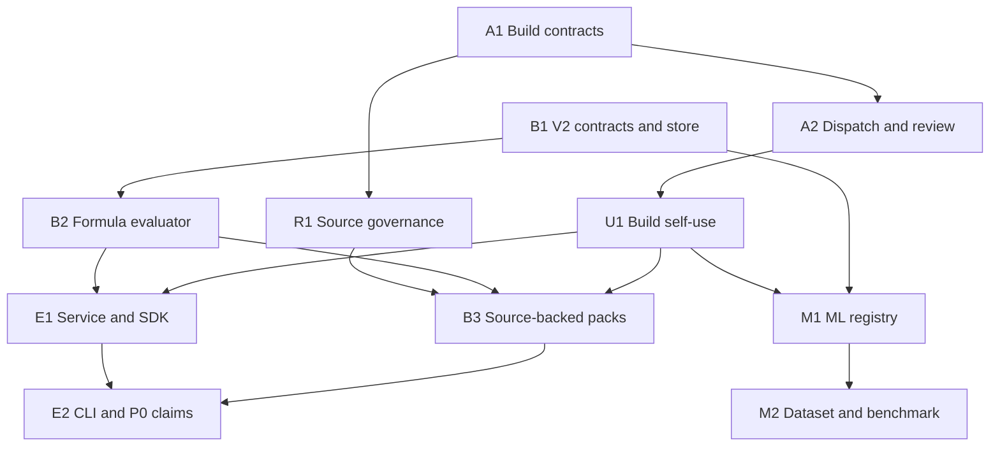

# HELIOS Enriched Build Cycle Implementation Plan

> **For agentic workers:** REQUIRED SUB-SKILL: Use superpowers:subagent-driven-development (recommended) or superpowers:executing-plans to implement this plan task-by-task. Steps use checkbox (`- [ ]`) syntax for tracking.

**Goal:** Deliver the thin development build fabric and the first usable, source-backed Division 23 engine increment—airside, piping, and equipment—through one local service, typed SDK, and finite CLI, while adding governed ATHENA/NotebookLM and Hugging Face/Kaggle inputs without making external services runtime dependencies.

**Architecture:** Keep three authority planes separate: repository-only build control under `build_control/` and `tools/helios_build/`; deterministic runtime code under `src/helios_takeoff_core/`; and external credentials, sessions, weights, datasets, logs, and worktrees under an operator-selected state root. Implement v2 in new engine and database namespaces, preserve all P0/P1A/v1 behavior, and let only the explicit P0 extraction-claim adapter cross from candidate engine results into existing project evidence.

**Tech Stack:** Python 3.12 standard library for the installed core, SQLite with forward-only isolated migration streams, `unittest`, JSON Schema Draft 2020-12 for development manifests, optional `jsonschema` for build tooling, local HTTP/WSGI service, pinned local Hugging Face environments, and Git-tracked content-addressed JSON/JSONL build state.

**Spec:** [`docs/superpowers/specs/2026-09-01-enriched-build-fabric-design.md`](../specs/2026-09-01-enriched-build-fabric-design.md)

## Global Constraints

- Existing P0, P1A, migration 017, v1 domain-pack bytes, v1 digests, and v1 CLI behavior are immutable compatibility surfaces.
- No tarnished repository, quarantine branch, or prior superseded ATHENA implementation is imported or preserved.
- No live drawing/spec ingestion occurs in this cycle. Structured observations and generated P0 fixtures prove the engine and authority boundaries.
- `helios-build` is repository development tooling, not a packaged runtime command, daemon, provider proxy, or second authority database.
- ATHENA returns cited `SourcePacket` artifacts only. Codex or Claude verifies originals and authors engine definitions.
- Hugging Face models return observations; deterministic kernels calculate results. Kaggle/Hugging Face datasets pass rights, provenance, quarantine, and leakage gates before use.
- Codex is the only canonical integrator and Git authority. A builder cannot review its own patch.
- At most three implementation lanes run concurrently, and no two active lanes own the same file, migration stream, schema ID, or public interface.
- Each behavior receives one focused RED/GREEN cycle. The affected integration gate runs once at handoff and once only after substantive correction. The full suite runs once per milestone and once only after substantive correction.
- An unavailable external CLI, expired NotebookLM session, missing source, or absent target Mac blocks only its dependent receipt; it never halts independent core implementation.
- A milestone must include installed executable production behavior. Documentation-only and test-only work cannot complete a capability milestone.

## Plan Suite and Ownership

| Plan | Sole path/interface ownership while active | Output |
|---|---|---|
| [Build Fabric MVP](2026-09-01-build-fabric-mvp.md) | shared build contracts and non-research `tools/helios_build/` modules | Finite task graph, worker dispatch, review, integration, and status |
| [Division 23 V2 Kernels](2026-09-01-division23-v2-kernels.md) | `engine/v2` contracts, compiler, formulas, store, evaluator, packs | Source-backed airside, piping, and equipment results |
| [ATHENA Research Round Trip](2026-09-01-athena-research-roundtrip.md) | research schemas/profile/registry and research modules | Eleven-notebook `ResearchRequest`/`SourcePacket`/outcome chain |
| [ML Registry and Benchmark](2026-09-01-ml-registry-benchmark.md) | `ml/`, ML migrations, model/dataset artifacts and CLI | Governed HF/Kaggle intake and benchmark harness |
| [Local Service, SDK, and CLI](2026-09-01-local-service-sdk-cli.md) | v2 API/service, shared SDK, `engine_cli.py`, P0 adapter transport | Identical engine behavior through service, SDK, and CLI |

`pyproject.toml`, `README.md`, package metadata tests, shared build CLI routing, and package-boundary tests are serialized integration files. The task that owns one must record an `InterfaceFreeze`; later tasks consume that exact hash.

## Dependency Graph



Only true descendants block. For example, an owner-authenticated research receipt can remain pending while B1, B2, M1, M2, and service contract code proceed; production pack definitions that require an unresolved source remain explicitly blocked rather than filled with invented constants.

## Milestone 0 — Freeze Authority and Compatibility

### Task 0.1: Record the accepted plan suite

**Files:**

- Modify: `README.md`
- Modify: `docs/superpowers/specs/2026-09-01-enriched-build-fabric-design.md`
- Create: the six plan files listed above

- [ ] Confirm the accepted spec status says owner-approved and the README identifies implementation planning/execution as the active phase.
- [ ] Confirm every subsystem plan links to the accepted spec and assigns exclusive paths.
- [ ] Run a placeholder scan, not the product test suite:

```bash
forbidden_terms='TO[D]O|TB[D]|PLACE[H]OLDER|coming[ ]later|fill[ ]this'
rg -n "$forbidden_terms" \
  docs/superpowers/plans/2026-09-01-*.md \
  docs/superpowers/specs/2026-09-01-enriched-build-fabric-design.md
```

- [ ] Review the aggregate diff and commit:

```bash
git diff --check
git diff -- README.md docs/superpowers/specs docs/superpowers/plans
git add README.md docs/superpowers/specs/2026-09-01-enriched-build-fabric-design.md docs/superpowers/plans/2026-09-01-*.md
git commit -m "docs: plan enriched HELIOS build cycle"
```

### Task 0.2: Lock v1 compatibility before adding v2

**Owner:** Division 23 V2 Kernels Task 1. The aggregate plan does not create or modify its files.

- [ ] Have the kernel task add the single golden test for the installed v1 demo pack digest, evaluation document, assembly output, and migration 017 SHA-256.
- [ ] Run that task's focused compatibility test once and confirm it passes before v2 edits:

```bash
PYTHONPATH=src python3 -m unittest tests.test_engine_v1_compatibility -v
```

- [ ] Use the kernel plan's `test: lock v1 engine compatibility` commit; do not create a second aggregate-plan commit.

## Enabling Checkpoint 1 — Build Fabric Plus Executable V2 Core

This checkpoint enables productive work but is not the first accepted engine-progress milestone. That milestone requires the source-backed airside, piping, and equipment lanes in Milestone 2.

### Task 1.1: Implement immutable build contracts and graph

Follow Build Fabric MVP Tasks 1–3. The frozen shared functions are:

```python
def load_strict_json(path: Path) -> dict[str, Any]: ...
def canonical_json_bytes(value: JsonValue) -> bytes: ...
def sha256_hex(data: bytes) -> str: ...

class BuildPaths:
    @classmethod
    def discover(cls, start: Path, state_root: Path | None) -> "BuildPaths": ...

class ContentAddressedStore:
    def put_json(self, kind: str, payload: JsonValue) -> StoredObject: ...
```

- [ ] Implement strict canonical data, content-addressed storage, hash-chained ledgers, ownership collision detection, graph transitions, worker profiles, and honest finite preflight.
- [ ] Do not implement dispatch until the task/profile/adapter/configuration schema hashes are frozen.
- [ ] Run only the focused commands declared in the Build Fabric plan and commit at its stated boundaries.

### Task 1.2: Complete finite dispatch, collection, review, and integration

- [ ] Finish Build Fabric MVP Tasks 4–9 only after Task 1.1 interfaces are frozen.
- [ ] Make one local dispatch invocation create one attempt and one finite process group; replay returns existing state.
- [ ] Implement the honest `EXTERNAL_SESSION` assignment/handoff path without converting it into provider preflight or target-host evidence.
- [ ] Derive changed paths from Git, enforce declared ownership, and require a distinct reviewer.
- [ ] Keep raw logs/worktrees/configuration outside Git and keep the entire build tool outside the runtime wheel.

### Task 1.3: Implement v2 contracts, isolated store, and formulas through the fabric

Follow Division 23 V2 Kernels Tasks 1–5. Freeze these runtime boundaries:

```python
def compile_domain_pack(document: object) -> CompiledDomainPack: ...
def compile_observation_bundle(document: object) -> ObservationBundle: ...
def evaluate_bundle(
    pack: CompiledDomainPack,
    bundle: ObservationBundle,
) -> EngineResultSet: ...

class EngineStore:
    def initialize(self) -> None: ...
    def import_pack(self, pack: CompiledDomainPack) -> str: ...
    def load_pack(self, *, pack_sha256: str) -> CompiledDomainPack: ...
```

- [ ] Create `engine/v2/migrations/001_engine_registry.sql`; reject P0/P1A/v1 databases and never invoke `Database` migrations.
- [ ] Compile strict, non-executable formulas and exact Decimal/unit conversions.
- [ ] Emit ordered `READY` or `BLOCKED` `EngineResultLine` records with source, evidence, observation, formula, and pack hashes.
- [ ] Demonstrate deterministic success and blocked-missing-input results from installed runtime code.
- [ ] Before implementation begins, freeze the first substantive Deliverable B task in the Build Fabric. Route its real patch through an available local adapter or the explicit `EXTERNAL_SESSION` path, independent review, and Codex integration.

### Task 1.4: Complete the installed enabling gate

- [ ] Run the Build Fabric focused aggregate once.
- [ ] Run the v2 contracts/store/formula focused aggregate once.
- [ ] Build and install one clean wheel, prove v1 compatibility and v2 structured evaluation, and inspect the wheel to prove it excludes `build_control/`, `tools/helios_build/`, provider configuration, and a `helios-build` entry point.
- [ ] Record `FOUNDATION_READY` only when both Build Fabric and executable v2 core pass. This is an enabling receipt, not accepted domain capability or engine progress. An external-worker preflight is not required.

### Task 1.5: Put subsequent production work under the fabric

- [ ] Freeze real task manifests for remaining B, C, D, E, and F production changes before their builders start.
- [ ] For each capability, collect the actual Git-derived patch/handoff, distinct review, and Codex integration receipt through either an honestly preflighted local adapter or the Build Fabric's explicit `EXTERNAL_SESSION` path.
- [ ] An `EXTERNAL_SESSION` receipt identifies the real worker/session and evidence digest but cannot claim local CLI availability, target-host preflight, or `TARGET_HOST_ACCEPTED`.

## Milestone 2 — First Progress Milestone: Three Source-Backed Division 23 Kernels

### Task 2.1: Establish the research lane without blocking kernel code

- [ ] Implement the eleven-notebook logical manifest, ATHENA profile/instructions, `ResearchRequest`, `SourcePacket`, source registry, original verification, and `ResearchOutcome` contracts from the research plan.
- [ ] Implement the governed `DIRECT_PRIMARY` admission path for an original official/public source. It uses the same immutable `SourceRecord`, independent original verification, and Codex task-scoped acceptance but requires no NotebookLM login and cannot satisfy the ATHENA roundtrip receipt.
- [ ] Export bounded questions for airside, piping, and equipment definitions.
- [ ] If the authenticated session is live, drive ATHENA/NotebookLM and import real packets. If login/MFA is required, record `PENDING_EXTERNAL` and continue non-source-dependent kernel work.
- [ ] Never convert ATHENA prose directly into a rule. A distinct Codex/Claude verifier resolves the original source; another builder authors the pack.

### Task 2.2: Build airside, piping, and equipment lanes

- [ ] Implement the airside pack: rectangular duct LF, surface SF, cited weight lookup, fittings/accessories EA, pressure/material/insulation lineage, and a blocked-input case.
- [ ] Implement the piping pack: pipe and insulation LF, fittings/valves EA, service/material/joining lineage, path-preserving assembly multiplicity, and a blocked-input case.
- [ ] Implement the equipment pack: schedule/plan `MATCHED`, `MISSING`, `DUPLICATE`, and `CONFLICT` reconciliation plus source-backed accessory assembly candidates and a blocked-input case.
- [ ] Keep missing source-dependent production definitions blocked. Contract/compiler/evaluator code and clearly labeled non-authoritative benchmark fixtures may merge independently.
- [ ] Independently review each lane before Codex integration.

### Task 2.3: Prove combined deterministic engine behavior

- [ ] Import all accepted packs into a fresh v2 `EngineStore`.
- [ ] Evaluate canonical BENCHMARK bundles for all three lanes twice with reordered input objects and assert identical result hashes.
- [ ] Reopen the database with network and coding providers disabled and reproduce the same hashes.
- [ ] Record capability matrix states truthfully; do not claim full Division 23 or live takeoff coverage.

## Milestone 3 — Local Service, SDK, CLI, and P0 Candidate Bridge

### Task 3.1: Expose one shared engine behavior

Follow the Local Service, SDK, and CLI plan. Freeze:

```python
class EngineV2Service:
    def compile_pack(self, document: object) -> CompiledDomainPack: ...
    def import_pack(self, document: object) -> PackIdentity: ...
    def load_pack(self, pack_sha256: str) -> CompiledDomainPack: ...
    def evaluate(self, bundle: ObservationBundle) -> EngineResultSet: ...

class HeliosClient:
    def compile_pack(self, document: Mapping[str, object]) -> CompiledDomainPack: ...
    def import_pack(self, document: Mapping[str, object]) -> PackIdentity: ...
    def load_pack(self, pack_sha256: str) -> CompiledDomainPack: ...
    def evaluate(self, bundle: ObservationBundle) -> EngineResultSet: ...
```

- [ ] Implement loopback-only `/v2/engine` routes and a typed standard-library SDK.
- [ ] Route every new `helios-engine v2` command through the SDK/service. The CLI contains no calculation rules and is not the product identity.
- [ ] Prove production evaluator, service/SDK, and CLI emit byte-equivalent canonical result documents and hashes.

### Task 3.2: Connect the evidence-bound extraction-claim adapter

- [ ] Consume the kernel plan's `submit_engine_claims()` contract and connect it to the SDK transport for the existing P0 claim route with `Idempotency-Key: engine-result:{line.sha256}`; do not duplicate request derivation.
- [ ] Reject BENCHMARK results, project/run mismatch, missing or duplicate evidence, and primary-evidence mismatch before any request.
- [ ] Use a generated P0 fixture and prove only `extraction_claims`, `claim_evidence`, and `idempotency_requests` can change.
- [ ] Prove exact replay returns the same claim and no quantity, review, estimate, price, release, or P1A table changes.

## Milestone 4 — Governed Hugging Face and Kaggle Inputs

### Task 4.1: Implement the isolated ML registry and artifact gate

- [ ] Follow ML Registry Tasks 1–3: canonical manifests, isolated migrations, content-addressed quarantine, archive/static scan receipts, local-only adapter protocol, and strict path/database rejection.
- [ ] Keep all ML libraries outside the default wheel dependencies. Missing optional packages produce truthful `UNAVAILABLE`, not a fake pass.
- [ ] Reject floating model revisions, executable/pickle artifacts, silent device/model substitution, and unrecorded network access.

### Task 4.2: Implement dataset rights and leakage intake

- [ ] Record access, copying, redistribution, commercial-use, and training determinations independently.
- [ ] Run hash, archive, provenance, duplicate, split-overlap, and benchmark-leakage gates before acceptance.
- [ ] Reject private bid documents for Hub/Kaggle upload or training without a separate explicit authorization artifact.

### Task 4.3: Separate core code from target-host proof

- [ ] Run the installed-wheel `ML_CORE_CODE_ACCEPTED` gate without a live model.
- [ ] Select no model or dataset by guess. A real pinned model and admitted evaluation set are later content-addressed acceptance inputs.
- [ ] On the owner's M5 Max, run the frozen title-block OCR benchmark with explicit MPS and record real metrics, latency, peak memory, host/runtime/lock hashes, and failure-set review as `TARGET_MODEL_BENCHMARK_ACCEPTED`.
- [ ] If target-host access is unavailable, leave only that receipt pending and continue core/product work.

## Milestone 5 — Real Research-to-Engine and Build-Self-Use Proofs

### Task 5.1: Close one accepted and one rejected research path

- [ ] Drive one real owner-authenticated ATHENA/NotebookLM request through `ResearchRequest → SourcePacket`.
- [ ] Independently verify the original public source and record `ORIGINAL_VERIFIED` and task-scoped `ACCEPTED_FOR_BUILD`.
- [ ] Have the non-verifier builder author the v2 definition, compile it, evaluate it, and record `ResearchOutcome: USED`.
- [ ] Preserve one rejected source or unresolved conflict through `ResearchOutcome: REJECTED|PARTIAL`.
- [ ] Store only sanitized hashes/metadata in Git and emit `RESEARCH_ROUNDTRIP_ACCEPTED`; never commit cookies, live notebook IDs, raw transcripts, or source bodies.

### Task 5.2: Close the target-host workforce receipt

- [ ] On the target Mac, exact-preflight Claude and one secondary worker using operator-owned configuration outside Git.
- [ ] Dispatch bounded, non-overlapping tasks that make substantive production changes; collect their real patches, independently review them, and let Codex integrate them. This target-host proof is additional to the B-through-F core self-use receipts from Task 1.5.
- [ ] Record honest `UNAVAILABLE` for any other provider; never substitute Codex output under another identity.
- [ ] Combine those receipts with the real M5 benchmark to emit `TARGET_HOST_ACCEPTED`.

### Task 5.3: Emit final cycle status

The report logic is exact:

```python
cycle_complete = all((
    core_code_complete,
    research_roundtrip_accepted,
    target_host_accepted,
))
```

- [ ] Emit `CORE_CODE_COMPLETE` after the installed build schemas, three kernels, service/SDK/CLI parity, and ML/dataset harness gates pass.
- [ ] Emit the two external receipts only from real external operations.
- [ ] Emit `CYCLE_COMPLETE` only when all three are present; otherwise name the pending receipt while continuing independent roadmap work.

## Final Verification and Handoff

- [ ] Run each subsystem's affected integration gate once after its final substantive integration.
- [ ] Run the full repository suite once for the completed milestone; rerun it only if a substantive fix was made.
- [ ] Build a fresh wheel without network dependency resolution, install it into a fresh environment, and run installed runtime acceptance.
- [ ] Inspect the wheel and source tree for authority-boundary violations and placeholder/fake receipt markers.
- [ ] Have a non-author independent reviewer compare implementation to the accepted spec and all five subsystem plans.
- [ ] Codex resolves findings, records exact final `git rev-parse HEAD`, pushes the feature branch, updates the draft PR, and keeps `main` unchanged pending merge approval.

The next execution action after this plan is committed is Build Fabric Task 1 in parallel with v1 compatibility Task 0.2. As soon as the build contracts freeze, v2 contracts/store work starts; development does not wait for NotebookLM login, external provider preflight, source acquisition, or the M5 benchmark.
