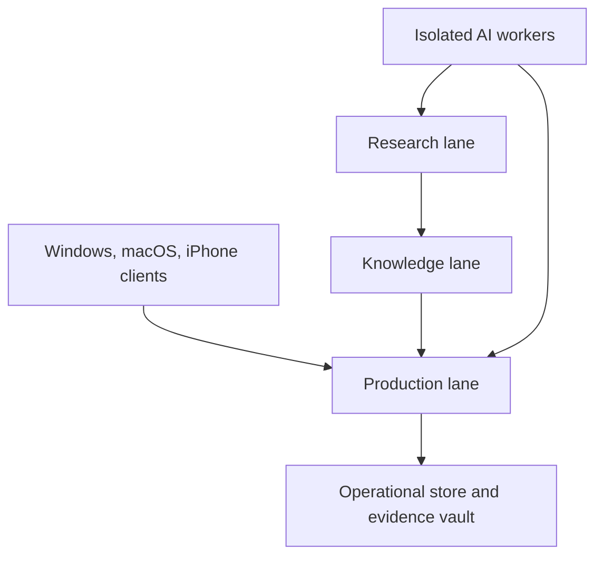

# Heleos-spark Foundation Design

**Status:** Approved by owner on 2026-08-28

**Date:** 2026-08-26

**Repository:** `bbukolla-eng/Heleos-spark`

**Decision owner:** Bekim Bukolla

## 1. Purpose

Heleos-spark will be a clean-room, evidence-first HVAC and Division 23 takeoff system. It will combine deterministic document processing and quantity calculations with source-grounded research, specialized vision models, and governed AI workers.

The system is intended to become superior for the owner's work through measured performance on adjudicated drawing sets. It is not an attempt to train a general-purpose foundation model. No model, notebook, agent, or researched rule becomes production truth merely because it produced a confident answer.

The initial engineering priority is the foundation beneath the AI: operational data, immutable evidence, deterministic intake, migrations, auditability, and tests.

## 2. Binding clean-room boundary

The prior repository is quarantined and unrelated. Heleos-spark must not fork, clone, inspect, compare against, import, migrate, install, reference, or reuse any of its:

- code, tests, configuration, dependencies, database state, prompts, datasets, generated artifacts, or build outputs;
- branches, commits, tags, issues, pull requests, actions, releases, or Git history; or
- internal documentation, schemas, conventions, filenames, or implementation details.

Owner requirements may be expressed anew. Every external source, dependency, dataset, model, and copied asset introduced into Heleos-spark must have independently recorded provenance and an acceptable license or usage basis. The new repository begins with its own root history and source registry.

## 3. Governing principles

1. **Evidence before assertion.** Every material takeoff line must be traceable to document revision, sheet, coordinates, extraction method, rule version, model or software version, confidence, and review history.
2. **Intelligence is separate from authority.** Models and research systems propose; deterministic controls and approved humans authorize.
3. **Local-first operation.** Core intake, review, correction, calculation, evidence retrieval, and export must work without a cloud connection.
4. **Affected-scope blocking.** Uncertainty blocks the affected item, system, or release. It does not cause guessing and should not prevent safe work elsewhere.
5. **Reproducibility.** The same frozen inputs, rules, and versions must yield the same authoritative quantities and evidence references.
6. **Least privilege.** Every worker, plugin, browser session, and cloud adapter receives only the data and permissions its current task requires.
7. **Replaceable providers.** NotebookLM, model hosts, cloud services, automation tools, and coding CLIs are adapters, never the canonical data model.
8. **Measured promotion.** Corrections and research become candidate rules, then tests, then staging changes, then owner-approved production changes.

## 4. Three-lane architecture

The arrows into the production lane are controlled submissions, not direct authority. Research and workers cannot write accepted quantities, approved rules, immutable evidence, or release state directly.

### 4.1 Production lane

The production lane begins as one local process and one transactional metadata store. It owns:

- immutable project intake;
- document and revision identity;
- sheet inventory and scale state;
- job execution and resumability;
- evidence objects, crops, overlays, and coordinates;
- detections, schedule rows, reconciliations, and takeoff lines;
- corrections, reviewer decisions, exports, and audit events; and
- all release gates.

For the first local milestone, metadata will use SQLite in WAL mode with foreign keys, explicit migrations, a controlled single-writer path, and safe transaction boundaries. Binary evidence will use a content-addressed filesystem vault keyed by SHA-256. Objects are immutable by application contract and written atomically; an ordinary local filesystem is not represented as regulatory WORM storage. Mutable review and lifecycle state stays in separate records. These are deliberate initial choices for a single-user, offline-first foundation; storage interfaces must permit a later PostgreSQL and object-storage implementation without changing domain contracts.

### 4.2 Knowledge lane

The knowledge lane is separate from project operational state. It owns:

- source registry and immutable source snapshots;
- Division 23 taxonomy and system vocabulary;
- cited specification facts and manufacturer requirements;
- versioned candidate and approved rules;
- pricing provenance and freshness metadata;
- training/evaluation dataset manifests; and
- supersession, review, and retirement history.

A source can support a candidate rule but cannot directly alter a quantity. A rule may enter production only after its citations, scope, tests, version, reviewer, and rollback path are recorded.

The promotion path is: original source → versioned cited finding → candidate rule → tests → independent review → owner promotion. Source records include source class, rights basis, jurisdiction, edition or effective date, retrieval date, document hash, precise locator, applicability, and supersession state.

### 4.3 Research lane

The research lane may use NotebookLM, browser research, Hugging Face, Kaggle, Grok Bots, direct model APIs, and isolated coding CLIs. It produces cited research packets, dataset candidates, model evaluations, rule candidates, and code patches.

Its outputs land in staging or quarantine. The research lane has no direct production database credentials, bid-release authority, or ability to approve its own output.

## 5. Data classification and external egress

| Class | Examples | Default external-provider rule |
|---|---|---|
| `PUBLIC` | Public standards pages, public manufacturer literature, licensed public datasets | May be sent to approved research providers with source and license logging |
| `INTERNAL` | Company rules, internal benchmarks, non-project estimating methods | Local by default; provider access requires an explicit approved policy |
| `PROJECT_CONFIDENTIAL` | Bid drawings, specifications, addenda, quotes, evidence crops | Local by default; external use requires project- and provider-specific approval |
| `SECRET` | API keys, tokens, credentials, signing material | Never placed in prompts, datasets, notebooks, logs, or the repository |

Every external submission must record provider, purpose, data class, source hashes, policy decision, time, and result reference. Interactive login is permitted through the official service UI; credentials are entered by the owner, are never extracted by automation, and expired sessions pause the affected workflow.

## 6. Operational data and evidence contracts

The first schema establishes these durable concepts:

| Record | Responsibility |
|---|---|
| `projects` | Project identity and lifecycle |
| `content_objects` | Canonical byte blobs, hashes, media types, lengths, and vault keys |
| `documents` | Logical document identity independent of one file or project |
| `document_revisions` | Canonical revision identity linked to an immutable content object |
| `project_documents` | Project-specific association, role, authority, and naming context |
| `ingest_events` | Every attempted intake, including duplicate, rejected, and quarantined outcomes |
| `sheets` | Page/sheet identity, title, discipline, dimensions, and revision link |
| `scales` | Declared, detected, calibrated, verified, and rejected scale facts |
| `job_runs` | Finite, resumable work with frozen inputs, versions, budget, and exit reason |
| `source_records` | Provenance, license/rights basis, data class, taxonomy, and source hash |
| `evidence_objects` | Content-addressed crops, overlays, text, coordinates, and generating context |
| `corrections` | Before/after values, reason, author, scope, and rule-candidate link |
| `audit_events` | Append-only security, workflow, and decision history |

Later migrations add detections, equipment schedule rows, reconciliation edges, topology, takeoff lines, RFIs, pricing, labor, and exports. Those later tables must reference the same document revision, evidence, rule, and run identities rather than creating parallel provenance schemes.

An evidence object must be sufficient to reproduce or inspect a claim. At minimum it records:

- object SHA-256, media type, byte length, and storage-relative key;
- project association, document revision, sheet, page coordinate space and transform, and bounding box or polygon;
- source text or visual crop and, when applicable, an overlay object hash;
- extraction method and parameters;
- model name, pinned version or digest, and runtime when a model participated;
- applied rule identifiers and versions;
- confidence components rather than only one opaque score;
- originating run, timestamps, and decision state; and
- reviewer identity, correction history, and final disposition.

No accepted material line may exist without resolvable evidence. Derivatives record parent artifact hashes so lineage can be traversed to the original bytes. Evidence bytes are immutable by application contract; corrections create new records and links rather than overwriting history.

## 7. Quantity and decision states

The initial domain vocabulary reserves these distinct states:

- `measured_m`
- `rule_derived`
- `context_required_candidate`
- `allowance`
- `clarification`
- `exclusion_proposal`
- `human_accepted_estimate_line`

Context documents may create obligations, conflicts, candidates, allowances, or questions. They may not silently rewrite measured M-drawing quantities. Project-specific contract instructions determine precedence. An unresolved material conflict is evidence-linked and blocked for decision.

## 8. Model and dataset strategy

No Hugging Face or Kaggle asset is automatically part of the product. Each candidate must pass license, provenance, security, hardware, accuracy, latency, memory, and reproducibility review.

The initial vision bakeoff registry will include:

- **Detection:** RF-DETR Large as the initial primary candidate, challenged by D-FINE, LW-DETR, and RT-DETR-family implementations that have verified releases and acceptable licenses.
- **OCR/layout:** exact pinned PP-OCR releases for text and PaddleOCR-VL-family candidates for schedules and dense document layouts, challenged by other reproducible document-VLM candidates.
- **Segmentation:** EdgeTAM for interactive assistance, SAM 2.1 for high-quality masks, and an RF-DETR segmentation candidate where its license and performance qualify.
- **Verification:** a locally runnable Qwen-family vision-language candidate, used as a non-authoritative checker rather than a measuring engine.

Model names above are candidates, not permanent winners. Exact repository, release, license, weights digest, preprocessing, and runtime are pinned only after a frozen bakeoff. Unpinned `latest` model identifiers are forbidden in reproducible or production runs.

The owner's M5 Max Mac with 18 CPU cores, 40 GPU cores, 128 GB unified memory, and 2 TB free storage is the primary local research and inference workstation. It is well suited for annotation, OCR, document models, evaluation, local inference, and moderate fine-tuning. Metal/MPS incompatibility or inefficient training must not be hidden; authoritative large training jobs may use a time-bounded NVIDIA cloud job after the local pipeline and dataset are reproducible.

Kaggle is included for public or explicitly licensed datasets, notebooks, and benchmark discovery. A dataset must be copied into the governed local registry with its origin, owner, version, license, files, hashes, transformations, and allowed uses before evaluation. Kaggle and Hugging Face downloads enter quarantine for checksum verification, archive and malware inspection, safe-serialization checks, and data-leakage review before any code loads them. Private bid packages are not uploaded to Kaggle or Hugging Face.

## 9. NotebookLM and research operation

NotebookLM is a research workspace, not the database, rules engine, evidence vault, or production authority.

The first integration is browser-driven through the official UI using an owner-authorized login session in a dedicated browser profile. That login authorizes only the approved workflow; cookies and session material are never exported to code, logs, other workers, or the repository. The system will maintain a complete local source registry and local source copies so a notebook can be rebuilt or replaced. Browser automation may create or update notebooks, add approved sources, request cited synthesis, and export permitted results. It must pause for expired sessions, MFA, consent, or ambiguous UI state; it must never extract credentials or bypass access controls.

Any future official or experimental API integration sits behind a capability-tested adapter. Unsupported operations use an explicit human-assisted fallback. No undocumented API becomes a mandatory production dependency.

Notebook outputs are imported as research artifacts with notebook identity, source set, query, time, citation mapping, and content hash. NotebookLM assists navigation and synthesis; the original source and precise locator—not the notebook answer—are the authoritative citation. Claims remain candidates until citations and applicability are independently checked.

## 10. AI worker and automation boundaries

Codex orchestrates task definition, routing, review, correction, verification, and controlled Git integration. A deterministic controller—not an LLM—owns permissions, budgets, leases, timeouts, idempotency, state transitions, and stop conditions.

Claude Code, Kimi Code, Grok Build, Cursor Agent, GitHub Copilot CLI, and later approved workers operate in isolated worktrees or disposable containers. Each receives a frozen base commit, exact objective, allowed paths and tools, acceptance tests, forbidden changes, and time/action/cost limits. Workers return patches and reports; they do not push to `main`, approve themselves, merge, modify credentials, or change production truth.

Grok Bots are included as a staged public-data research and adversarial-review channel. They are not treated as independent security boundaries, receive no private project data by default, and cannot write to production systems.

n8n may later provide self-hosted edge automation for intake notifications, research dispatch, approval routing, and run alerts through idempotent job APIs. It will not calculate quantities, store raw private drawing sets, invoke unrestricted shells, or become a source of truth. CrewAI remains a laboratory adapter and is admitted only if a frozen benchmark shows a material advantage over simpler direct-worker workflows.

No cloud deployment is required for the foundation milestone. The design remains portable to Azure as the first optional production cloud, a bounded Google research lane, and an inactive AWS adapter. Multi-cloud-ready does not mean multi-cloud-deployed.

## 11. Skills and plugin policy

Repository-owned skills will capture repeatable, testable workflows after this design is approved:

- clean-room boundary enforcement;
- source curation and citation validation;
- evidence-first takeoff review;
- model and worker bakeoffs;
- plan-tag and equipment-schedule reconciliation; and
- release verification.

Development may use reviewed Superpowers workflows for planning, test-driven development, debugging, worktrees, code review, and verification, plus PDF, spreadsheet, Hugging Face, analytics, and native iOS skills where their task applies.

The GitHub connector is the current repository control path. Codex Security is the preferred next plugin before serious code-review and dependency gates. Google Drive, Figma, and Gmail integrations are deferred until an approved milestone requires document intake, interface design, or communication. Third-party skills and plugins require source review, version pinning, minimum permissions, a named owner, and a concrete task; novelty is not an admission criterion.

Four GitHub Apps appeared as account-level auto-installs when this repository was created: Azure Pipelines, AWS Connector for GitHub, Amazon Q Developer, and ECC Tools. The repository-creation form did not offer a repository-local opt-out, and this design does not authorize changing account-wide installations. Their presence is not approval to run them. Before implementation workflows or secrets are added, their permissions and repository access must be inventoried and each app must be explicitly retained, restricted, suspended, or removed by the owner. Until then, no workflow or secret will be added for them, and no app-triggered result is authoritative.

Skills are executable supply chain and are reviewed like code. Repository-owned skills are versioned, tested, and changed through review. External skills, plugins, prompts, models, and tools may not drift at runtime: admission requires provenance, pinned version or digest, license, permissions and egress review, evaluation evidence, and a rollback target.

## 12. Native platform direction

Windows and macOS are full-authority desktop clients with feature parity for intake, drawing review, takeoff, evidence, correction, estimating, research control, export, and final approval. Apple Silicon is a required macOS target. The iPhone application is a native companion for controlled review and approval; it does not replace the desktop final-estimate workflow.

Business rules, geometry, data contracts, and evidence behavior live in one shared platform-independent core exposed through a versioned local API. Platform shells provide native filesystem, keychain, installer/signing, rendering, and hardware-acceleration adapters. The exact UI and core implementation technologies will be selected in the implementation plan only after a small cross-platform proof tests PDF rendering, local IPC, packaging, and Apple Silicon/Windows behavior. Windows CI begins with the shared core; desktop feature parity is a product gate, not a requirement to build both complete interfaces during Foundation 0.1.

## 13. Failure behavior and security controls

- Intake never alters source bytes. A hash mismatch is a hard failure.
- Duplicate content is deduplicated in the vault while every intake attempt remains auditable.
- Unsupported, corrupt, password-protected, or suspicious files enter quarantine with a typed reason.
- A missing or unverified scale blocks scale-dependent quantities on that sheet.
- Localized extraction failures block only their dependent items; integrity, migration, hash, or scale failures block the affected job or release.
- Research, model, browser, or cloud failure cannot corrupt or partially approve production data.
- Jobs have explicit states, leases, heartbeats, deadlines, action budgets, cost budgets, cancellation, and resumable checkpoints.
- Writes are transactional and idempotent. Replaying a request with the same idempotency key cannot create a second authoritative result.
- Secrets remain in OS keychains or an approved secret manager and are redacted from logs.
- Logs distinguish public metadata from sensitive content and default to the least revealing useful record.
- The evidence vault is append-only to application code. Retention and deletion require a separately authorized, fully enumerated operation.
- Audit events are append-only at the application boundary and chained or exported for tamper detection; SQLite alone is not claimed to prevent privileged alteration.
- Backups are encrypted, content hashes are verified during backup, restore, read, and export, and restoration is tested before production use.
- Untrusted PDFs, pages, notebooks, datasets, model cards, and web content are data, never agent instructions; embedded prompt injection cannot grant tools, change policy, disclose secrets, or promote rules.
- Every production-changing decision records actor, inputs, prior state, new state, reason, and time.

Agents cannot provision cloud services, change billing, purchase anything, send external messages, or alter account-wide security settings without a separately authorized owner action.

## 14. First implementation milestone: Foundation 0.1

After owner approval of this design and the implementation plan, the first vertical foundation will build:

1. repository policy, dependency manifests, formatting, typing, and test harness;
2. versioned SQLite schema and forward migrations for the initial operational records;
3. content-addressed evidence vault with atomic writes, orphan reconciliation, backup/restore verification, and SHA-256 verification;
4. deterministic PDF intake, metadata extraction, and per-page records;
5. typed domain and error contracts;
6. audit events, finite job state, idempotency, and crash-safe retry behavior; and
7. unit, integration, migration, corruption, duplicate-ingest, and restart tests.

Foundation 0.1 is accepted only when a public or synthetic PDF fixture can be ingested twice with:

- original bytes unchanged and the expected stable SHA-256;
- one stored content object and one canonical document revision rather than duplicate evidence bytes;
- two auditable intake attempts linked to deterministic outcomes;
- stable page ordering, page dimensions, rotation, units, per-page identities, and derivative lineage;
- a clean migration from an empty database and a tested migration rollback/recovery procedure;
- successful restart after an intentionally interrupted ingest without partial authoritative state;
- correct typed outcomes for identical content under a new filename, a near-duplicate PDF, corrupt bytes, and an encrypted PDF;
- successful retrieval and hash verification of the original and its evidence manifest;
- zero external network calls in the default local test path; and
- all declared automated checks passing from a clean checkout.

No broad Division 23 rules engine, pricing engine, multi-cloud deployment, full UI, bot roster, or model training may delay this milestone.

## 15. Subsequent sequence

After Foundation 0.1 passes:

1. build the governed source registry and Division 23 taxonomy;
2. establish the frozen dataset and model/worker bakeoff harness;
3. implement sheet inventory and verified scale;
4. extract equipment schedules and reconcile plan tags in both directions;
5. implement one narrow airside takeoff class with evidence crops and overlays;
6. support human correction and deterministic recalculation;
7. export estimator-usable live-formula Excel and an evidence PDF; and
8. expand systems, automation, native clients, and optional cloud services only through measured gates.

## 16. Approval and change control

This document is the proposed foundation design, not permission to begin production implementation. Owner approval freezes it as the initial architecture baseline. Material changes to clean-room scope, data egress, production authority, evidence requirements, native platform parity, or the first milestone require a recorded owner decision.

After approval, a separate implementation plan will break Foundation 0.1 into small test-driven tasks with exact files, commands, acceptance checks, and commit boundaries.
