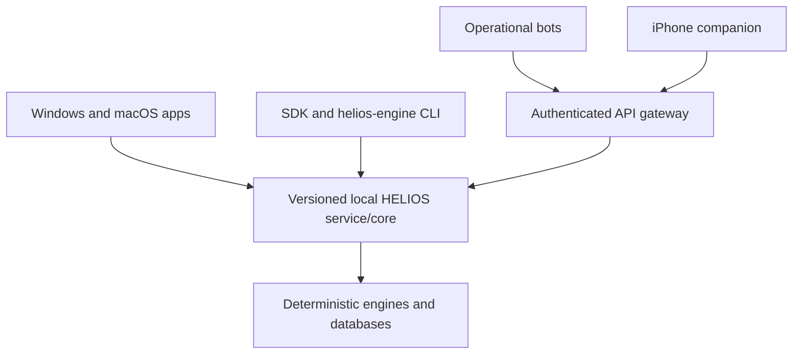

# HELIOS Enriched Build Fabric Design

**Status:** Owner-approved; implementation plan recorded

**Date:** 2026-09-01

**Repository:** `bbukolla-eng/Heleos-spark`

**Python distribution:** `helios-takeoff-core`

**Branch:** `feat/enriched-build-fabric`

**Base:** `6d50910727b14fedfe28ce5c1e6171b8fab9fc0c`

Once approved, this document is the controlling successor to the 2026-08-26 foundation design for build sequencing, research operation, worker orchestration, and engine delivery. The earlier clean-room boundary, evidence requirements, authority separation, data classification, and native-platform direction remain in force. Where the earlier document places PDF/drawing intake before the engine foundation, this later owner decision controls: databases, source governance, structured engine contracts/kernels, and model boundaries come first.

## 1. Purpose

This phase turns the approved multi-model design into a productive software-building system while continuing to build the actual HELIOS Division 23 engines.

HELIOS is the deterministic takeoff, estimating, pricing, bidding, procurement, and project-management engine. It is not a researcher, agent chat room, NotebookLM controller, or collection of provider CLIs. Codex, Claude, Kimi, Grok, Cursor, Copilot, ATHENA, Grok Bot, NotebookLM, Hugging Face, and Kaggle assist in building or operating HELIOS through explicit boundaries; they do not become its authority.

The phase has two inseparable outputs:

1. A thin, controlled build fabric that lets Codex direct multiple builders without overlapping work or creating hidden test loops.
2. New installed engine capability covering shared Division 23 contracts plus initial airside, piping, and equipment behavior.

The build fabric is not considered progress by itself. Every implementation cycle must produce a usable, executable HELIOS capability.

HELIOS is the product; `Heleos-spark` is its canonical clean GitHub repository; `helios-takeoff-core` is the current Python distribution for the deterministic core. No tarnished predecessor repository, quarantined history, or misplaced branch is imported, preserved, or consulted.

## 2. Non-negotiable rulings

- Codex owns task decomposition, routing, integration, Git commits, pull requests, and final merge authority.
- Claude is the co-architect, primary complex-feature builder, and integration reviewer. Claude does not merge independently.
- Kimi, Grok, Cursor, and Copilot are bounded specialist builders or reviewers selected by task type and measured performance.
- ATHENA and NotebookLM form an external build-time research service driven by Codex and Claude. They do not live inside the HELIOS runtime.
- The shipped HELIOS runtime must recalculate deterministically without any coding-provider, NotebookLM, Grok Bot, Hugging Face Hub, Kaggle, cloud, or live network dependency.
- Hugging Face models may produce observations and evidence candidates. Deterministic HELIOS code calculates quantities, assemblies, labor, and prices. P0 retains approval and release authority.
- The current `helios-engine` command is a headless development, proof, and automation adapter. It is not the planned customer interface.
- Windows and macOS are full-authority native desktop targets. iPhone is a native companion. All clients call the same local HELIOS service/API and SDK.
- Existing P0 authority remains intact. No builder, model, bot, or build-fabric command may approve takeoffs, pricing, estimates, or bid releases.
- There is no quarantined legacy workflow to maintain and no second orchestration authority. Historical migrations remain immutable facts; obsolete worker identities are not activated or repurposed.
- Real drawing ingestion is not the first task in this phase. Shared schemas, source-backed engine definitions, calculation kernels, model registry, and local service contracts are built first.

## 3. System boundary

### 3.1 Build-time control plane

The build-time control plane lives in repository development tooling and operator-owned configuration outside the packaged HELIOS runtime. It may use internet access, authenticated browser sessions, local provider CLIs, isolated worktrees, NotebookLM, model registries, and public datasets.

It produces:

- immutable task contracts;
- source and research packets;
- code patches and commits;
- migration and interface changes;
- test and benchmark receipts;
- independent review findings;
- accepted source-backed engine definitions;
- sanitized integration receipts.

ATHENA, NotebookLM, and other source assistants cross this boundary only by producing schema-validated `SourcePacket` and source-manifest artifacts. Codex or Claude authors candidate v2 domain-pack JSON from accepted packets. Research assistants do not edit domain packs, import HELIOS database classes, call `EngineRepository`, submit P1A jobs, write P0/P1A tables, or appear in installed runtime commands or runtime acceptance.

### 3.2 HELIOS runtime

The HELIOS runtime owns:

- versioned databases and migrations;
- source-backed domain packs;
- deterministic engine contracts and calculations;
- local service and SDK interfaces;
- evidence and lineage references;
- P0 project, review, approval, estimate, and bid-release authority;
- P1A bounded operational worker execution where explicitly applicable.

It must not require a build-worker CLI, research login, prompt transcript, NotebookLM session, or cloud account to open a project or recalculate an accepted result.

### 3.3 P0 and P1A compatibility

P0 remains the sole authority for projects, actors, document revisions and frozen baselines, evidence, extraction claims, quantities, reviews, takeoff snapshots and approvals, suppliers and quotes, estimate snapshots and approvals, and bid releases.

P1A remains the bounded runtime worker/audit boundary already recorded by its migrations. It is not the development scheduler. Existing coding-provider roster entries remain unavailable and are not used by the new build fabric. A later forward migration may explicitly deprecate them and add separately named operational bot identities; history is not rewritten.

The build fabric has no database route into P0 bid-impacting tables. Accepted runtime features continue to enter through the existing P0 service and migration boundaries.

`helios-build` never uses `agent_jobs` as a development queue, writes no P0/P1A table, and is never imported by installed HELIOS runtime modules. The existing `BASELINE_AUDIT` capability remains unchanged. Any future runtime observation worker requires a separate P1A capability-extension design and migration.

### 3.4 Authority and persistence map

“Database first” means freezing the minimum authoritative data contracts and forward-only schema before implementing each kernel. It does not mean prebuilding every future product table.

| Store | Authority | Explicit non-authority |
|---|---|---|
| P0 project database | Project sources/evidence, claims, quantities, reviews, pricing snapshots, approvals, releases | Research, development scheduling, model selection |
| Engine registry database | Immutable source-backed domain definitions, formulas, units, assembly rules, exact pack identity | Project facts, activation by “latest,” approval or release |
| Build-control ledger | Development tasks, graph state, routing, handoffs, sanitized receipts | Runtime work, project facts, bid authority |
| Model/dataset registry | ML provenance, rights, benchmark and promotion metadata | Quantity, engineering-rule, or bid authority |
| NotebookLM notebooks | Derivative research workspace over admitted sources | Canonical source registry, engine database, production rules |

The first executable engine task freezes shared Division 23 contracts and the engine-store schema before kernel implementation.

## 4. Build graph and worker roles

The build is a directed task graph, not a group chat and not an unbounded agent loop.

| Lane | Primary responsibility | Authority limit |
|---|---|---|
| Codex control | Contract, dependency graph, worker routing, integration, Git | Cannot waive P0 approval rules |
| Claude architecture | Interfaces, complex multi-file features, design and integration review | Cannot merge or approve its own work |
| ATHENA/NotebookLM research | Source discovery, notebook maintenance, cited synthesis | Cannot write runtime facts or approve rules |
| Kimi impact/data | Repository-wide impact maps, large bounded implementation, data consistency | Read-only unless named sole builder |
| Grok CLI | Alternative implementation, adversarial analysis, failure discovery | Cannot self-review or merge |
| Cursor | Focused repository work, native UI, targeted refactors | One assigned file scope at a time |
| Copilot | GitHub/CI work, small maintenance, tests, issue-scoped implementation | No branch protection or merge authority |
| Independent review | Contract compliance, source fidelity, failure behavior | Reviewer must not be the author |
| Codex integration | Apply accepted work, resolve conflicts, run bounded gate, commit | Sole integration and Git authority |

### 4.1 Parallelism rules

- At most three implementation lanes run concurrently.
- One writer owns a file, module, schema, or public interface at a time.
- A task may run in parallel only when it does not consume another active task's uncommitted output.
- Research and repository-impact analysis may run in parallel with one another.
- Tasks sharing a migration, schema, package boundary, or public interface run sequentially until that boundary is frozen.
- Each implementation lane has a distinct builder, an independent reviewer, and Codex as integrator.
- A worker never approves its own patch.
- Provider substitution is never silent. An unavailable worker produces a recorded reroute decision or a blocked node.
- A blocked node blocks only its descendants; unrelated graph nodes continue.

An unavailable external worker never blocks independent engine work. Codex may append an explicit routing event and reassign the task, but cannot relabel its own work as output from Claude, Kimi, Grok, Cursor, or Copilot.

### 4.2 Diamond handoff pattern

Every non-trivial capability uses the graph-engineering diamond:

1. A small number of independent research or analysis branches produce evidence.
2. One named synthesis node reconciles those branches.
3. A verifier distinct from the author checks the synthesized artifact.
4. Codex alone integrates the verified result.

This prevents duplicate synthesizers, contradictory builders, circular review, and two workers editing the same deliverable.

### 4.3 Typed graph and idempotency

The graph contains typed nodes `ResearchRequest`, `SourcePacket`, `InterfaceFreeze`, `BuildTask`, `Attempt`, `Checkpoint`, `Artifact`, `Patch`, `Review`, `Integration`, and `Capability`, with typed edges `DEPENDS_ON`, `PRODUCES`, `CONSUMES`, `REVIEWS`, `TOUCHES_INTERFACE`, and `BLOCKS`. The normal append-only transition path is `DRAFT → READY → DISPATCHED → RETURNED → REVIEWED → ACCEPTED → INTEGRATED`. Any active node may terminally become `BLOCKED` or `FAILED`; a correction, resume after unknown outcome, or reroute creates a successor manifest and marks the prior node `SUPERSEDED` rather than rewriting its events.

Before dispatch, the controller must prove the dependency graph is acyclic and detect collisions across explicit files, path globs, migrations, schemas, and public interfaces. One run is identified by `(task_manifest_sha256, base_commit_sha, adapter_configuration_sha256)`. Replaying that identity returns the existing handoff instead of starting hidden duplicate work.

Each dispatch creates one finite append-only attempt. A worker may publish a checkpoint only at a task-declared boundary. A normal verified resume references the last checkpoint through a successor manifest. Timeout or crash terminates the process group and records `OUTCOME_UNKNOWN` or `FAILED`; it never invents success. Retry or reroute requires a new explicit routing event. Replaying an existing run identity returns its current state or prior terminal receipt—not an assumed handoff. There is no automatic polling or hidden retry loop.

Git stores immutable manifests and sanitized receipts. A configured external state root stores raw logs, credentials, authenticated sessions, and ephemeral worktrees. Workers may return patches or commits from isolated worktrees but never push or merge the canonical branch. Only Codex stages canonical changes, records independent review, commits, and merges.

### 4.4 Skills and plugins

Skills and plugins are versioned build-time capabilities, not implicit authority. A worker profile declares the exact skill/plugin, version or revision, allowed tools, data class, and task purpose. A task contract grants only the minimum needed capabilities. Superpowers governs design/planning/execution gates; graph-engineering governs task DAGs, ownership, synthesis, and verification. Additional plugins are admitted only for a concrete task and never gain direct P0/P1A writes, credentials beyond their declared connector, or merge authority.

## 5. Task contract

Every worker assignment is an immutable, schema-validated task manifest containing:

- task ID and user-visible capability;
- base commit and dependency-node IDs;
- primary builder, independent reviewer, and Codex integrator;
- owned files/modules and forbidden paths;
- frozen interfaces and declared schema impact;
- required source-packet IDs and evidence threshold;
- production deliverables, such as code, migration, API, SDK, CLI adapter, or documentation;
- exact executable acceptance behavior and commands;
- time, cost, focused-test, and integration-test budgets;
- maximum correction rounds;
- stop, block, reroute, and escalation conditions.

The worker returns a structured handoff containing:

- patch or commit SHA;
- files changed;
- commands executed;
- focused-test results;
- assumptions and unresolved issues;
- dependency and security effects;
- source-packet IDs used;
- duration and cost when the provider exposes them.

Conversational claims such as “done,” “tested,” or “researched” are not handoff artifacts.

## 6. Productive development and bounded verification

The process is optimized for accepted behavior rather than activity.

- Each feature cycle must add working engine capability. Documentation or tests alone cannot complete a feature cycle.
- Synthetic fixtures may test edge cases, but production acceptance must execute installed production code and source-backed definitions.
- Each contracted behavior gets one focused RED/GREEN cycle. After substantive implementation or correction, rerun only its focused affected set—not every unchanged command.
- The affected integration gate gets one initial run at handoff and at most one verification rerun after a substantive correction.
- Each integration milestone gets one initial full-suite run and at most one verification rerun after a substantive fix. An unchanged failing command is never rerun.
- A builder/reviewer pair receives at most two correction rounds. A remaining critical defect causes the task to be split, redesigned, or escalated; minor findings enter the backlog.
- New tests require a contracted behavior or a newly discovered real failure. Test count is not a progress metric.
- Initial time targets are five minutes for focused checks, ten minutes for the affected integration gate, and twenty minutes for a full milestone gate. Each task contract may set a measured exception. Repeatedly exceeding the declared budget causes split, redesign, or escalation—not a waived threshold or another blind run.
- Small working increments are integrated instead of accumulating a large speculative branch.

Primary progress is the number and complexity of accepted executable capabilities. Lines of code, test count, commits, prompts, research messages, and agent activity are not progress measures.

A capability is complete only when installed production code accepts non-canned structured input, loads persisted source/rule/model lineage as applicable, emits deterministic canonical output plus a blocked or invalid case, is reachable through the shared service/SDK/CLI surfaces that apply to that capability, and records a content-addressed receipt.

## 7. ATHENA and NotebookLM research service

ATHENA exists to help Codex and Claude build better engines. It is not a generic HVAC news feed and not an operator of HELIOS.

### 7.1 Notebook separation

The research corpus is divided into eleven notebooks so sources and answers do not become an undifferentiated swamp:

1. Takeoff methodology and drawing interpretation
2. Duct, fittings, and SMACNA
3. Hydronic, refrigerant, and condensate piping
4. Equipment, schedules, and manufacturer literature
5. Insulation, supports, seismic, and vibration
6. NYC/NYS codes, public work, labor, and tax
7. Pricing, procurement, and vendor intelligence
8. OCR, computer vision, PDF/CAD, and AI models
9. Estimating, bidding, proposals, and risk
10. Project management, submittals, TAB, and closeout
11. HELIOS software architecture, database, and agent engineering

Codex or Claude selects the research question; ATHENA selects or maintains the relevant notebook. Research is not limited to these initial topics: a new notebook may be created when a stable source domain would otherwise dilute retrieval quality.

Every scheduled ATHENA action must trace to an open engine question, source gap, benchmark need, pricing/procurement question, or builder follow-up. Unrequested findings enter a research-gap queue; they are not pushed as a generic “feed,” converted into rules, or presented as engine progress.

### 7.2 Public-source admission policy

For this build, a public source is material lawfully reachable without using the owner's private bid documents, vendor credentials, paywall bypass, or unauthorized copy. Public reachability does not by itself grant authority, copying rights, redistribution rights, or model-training rights.

Every source receives one authority class:

- `PRIMARY_PUBLIC`: original government, code/standard issuer, manufacturer, official procurement, wage, or tax publisher;
- `AUTHORIZED_LICENSED`: non-public material the owner is authorized to use for the declared purpose;
- `REPUTABLE_SECONDARY`: corroboration or interpretation, not a replacement for an available primary source;
- `DISCOVERY_ONLY`: a lead that cannot support an accepted rule;
- `PROHIBITED_OR_QUARANTINED`: unauthorized, unverifiable, unsafe, or rights-incompatible material.

Preferred sources are original publishers:

1. government agencies, adopted codes, statutes, regulations, wage determinations, and official guidance;
2. standards bodies and trade associations where the specific material is lawfully public;
3. manufacturer product data, installation instructions, engineering manuals, and public catalogs;
4. universities, national laboratories, and primary research publications;
5. reputable technical and estimating publications used as secondary interpretation;
6. public vendor listings or market data used only under the pricing-source policy.

Search results, forums, social posts, scraped aggregators, AI-generated pages, unauthorized standards copies, and unattributed tables may identify leads but cannot support an accepted rule when an original source is required. Notebook admission means the source passed this public-source policy; it does not make the source, finding, or rule production-authoritative.

### 7.3 Research request

Codex or Claude issues a schema-validated `ResearchRequest` containing:

- request, task, and target-engine-component IDs;
- exact question or pending engineering decision;
- jurisdiction and US customary unit requirement;
- required source-authority class;
- target notebook;
- explicitly excluded sources or data classes;
- required output schema;
- priority and deadline.

ATHENA then:

1. Routes the request to the correct notebook.
2. Searches for stronger public sources.
3. Adds, tags, deduplicates, and, when necessary, rejects or isolates weak sources in NotebookLM.
4. Queries NotebookLM against the selected source set.
5. Compares conflicting sources and records unresolved gaps.
6. Returns a structured `SourcePacket`.

### 7.4 Source packet

Each `SourcePacket` contains:

- protocol/version, immutable packet ID, request ID, and request hash;
- notebook ID and canonical source-registry ID;
- original source URL or authorized document ID;
- publisher, title, publication/effective/retrieval date, and jurisdiction;
- source-authority class;
- section, table, page, or paragraph locator;
- source/content hash when lawful and possible;
- citation-resolution status and license/use notes;
- concise finding;
- applicability and limitations;
- conflicting findings and their sources;
- confidence;
- proposed engine implication;
- unanswered questions;
- prompt/response provenance sufficient to reproduce the NotebookLM synthesis when the provider permits it.

A NotebookLM citation must resolve to the underlying source. NotebookLM's answer is a derivative synthesis, not the primary evidence.

“Locally verified” does not mean the owner must already possess downloaded local source files. It means Codex or Claude can resolve the original public URL or authorized document, confirm the cited location and meaning, and record publisher, retrieval date, locator, and—when downloadable—a content hash. A local mirror is optional when licensing and storage permit it.

One canonical source ID may be referenced from multiple notebooks. Removing a source from NotebookLM marks its registry relation `SUPERSEDED`; it never erases source history or prior packet identity. `SourcePacket` content is immutable, so a correction creates a successor packet.

Canonical cross-notebook source metadata, status, notebook relations, and successor links live in Git-tracked `build_control/source_registry/`; source bodies and copyrighted files do not. The first-cycle transport is deliberately file-based: `research export` validates and emits a `ResearchRequest` JSON artifact, Codex drives the existing authenticated Grok Bot/NotebookLM UI, and `research import` validates and content-addresses the returned `SourcePacket`. No Grok Bot or NotebookLM browser automation is packaged or fabricated.

Source status is explicit:

`DISCOVERED → ADMITTED_TO_NOTEBOOK → CITATION_RESOLVED → ORIGINAL_VERIFIED → ACCEPTED_FOR_BUILD`

Any step may instead produce `REJECTED`; an accepted or verified source may later become `SUPERSEDED`. ATHENA may advance through `CITATION_RESOLVED`. Codex or Claude performs `ORIGINAL_VERIFIED`; Codex records `ACCEPTED_FOR_BUILD` for the named task.

### 7.5 Builder verification and feedback

Codex or Claude verifies material findings against the original source and decides applicability. The original-source verifier must be a different task role from the builder who authors the resulting rule or engine change; Codex may perform one role and Claude the other. The builder converts accepted findings into explicit database rows, domain-pack definitions, code, migrations, and targeted tests. The result preserves the source URL, locator, packet ID, and resulting artifact IDs.

The builder returns a `ResearchOutcome` with one of `USED`, `PARTIAL`, or `REJECTED`, plus the reason, missing information, discovered source defect, and follow-up request. ATHENA uses outcomes to improve future research relevance.

### 7.6 ATHENA self-improvement boundary

ATHENA may improve only at:

- locating higher-authority sources;
- maintaining clear, deduplicated notebooks;
- recognizing research gaps;
- comparing conflicting sources;
- answering Codex and Claude more precisely;
- producing clearer citations and limitations;
- learning which research packets actually helped builders.

ATHENA may not:

- edit HELIOS code, databases, migrations, domain packs, or project facts;
- approve engineering rules, quantities, prices, estimates, or bids;
- invent a standard or silently generalize one jurisdiction;
- treat a NotebookLM answer as a primary source;
- access private bid documents without explicit data-class authorization;
- turn routine chat observations into production requirements on its own.

`ResearchOutcome` feedback may update search terms, source ranking, deduplication rules, gap queues, notebook organization, and answer format. Changes to ATHENA's bot instructions are versioned proposals approved by Codex. ATHENA cannot change its own authority, source-admission policy, acceptance thresholds, engine code, or database schemas. Improvement is measured by citation-resolution rate, accepted-source rate, conflict detection, duplicate reduction, and builder usefulness—not raw source count.

Initially, Codex drives ATHENA and NotebookLM through the authenticated Grok Bot/browser session. There is no assumed or fabricated Grok Bot CLI. If authentication or MFA expires, the research node blocks and requests owner sign-in; unrelated code-building nodes continue. Codex may continue an already-authenticated session but cannot bypass an interactive identity or MFA challenge.

## 8. Repository build-control surface

The following development-only structure is added without packaging it as part of the HELIOS runtime:

```text
build_control/
  schemas/
  worker_profiles/
  tasks/
  source_registry/
  source_packets/
  outcomes/
  graph/
  README.md
tools/helios_build/
  doctor
  graph
  dispatch
  collect
  review
  integrate
  status
```

The repository stores schemas, profiles, contracts, hashes, and sanitized receipts. Credentials, raw provider logs, authenticated browser state, disposable worktrees, provider-specific host configuration, and private source content stay outside Git.

Canonical development state is file-based: content-addressed JSON manifests plus append-only JSONL routing/lifecycle events under `build_control/`. Ephemeral process state lives in the configured external state root and can be reconstructed from committed manifests and receipts after a crash. The build fabric does not introduce another authority database.

The development operator surface is invoked from the repository as `python -m tools.helios_build`:

- `python -m tools.helios_build doctor`
- `python -m tools.helios_build graph status`
- `python -m tools.helios_build task validate <task>`
- `python -m tools.helios_build dispatch <task>`
- `python -m tools.helios_build collect <task>`
- `python -m tools.helios_build review <task>`
- `python -m tools.helios_build integrate <task>`
- `python -m tools.helios_build research export <request>`
- `python -m tools.helios_build research import <packet>`
- `python -m tools.helios_build report`

An optional host-local alias may be named `helios-build`, but it is not a runtime-wheel console entry point. This is a finite repository tool, not a daemon, autonomous retry loop, hosted control plane, or product UI. It never guesses provider commands. Each provider adapter remains unavailable until a real finite preflight succeeds on the exact executable and immutable configuration hash of the target machine.

## 9. Shared Division 23 contracts

The database and public contracts are defined before broad engine implementations. Every engine shares:

- project system, floor, area, phase, and zone identity;
- `NEW`, `DEMOLITION`, `EXISTING`, `RELOCATE`, and `REUSE` work states;
- `BASE`, `ALTERNATE`, `ALLOWANCE`, and `UNIT_PRICE` commercial dimensions;
- source revision and addendum lineage;
- evidence and rule lineage;
- `MEASURED`, `RULE_DERIVED`, and `ALLOWANCE` calculation bases, separate from `READY` or `BLOCKED` evaluation status;
- US customary units and explicit conversion rules;
- separation of quantities from labor, pricing, approvals, and release.

These dimensions do not replace P0's quantity lifecycle of `CANDIDATE`, `VERIFIED`, `APPROVED`, and `REJECTED`.

System, floor, area, phase, zone, work state, commercial dimension, revision, and addendum identity are project facts stored in P0 or supplied by an `ObservationBundle`; they are not project-instance rows in the v2 engine registry. A pack may define allowed vocabulary and rule applicability only.

### 9.1 Versioned pack and persistence ruling

The existing `helios.p1b.domain-pack/v1` protocol and migration 017 remain immutable and readable. Their digests and evaluation results must not change. The enriched schema is a new protocol, `helios.engine.domain-pack/v2`; no v1 document is silently reinterpreted, enriched, or rehashed as v2.

V2 uses a dedicated engine registry database through a new `EngineStore`, separate from the P0/P1A project database. It has its own migration stream under `engine/v2/migrations/`, is not initialized by `helios_takeoff_core.db.Database`, and rejects any database containing the P0/P1A `schema_migrations` or authority tables. Migration 017 and the existing `EngineRepository` remain the v1 compatibility path only.

The v2 authoritative record is one immutable canonical pack blob addressed by SHA-256. Source, catalog, rule, and relation query indexes are derived and rebuildable from that blob; they are not a second authority. Importing identical content is idempotent, and different content under the same `(pack_code, version)` is rejected.

Expected implementation seams are a versioned JSON schema plus `engine/v2/contracts.py`, `engine/v2/compiler.py`, `engine/v2/formulas.py`, `engine/v2/store.py`, `engine/v2/evaluator.py`, and `engine/v2/p0_adapter.py`. Existing v1 modules remain compatibility code rather than being silently redefined.

The v2 pack contains stable source records and per-definition `source_refs`. Each source reference names a `source_id`, immutable source digest or stable reference, exact locator, jurisdiction, applicability, and limitations. Catalog items, rules, formula lookup tables, and assembly edges cite the applicable source references. Pack-level provenance alone is insufficient.

Runtime compilation and evaluation verify the internal source-reference graph and declared or locally embedded digests. They do not claim that a remote source still has the same bytes without retrieval, and they never browse, research, fetch, or update a source.

Importing a pack does not approve or activate it. Every evaluation receives an explicit immutable pack digest; there is no “latest version” selection or automatic promotion. Any future project activation requires a named human-controlled, append-only record and its own design.

### 9.2 Typed observations and deterministic formulas

A v2 rule declares every observation's stable name, scalar type (`DECIMAL`, `INTEGER`, `BOOLEAN`, `TEXT`, or closed `ENUM`), physical dimension, accepted UOMs, required evidence cardinality, and validation bounds.

Calculation rules use a bounded, non-executable abstract syntax tree. Allowed nodes are literals, observation references, source-backed lookup references, arithmetic, comparison, conditional selection, `MIN`, and `MAX`. The compiler rejects executable code, callbacks, imports, environment access, paths, provider calls, unbounded recursion, undeclared lookups, and unknown fields.

Authoritative numeric work uses `Decimal` and exact rational conversion factors, never binary floating point. Values remain unrounded through calculation; a rule or export contract declares any presentation rounding explicitly. Canonical serialization, input digests, and calculation trace digests are stable across input ordering and supported platforms.

Assembly edges carry a quantity/multiplicity expression, UOM where dimensional, and an optional bounded condition. Resolution produces a deterministic quantity-bearing tree or an explicit blocked result—not only set-valued graph reachability.

### 9.3 Observation and result boundary

The pure kernel consumes a versioned `ObservationBundle` in one of two explicit modes:

- `BENCHMARK`: references a content-addressed structured input artifact, carries no P0 evidence identity, and can never be submitted to P0.
- `PROJECT_BOUND`: references a pre-existing P0 extraction run/project context and concrete P0 evidence, making eligible result lines submit-able through the narrow adapter.

Every bundle contains:

- exact pack digest and subject code;
- typed name/value/UOM observations;
- a decimal-string confidence from zero through one for each observation;
- model/revision/input/region/confidence lineage when a model produced an observation;
- deterministic bundle digest.

`PROJECT_BOUND` additionally contains a distinct project-instance `subject_kind` and `subject_key`—never inferred from or replaced by the catalog subject code—plus an ordered canonical evidence-ID set, an explicit primary evidence ID, and the subset supporting each project-derived observation.

The kernel does not create observations, evidence, extraction runs, or project facts. It returns an ordered immutable `EngineResultSet`. Each typed line is `QUANTITY`, `RECONCILIATION`, or `ASSEMBLY` and carries its own ready/blocked status; project-instance identity when project-bound; declared output claim type; typed value and UOM where quantitative; pack/rule/source lineage; exact evidence set; observation references; exact calculation trace; formula-trace digest; and canonical line/result-set digests. Line confidence is deterministically the minimum confidence of the observations that line actually used.

A narrow adapter named `submit_engine_claims(p0_client, extraction_run_id, engine_result_set)` accepts only ready `PROJECT_BOUND` lines. It derives all subject, claim-type, confidence, and evidence fields from each immutable line and rejects missing, extra, duplicated, or cross-project evidence. For each line, it posts to the existing P0 route `/v1/evidence-items/{primary_evidence_item_id}/claims` with `Idempotency-Key: engine-result:{engine_result_line_sha256}`. Exact replay returns the existing claim; the same key with different content conflicts.

The versioned claim payload preserves the pack digest, rule code, source references, input/evidence digest, formula-trace digest, typed value, and UOM where applicable. Through the existing P0 API it may create only an `extraction_claims` row, its `claim_evidence` links, and the corresponding `idempotency_requests` receipt. It may not call `create_quantity_assertion` or write evidence, quantity assertions, reviews, takeoff snapshots, quotes, estimates, approvals, releases, or P1A state.

Pure compilation/evaluation writes no database. The adapter is optional and separate from the kernel. P0 does not currently support `REUSE` as a quantity scope state; any future result-to-quantity promotion for that state must block pending an explicit P0 schema/service decision rather than coercing it to another state.

### 9.4 First parallel engine lanes

| Lane | Program scope | First structured-input proof |
|---|---|---|
| Airside | Rectangular, round, oval, spiral, and flex duct; transitions, elbows, tees, taps and other fittings; volume/control/fire/smoke/combination dampers; access doors; air devices and louvers; liner and external wrap | Segments, fittings, and accessories produce LF, SF, lb, and count results with pressure, material, and insulation lineage |
| Piping | Hydronic, refrigerant, condensate, steam/condensate, and scoped HVAC fuel systems; pipe materials and sizes; fittings; valves; specialties; equipment connections; risers; insulation | Segments, fittings, and valves produce LF and count results with material, joining, service, and insulation lineage |
| Equipment and scope | Scheduled and unscheduled equipment; central plant; plan-tag/schedule reconciliation; accessories; controls interfaces; supports; seismic restraint; vibration isolation | Plan tags, schedule rows, and accessory rules produce matched, missing, duplicate, and conflict states plus equipment/accessory candidates |

These proofs accept `BENCHMARK` structured inputs only. They do not ingest or interpret a project drawing and cannot be reported as a takeoff. Missing inputs produce a blocked result. A ready project-bound result line may enter P0 only through the extraction-claim adapter described above; it does not become a quantity assertion or approved takeoff automatically.

### 9.5 Full engine roadmap and coverage truth

Full Division 23 is the program scope, not a first-cycle completeness claim. A versioned capability matrix uses `NOT_STARTED`, `EXPERIMENTAL`, `VERIFIED`, and `PRODUCTION_APPROVED` for air distribution; hydronic, refrigerant, condensate, steam/condensate, and scoped HVAC fuel systems; equipment and central plant; controls/BAS interfaces; insulation; supports/seismic/vibration; testing/TAB/commissioning; demolition/relocation/phasing; and alternates/allowances. HELIOS may not claim full Division 23 coverage until the declared matrix gate is satisfied.

The architecture must accommodate, without pretending to implement all at once:

- **Intake and authority:** source custody, revision graph, addenda, missing sheets, and project-specific precedence.
- **Drawing intelligence:** PDF/CAD ingestion, sheet identity, scale, OCR, title blocks, legends, symbols, schedules, and evidence crops.
- **Takeoff:** airside, piping, equipment, insulation, accessories, supports, topology, demolition, relocation, alternates, and phases.
- **Specifications:** Divisions 01, 22, 23, and 25; conflicts, allowances, RFIs, clarifications, and exclusions.
- **Labor:** labor units, height/access/occupancy/shift conditions, union and prevailing-wage inputs.
- **Pricing:** materials, equipment, quotes, freshness, freight, tax, waste, and provenance.
- **Estimating:** assemblies, alternates, allowances, overhead, profit, contingency, and immutable snapshots.
- **Bidding:** inclusions, exclusions, clarifications, proposals, bid forms, and RFQs.
- **Procurement:** buyout, vendor comparison, submittals, lead times, and purchasing.
- **Project management:** schedules, long-lead tracking, change orders, RFIs, submittals, TAB, and closeout.
- **Learning and evaluation:** corrections, candidate rules, gold sets, shadow bids, calibration, rollback, and drift checks.
- **Applications:** native Windows and macOS desktop clients and a native iPhone companion.
- **Operational bots:** separately governed takeoff, estimating, pricing, bidding, sourcing, procurement, and project-management operators.

The sequence supersedes the stale P1A handoff sentence that called drawing/spec ingestion the immediate P1B step. The correct chain is external source research and pack authoring → immutable v2 compile/import → evidence-bound observation extraction in a later capability → deterministic evaluation → optional P0 extraction-claim adapter → governed P0 quantity review.

## 10. Product API, SDK, and UI boundary

The target product shape is:



The local service and Python SDK are the shared integration boundary. Native desktop clients provide the complete estimator workflow. The iPhone companion crosses a separately authenticated sync/API boundary and does not directly call a desktop loopback listener. Its approval powers remain separately gated.

Windows/macOS applications, operational bots, SDK, and `helios-engine` are thin clients and contain no independent calculation rules. Equivalent canonical inputs yield identical canonical result hashes. The CLI remains valuable for acceptance, batch automation, troubleshooting, and headless integration, but no product requirement is reduced to “use the CLI.” `helios-build` is unrelated development tooling.

### 10.1 Grok Bot operational workforce

ATHENA is the research assistant used by Codex and Claude to build HELIOS. It is not renamed into an operating bot. Separately configured Grok Bots will later run engine workflows through the authenticated API:

| Bot role | Engine use | Output authority |
|---|---|---|
| Takeoff operator | Submit document-processing and candidate takeoff jobs; present evidence-linked results | Candidate only |
| Estimate builder | Assemble approved quantities with governed labor and pricing inputs | Draft estimate only |
| PRICE-SCOUT | Gather public/current price leads and freshness metadata | Research or allowance candidate only |
| Equipment scout | Gather manufacturer data, accessories, alternates, and lead-time evidence | Candidate equipment/procurement data only |
| Bid manager | Compile inclusions, exclusions, clarifications, alternates, and proposal drafts | Draft bid package only |
| Procurement operator | Compare approved quotes, submittals, lead times, and buyout status | Recommendation only |
| Project-management operator | Track RFIs, submittals, changes, TAB, schedule, and closeout | Workflow proposal only |

Operational bots never contain independent calculation logic, write databases directly, or approve/release their own outputs. Their scopes and tokens are separate from ATHENA and from the coding-worker adapters even when they use the same Grok Bot platform.

## 11. Hugging Face model layer

Hugging Face is a replaceable model and dataset source, not an authority layer. Candidate model tasks include:

- OCR and text-region recognition;
- page and sheet classification;
- title-block extraction;
- schedule and table extraction;
- symbol and equipment detection;
- duct and pipe segmentation;
- dimension and annotation extraction;
- embeddings and reranking;
- specification classification;
- later fine-tuning against approved gold data.

Model and dataset manifests are canonical, immutable records in a dedicated ML registry with its own migration stream; model weights and dataset archives remain content-addressed files outside the database. The ML registry is separate from P0/P1A and the v2 domain-pack `EngineStore`.

Each admitted model has an immutable manifest containing:

- exact repository and revision;
- task and intended use;
- model card plus separate access, copying, redistribution, commercial-use, and training-rights determinations;
- source URL and checksum;
- runtime and dependency lock;
- memory and hardware requirements;
- input/output schema;
- frozen benchmark datasets, thresholds, metrics, results, and failure-set review;
- permitted data classes;
- promotion state and rollback target.

Pinned artifacts are checksum-verified. `trust_remote_code` defaults to false, `safetensors` is preferred where supported, and archives or executable artifacts remain isolated until scanned and admitted. A model's research or access license never implies permission to redistribute it or train on a dataset.

Models are selected using mechanical-drawing and specification benchmarks, not provider popularity. Metrics are task-specific: OCR uses CER/WER; layout and tables use precision/recall/F1; detection uses precision/recall/mAP; every task records latency and peak memory on exact hardware/runtime. A promoted model must meet its declared threshold, pass failure-set review, name a rollback revision, and perform a HELIOS-relevant task—not merely load successfully.

A model returns typed observations with exact model/revision, input hash, coordinates or region, confidence, and evidence references. Model output alone never becomes a quantity or engineering rule. Deterministic kernels consume validated observations. Recalculation from accepted observations and domain packs requires no provider network; new extraction may use a promoted local model or an explicitly approved cloud adapter.

Execution is local-first on the owner's Apple Silicon Mac and supported Windows hardware. The first local benchmark receipt must be produced on the owner's M5 Max with 18 CPU cores, 40 GPU cores, 128 GB unified memory, and available local storage; the current server must not claim that hardware result. Optional cloud execution may be added for measured workloads that exceed local capacity.

Failure behavior is bounded:

- missing model: use a qualified alternative or block only the affected extraction;
- low confidence: preserve the observation and route it to review;
- conflicting models: retain both results and their provenance;
- out of memory: retry once with a smaller qualified model, then block that extraction and continue unaffected work;
- unavailable Hub/network: use a pinned local artifact or block; never silently download a substitute.

## 12. Kaggle and Hugging Face dataset intake

Kaggle and Hugging Face datasets enter a quarantine-and-review intake, not the production corpus directly. Each dataset record includes:

- exact dataset and revision;
- license and commercial-use status;
- source provenance and original collection method when known;
- target task and domain relevance;
- annotation format and quality sample;
- geographic, discipline, and drawing-type coverage;
- duplicate and benchmark-leakage checks;
- private/proprietary data risk;
- accepted, rejected, or restricted disposition.

No dataset is used for training or evaluation until its license, provenance, relevance, and leakage disposition are recorded. Evaluation sets remain separate from training data.

Dataset rights are recorded separately for access, copying, redistribution, commercial use, and training. Archives are quarantined and scanned before parsing. Research-source permission never implies model-training permission, and no private bid drawing or specification may be uploaded to Hugging Face or Kaggle or used for training without explicit data-class authorization.

## 13. First enriched build cycle

The cycle is intentionally broader than a duct-only demonstration but narrower than the full product.

Deliverables A through F are independently mergeable gates. The implementation order is authority/schema map → minimal build fabric → shared v2 contracts and engine-store schema → three kernels → service/SDK/CLI parity → model/dataset gate → source-packet-to-domain-rule integration. No documentation-only or test-only gate counts as engine capability. Deliverable A may merge as an enabling foundation, but the first progress milestone is A+B; A alone is not an accepted engine capability.

### Deliverable A — Thin Build Fabric MVP

Implement task/graph schemas, worker profiles, honest host preflight, isolated worktree dispatch, artifact collection, independent review, bounded test budgets, status reporting, file/interface collision detection, and ATHENA research handoffs.

At least Claude and one secondary external builder must ultimately complete a real bounded task on the owner's target Mac after exact preflight. This target-host acceptance is reported separately. If that host or CLI is temporarily unavailable, the repository may reach `CORE_CODE_COMPLETE` and unrelated engine nodes continue, but it cannot claim `TARGET_HOST_ACCEPTED`. Other named providers may remain honestly `UNAVAILABLE`; no canned receipts, impersonation, or fake commands are accepted.

### Deliverable B — Shared Division 23 Contracts and Kernels

Build the dedicated v2 engine-store schema and public contracts first, retain v1 compatibility, then implement the concrete structured-input proofs for the airside, piping, and equipment/scope lanes. Include typed observations, deterministic formula traces, per-definition provenance, assembly cardinality, blocked-input behavior, and candidate-output lineage.

### Deliverable C — Hugging Face Model Registry and Benchmark Harness

Implement immutable model manifests, supply-chain checks, local artifact verification, model adapter contracts, frozen benchmark receipts, hardware/resource reporting, and one real local model execution on a HELIOS-relevant task.

### Deliverable D — Dataset Intake and License Registry

Implement Kaggle/Hugging Face dataset manifests, license/provenance review, quarantine status, duplicate/leakage checks, and promotion decisions.

### Deliverable E — Local HELIOS Service and Python SDK

Expose the shared contracts and initial kernels through a versioned loopback service and typed Python SDK without bypassing P0 authority.

### Deliverable F — CLI Adapter

Update the finite CLI to call the same SDK/service behavior as other clients. It remains a proof and automation surface, not the product identity.

The Build Fabric MVP must immediately use its own task contracts to build and integrate Deliverables B through F. The phase cannot spend its entire budget building orchestration.

The integrated build-use proof must preserve one complete chain:

`ResearchRequest → SourcePacket → ORIGINAL_VERIFIED → ACCEPTED_FOR_BUILD → v2 domain definition → compiled pack → EngineResultSet → ResearchOutcome`

It must also preserve one rejected or conflicting-source path. This proves ATHENA and NotebookLM help the builders without entering runtime authority.

## 14. Cycle completion criteria

Acceptance is split into three independent receipts so an external login or target host cannot halt core construction:

- `CORE_CODE_COMPLETE`: build schemas, v2 engine store, structured-input kernels, service/SDK/CLI parity, and model/dataset harness code satisfy their installed-code gates without a live provider.
- `RESEARCH_ROUNDTRIP_ACCEPTED`: one real ATHENA/NotebookLM file round trip, original-source verification, accepted rule path, and rejected/conflict path are recorded.
- `TARGET_HOST_ACCEPTED`: Claude plus one secondary builder complete preflight and a real bounded task on the target Mac, and the M5 Max produces the required HELIOS-relevant model benchmark receipt.

`CYCLE_COMPLETE` requires all three receipts. A pending external receipt does not block later independent core milestones; status remains truthful rather than calling the external path complete.

Across those receipts, all of the following must be true:

- task contracts and the graph reject overlapping file, migration, schema, or interface ownership;
- worker adapters perform real preflight and record honest available/unavailable state;
- Codex or Claude can issue a `ResearchRequest`, ATHENA can return a structured `SourcePacket`, and a builder can record a `ResearchOutcome`;
- one accepted source is traceable from original locator through source packet into an engine artifact;
- v1 pack digests and existing v1 results remain compatible, and v2 content never changes v1 semantics;
- pure v2 compilation and evaluation touch no database, and v2 import mutates only the dedicated engine registry;
- `EngineStore` rejects a P0/P1A database path, uses only its own migration stream, and rebuilds disposable indexes from the canonical blob;
- airside, piping, and equipment/scope inputs execute through the shared contracts;
- each engine lane demonstrates at least one real source-backed behavior and one blocked-missing-input behavior;
- formulas, units, canonical inputs, and outputs are deterministic across ordering and supported platforms and reject executable/path/provider fields;
- every referenced source ID resolves in the v2 pack, and every P0-submitted evidence ID resolves in the pre-existing extraction run's project;
- at least one pinned Hugging Face model executes a HELIOS-relevant task and produces a metric, latency, memory, hardware, and runtime receipt on approved target hardware;
- at least one candidate dataset completes license/provenance intake without being assumed safe by origin;
- service, SDK, and CLI return equivalent deterministic results for the integrated proof;
- deterministic recalculation works with every coding provider and research session disabled;
- no model, builder, research bot, or operational bot can approve a quantity, price, estimate, or bid;
- an extraction-claim boundary proof uses a generated P0 fixture—not a real drawing or takeoff—and mutates only `extraction_claims`, `claim_evidence`, and `idempotency_requests` for its pre-existing extraction run/evidence set; exact replay returns the same claim, while `evidence_items`, quantity/review/takeoff/quote/estimate/release tables, and every P1A table remain unchanged;
- a clean wheel/install proves `build_control/`, `tools/helios_build/`, provider adapters/configuration, NotebookLM/browser code, and a `helios-build` entry point are absent from the installed runtime distribution;
- focused, affected-integration, and milestone gates stay within the declared bounded verification policy;
- Codex integrates the installed production code from verified builder handoffs;
- the proof contains no stub, canned worker success, fabricated provider command, or demo-only substitute for the required behavior.

The target-host receipt is required before claiming the external workforce and M5 Max model path operational, but its temporary absence does not invalidate independently completed core capabilities.

## 15. Failure and continuation policy

| Failure | Required response |
|---|---|
| ATHENA/NotebookLM login expired | Block research node, request owner sign-in, continue unrelated build nodes |
| Provider CLI missing or preflight fails | Record unavailable; explicitly reroute or block |
| Required source missing | Keep proposed rule as candidate/blocked; never invent a default |
| Model unavailable | Use a qualified pinned alternative or block affected extraction |
| Low-confidence/conflicting model output | Preserve evidence and route to review; do not choose silently |
| Model out of memory | Retry once with smaller qualified model, then block affected work |
| File/schema/interface collision | Serialize ownership before dispatch |
| Verification budget repeatedly exceeded | Split or redesign the task; do not enter an endless loop |
| Two correction rounds exhausted | Escalate, split, or backlog non-critical findings |
| Worker output violates authority boundary | Reject the artifact; do not sanitize it into acceptance |

“Continue unaffected work” never means guessing the blocked fact.

## 16. Metrics

| Metric | Initial target |
|---|---|
| Complexity-weighted accepted capabilities | Primary throughput measure |
| First-pass independent-review acceptance | At least 70% |
| Source coverage for source-dependent rules | 100% |
| Duplicate implementation effort | Less than 5% |
| Rework after integration | Less than 15% |
| Task cycle time | Measured by task class and trending down |
| Test minutes per accepted capability | Stable or declining |
| Work-in-progress age | No normal task beyond two expected cycle windows without escalation |

Provider routing will be updated from measured results—correctness, review findings, unauthorized changes, cycle time, and cost—not brand reputation.

## 17. Explicit exclusions from this phase

- No full production drawing takeoff pilot before the shared engine, model, and service contracts exist.
- This increment does not ingest or interpret a live project drawing/spec packet and cannot be reported as a takeoff. Drawing ingestion begins only after the databases, source governance, structured-input kernels, and model-evaluation boundary are executable.
- No generic HELIOS chatbot.
- No requirement for every provider on every task.
- No unbounded polling, retry, self-improvement, or “research forever” loop.
- No multi-cloud deployment merely for optionality.
- No CrewAI or n8n inside the calculation or authority path.
- No autonomous source-to-production promotion.
- No native desktop UI before the shared local service is usable; native applications remain the intended product and follow in the next product-facing increment.
- No claim that a server-side test proves performance on the owner's Mac or Windows hardware.

## 18. Next action

The owner approved this written specification on 2026-09-01. Execute the recorded plan suite beginning with Build Fabric contracts and the v1 compatibility lock, then start v2 contracts/store work as soon as their interfaces are free. Use Superpowers `subagent-driven-development`, retain one writer per owned path, and do not wait for external research login or target-host receipts before continuing independent core construction.
